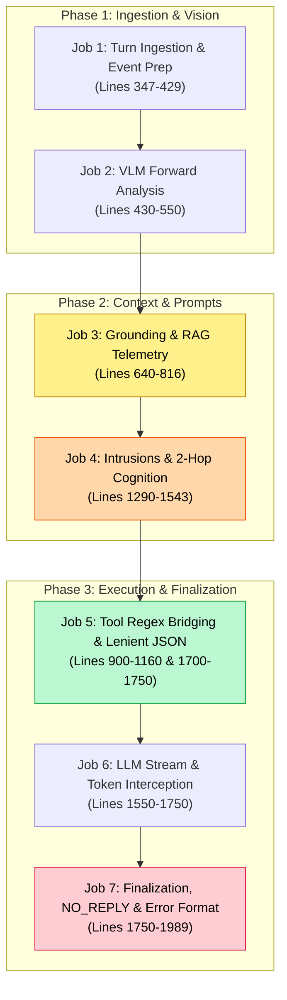
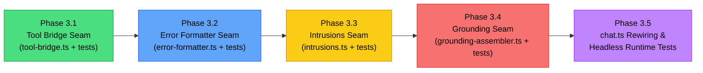

# Architectural Specification: Surgical Decomposition of Chat Orchestrator & Headless Invariant Tests

**Status:** Proposed (Ready for Peer Review)
**Authors:** dasilva333 & Antigravity
**Domain:** Core Agent & Companion Turn Orchestration (`@proj-airi/stage-ui`)
**Target Milestone:** Phase 3 of [`docs/project-testing-parity.md`](file:///Users/richardpinedo/Projects.nosync/airi/airi_dasilva333/docs/project-testing-parity.md)
**Related Documents:**
- [`docs/proposal-core-agent-revamp.md`](file:///Users/richardpinedo/Projects.nosync/airi/airi_dasilva333/docs/proposal-core-agent-revamp.md)
- [`docs/project-selective-upstream-sync-shortlist.md`](file:///Users/richardpinedo/Projects.nosync/airi/airi_dasilva333/docs/project-selective-upstream-sync-shortlist.md)
- [`docs/research-forks-ecosystem.md`](file:///Users/richardpinedo/Projects.nosync/airi/airi_dasilva333/docs/research-forks-ecosystem.md)

---

## 1. Executive Summary & Objective

In our fork, [`packages/stage-ui/src/stores/chat.ts`](file:///Users/richardpinedo/Projects.nosync/airi/airi_dasilva333/packages/stage-ui/src/stores/chat.ts) is the central brain of the desktop companion. However, its primary turn execution handler, `performSend`, has grown into a **1,642-line monolithic closure** (lines 347 to 1,989) handling 7 disparate responsibilities:
1. Turn ingestion & Event Ledger recording
2. VLM forward-mode image analysis
3. Grounding & context telemetry assembly
4. Dynamic introspections & two-hop cognition
5. Tool call regex bridging & lenient JSON repair
6. LLM streaming & token interception
7. Post-turn message persistence, `NO_REPLY` guards & markdown error formatting

This document specifies a **surgical decomposition plan (Option B)** combined with a **headless invariant test harness (Option A)**. It refactors `performSend` into pure, isolated sub-modules residing within the existing [`packages/stage-ui/src/stores/chat/`](file:///Users/richardpinedo/Projects.nosync/airi/airi_dasilva333/packages/stage-ui/src/stores/chat/) directory, without introducing foreign package boundaries or disrupting companion runtime behaviors.

---

## 2. Upstream & Fork Ecosystem Context: Why Option C is Rejected

Prior proposals explored porting upstream’s `packages/core-agent` or migrating to **Apeira v0.0.5** (Option C). Detailed ecosystem review confirms this would be a severe regression for our fork:

1. **Apeira Instability & Pending Redesign:**
   During community discussions, upstream creator 藍 explicitly stated that Apeira v0.0.5 is unstable and that new persistence interfaces will be designed later. Adopting it prematurely guarantees repeated breaking migrations.
2. **NashChennc's Core-Agent is an Under-Featured Subset:**
   NashChennc extracted a 46-file `packages/core-agent` with dependency-injection ports (`AgentContextPort`, `AgentLLMPort`, `AgentSessionPort`). However, our `performSend` is a **strict superset** of his runtime. It includes VLM forward-mode handover, real-time sensor telemetry, autonomous artistry, multi-window BroadcastChannel ingest, Live2D/VRM speech cancellation hooks, and conversational pacing. Adopting that architecture would require writing extensive adapter shims to re-implement features we already have working natively.
3. **Strategic Decision:**
   **Reject Option C.** Retain our local companion store architecture, but surgically decouple the pure computational logic inside `performSend` into modular, unit-testable files inside `packages/stage-ui/src/stores/chat/`.

---

## 3. The 7 Jobs Inside `performSend` (Anatomy of the Monolith)



*Highlighted boxes denote pure/isolated logic that will be extracted out of `chat.ts`.*

---

## 4. Proposed Target File Inventory

All extracted modules will be placed in the existing [`packages/stage-ui/src/stores/chat/`](file:///Users/richardpinedo/Projects.nosync/airi/airi_dasilva333/packages/stage-ui/src/stores/chat/) directory alongside existing modules (`session-store.ts`, `stream-store.ts`, `hooks.ts`, etc.).

### 4.1 Files to Create (New)

| File Path | Nature | Lines (Est.) | Description |
|---|---|:---:|---|
| [`packages/stage-ui/src/stores/chat/tool-bridge.ts`](file:///Users/richardpinedo/Projects.nosync/airi/airi_dasilva333/packages/stage-ui/src/stores/chat/tool-bridge.ts) | Implementation | ~160 | Pure string parsing, regex matching for `<\|...\|>`, `[call_tool:...]`, `<tool_call>`, and lenient JSON recovery. Zero store dependencies. |
| [`packages/stage-ui/src/stores/chat/tool-bridge.test.ts`](file:///Users/richardpinedo/Projects.nosync/airi/airi_dasilva333/packages/stage-ui/src/stores/chat/tool-bridge.test.ts) | Unit Test | ~120 | Exhaustive test suite for malformed JSON, unclosed quotes, nested object repair, and marker extraction. |
| [`packages/stage-ui/src/stores/chat/error-formatter.ts`](file:///Users/richardpinedo/Projects.nosync/airi/airi_dasilva333/packages/stage-ui/src/stores/chat/error-formatter.ts) | Implementation | ~90 | Pure error inspection, XSAI error payload unwrapping, 401/403 detection, and user-facing Markdown error card generation. |
| [`packages/stage-ui/src/stores/chat/error-formatter.test.ts`](file:///Users/richardpinedo/Projects.nosync/airi/airi_dasilva333/packages/stage-ui/src/stores/chat/error-formatter.test.ts) | Unit Test | ~80 | Unit tests for network error formatting, rate limit extractions, and auth guidance. |
| [`packages/stage-ui/src/stores/chat/intrusions.ts`](file:///Users/richardpinedo/Projects.nosync/airi/airi_dasilva333/packages/stage-ui/src/stores/chat/intrusions.ts) | Implementation | ~110 | Evaluates Dating Sim climax rules, Dream state echo chips, text journal reflections, and autonomous artistry intrusions into combined context blocks. |
| [`packages/stage-ui/src/stores/chat/intrusions.test.ts`](file:///Users/richardpinedo/Projects.nosync/airi/airi_dasilva333/packages/stage-ui/src/stores/chat/intrusions.test.ts) | Unit Test | ~90 | Unit tests for elapsed minute calculations, template placeholder replacements, and staging clear triggers. |
| [`packages/stage-ui/src/stores/chat/grounding-assembler.ts`](file:///Users/richardpinedo/Projects.nosync/airi/airi_dasilva333/packages/stage-ui/src/stores/chat/grounding-assembler.ts) | Implementation | ~170 | Aggregates system awareness payloads: sensors, STMM daily summaries, Lifetime memory, text journal RAG queries, recent topics, director visual scratchpad, and salience gate telemetry. |
| [`packages/stage-ui/src/stores/chat/grounding-assembler.test.ts`](file:///Users/richardpinedo/Projects.nosync/airi/airi_dasilva333/packages/stage-ui/src/stores/chat/grounding-assembler.test.ts) | Unit Test | ~100 | Tests for grounding message order, toggle overrides, query thresholds, and fault-tolerant fallbacks. |
| [`packages/stage-ui/src/stores/chat/queue-cancellation.test.ts`](file:///Users/richardpinedo/Projects.nosync/airi/airi_dasilva333/packages/stage-ui/src/stores/chat/queue-cancellation.test.ts) | Headless Runtime Test | ~110 | Option A runtime test: verifies queued sends purging and promise resolution when stop or new turns interrupt. |
| [`packages/stage-ui/src/stores/chat/stale-generation.test.ts`](file:///Users/richardpinedo/Projects.nosync/airi/airi_dasilva333/packages/stage-ui/src/stores/chat/stale-generation.test.ts) | Headless Runtime Test | ~100 | Option A runtime test: verifies that slow streaming turns for abandoned sessions discard tokens and do not leak into active sessions. |
| [`packages/stage-ui/src/stores/chat/hook-ordering.test.ts`](file:///Users/richardpinedo/Projects.nosync/airi/airi_dasilva333/packages/stage-ui/src/stores/chat/hook-ordering.test.ts) | Headless Runtime Test | ~120 | Option A runtime test: validates deterministic execution sequence (`beforeMessageComposed` $\rightarrow$ `beforeSend` $\rightarrow$ tokens $\rightarrow$ `afterSend` $\rightarrow$ `streamEnd` $\rightarrow$ `turnComplete`). |
| [`packages/stage-ui/src/stores/chat/tool-round-limits.test.ts`](file:///Users/richardpinedo/Projects.nosync/airi/airi_dasilva333/packages/stage-ui/src/stores/chat/tool-round-limits.test.ts) | Headless Runtime Test | ~90 | Option A runtime test: validates recursion limit (maximum 5 steps) and exit condition enforcement during multi-turn tool loops. |

### 4.2 Files to Modify (Existing)

| File Path | Nature | Proposed Modification |
|---|---|---|
| [`packages/stage-ui/src/stores/chat.ts`](file:///Users/richardpinedo/Projects.nosync/airi/airi_dasilva333/packages/stage-ui/src/stores/chat.ts) | Implementation | Slim down `performSend` from 1,642 lines to ~250 lines by importing and invoking the 4 extracted sub-modules. |
| [`docs/project-testing-parity.md`](file:///Users/richardpinedo/Projects.nosync/airi/airi_dasilva333/docs/project-testing-parity.md) | Documentation | Track Phase 3 progress and register newly authored test suites in the Section 7 inventory. |
| [`docs/proposal-core-agent-revamp.md`](file:///Users/richardpinedo/Projects.nosync/airi/airi_dasilva333/docs/proposal-core-agent-revamp.md) | Documentation | Add header cross-referencing this architectural specification as the active execution roadmap. |

---

## 5. Detailed Module Interface Contracts

### 5.1 `tool-bridge.ts` (Pure String & Tool Parsing)

**Location:** `packages/stage-ui/src/stores/chat/tool-bridge.ts`
**Dependencies:** Zero Pinia, zero Vue, zero browser APIs. Pure TypeScript.

```typescript
export interface BridgedToolMatch {
  matchedText: string
  toolName: string
  args: Record<string, any>
  bridged: boolean
}

/**
 * Attempts to parse loose/truncated JSON returned by LLM function tags.
 * Fixes unclosed quotes, unbalanced brackets, and trailing commas.
 */
export function tryParseLenientJson(json: string): any

/**
 * Scans input text for tool markers in any supported dialect:
 * 1. <|tool_name:args|>
 * 2. [call_tool:tool_name, args]
 * 3. <tool_call>tool_name(args)</tool_call>
 * 4. <tool_call>{"name": "...", "arguments": "..."}</tool_call>
 */
export function matchToolMarker(
  input: string,
  availableTools: Array<{ name: string } | { function?: { name: string } }>,
): BridgedToolMatch | null
```

### 5.2 `error-formatter.ts` (Error Presentation & Traceability)

**Location:** `packages/stage-ui/src/stores/chat/error-formatter.ts`
**Dependencies:** Zero Pinia/Vue. Pure TypeScript.

```typescript
export interface ChatErrorContext {
  model: string
  provider: string
  sessionId: string
}

export interface FormattedChatError {
  userFacingMarkdown: string
  isAuthError: boolean
  isRateLimit: boolean
  rawErrorMessage: string
  technicalDetail?: string
}

/**
 * Formats unknown catch-block errors from performSend into user-friendly Markdown
 * with actionable recovery hints (e.g. API key setup, provider down).
 */
export function formatChatError(error: unknown, ctx: ChatErrorContext): FormattedChatError
```

### 5.3 `intrusions.ts` (Dynamic Introspections & Narrative Prompts)

**Location:** `packages/stage-ui/src/stores/chat/intrusions.ts`

```typescript
export interface IntrusionContextParams {
  card?: AiriCard
  sessionId: string
  messagesCount: number
  datingSimStore?: any
  pendingJournal?: { entryText: string, timestamp: number }
  pendingArtistry?: { prompt: string }
}

export interface IntrusionResolutionResult {
  combinedPrompt: string
  hasJournal: boolean
  hasArtistry: boolean
  hasDream: boolean
}

/**
 * Compiles introspective prompts (Dream state, Journal reflection, Artistry awareness,
 * Dating Sim climax resolution) into a single system instruction block.
 */
export function resolveIntrusionPrompts(params: IntrusionContextParams): IntrusionResolutionResult
```

### 5.4 `grounding-assembler.ts` (Context & Telemetry Pipeline)

**Location:** `packages/stage-ui/src/stores/chat/grounding-assembler.ts`

```typescript
export interface GroundingAssemblyParams {
  card?: AiriCard
  cardId: string
  sessionId: string
  sendingMessage: string
  triggerOnly?: boolean
  vlmImageAnalysis?: string | null
  sensorPayload?: string
  shortTermContext?: string | null
  lifetimeContext?: string | null
  semanticMemories?: string | null
  directorScratchpad?: string | null
  salienceTelemetry?: string | null
}

/**
 * Builds the complete ordered array of system grounding messages
 * to be spliced into the prompt before LLM dispatch.
 */
export function buildGroundingMessages(params: GroundingAssemblyParams): Message[]
```

---

## 6. Headless Invariant Test Suite (Option A Specification)

These 4 tests mount `useChatOrchestratorStore` directly in Vitest using mock LLM streams, establishing automated regression protection for core agent behaviors:

### 1. `queue-cancellation.test.ts`
- **Scenario A:** Queue Send 1, Send 2, and Send 3 rapidly.
- **Scenario B:** Call `stopCurrentGeneration()` while Send 1 is streaming.
- **Assert:** Send 1 stream is aborted; Send 2 and Send 3 are removed from `pendingQueuedSends`; deferred promises reject with cancellation; no unhandled promise rejections occur.

### 2. `stale-generation.test.ts`
- **Scenario:** Start Send 1 on Session A with a delayed streaming chunk (500ms). While in flight, switch `activeSessionId` to Session B.
- **Assert:** The late chunk for Session A is discarded from UI reactivity; Session B message history is completely uncontaminated; switching back to Session A displays the finalized state without corruption.

### 3. `hook-ordering.test.ts`
- **Scenario:** Execute a standard turn with an instrumented test hook listener tracking lifecycle timestamps.
- **Assert:** Hooks trigger in strict deterministic order:
  `emitBeforeMessageComposedHooks` $\rightarrow$ `emitAfterMessageComposedHooks` $\rightarrow$ `emitBeforeSendHooks` $\rightarrow$ `emitTokenLiteralHooks` / `emitReasoningChunkHooks` $\rightarrow$ `emitStreamEndHooks` $\rightarrow$ `emitAssistantResponseEndHooks` $\rightarrow$ `emitAfterSendHooks` $\rightarrow$ `emitAssistantMessageHooks` $\rightarrow$ `emitChatTurnCompleteHooks`.

### 4. `tool-round-limits.test.ts`
- **Scenario:** Mock a model that endlessly outputs a tool call marker on every follow-up turn.
- **Assert:** `bridgedSteps` reaches exactly 5, then forcefully terminates; the assistant reply finalizes cleanly with the output produced up to step 5; no infinite loop or process hang occurs.

---

## 7. Step-by-Step Phased Execution Plan



1. **Phase 3.1: Tool Bridge Extraction (Safest First)**
   - Extract `tryParseLenientJson` and `matchToolMarker` into `tool-bridge.ts`.
   - Author `tool-bridge.test.ts`.
   - Update `chat.ts` to call the new helper. Run typecheck & tests.
2. **Phase 3.2: Error Formatter Extraction**
   - Extract `formatChatError` into `error-formatter.ts`.
   - Author `error-formatter.test.ts`.
   - Update `chat.ts` catch block. Run typecheck & tests.
3. **Phase 3.3: Intrusions & Narrative Prompt Extraction**
   - Extract `resolveIntrusionPrompts` into `intrusions.ts`.
   - Author `intrusions.test.ts`.
   - Update `chat.ts` loop. Run typecheck & tests.
4. **Phase 3.4: Grounding & Telemetry Extraction**
   - Extract `buildGroundingMessages` into `grounding-assembler.ts`.
   - Author `grounding-assembler.test.ts`.
   - Update `chat.ts`. Run typecheck & tests.
5. **Phase 3.5: Option A Headless Runtime Suites**
   - Author `queue-cancellation.test.ts`, `stale-generation.test.ts`, `hook-ordering.test.ts`, and `tool-round-limits.test.ts`.
   - Verify all 86 monorepo test suites pass cleanly.

---

## 8. Non-Negotiable Invariants & Safety Guardrails

During and after the refactor, the following companion invariants **must not be altered**:
- **Zero-Stall UI Bubble:** User message must be ingested into `chatSession` *before* any VLM inference begins (Task 1).
- **Early Audio Flush:** `emitBeforeMessageComposedHooks` must fire *immediately* so Stage avatar lip sync, caption streams, and TTS pipelines halt instantly when the user sends a message (Task 2).
- **RawContent Preservation:** Assistant messages must always store `rawContent` (unstripped tokens like `<|ACTOR:|>`, `<|ACT:|>`, `<|DELAY:|>`) alongside display `content` to prevent long-term prompt token amnesia.
- **Speech Cancellation Bridge:** `canStop = computed(() => sending.value || isSpeaking.value)` and `stopCurrentGeneration` must continue to cancel active speech even after LLM streaming has finished.
- **Event Ledger Traceability:** Live `eventLogStore.appendEvent` calls for messages and tool executions must remain intact.

---

## 9. Verification & Sign-Off Criteria

1. `pnpm -F @proj-airi/stage-ui typecheck` passes with **0 errors**.
2. All new unit tests (`tool-bridge.test.ts`, `error-formatter.test.ts`, `intrusions.test.ts`, `grounding-assembler.test.ts`) pass 100%.
3. All 4 headless runtime suites (`queue-cancellation`, `stale-generation`, `hook-ordering`, `tool-round-limits`) pass 100%.
4. Full monorepo verification: `pnpm run test:run` exits with 0 failures across all 86 test files.
5. Peer review approval on this specification before Phase 3.1 implementation commences.
