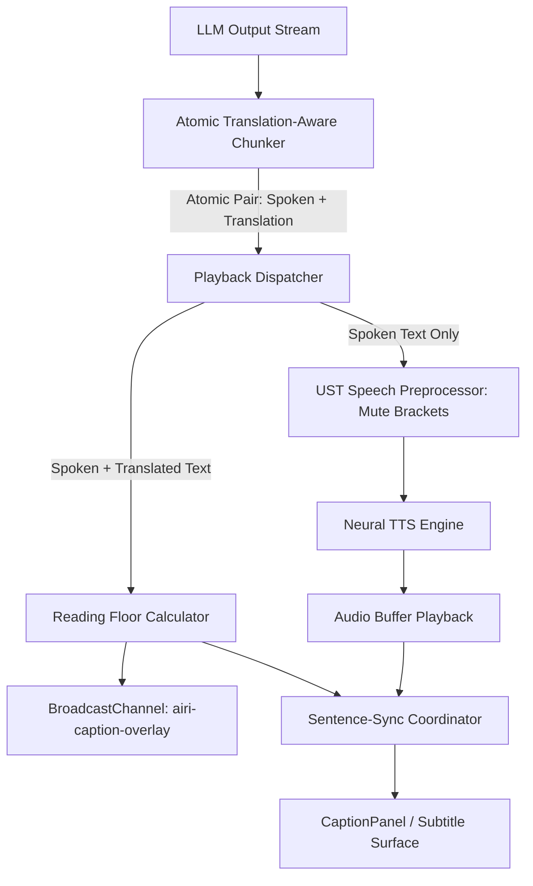

# Design & Architecture: Bilingual Spoken Dialogue & Synchronized Subtitles

**Status:** Proposed Architecture & Deferred Specification
**Authors:** Richard Pinedo (@dasilva333) & Antigravity
**Target Subsystems:**
- `packages/stage-ui/src/stores/modules/speech.ts` (Universal Speech Transformer & bracket muting)
- `packages/stage-ui/src/composables/use-speech-caption-player.ts` (Sentence-sync playback player & dwell clock)
- `packages/stage-ui/src/components/scenes/CaptionPanel.vue` (Floating window & DatingSim overlay captions)
- `packages/stage-ui/src/components/scenes/HeadTetheredCaption.vue` (In-scene avatar comic bubble plank)
- `packages/stage-ui/src/components/scenarios/character/tabs/acting.vue` (Character Acting & Dialogue Delivery tab)
- `packages/stage-ui/src/components/scenarios/dialogs/onboarding/v3/steps/step-speech.vue` (Onboarding V3 Step 9 Speech)
- `packages/stage-ui/src/composables/prompt/` (Prompt assembly & system directive compiler)

---

## 1. Executive Summary & The Core Architectural Conflict

A primary aspiration for virtual companion systems—especially those powered by anime/Live2D/VRM avatars—is **multilingual authenticity**: having the companion speak natively in Japanese, French, Korean, or Spanish using high-fidelity neural TTS (e.g. Kokoro, Fish Speech, Edge TTS, GPT-SoVITS), while presenting real-time, synchronized English subtitles for the user.

```
┌────────────────────────────────────────────────────────────────────────────────────────┐
│                        THE BILINGUAL SUBTITLE TRILEMMA                                 │
├──────────────────────────────┬──────────────────────────────┬──────────────────────────┤
│ ⚡ 1. Generation Latency     │ 🗣️ 2. Pure Spoken Prosody   │ 👁️ 3. Human Reading Time │
├──────────────────────────────┼──────────────────────────────┼──────────────────────────┤
│ Running a 2nd LLM translation│ The TTS must never pronounce │ A 0.4s spoken word ("Hai")│
│ pass doubles turn latency and│ secondary translation tokens;│ needs 2.5s of visual on- │
│ explodes token costs. Single-│ audio must flow uninterrupted│ screen dwell for a 60-char│
│ turn streaming is required.  │ in the target spoken tongue. │ English translation line.│
└──────────────────────────────┴──────────────────────────────┴──────────────────────────┘
```

### The Upstream Trap (PR #2487)
Upstream attempted to solve this by treating bilingual streaming like an MPEG transport stream: constructing 2,400+ lines of stateful token demuxers, token hold-back buffers (`MAX_TAG_LENGTH`), and multi-window BroadcastChannels (`use-spark-translation-channel`). This introduced audio jitter, increased Time-to-First-Audio (TTFA), and created delicate state machines across window boundaries.

### The Fork's Breakthrough
In this fork, we discovered that **Prompt Crafting** paired with the **Universal Speech Transformer (UST)** bracket processor can achieve clean separation with zero demuxers:
1. The LLM is instructed to generate: `こんにちは、調子はどう？ [Hello, how are you doing?]`
2. UST pre-processes the text with `squareBrackets: 'mute'`, stripping `[...]` right before it hits the TTS engine.
3. The TTS synthesizes only pure Japanese audio with zero stutter or buffer delay.

### The Fatal Discovery: The Reading-Speed vs. Audio-Duration Paradox
However, deep analysis reveals that **pure "no-code" prompt crafting breaks down at the human presentation layer**:
1. **The Audio Duration Clamp**: AIRI's sentence-sync audio player (`useSpeechCaptionPlayer`) bounds caption lifetime to `audio.onended`. When the avatar speaks a short phrase like `はい！` (0.4s audio), the accompanying 50-character English translation vanishes from the screen in 400ms—long before human eyes can scan it.
2. **Punctuation Splitting Corruption**: Standard sentence regex `/(?<=[.!?])\s+/` splits on punctuation *inside* the translation brackets (e.g. `[Nice to meet you!]`), tearing the translation into an orphan segment. Because the orphan segment is 100% bracketed, UST strips it to 0 bytes, creating an instantaneous 0-second audio clip that flickers on screen for a single frame and disappears.
3. **Persona Cognitive Bleed**: Prompting a model with *"Never speak or pronounce the bracketed text"* injects audio-engineering jargon into the LLM's token prediction space, disrupting character immersion.

**Conclusion**: Bilingual dialogue cannot be solved purely by adding a naive system prompt checkbox. It requires an **atomic chunker**, a **human reading dwell clock**, and dedicated UI surfaces for user control.

---

## 2. Surface Architecture: Where the User Controls Bilingual Subtitles

Bilingual dialogue fundamentally affects **dialogue delivery, TTS audio stripping, and subtitle formatting**. It must live in surfaces where users configure persona and voice—never in transient control bars.

```
┌─────────────────────────────────────────────────────────────────────────────┐
│                             SURFACE MATRIX                                  │
├──────────────────────────────┬──────────────────────────────┬───────────────┤
│ Surface                      │ Role / Responsibility        │ Priority      │
├──────────────────────────────┼──────────────────────────────┼───────────────┤
│ Character Config > Acting    │ Primary Persona Delivery     │ ⭐⭐⭐ Core   │
│ Modules > Voice / Speech     │ Engine / UST Bracket Rules   │ ⭐⭐⭐ Core   │
│ Onboarding V3 (Step 9 Speech)│ First-Run Companion Setup    │ ⭐⭐ Wizard   │
│ Floating Control Strip       │ EXCLUDED BY DESIGN           │ 🚫 Prohibited │
└──────────────────────────────┴──────────────────────────────┴───────────────┘
```

### 2.1 Character Config > Acting Tab (`airi-acting-cue-act-tokens`)
**Why here:** In AIRI, the Acting Tab governs dialogue cadence, ACT emotion tokens, pauses (`DELAY`), and stage behavior. Bilingual dialogue is fundamentally an **acting and delivery style** ("How does this character deliver their lines to me?").

**Controls to Introduce:**
- **Dialogue Delivery Mode**:
  - `Monolingual (Native)`: Standard dialogue without inline translations.
  - `Bilingual Subtitled (Visual Novel)`: Spoken lines in primary tongue with bracketed translation subtitles.
  - `Language Tutor`: Spoken lines followed by phonetic breakdown / vocabulary hints.
- **Spoken Language**: e.g., Japanese (`ja-JP`), Korean (`ko-KR`), French (`fr-FR`).
- **Translation Subtitle Language**: e.g., English (`en-US`), Spanish (`es-ES`).
- **Delimiter Format**: `Square Brackets [ ]` (Default, paired with UST mute), `Parentheses ( )`.

### 2.2 Modules Tab > Voice / Speech (`airi-audio-pipeline`)
**Why here:** The physical voice engine (Kokoro, Edge TTS, OpenAI TTS) and VoiceProfile UST rules live in the Modules tab.

**Controls & Guarantees:**
- **Automatic UST Mute Assurance**: When a character has Bilingual Subtitles enabled, the speech pipeline automatically activates `squareBrackets: 'mute'` for that session, even if the user has not authored a custom Audio Studio profile.
- **Voice Locale Compatibility Warning**: If the character's persona is set to speak Japanese but the selected TTS voice is an English-only model (e.g. `en-US-GuyNeural`), a non-blocking configuration hint suggests a compatible multilingual voice (e.g. Kokoro `jf_alpha` or Edge `ja-JP-NanamiNeural`).

### 2.3 Onboarding V3 > Step 9: Speech (`airi-onboarding-v2`)
**Why here:** During first-run onboarding, when a user selects an anime archetype (e.g., *The Creative Muse* or *The Casual Companion*) and pairs it with a Japanese voice, offering bilingual subtitles right in Step 9 eliminates friction.

**Controls to Introduce:**
- Under the TTS Voice selector, an optional toggle card:
  - `[✓] Bilingual Dialogue & Subtitles`
  - Subtext: *"Character speaks in Japanese while generating synchronized English subtitles."*
  - Directly seeds `card.extensions.airi.bilingual = { enabled: true, spokenLang: 'Japanese', targetLang: 'English' }`.

### 2.4 Floating Control Strip: Explicitly Excluded
**Confirmed Architectural Rule:** Bilingual dialogue configuration **MUST NOT** be placed in the Floating Control Strip (`ControlStripHost.vue` or desktop mini-bar).
- The Control Strip is reserved for **ephemeral runtime telemetry and quick toggles** (mic mute, camera toggle, emote triggers, chat toggle, master volume).
- Flipping a companion from English to Japanese-with-subtitles rewrites system prompt cache prefixes, alters TTS linguistic sanitizers, and switches token chunkers. Doing so mid-sentence from a micro-toolbar produces cache churn and jarring conversational continuity breaks.

---

## 3. Structural Engine Requirements

To graduate from "hacky prompt crafting" to a rock-solid, production-grade feature, the following three components must be implemented:



### 3.1 The Atomic Translation-Aware Chunker
Sentence splitting must never break inside bracketed translation blocks.
Instead of:
```ts
text.split(/(?<=[.!?])\s+/) // DANGEROUS: Splits inside [Nice to meet you!]
```
We require a bracket-balanced regex or lexical scanner:
```ts
// Splits only on sentence boundaries that occur OUTSIDE of square brackets
const ATOMIC_SENTENCE_REGEX = /(?<=[.!?])(?![^[]*\])\s+/
```
This guarantees that `こんにちは！ [Hello!]` is treated as a single indivisible unit, completely preventing 0-second orphan audio chunks.

### 3.2 The Human Reading Dwell Floor
In `useSpeechCaptionPlayer.ts`, caption clearance must not rely purely on `audio.onended`. It must compute a **Reading Time Floor**:

$$\text{ReadingTimeMs} = \text{max}\left(\text{AudioDurationMs},\; \text{BaseDwell} + \text{CharCount} \times \text{ReadingRateMs}\right)$$

Where:
- $\text{BaseDwell} = 800\text{ ms}$ (visual cognitive acquisition window)
- $\text{ReadingRateMs} = 40\text{ ms per character}$ (~250 words per minute)

If the avatar says `はい！` (400ms audio), but the translation is `[Yes, I completely understand and agree.]` (46 characters):
- $\text{AudioDuration} = 400\text{ ms}$
- $\text{ReadingFloor} = 800 + (46 \times 40) = 2,640\text{ ms}$
- **The caption stays on screen for 2.64 seconds**, smoothly providing the user time to read before advancing.

### 3.3 Two-Tier Caption Segment Protocol
Extend `CaptionSegment` in `airi-caption-overlay` to support native secondary subtitles:

```ts
interface CaptionSegment {
  text: string // Primary spoken text: "こんにちは！"
  translation?: string // Secondary subtitle: "Hello!"
  color: string
  actorId: string
  isActive: boolean
}
```

This allows `CaptionPanel.vue` and `DatingSimOverlay.vue` to render subtitles with authentic cinematic typography:
```html
<div class="flex flex-col items-center text-center">
  <span class="text-base font-semibold text-white">{{ segment.text }}</span>
  <span v-if="segment.translation" class="text-xs text-amber-300/90 font-sans mt-0.5 tracking-wide">
    {{ segment.translation }}
  </span>
</div>
```

---

## 4. Compile-Time System Prompt Directive

The prompt must be clean, natural, and free of audio-engineering jargon.

```markdown
[Dialogue & Subtitle Format]
You are a bilingual communicator. Express all your spoken responses in {{spokenLanguage}}.
Immediately follow each sentence or dialogue clause with its {{targetLanguage}} translation enclosed in square brackets.
Format template: <{{spokenLanguage}} sentence> [{{targetLanguage}} translation]
Example: おはようございます！ [Good morning!] 今日も一日頑張りましょう。 [Let's do our best today as well.]
Do not add additional explanations or meta-commentary outside this format.
```

---

## 5. Phased Implementation Roadmap

- **Phase 1 (Engine Foundation - Deferred)**:
  - Implement atomic bracket-balanced chunking in `useSpeechCaptionPlayer.ts`.
  - Add Reading Floor dwell calculation to prevent premature caption dismissal on short phrases.
  - Extend `airi-caption-overlay` with `translation` field support in `CaptionSegment`.
- **Phase 2 (UI Integration - Deferred)**:
  - Add `Bilingual Dialogue` configuration card in Character Config > Acting Tab.
  - Add `Bilingual Subtitles` opt-in card in Onboarding V3 Step 9 (Speech).
  - Inject compile-time prompt directive in `prompt-builder-engine`.
- **Phase 3 (Visual Novel & Visual Enhancements)**:
  - Add two-tier styling (Japanese main line + English subtitle sub-line) in `CaptionPanel.vue` and `DatingSimOverlay.vue`.
  - Ensure Head-Tethered Live2D comic bubble cleanly formats the dual-language payload.
