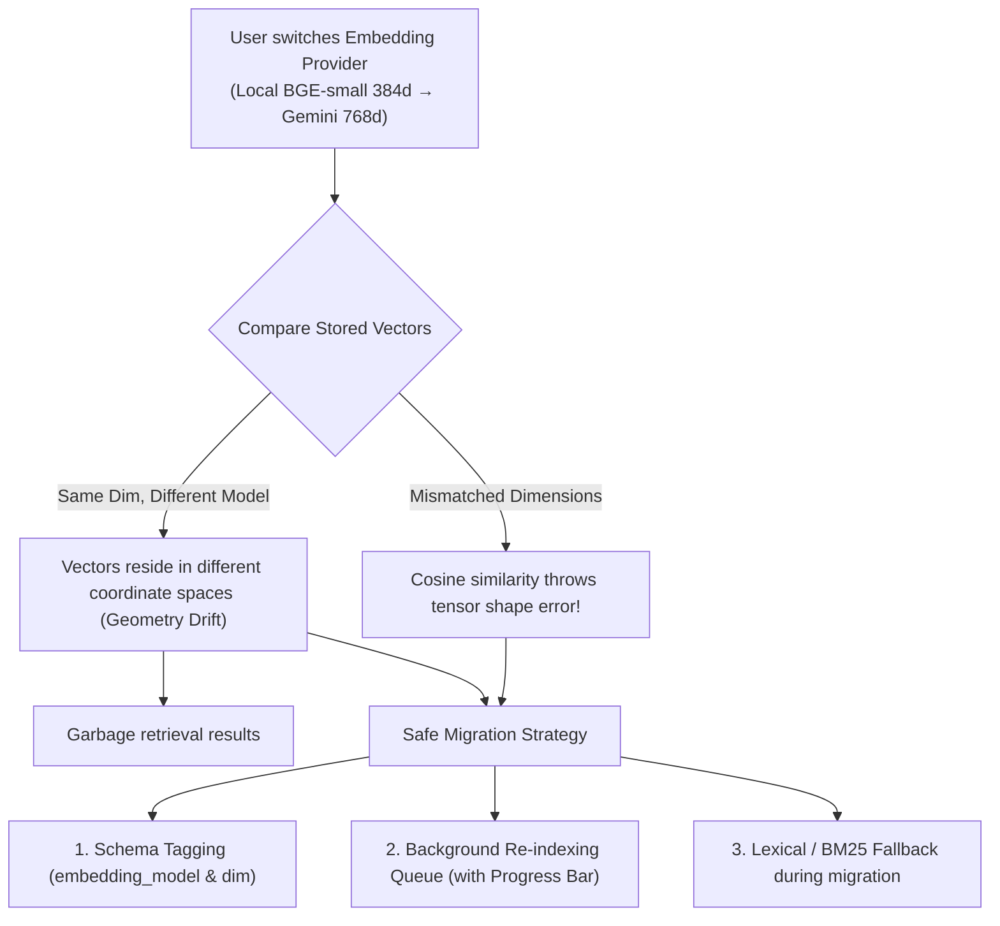

# Dynamic Embedding Provider Support & Multi-Backend Architecture

> **Status:** Design draft — architectural proposal
> **Target Doc:** `docs/design-embedding-provider-support.md`
> **Primary Surface:** Settings → Inference Providers → `Embeddings`
> **Downstream Consumers:** Layered Memory (`layered-memory.ts`), Short-Term Memory, Sacred Text Journal, Entity Ledger

---

## 1. Problem & Opportunity

### The Current Bottleneck
In AIRI today, semantic memory search is hardcoded to a single local worker:
- **Hardwired Implementation:** `packages/stage-ui/src/libs/search/layered-memory.ts` imports `searchWorker` directly from `packages/stage-ui/src/libs/workers/search/index.ts`.
- **Hardcoded Model:** `search.worker.ts` loads `Xenova/bge-small-en-v1.5` over WebGPU via Transformers.js.
- **Resource Contention:** BGE-small reserves ~100MB VRAM via `getGPUCoordinator()` at priority `GPU_PRIORITY.BG_REMOVAL_LOAD + 1`, competing with 3D VRM rendering, Live2D rendering, and local Whisper/Kokoro inference.
- **Quality & Lingual Limits:** BGE-small has 33M parameters, 384 dimensions, and a 512-token context window. It struggles with long journal entries, subtle negations/emotional subtext, and degrades completely on non-English conversations (e.g. Japanese or Chinese).

### The Opportunity
AIRI's **Free AI Hub** already catalogs **39 embedding models** across providers (Google AI Studio `gemini-embedding`, NVIDIA NIM `Nemotron Embed`, OpenRouter, Cloudflare Workers AI `@cf/baai/bge-m3`, SEA-LION, etc.). Google AI Studio offers a free tier of up to 1,500 requests/minute for `text-embedding-004`. Enabling remote and alternative local embedding backends will:
1. Drastically improve memory discrimination and recall quality (MTEB score ~66+ vs ~58).
2. Unlock true multilingual and cross-lingual memory retrieval.
3. Completely offload GPU/VRAM pressure from lower-end host machines.

---

## 2. Category Taxonomy: Dedicated "Embeddings" vs. "Limbic"

### The Decision: Dedicated `Embeddings` Category (Recommended)

In Settings → Inference Providers, the navigation bar currently features explicit functional modalities:
`Chat` · `Speech` · `Transcription` · `Artistry` · `Vision` · `Motion` · `System 1` · `Cloud & Storage`

```
┌────────────────────────────────────────────────────────────────────────────────────────┐
│  Chat   Speech   Transcription   Artistry   Vision   Motion   System 1   [ Embeddings ]│
└────────────────────────────────────────────────────────────────────────────────────────┘
```

#### Why Dedicated `Embeddings` Wins Over "Limbic" Megagroup:
1. **Modality Parity with Free AI Hub:** In the Free AI Catalog, `Embeddings (39)` is already a first-class modality filter alongside `Chat (253)`, `Vision (85)`, and `STT Hearing (7)`. Making it a dedicated pill in Inference Providers creates 1:1 cognitive alignment between discovering a model and configuring it.
2. **Distinct Functional Contracts:**
   - **System 1 (Jev / ModernBERT):** A *discrete classifier & decision engine* (Input: text $\rightarrow$ Output: classification, intent tokens, routing logits, compliance instructions).
   - **Embeddings:** A *continuous vector encoder* (Input: text $\rightarrow$ Output: high-dimensional float array $\mathbb{R}^D$ for cosine similarity math).
3. **Avoids the "Junk Drawer" Anti-Pattern:** Cramming vector encoders and fast decision trees into a single "Limbic" tab forces complex nested sub-tabs and confuses users looking for their vector memory configuration.

---

## 3. The Core Engineering Challenge: Incompatible Vector Geometries

Unlike LLMs (where switching from GPT-4 to Claude yields plain text strings), **embedding models cannot be swapped transparently on existing vectors**.



### The Three Required Safeguards:

### 1. Vector Metadata Tagging
Every embedded memory record stored in IndexedDB must carry provenance metadata:
```ts
interface StoredVectorMetadata {
  vector: number[]
  embeddingModel: string // e.g. "google:text-embedding-004", "local:bge-small-en-v1.5"
  embeddingDim: number // e.g. 768, 384
  embeddedAt: number
}
```
*Lesson from Spring Haven:* If `entry.embeddingModel !== activeProvider.modelId`, the retrieval engine strictly excludes that vector from semantic cosine scoring and falls back to lexical matching until re-indexed.

### 2. Automated Re-indexing & Backfill Queue
When a user switches embedding providers in Settings:
1. The UI prompts: *"Switching embedding provider requires re-indexing your memories. Re-index now?"*
2. A background worker iterates through stored memories (Short-Term, Sacred Journal, Entity Ledger), batches raw text, calls `provider.embedBatch(texts)`, and updates vector records in IndexedDB.
3. The Memory Hub shows an unobtrusive progress tracker:
   > *"Re-indexing memory constellation for Gemini Embedding... (84 / 160 entries) [======----] 52%"*
4. With batch endpoints (e.g. Gemini 100-chunk batching), re-indexing an entire character's lifetime history takes 2–5 seconds.

### 3. Graceful Offline & Failure Fallback
If a remote embedding provider hits a rate limit, network timeout, or missing API key:
- Semantic scoring temporarily drops to zero.
- The retrieval engine falls back to n-gram / lexical keyword matching.
- The chat turn **never crashes or hangs**.

---

## 4. Privacy & Transparency Boundaries

Because memory retrieval encodes private personal conversations and character journals, the UI must clearly delineate data boundaries:

| Provider Type | Badge | Data Privacy | Latency | Multilingual | Context Window |
| :--- | :--- | :--- | :--- | :--- | :--- |
| **Local WebGPU (BGE-Small / BGE-M3)** | 🟢 `Local (Private)` | 100% on-device; zero network traffic | 15–40ms | English only (BGE-small) / Good (BGE-M3) | 512 tokens |
| **Google AI Studio (Gemini Embedding)** | ⚡ `Cloud (High Precision)` | Sent over TLS to Google AI API | 80–180ms | Excellent (100+ languages) | 8,192 tokens |
| **Cloudflare Workers AI (`@cf/baai/bge-m3`)** | ⚡ `Cloud (Fast Edge)` | Sent to Cloudflare edge worker | 60–120ms | Excellent | 8,192 tokens |
| **OpenAI Compatible (Ollama / Local vLLM)** | 🏠 `Self-Hosted` | Local network IP (`127.0.0.1:11434`) | 20–60ms | Model-dependent | Model-dependent |

---

## 5. Architectural Implementation Plan

### Step 1: Provider Store Integration (`packages/stage-ui/src/stores/providers/`)
- Add `'embedding'` to provider modalities.
- Define `EmbeddingProvider` interface:
  ```ts
  export interface EmbeddingProvider {
    embed: (text: string) => Promise<number[]>
    embedBatch: (texts: string[]) => Promise<number[][]>
    dimensions: number
    maxBatchSize: number
    maxTokensPerChunk: number
  }
  ```
- Implement standard adapters:
  - `LocalWebGpuEmbeddingAdapter` (wraps existing `search.worker.ts`)
  - `GoogleGeminiEmbeddingAdapter` (calls `v1beta/models/text-embedding-004:batchEmbedContents`)
  - `OpenAICompatibleEmbeddingAdapter` (calls `/v1/embeddings` for Ollama, OpenRouter, Cloudflare)

### Step 2: Layered Memory Bridge (`packages/stage-ui/src/libs/search/layered-memory.ts`)
- Decouple `layered-memory.ts` from hardcoded `searchWorker`.
- Inject active embedding provider from `useProvidersStore()`.
- Add vector dimension check and model-tag validation before vector search.

### Step 3: UI Surfaces (`packages/stage-pages/src/pages/settings/`)
- Add `Embeddings` tab pill to `packages/stage-pages/src/pages/settings/modules/providers.vue`.
- Display cataloged embedding providers from `free-ai-catalog.ts` with 1-click configuration.
- Add "Re-index All Memories" maintenance action with live progress indicator in Memory Settings.
