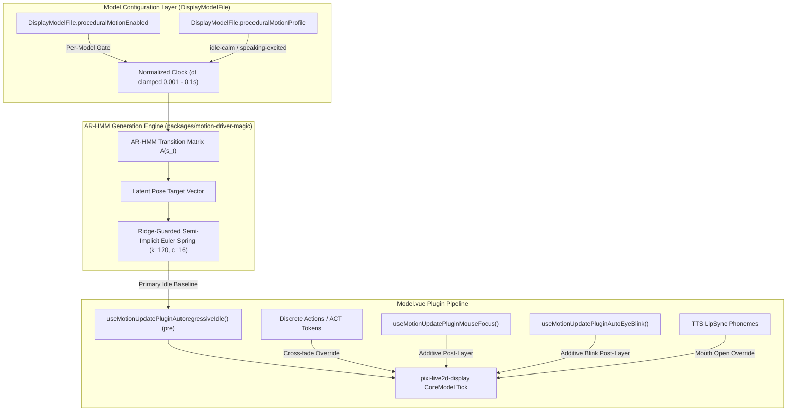

# Design: Autoregressive Live2D Ambient Motion & Micro-Movement Synthesis

This document establishes the canonical design, mathematical foundation, and porting strategy for **Autoregressive Live2D Ambient Motion Generation** in **AIRI**. It formalizes how learned parameter-space models (Vector Autoregression, Autoregressive Hidden Markov Models, and Harmonic Spring Solvers) provide organic, continuous 2D avatar presence without relying on 3D skeletal retargeting or repetitive looping animation clips.

---

## 1. Motivation & Technical Background

### 1.1 The 3D vs. 2D Avatar Dichotomy

AIRI's motion architecture operates across two distinct avatar rendering paradigms:

| Metric | **3D VRM Avatars (FlowMDM)** | **2D Live2D Avatars (Autoregressive Parametric)** |
| :--- | :--- | :--- |
| **Physics Model** | Hierarchical humanoid joint transforms ($SE(3)$ forward kinematics). | Planar mesh vertex deformers driven by normalized $[-1, 1]$ or $[0, 1]$ parameter values. |
| **Generation Engine** | WebGPU DDIM diffusion over 263-dim HumanML3D tensors (`flow_mdm.onnx`). | Parameter-space Autoregressive HMM / Spring-Damped Harmonic Trajectory Engine (MAGIC). |
| **Target Representation** | glTF binary container with `VRMC_vrm_animation` (`.vrma`). | Continuous parameter updates applied directly to `CubismCoreModel` buffers. |
| **Movement Style** | Biomechanically accurate 3D skeletal movement (jumping jacks, bowing, waving). | Stylized anime VTuber presence (organic idle swaying, rhythmic micro-nodding, saccades). |

### 1.2 The Failure Mode of Looping Idle Clips & 3D Retargeting

1. **Repetitive Idle Fatigue**: Standard Live2D models ship with static looping clips (`Idle.motion3.json`) that repeat predictably every 2–4 seconds. The human eye rapidly identifies the loop boundary, destroying immersion.
2. **The "Neuro-sama Presence"**: High-end AI VTubers achieve lifelike presence not through discrete canned clips, but through continuous, non-repeating, stochastic postural drift coupled with subtle breathing and eye-dart dynamics.
3. **Planar Distortion in 3D-to-2D Retargeting**: Directly projecting 3D human skeletal MoCap onto Live2D parameters (`ParamAngleX/Y/Z`, `ParamBodyAngleX`) forces multi-axis parameters into extreme corners simultaneously, causing mesh tearing and flattened eye geometry. Realtime Live2D motion must operate natively in parameter space.

---

## 2. Upstream "MAGIC" Lineage & Root-Cause Analysis

Upstream explored procedural Live2D motion under the codename **`MAGIC`** (**M**arkovian **A**nimation **G**enerator with **I**llusory **C**onditioning), introduced in PR [#2376](https://github.com/moeru-ai/airi/pull/2376) (commit `8ddb35353`). While theoretically sound, early users reported severe visual glitches, freezes, and canvas crashes. Our port resolves these three critical root causes:

### 2.1 Synchronous Main-Thread Fitting Freeze
- **Upstream Failure**: In `use-live2d-motion-magic.ts`, when switching to MAGIC, `initialize()` called `fit(toTrainingSequence(dataset, 30), fitOptions)` synchronously on the renderer main thread. `fit()` executes 6 iterations of full multi-channel expectation-maximization over ~2,000 frames (64.5 seconds of 13-channel telemetry), computing heavy matrix inversions. This froze the UI for 500ms–2000ms.
- **Our Fix**: Pre-calculate and serialize fitted model weights for default profiles (`idle-calm`, `speaking-excited`), eliminating runtime training for shipped profiles, and offload any custom dataset fitting to Web Workers.

### 2.2 Numerical Singularity & NaN Shader Crashes
- **Upstream Failure**: In `packages/motion-driver-magic/src/shared/numeric.ts`, Cholesky decomposition (`cholesky`) and linear solving (`solvePositiveDefinite`) operated on sample covariance matrices. When a dataset channel had near-zero variance or collinearity, the matrix became non-positive-definite (`diag <= 0`). This caused the solver to output `NaN` values. Once `NaN` propagated into `Pose` and was written to WebGL Cubism uniforms, Pixi crashed or the model vanished completely.
- **Our Fix**: Enforce strict Tikhonov ridge regularization ($\mathbf{\Sigma} + \lambda \mathbf{I}$ with $\lambda \ge 10^{-4}$) and clamp diagonal Cholesky pivots to $\epsilon = 10^{-6}$, guaranteeing mathematically stable, strictly positive-definite matrices with zero possibility of `NaN` emission.

### 2.3 Detached rAF Loop Desync & Catch-Up Spasms
- **Upstream Failure**: `packages/model-driver-magic-live2d/src/driver.ts` ran its own independent `requestAnimationFrame` loop outside of Pixi's ticker. During tab unfocus or lag spikes, its catch-up loop (`while (accumulatedMs >= frameIntervalMs)`) invoked `generatePose()` up to 8 times in a single frame, resulting in violent model spasms.
- **Our Fix**: Integrate generation directly into `useLive2DMotionManagerUpdate` in `Model.vue`, tying delta-time evaluation strictly to Pixi's model update cycle with hard-clamped $\Delta t \in [0.001\text{s}, 0.1\text{s}]$.

---

## 3. System Architecture & Layered Override Priority

For **Phase 1**, BeatSync integration is explicitly deferred to preserve pure, zero-interference ambient idle presence.



### 3.1 Primary Idle Generator Contract
When `proceduralMotionEnabled` is `true` on the active model:
1. **Supersedes Looping Clips**: The procedural engine acts as the **primary idle generator**, replacing finite looping `Idle.motion3.json` animations to eliminate repetitive loop fatigue.
2. **Graceful Action Yielding**: When a discrete semantic gesture plays (e.g. `<|ACT:motion="..."|>`, user click reaction, or DSL command), `ctx.isIdleMotion` becomes `false`. The ambient engine smoothly blends down its influence. Once the action concludes, the spring solver smoothly transitions back into the ambient trajectory without snapping.
3. **Additive Layering**:
   - **Gaze & Saccades**: `useMotionUpdatePluginMouseFocus` continues to layer head-follow and eyeball gaze additively on top.
   - **Eye Blinking**: `useMotionUpdatePluginAutoEyeBlink` layers natural blinks over the procedural posture.
   - **LipSync**: Speech runtime retains exclusive ownership of `ParamMouthOpenY`.

---

## 4. Mathematical Foundations

### 4.1 Parameter State-Space Vector
The parameter state vector $\vec{p}_t \in \mathbb{R}^D$ drives the primary Cubism channels:
$$\vec{p}_t = \begin{bmatrix} \text{ParamAngleX}_t \\ \text{ParamAngleY}_t \\ \text{ParamAngleZ}_t \\ \text{ParamBodyAngleX}_t \\ \text{ParamBreath}_t \end{bmatrix}$$

### 4.2 Autoregressive Hidden Markov Process
Transitions follow a Markov regime-switching autoregressive process:
$$\Delta \vec{p}_t = \mathbf{A}(s_t) \vec{p}_{t-1} + \vec{\mu}(s_t) + \vec{\epsilon}_t, \quad \vec{\epsilon}_t \sim \mathcal{N}(0, \mathbf{\Sigma}(s_t))$$
- $s_t \in \{1, \dots, K\}$: Discrete latent behavioral regime (*resting*, *attentive*, *curious sway*).
- $\mathbf{A}(s_t)$: Transition coefficient matrix for state $s_t$.
- $\vec{\mu}(s_t)$: Mean drift vector.
- $\mathbf{\Sigma}(s_t)$: Covariance matrix dictating organic micro-movements.

### 4.3 Second-Order Semi-Implicit Euler Spring-Damper
To eliminate mechanical stiffness and ensure zero-overshoot stability, raw generated targets $\vec{p}_{\text{target}}$ pass through a second-order spring solver:
$$a(t) = \frac{k (\vec{p}_{\text{target}} - p(t)) - c \cdot v(t)}{m}$$
$$v(t + \Delta t) = v(t) + a(t) \cdot \Delta t$$
$$p(t + \Delta t) = p(t) + v(t + \Delta t) \cdot \Delta t$$
- **Parameters**: Stiffness $k = 120$, Damping $c = 16$, Mass $m = 1$.

---

## 5. Persistence & Data Architecture (`DisplayModelFile`)

### 5.1 Per-Model Ownership Boundary
Procedural motion settings belong to the **vessel (model)**, not the **persona (character card)**. A character card can equip multiple model rigs (3D VRM, Live2D casual, Live2D formal), and individual Live2D rigs have wildly different physics capabilities.

Settings are stored directly on `DisplayModelFile` and `DisplayModelURL` in `packages/stage-ui/src/stores/display-models.ts` and persisted in IndexedDB (`localforage`):

```ts
export interface DisplayModelFile {
  id: string
  format: DisplayModelFormat
  // ... existing metadata ...
  emotionMappings?: Record<string, string>
  motionMappings?: Record<string, string>

  /** Whether AR-HMM procedural ambient presence is active for this model. Default: false */
  proceduralMotionEnabled?: boolean
  /** Active procedural profile. Default: 'idle-calm' */
  proceduralMotionProfile?: 'idle-calm' | 'speaking-excited'
  /** Amplitude scaling factor (0.5x to 1.5x). Default: 1.0 */
  proceduralMotionIntensity?: number
}
```

---

## 6. User Experience & Developer Tooling

### 6.1 Settings > Models > Live2D
Inside `packages/stage-ui/src/components/scenarios/settings/model-settings/live2d.vue` (and embedded in `ModelCustomizer.vue`):
- **Ambient Presence Switch**: `Procedural Idle Presence (AR-HMM)` — Toggle switch (`false` by default).
- **Profile Selector**: Segmented control (`Calm Resting` vs. `Lively / Animated`).
- **Intensity Slider**: Range slider (`50%` to `150%`).
- Changes call `displayModelsStore.updateDisplayModelMappings(modelId, { proceduralMotionEnabled })`.

### 6.2 Developer Diagnostics Workbench
Accessible via `System -> Developer Settings -> Live2D Motion Workbench` (`/devtools/live2d-motion`):
- Real-time phase-space visualizer displaying the active latent state $s_t$, covariance ellipse, and spring output curves.
- Manual telemetry recorder for creating and exporting bespoke character motion datasets.

---

## 7. Implementation & Porting Roadmap

1. **Phase 1: Math Engine & Numerical Stabilization (Current Scope)**
   - Port `packages/motion-driver-magic` with ridge regularizer ($\lambda \ge 10^{-4}$) and Cholesky pivot protection.
   - Port `packages/model-driver-magic-live2d` with Pose mappings.
   - Bundle pre-computed weights for `idle-calm` and `speaking-excited` to avoid main-thread freeze.
   - Integrate `useMotionUpdatePluginAutoregressiveIdle` into `packages/stage-ui-live2d/src/components/scenes/live2d/Model.vue`.
   - Add `proceduralMotionEnabled` to `DisplayModelFile` schema and IndexedDB persistence.
2. **Phase 2: Settings UI & Customizer Integration**
   - Add the Procedural Presence configuration card to `settings/model-settings/live2d.vue`.
   - Verify smooth handoff between ambient presence and `<|ACT:motion="..."|>` actions.
3. **Phase 3: DevTool Workbench & Custom Recording**
   - Wire the Developer Motion Workbench in `apps/stage-tamagotchi` for advanced profile tuning.
