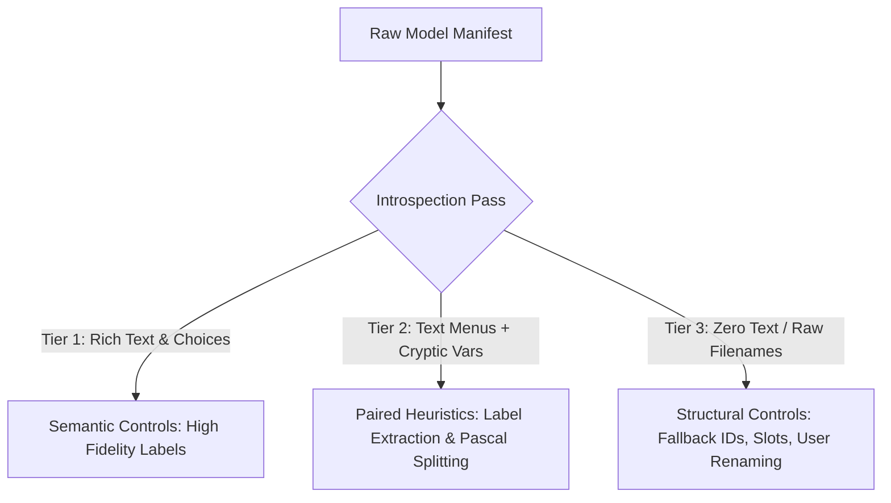
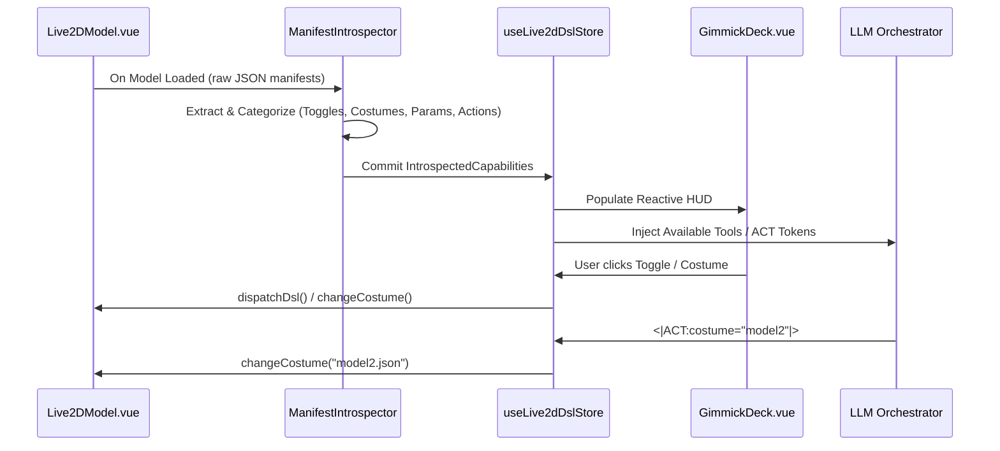
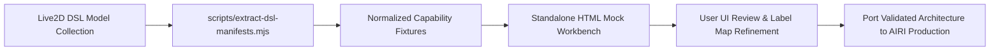

# Live2D Gimmick Deck & Capability Introspection
### 🎛️ Translating Wild Creator State Machines into Usable Companion Controls
**Specification & Architectural Design**

---

## 🧭 Executive Summary

Third-party Live2D creator packages (Wallpaper Engine, Bilibili, and game rips) frequently bundle sophisticated state machines (`VarFloats`, `change_cos`, `ParamValue`, `Choices`, and semicolon-chained `Commands`). In their native environments, these engines operated without an AI brain, using hardcoded Japanese/Chinese audio files, rigid menu trees, and arbitrary variable registers (`var`, `var1`, `var2`).

In AIRI, developers face a persistent **"Mental Hump"**:
1. **The Emulator Trap**: Treating the DSL purely as a low-level bytecode VM results in developer debuggers—opaque tables of cryptic numbers and raw input boxes that are unusable for end users.
2. **The Hand-Waving Trap**: Assuming third-party manifests contain cleanly curated labels, icons, and descriptions. In reality, wild manifests range from bilingual menu trees to zero-semantic file dumps (e.g. 228 raw files named `model1.json` through `model228.json`).
3. **The Voice Collision Trap**: Blindly running the creator's hardcoded audio clips obliterates AIRI's generative TTS, persona, and memory continuity.

**The Solution:** The **Live2D Gimmick Deck**.
Instead of executing the DSL in the dark, AIRI runs a **static manifest introspection pass** on model mount. It categorizes messy creator data into a deterministic schema of **Switches, Costumes, Part Sliders, and Gimmicks**. It renders a tactile, floating HUD with pragmatic fallback heuristics (from semantic text down to raw variable keys) and offers **Dual-Execution Mode** (Original Creator Playback vs. AIRI Generative Sync).

---

## 📚 Related Documents & Architectural Lineage

This design directly operationalizes and unifies the following AIRI research and specification documents:

- [docs/research-live2d-special-sauce.md](file:///Users/richardpinedo/Projects.nosync/airi/airi_dasilva333/docs/research-live2d-special-sauce.md) — The empirical foundation: logs 25+ real-world Live2D packages, analyzing custom commands removed during WebGL crash-proofing.
- [docs/design-live2d-dsl-interpreter-spec.md](file:///Users/richardpinedo/Projects.nosync/airi/airi_dasilva333/docs/design-live2d-dsl-interpreter-spec.md) — The formal VM specification: `VarFloats` Type 1 guards vs. Type 2 modifiers, glassmorphic choice overlays, delta ticking engine, and dating-sim staging.
- [docs/design-live2d-multimoc-changecos.md](file:///Users/richardpinedo/Projects.nosync/airi/airi_dasilva333/docs/design-live2d-multimoc-changecos.md) — The zero-latency multi-`.moc3` costume hot-swapping pipeline.
- [docs/design-live2d-change-cos-challenge.md](file:///Users/richardpinedo/Projects.nosync/airi/airi_dasilva333/docs/design-live2d-change-cos-challenge.md) — WebGL memory and texture atlas preservation across submodel switches.
- [docs/handoff-live2d-dsl-phase2.md](file:///Users/richardpinedo/Projects.nosync/airi/airi_dasilva333/docs/handoff-live2d-dsl-phase2.md) — Phase 2 implementation handoff: dispatch opcodes and instruction pipelines.
- [apps/stage-tamagotchi/src/renderer/pages/devtools/live2d.vue](file:///Users/richardpinedo/Projects.nosync/airi/airi_dasilva333/apps/stage-tamagotchi/src/renderer/pages/devtools/live2d.vue) — The active playground exposing `getDslState()`, `dispatchDsl()`, `varFloats` heap, and sandboxed intimacy.
- [packages/stage-ui-live2d/src/components/scenes/live2d/Model.vue](file:///Users/richardpinedo/Projects.nosync/airi/airi_dasilva333/packages/stage-ui-live2d/src/components/scenes/live2d/Model.vue) — The primary runtime rendering component hosting the Cubism model and ticker loop.

---

## 🔍 The Data Reality: 3 Wild Tiers of Creator Metadata

To avoid hand-waving, the introspection engine is built around the raw data structures documented in `research-live2d-special-sauce.md`. Real-world models fall into three distinct quality tiers:



### Tier 1: High Semantic Metadata (The Ideal Case)
*Example: `live2d_3626567931` (Raiden Shogun / Genshin Mascot)*
Manifest snippet:
```json
{
  "Group": "Tap",
  "Entry": "DoubliClick",
  "Text": "Menu{$br}Intimacy: {$vi_IntimacyVI}",
  "Choices": [
    { "Text": "Gift", "NextMtn": "送礼菜单#99" },
    { "Text": "Chat Switch: {$vi_OpenChat}", "NextMtn": "闲聊开关#99" },
    { "Text": "Mouse Track: {$vi_InMouseTracking}", "NextMtn": "鼠标跟踪#99" },
    { "Text": "Idle Motion: {$vi_InIdle}", "NextMtn": "待机动作#99" },
    { "Text": "Texture Menu: {$vi_TextureNum}", "NextMtn": "纹理菜单#99" }
  ]
}
```
- **Reality**: Clean English/Chinese text, dynamic variable interpolation (`{$vi_OpenChat}`), and explicit choice trees.
- **UI Translation**: Extremely straightforward. The engine can generate titled buttons and toggle switches directly from the `Text` property.

### Tier 2: Semi-Semantic / Cryptic Dual-Ended (The Common Case)
*Example A: `live2d_2883004043` (Azur Lane)*
Manifest snippet:
```json
{
  "Group": "choice",
  "Choices": [
    { "Text": "开启誓约动画", "NextMtn": "A" },
    { "Text": "关闭誓约动画", "NextMtn": "B" },
    { "Text": "开启登录动画", "NextMtn": "C" },
    { "Text": "关闭登录动画", "NextMtn": "D" }
  ]
}
// Group A: {"VarFloats": [{"Name": "var", "Type": 1, "Code": "equal 1"}, {"Name": "var", "Type": 2, "Code": "assign 0"}]}
// Group B: {"VarFloats": [{"Name": "var", "Type": 1, "Code": "equal 0"}, {"Name": "var", "Type": 2, "Code": "assign 1"}]}
```
- **Reality**: The user menu has beautiful Chinese labels (`开启誓约动画` = Enable Oath Animation), but the underlying variables are completely opaque: `var`, `var1`, `var2`.
- **UI Translation**: If an agent or UI looked only at `VarFloats`, it would see `var: 0`. But by **correlating** `NextMtn` targets (`A`/`B`) back to the parent `Choices` array, the system extracts the true semantic intent: `var` controls "誓约动画" (Oath Animation).

*Example B: `live2d_3490176232` (Momoka Sono)*
Manifest snippet:
```json
{
  "ParamValue": {
    "Items": [
      { "Name": "MomokaSono", "Ids": ["ParamMomokaSono"], "Value": 0.5 },
      { "Name": "LegSwitch", "Ids": ["ParamLegSwitch"] },
      { "Name": "BedColor", "Ids": ["ParamBedColor"] },
      { "Name": "HairOrnmt", "Ids": ["ParamHairornamentSwitch"] },
      { "Name": "CheekSwitch", "Ids": ["ParamCheek"] }
    ]
  }
}
```
- **Reality**: No user-facing descriptions. Only PascalCase internal parameter names.
- **UI Translation**: Needs heuristic string formatting: stripping `Param` prefixes, splitting camel/Pascal case (`HairOrnmt` -> "Hair Ornament"), and detecting binary ranges (`[0, 1]` -> Switch) vs continuous ranges (`[0.0 - 1.0]` -> Slider).

### Tier 3: Zero-Semantic / Raw Numbers & Filenames (The Brutal Case)
*Example: `live2d_3548538714` (Senran Kagura Standby Characters)*
Manifest snippet:
```json
{ "Group": "Start", "Entry": "0", "Command": "change_cos model1.json" },
{ "Group": "Start", "Entry": "1", "Command": "change_cos model2.json" },
...
{ "Group": "Start", "Entry": "227", "Command": "change_cos model228.json" }
```
- **Reality**: Zero text. Entry names are sequential digits `0` to `227`. Filenames are `model1.json` to `model228.json`.
- **UI Translation**: The engine cannot magically know that `model14.json` is "Asuka Shinobi Uniform". It must fall back to indexed slots (`Costume #1 (model1)`, `Costume #2 (model2)`), while providing an inline **Rename / Alias** button so users can label them as they discover them.

---

## 🛠️ The Concrete Form-Control Translation Engine

Here is the exact algorithmic mapping from raw manifest keys to Vue 3 UI controls:

### 1. Binary Toggles: `<GimmickSwitch />`
**Target Mechanics**: `VarFloats` toggling between 0 and 1; Live2D parameters toggling mesh visibility (e.g. glasses, hair ribbons).

```
[ Real Manifest Input ]
Group 'choice': [{"Text": "开启登录动画", "NextMtn": "C"}, {"Text": "关闭登录动画", "NextMtn": "D"}]
Group 'C': VarFloats: [{"Name": "var1", "Code": "assign 0"}]
Group 'D': VarFloats: [{"Name": "var1", "Code": "assign 1"}]
```
⬇️ **Introspection Logic**:
1. Scan `VarFloats` modifications across all groups. Detect variables that only receive `assign 0` and `assign 1`.
2. Look for paired choices that lead to these groups. Match common toggle prefix pairs:
   - `开启` / `关闭` (Chinese: Enable / Disable)
   - `On` / `Off` or `Enable` / `Disable` (English)
   - `{$vi_VarName}` interpolation
3. Extract root label: `"登录动画"` (Login Animation).

⬇️ **Rendered Control**:
```
+-------------------------------------------------------------+
|  [x] 登录动画 (Login Animation)                [var1 = 1]   |
|      Source: Choice Toggle · Target Group: C / D            |
+-------------------------------------------------------------+
```
*Fallback when no Choice exists (e.g. `InMouseTracking` initialized in `InitNext`):*
```
+-------------------------------------------------------------+
|  [x] In Mouse Tracking                         [InMouseTracking]
|      Source: VarFloat Register                              |
+-------------------------------------------------------------+
```
*Fallback for bare variable (`var` with no parent text):*
```
+-------------------------------------------------------------+
|  [x] Flag: var                                 [var = 1]    |
|      Source: Raw Register                                   |
+-------------------------------------------------------------+
```

---

### 2. Multi-MOC Costume Rack: `<CostumePicker />`
**Target Mechanics**: `change_cos <filename>` commands.

```
[ Real Manifest Input ]
Group 'Start': Entry '13': {"Command": "change_cos model14.json"}
```
⬇️ **Introspection Logic**:
1. Parse all semicolon commands matching `change_cos (?<target>[^\s;]+)`.
2. Deduplicate target filenames into an ordered list.
3. Check `displayModelsStore` user-alias map for the active model: `userAliases[modelId]?.[target]`.

⬇️ **Rendered Control**:
- If <= 4 costumes: Render as a segmented pill row: `[ Default ] [ Costume 2 ] [ Costume 3 ]`
- If > 4 costumes (e.g. Senran Kagura with 228 models): Render as a searchable dropdown combobox + pagination grid:
```
+-------------------------------------------------------------+
| 👗 WARDROBE (228 Costumes Detected)                         |
|   [ Search costume / model...                             ] |
|   +-------------------------------------------------------+ |
|   | #1: model1.json                        [Active]       | |
|   | #2: model2.json                        [Wear] [✏️]    | |
|   | #3: model3.json                        [Wear] [✏️]    | |
|   | #14: Asuka (Summer Uniform)            [Wear] [✏️]    | |
|   +-------------------------------------------------------+ |
+-------------------------------------------------------------+
```
*Clicking `[Wear]` dispatches `live2dModelRef.value.changeCostume(target)`.*
*Clicking `[✏️]` lets the user save a friendly name into IndexedDB for that model slot.*

---

### 3. Part & Mesh Sliders: `<PartController />`
**Target Mechanics**: `ParamValue` controllers inside `model3.json`.

```
[ Real Manifest Input ]
{"Name": "HairOrnmt", "Ids": ["ParamHairornamentSwitch"], "KeyValues": [0.0, 1.0]}
{"Name": "MomokaSono", "Ids": ["ParamMomokaSono"], "Value": 0.5, "KeyValues": [0.0, 0.5, 1.0]}
```
⬇️ **Introspection Logic**:
1. Read `model3.json` -> `Controllers` -> `ParamValue`.
2. Inspect `KeyValues` or value range:
   - If exactly 2 keys (`[0, 1]`): Render as `<Switch />`.
   - If 3-5 discrete keys: Render as `<SegmentedControl />`.
   - If continuous: Render as `<Slider min=0 max=1 step=0.01 />`.
3. **Continuous Delta-Ticking Clamp**: To prevent the known "Disappearing Body" bug (where Live2D physics resets parameters to 0.0 and turns meshes invisible), the active value is locked into the Delta Ticking loop so it is enforced every frame.

⬇️ **Rendered Control**:
```
+-------------------------------------------------------------+
| 🎨 ACCESSORIES & PARTS                                       |
|   Hair Ornament:    (•) Off   ( ) On        [ParamHairornament]
|   Momoka / Sono:    [====|========] 0.50    [ParamMomokaSono] |
|   Legs / Stockings: (•) Bare  ( ) Black     [ParamLegSwitch]  |
+-------------------------------------------------------------+
```

---

### 4. Special Gimmicks & Cutscenes: `<GimmickAction />`
**Target Mechanics**: Semicolon-chained motion, sound, and expression triggers with subtitles (`Text`).

```
[ Real Manifest Input ]
Group 'Sound#1', Entry '011501_051_01_01':
{
  "Sound": "Motions_Sound#1_10_Sound_0.wav",
  "Text": "わあ、きれいな花火！あっちには金鱼すくいがある！焼きそばも美味しそう～。",
  "Expression": "exp01.exp3",
  "PostCommand": "clear_exp",
  "NextMtn": "Next:011501_051_01_02"
}
```
⬇️ **Introspection Logic**:
1. Scan motion groups with `Text` or `Sound` properties.
2. Generate display title:
   - If `Text` exists: Truncate first 20 characters as title: *"わあ、きれいな花火！..."*
   - If no `Text`: Fallback to Group + Entry name: `Sound#1 : 011501_051_01_01`.

⬇️ **Rendered Control & Dual-Execution Switch**:
```
+-------------------------------------------------------------+
| 🎬 SPECIAL GIMMICKS (Cutscenes & Reactions)                  |
|   Execution Mode:                                           |
|   (•) AIRI Generative Sync   ( ) Original Creator Audio     |
|                                                             |
|   ▶ "わあ、きれいな花火！あっちには..." (Festival Fireworks)  |
|     Tracks: Sound + Motion (exp01) + Next Chaining          |
|                                                             |
|   ▶ "这是咲夜が着付けしてくれたの！" (Sakuya Yukata)         |
|     Tracks: Sound + Motion (exp01)                          |
+-------------------------------------------------------------+
```

#### The Dual-Execution Engine:
- **Mode A: Original Creator Audio**:
  Plays the creator's raw `.wav`/`.ogg` audio file and executes `start_mtn` / expressions exactly as authored in 2018.
- **Mode B: AIRI Generative Sync (The Bridge)**:
  1. The audio file playback is **suppressed** (`sound.muted = true`).
  2. The creator's `Text` is extracted and fed to the AIRI chat orchestrator as an environmental prompt injection:
     ```
     [System / Scene Context]: The user triggered the character's reaction:
     "わあ、きれいな花火！あっちには金鱼すくいがある！焼きそばも美味しそう～。"
     React to this moment in your own words, voice, and current persona.
     ```
  3. Live2D physical animations (`B10`, `Face#2:07`, `exp01.exp3`) play immediately on the character model.
  4. AIRI generates an in-character response, synthesized via ElevenLabs / Kokoro TTS, talking seamlessly over the creator's custom visual motion!

---

### 5. Intimacy & Relationship Gauge: `<IntimacyMeter />`
**Target Mechanics**: `Intimacy` bounds (`Min`, `Max`, `Bonus`) and variable tiers (`IntimacyVI`).

```
[ Real Manifest Input ]
Group 'Update7#98', Entry '1':  {"Intimacy": {"Min": 0, "Max": 99}, "assign 1"}
Group 'Update7#98', Entry '16': {"Intimacy": {"Min": 3750, "Max": 4209}, "assign 16"}
Tap Box 'TapDREFTouchBoxHip':   {"Intimacy": {"Min": 14350}, "Command": "start_mtn ..."}
```
⬇️ **Introspection Logic**:
1. Extract minimum and maximum intimacy bounds across all entries.
2. Read the model's current intimacy value from `dslState.intimacyRaw` (or write-back key `settings/live2d/dsl-intimacy/{modelId}`).
3. Count how many touch interactions or motion groups are locked vs unlocked.

⬇️ **Rendered Control**:
```
+-------------------------------------------------------------+
| 💖 INTIMACY & RELATIONSHIP PROGRESS                         |
|   Tier: Level 4 / 16 (Affinity: 450 pts)                    |
|   [██████████░░░░░░░░░░░░░░░░░░░] Next Tier: 520 pts        |
|   Unlocked Interactions: 14 / 22 Gimmicks                   |
+-------------------------------------------------------------+
```

---

## 🏗️ Architecture & Component Integration



### Component Breakdown
1. **Introspection Engine (`packages/stage-ui-live2d/src/interpreter/introspector.ts`)**:
   - Pure functional parser. Takes raw `model3.json`, motion group definitions, and `Controllers`.
   - Produces a strongly-typed `Live2dCapabilities` object.
2. **Store (`packages/stage-ui-live2d/src/stores/live2d-dsl.ts`)**:
   - Manages live `VarFloats` state, active costume index, and overrides.
   - Saves user aliases (`Costume #14 -> Swimsuit`) to `localforage`.
3. **UI Surfaces**:
   - **Desktop Stage (Electron)**: A slide-over glassmorphic drawer toggled via the Control Strip or a stage hotkey (`Ctrl+Shift+G`).
   - **Mobile / Web**: An expandable bottom sheet.
   - **Model Customizer Settings**: A dedicated "Special Features" inspection panel inside Settings > Models > Model Settings.

---

## 🧪 Cleanroom Prototyping Strategy & Phasing

### Why In-Engine Prototyping is a Dead End
Iterating on the Gimmick Deck directly inside the live AIRI desktop application (`devtools/live2d.vue` or `stage-tamagotchi`) introduces severe friction:
1. **Iteration Velocity**: Full Electron packaging, Vite HMR resets, and WebGL/PIXI canvas recompilation make UI tweaking painfully slow.
2. **Host Port Limitations**: Several upstream runtime operations (such as `change_cos` in `Model.vue`, multi-atlas texture hot-swapping, and certain expression bindings) have known limitations or empty stub callbacks in the existing host adapter. Attempting to build an end-to-end UI directly in-engine creates phantom buttons that appear valid but produce no visual change on screen.
3. **Ingestion Reality**: True multi-`.moc3` costume hot-swapping (`change_cos`) is not a simple script patch; it requires updating the model ingestion pipeline with an import wizard/modal allowing users to choose between normalized and legacy layout imports.

### The Isolated Cleanroom Pipeline (`scripts/live2d-cleanroom/`)
Instead of wrestling with the live runtime, development follows an **isolated cleanroom approach**:



1. **Batch Extraction**:
   - An offline Node/ESM script scans the user's real collection of Live2D models with DSL manifests.
   - Extracts choices, motion groups, variable modifiers, parameters, and costume lists into static JSON fixtures.
2. **Interactive HTML Mock Workbench**:
   - Generates a standalone, dependency-free interactive HTML test bench.
   - Renders grouped controls (Switches, Costumes, Sliders, Scene Triggers) for each discovered model scenario.
   - Provides a zero-latency playground to refine layout density, grouping heuristics, category icons, and user-friendly aliases without touching production code.
3. **Dual-View UX Architecture**:
   To prevent discarding the author's carefully curated menu logic by blindly flattening everything:
   - **"Creator Menu" View**: Preserves the original tree structure, branching options, and text from the creator's `Choices` array.
   - **"Discovered Features" View**: Groups features by functional capability (Switches, Outfits, Gimmicks, Sliders).
   Users and designers can toggle between both views to compare ergonomics.
4. **Three Concrete Experiment Deliverables**:
   - **Extracted Capability Inventory**: What each package actually declares, with source file references and locations preserved.
   - **Interactive Control Mock**: Demonstrates whether grouping, labels, menus, and discovery make sense to a human user.
   - **Coverage & Ambiguity Report**: Identifies which patterns generalize cleanly and which models require special aliases, fallbacks, or manual mapping.
5. **The 5-Layer Capability Model**:
   The cleanroom workbench enforces a strict separation of concerns across 5 distinct authorities:
   - **Layer 1 (Declared)**: What does the creator manifest declare? (Manifest inspection).
   - **Layer 2 (Host Supported)**: Does this specific host implement the required execution port? (e.g. is `change_cos` wired or stubbed?).
   - **Layer 3 (State Eligible)**: Is the action valid right now? (Variable guards, intimacy thresholds, cooldowns).
   - **Layer 4 (Execution Reality)**: What actually played, and did audio/motion complete?
   - **Layer 5 (User Presentation)**: What should it be called? (Original creator text vs. user aliases).
6. **Production Porting**:
   Once the UI ergonomics, grouped controls, and taxonomy maps are refined and approved in the cleanroom mock, the proven patterns will be ported into `@proj-airi/stage-ui-live2d`.

---

## 🤖 Companion & ACT Token Bridge

The introspected capabilities are not isolated to the UI; they are published directly to the LLM's system prompt and tool registry:

1. **System Prompt Sensory Context**:
   ```
   [Available Physical Outfits]: "Default", "Summer Yukata (model2)", "Swimsuit (model3)"
   [Available Toggles]: "Glasses" (currently: off), "Cat Ears" (currently: on)
   ```
2. **ACT Token Generation**:
   The LLM can trigger costume hot-swaps or toggles directly during natural conversation:
   ```
   "It's getting really hot outside! Let me change into something lighter. <|ACT:costume="model2"|>"
   ```
3. **Built-in Tool Bridge**:
   Exposes standard xsai tools:
   - `set_live2d_costume({ costumeId: string })`
   - `set_live2d_toggle({ toggleName: string, enabled: boolean })`
   - `trigger_live2d_gimmick({ gimmickId: string })`

---

## 🏁 Summary: Why This Defeats the Mental Hump

1. **No More Guesswork**: It accepts wild, dirty creator data as it actually exists—whether it has clean Chinese labels, PascalCase parameters, or raw `model228.json` numbers.
2. **Pragmatic Graceful Degradation**: If semantic text exists, it shows beautiful labels. If text is missing, it falls back to cleaned parameter names, slot numbers, and user-editable aliases.
3. **No Voice Clashing**: AIRI Generative Sync allows users to enjoy 2008–2020 visual novel animations without silencing AIRI's 2026 voice and intelligence.
4. **Agent Embodiment**: The AI companion gains direct physical agency over her own Live2D model's wardrobe, accessories, and stance switches.
