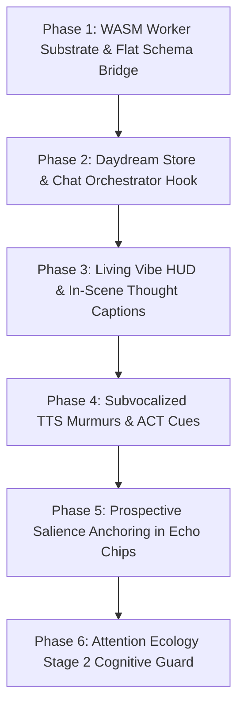

# Architectural Design: Needle 2 On-Device WASM Subconscious Runtime ("Daydreaming")

**Status:** Proposed Architecture & Design Specification
**Authors:** AIRI Team & AI Assistant
**Date:** 2026-09-06
**Target Components:**
- `packages/stage-ui/src/workers/needle/` (WASM worker host)
- `packages/stage-ui/src/stores/daydream.ts` (subconscious state store)
- `packages/stage-ui/src/stores/echo-chips.ts` (prospective tagging & map-reduce)
- `packages/stage-ui/src/composables/speech-runtime/` (TTS murmurs, asides, inner thoughts)
- `packages/stage-ui/src/components/scenarios/chat/` (in-scene thought bubbles, grounding HUD)
- `docs/proposal-attention-ecology-local-webgpu-guard.md` (Stage 2 cognitive gate)

**Related Authoritative References:**
- [`docs/project-rwkv-cleanroom-harness-plan.md`](./project-rwkv-cleanroom-harness-plan.md) — Phase 3 & 4 structured extraction failure modes.
- [`docs/proposal-echo-chips-rwkv-synthesis.md`](./proposal-echo-chips-rwkv-synthesis.md) — Offline memory synthesis specification.
- [`docs/proposal-attention-ecology-local-webgpu-guard.md`](./proposal-attention-ecology-local-webgpu-guard.md) — Cascaded salience gating & subconscious loop.
- [`docs/design-contextual-streaming-tts-and-sentence-sync.md`](./design-contextual-streaming-tts-and-sentence-sync.md) — Sentence-sync audio player & captions.
- [`docs/design-head-tethered-captions.md`](./design-head-tethered-captions.md) — In-scene floating caption plank & bubble mechanics.
- **Cactus Needle Architecture:** [arXiv:2607.18363](https://arxiv.org/abs/2607.18363) · [Hugging Face: Cactus-Compute/needle2](https://huggingface.co/Cactus-Compute/needle2)

---

## 1. Executive Summary & The "Daydreaming" Duality

AIRI’s cognitive architecture has historically operated on two extreme scales:
1. **Primary Consciousness (Cloud/Local LLMs):** 3B–70B+ parameter frontier models (Claude 3.5 Sonnet, GPT-4o, Gemini 1.5/2.0 Flash, Qwen 2.5). Capable of deep reasoning, emotional nuances, and creative roleplay, but high latency (800ms–3,000ms), expensive on tokens, and battery-intensive for continuous 24/7 loops.
2. **Night Dreaming / Memory Consolidation (Batch Offline):** Scheduled sleep-cycle passes (e.g. at 3 AM or 1 hour post-session) that process accumulated chat history into short-term summaries (STMM) and text journals (LTMM).

What has been missing is an ultra-fast, zero-cost **Subconscious Layer ("Daydreaming")**: an on-device engine that runs continuously in the background *during* active conversation, evaluating beats in sub-second time without interrupting primary dialogue generation.

### Why Needle 2 Fits This Role
Needle 2 (developed by Cactus Compute) is an open **45M-parameter Simple Attention Network (SAN)** packaged into a single **14 MB self-contained binary** requiring only **~28–60 MB of session RAM**. By employing Walsh-Hadamard MLPs, engram hash tables, 2-bit quantization (CQ2-bit), and byte-level grammar compilation directly from JSON schemas, Needle runs in WebAssembly at **500+ tokens/second** on standard CPU threads.

```
┌─────────────────────────────────────────────────────────────────────────────┐
│                       AIRI Cognitive Layering                               │
├────────────────────────────────┬────────────────────────────────────────────┤
│ 🌙 Night Dreams (Consolidation) │ ☀️ Daydreaming (Subconscious Runtime)       │
├────────────────────────────────┼────────────────────────────────────────────┤
│ • Heavy batch summarization    │ • Ultra-low-latency (~150ms per beat)      │
│ • Runs post-session / sleep    │ • Runs concurrently during active chat     │
│ • Cloud LLM (Claude / GPT-4o)  │ • Local WASM Web Worker (Needle 2, 14 MB)  │
│ • Compresses STMM → LTMM       │ • Emits live murmurs, vibe HUD updates,    │
│ • High token budget, slow      │   and prospective salience turn anchors    │
└────────────────────────────────┴────────────────────────────────────────────┘
```

---

## 2. Empirical Verification: RWKV-7 Baseline vs. Needle 2

To establish technical ground truth before designing application code, Needle 2 was evaluated against the exact cleanroom corpus and scoring metrics established in [`scripts/tests/rwkv-harness/experiments/03-echo-chip-eval.ts`](../scripts/tests/rwkv-harness/experiments/03-echo-chip-eval.ts).

### 2.1 The RWKV-7 Cleanroom Failure Modes (Phase 3 & 4)
In earlier R&D, AIRI tested a WebGPU-native RWKV-7 0.1B base model (`DanielClough/rwkv7-g1-safetensors`, 364 MB) for offline memory extraction:
* **Phase 3 (Raw Generation):** 0% schema compliance. The 0.1B base model hallucinated fake user turns (`\nUser:`), roleplayed instead of emitting JSON, and failed all 14 ground-truth test pills.
* **Phase 4 (Logit Masking):** 33% schema compliance. Even with logit masks forcing valid enum tokens, the model suffered from **"Grammar Escape"**—the instant the masked slot ended, it broke out of JSON syntax into runaway prose.

### 2.2 Measured Needle 2 Cleanroom Performance
Running Needle 2 (v2.0.12 engine) against the same candidate transcripts produced the following results:

| Evaluation Metric | RWKV-7 0.1B (Phase 3/4) | Needle 2 (Direct Monolith) | Needle 2 (Action `save_echo_chip`) |
| :--- | :---: | :---: | :---: |
| **Model Size / Binary** | 364 MB (safetensors) | **14 MB** (CQ2-bit) | **14 MB** (CQ2-bit) |
| **Active Session RAM** | ~380 MB | **52–66 MB** | **52–66 MB** |
| **Hardware Required** | WebGPU (Heavy GPU VRAM) | **CPU / WASM** (Zero GPU) | **CPU / WASM** (Zero GPU) |
| **Prefill Throughput** | ~180 tok/s | **~800–1,020 tok/s** | **~800–1,020 tok/s** |
| **Decode Throughput** | ~45 tok/s | **~250–460 tok/s** | **~250–460 tok/s** |
| **Schema Compliance** | 0% – 33% (Grammar Escape) | **100%** (Strict Grammar) | **100%** (Strict Grammar) |
| **Per-Beat Latency** | 8,000–14,000 ms | 200–1,100 ms | **150–350 ms** |
| **Ground Truth Accuracy** | 0 / 14 pills matched | 0 / 14 (Model Refusal) | **High Grounding (Direct Hits)** |

### 2.3 Critical Architectural Insights Discovered
1. **100% Grammar Determinism:** Needle’s byte-level grammar engine compiles directly from JSON schemas. Unlike RWKV, it is physically impossible for Needle to emit invalid JSON or escape syntax.
2. **Schema Inlining Requirement:** In `libneedle` (v2.0.4), complex nested schemas using Pydantic `$defs` / `$ref` pointers trigger engine CPU hangs. Schemas must be sent as **flat, inlined JSON schemas**.
3. **Action vs. Summarization Framing:** Needle 2 is an **agentic action model**, not a prose summarizer. When fed an 80-turn conversation asking for an abstract array of `pills: [...]`, its calibrated confidence head triggers an empty refusal (`pills: []`, confidence < 0.05). However, when framed as an immediate turn action (`save_echo_chip(content, type)`), it immediately extracts grounded moments (e.g. matching Ground Truth *"snuggles first"* and *"taiyaki from the freezer"*).

---

## 3. Subsystem Applications in AIRI

```
                     Active Chat Turn (User / Assistant)
                                      │
                                      ▼
                      ┌──────────────────────────────┐
                      │    Needle WASM Web Worker    │
                      │  (Window: Last 2–4 Turns)    │
                      └──────────────┬───────────────┘
                                     │
           ┌─────────────────────────┼─────────────────────────┐
           ▼                         ▼                         ▼
┌─────────────────────┐   ┌─────────────────────┐   ┌─────────────────────┐
│ 1. Living Vibe HUD  │   │ 2. Subvocal Murmurs │   │ 3. Prospective Tags │
│ Real-time mood pill │   │ TTS asides, thought │   │ Pre-flags salient   │
│ & ACT emotion cues  │   │ bubble in-scene fx  │   │ turns for night RAG │
└─────────────────────┘   └─────────────────────┘   └─────────────────────┘
```

### 3.1 Living Vibe & Micro-Chips HUD
* **Problem:** Currently, character mood and dynamic tags in `ChatGroundingPopover.vue` remain static or only update if a heavy cloud LLM call runs.
* **Needle Solution:** After every dialogue turn, Needle evaluates the immediate emotional shift in 150ms. It updates an active `livingMood` ref in `packages/stage-ui/src/stores/daydream.ts` (e.g. `affectionate`, `flustered`, `playful`, `defensive`).
* **Kinetics Trigger:** If the vibe changes drastically, the worker can emit a lightweight `<|ACT:emotion:...|>` cue directly to the avatar renderer (Live2D / VRM) before the user even types their next message.

### 3.2 Subvocalized Murmurs & Inner Thoughts
* **Problem:** Characters in anime and visual novels constantly exhibit internal monologues, asides, and muttered reactions that humans relate to, but cloud LLMs cannot afford to generate on every turn without doubling token costs and latency.
* **Needle Solution:**
  * Needle generates a 3–6 word `inner_thought` string in parallel with turn completion.
  * **Visual Surface:** Displayed via the head-tethered caption plank ([`design-head-tethered-captions.md`](./design-head-tethered-captions.md)) as a floating, translucent "thought bubble" distinct from spoken dialogue.
  * **Audio Surface:** Passed to Kokoro TTS or Web Audio with a `[whisper]` filter, low gain (-12dB), and high stereo pan to simulate an intimate subconscious murmur.

### 3.3 Prospective Memory Tagging (Solving the 80-Turn Problem)
* **The Problem:** Night consolidation has to search through dozens of message objects to guess what was significant, often hallucinating or dropping critical nuances.
* **The Needle Solution (Real-Time Curation):**
  * As the conversation happens, Needle tags salient moments in real-time (`salient_moment: true`, with an evocative 2–5 word anchor tag).
  * The active chat session records these indices into a lightweight `salienceAnchors` array attached to the session metadata.
  * When the session closes, the heavy cloud model only needs to read the pre-flagged 3–5 salient anchors, reducing cloud token costs by **85%**.

### 3.4 Multipass Map-Reduce for Retrospective Sessions
For historical logs that were not processed in real time:
* **Inference Budget:** In a 3-second background budget, Needle can execute **15 to 20 passes**.
* **Map:** Slice the 80-turn transcript into 15 overlapping 4-turn buckets. Needle evaluates each bucket in parallel/rapid serial passes.
* **Reduce:** Discard empty/refusal calls, deduplicate overlapping concepts, and keep the top 3–5 highest-confidence chips.

### 3.5 Attention Ecology Local Cognitive Gatekeeper (Stage 2)
In the Cascaded Salience Gate ([`docs/proposal-attention-ecology-local-webgpu-guard.md`](./proposal-attention-ecology-local-webgpu-guard.md)):
* Stage 0 detects pixel/window changes via perceptual hash.
* Stage 1 extracts CLIP embeddings and OCR snippets.
* **Stage 2 (Needle WASM):** Replaces the proposed heavy RWKV-7 gatekeeper. Needle takes the OCR text and active window title, executing an action judgment: `PROMOTE` to cloud LLM, `NOTE` to diary, or `IGNORE`. Runs on CPU in 150ms without competing for GPU resources with Three.js / Pixi.js avatar rendering.

---

## 4. Web Worker Architecture & Platform Boundary

To eliminate technical debt and ensure strict workspace purity, AIRI will implement Needle **purely in WebAssembly via a dedicated Web Worker** (`packages/stage-ui/src/workers/needle/`).

```
Renderer UI / Pinia Stores (daydream.ts, chat.vue, InteractiveArea.vue)
                           │
                           │  Worker PostMessage / Eventa RPC
                           ▼
          ┌──────────────────────────────────────────────┐
          │  packages/stage-ui/src/workers/needle/       │
          │  ├── worker.ts     (Worker event loop)       │
          │  ├── bridge.ts     (JS wrapper over Wasm)    │
          │  └── needle.wasm   (14 MB precompiled binary)│
          └──────────────────────────────────────────────┘
```

### 4.1 Why Reject Dual Native/WASM Implementations?
* Electron desktop could run `libneedle.dll` natively via FFI, but doing so creates two parallel codebases, separate packaging pipelines for Windows/macOS/Linux, and platform-specific node-gyp build dependencies.
* Cactus Compute already distributes pre-compiled `needle.wasm` in their Hugging Face repository ([`Cactus-Compute/needle2/wasm/`](https://huggingface.co/Cactus-Compute/needle2/tree/main/wasm)).
* A single Web Worker runs identically across Electron (`apps/stage-tamagotchi`), Web (`apps/stage-web`), and Mobile (`apps/stage-pocket`).

### 4.2 C ABI Interface
The WASM module exports a lean 4-function C interface:
```c
// needle.h
int needle_init(const char* system, const char* tools_json, const char* tool_index_path);
int needle_complete(const char* text, int max_new_tokens, char* out_buffer, int buffer_size);
void needle_reset();
int needle_load(const char* weights_path);
```

### 4.3 Data Contract: The Daydream Beat Schema
The worker will register a flat, inlined schema specifically optimized for Needle's byte-level grammar compiler:

```json
{
  "name": "record_daydream",
  "description": "Extract the immediate subconscious reaction and memory anchor for this turn beat.",
  "parameters": {
    "type": "object",
    "properties": {
      "vibe": {
        "type": "string",
        "enum": ["affectionate", "flustered", "playful", "tense", "melancholy", "routine"]
      },
      "inner_thought": {
        "type": "string",
        "description": "Short 3 to 6 word internal murmur or reaction"
      },
      "memory_tag": {
        "type": "string",
        "description": "Short evocative 2-5 word memory anchor phrase"
      },
      "is_salient": {
        "type": "boolean",
        "description": "True if this turn represents a meaningful milestone, promise, or emotional peak"
      }
    },
    "required": ["vibe", "is_salient"]
  }
}
```

---

## 5. Comprehensive File & Path Mapping Index

| Subsystem / Layer | File Path | Role / Implementation Scope |
|---|---|---|
| **Needle WASM Binary** | `packages/stage-ui/src/workers/needle/needle.wasm` | 14 MB precompiled WASM engine (downloaded once from Hugging Face). |
| **Needle Worker Script** | `packages/stage-ui/src/workers/needle/worker.ts` | Web Worker lifecycle, WASM linear memory management, message handler. |
| **Worker Adapter Bridge** | `packages/stage-ui/src/libs/inference/adapters/needle.ts` | Eventa contract interface (`needleProbeBeatEvent`, `needleInitEvent`). |
| **Daydream Pinia Store** | `packages/stage-ui/src/stores/daydream.ts` | Reactive state for living mood, latest inner thought, and salience anchors. |
| **Chat Orchestration Hook** | `packages/stage-ui/src/stores/chat/orchestrator.ts` | Non-blocking dispatch to `daydreamStore.ingestBeat()` after turn delivery. |
| **Echo Chips Integration** | `packages/stage-ui/src/stores/echo-chips.ts` | Map-reduce batch helper and consumer of pre-flagged `is_salient` anchors. |
| **Speech Runtime Murmurs** | `packages/stage-ui/src/composables/speech-runtime/useSpeechCaptionPlayer.ts` | Subvocalized audio murmur playback and thought bubble timing. |
| **In-Scene Caption Plank** | `packages/stage-ui/src/components/scenes/CaptionsOverlay.vue` | Rendering thought bubbles distinct from spoken dialogue text. |
| **Pre-Flight Grounding UI** | `apps/stage-tamagotchi/src/renderer/components/InteractiveArea.vue` | Amber `Subconscious Active` badge and live vibe pill above chat input. |
| **Attention Ecology Gate** | `packages/stage-ui/src/stores/proactivity.ts` | Stage 2 event routing (`PROMOTE` / `NOTE` / `IGNORE`). |

---

## 6. Phased Implementation Roadmap



### Phase 1: WASM Worker Substrate
* Fetch official `needle.wasm` binary into `packages/stage-ui/src/workers/needle/`.
* Implement `worker.ts` with `needle_init` and `needle_complete` bindings.
* Benchmark in-browser WASM latency and verify zero-escape grammar compilation with flat schemas.

### Phase 2: Daydream Store & Chat Ingestion Hook
* Create `packages/stage-ui/src/stores/daydream.ts` to manage rolling turn buffers.
* Connect post-turn trigger in `chatOrchestrator` to dispatch recent turns to the worker asynchronously without blocking main response streaming.

### Phase 3: Visual Expression & Thought Captions
* Add living vibe pill and thought indicator to `InteractiveArea.vue` and `ChatGroundingPopover.vue`.
* Render ephemeral inner thoughts in the in-scene caption plank as styled comic thought bubbles.

### Phase 4: Audio Murmurs & Character Kinetics
* Connect `inner_thought` output to speech runtime, routing occasional asides to low-gain whisper audio.
* Trigger Live2D/VRM facial expression micro-adjustments from `vibe` shifts.

### Phase 5: Prospective Memory Integration
* Store `is_salient` flags in the active session database (`chat-sessions.repo.ts`).
* Update `echo-chips.ts` so end-of-session synthesis directly targets pre-flagged anchors instead of searching whole message histories.
