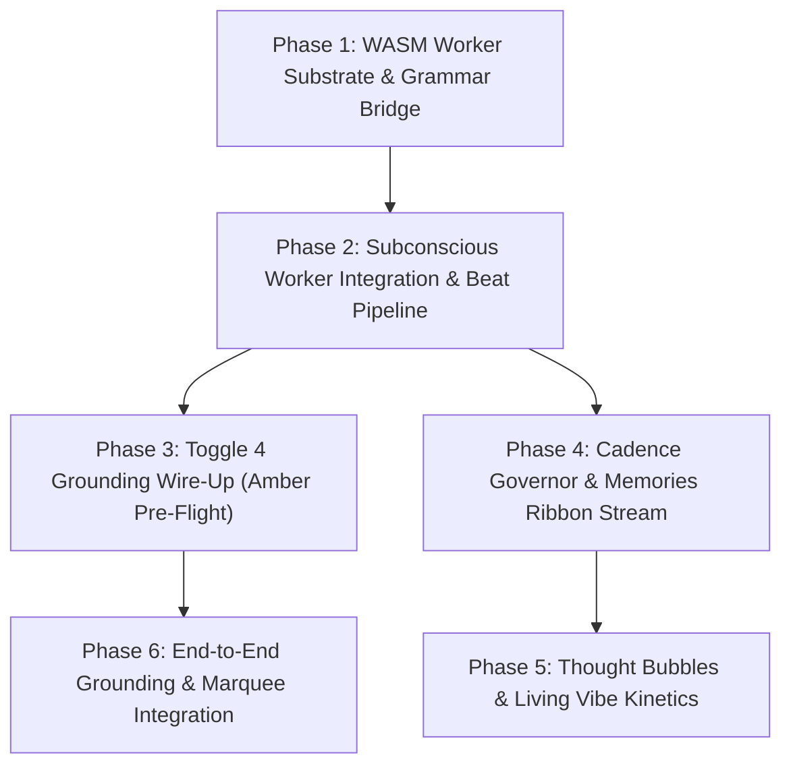

# Architectural Design: Needle 2 Subconscious Runtime (Daydreaming & Toggle 4 Recent Topics)

**Status:** Proposed Architecture & Design Specification
**Authors:** AIRI Team & AI Assistant
**Date:** 2026-09-08 (Updated to unify Daydreaming & Toggle 4)
**Target Components:**
- `packages/stage-ui/src/workers/needle/` (WASM worker host)
- `packages/stage-ui/src/stores/daydream.ts` (subconscious state store & cadence governor)
- `packages/stage-ui/src/stores/chat/recent-topics.ts` (ML-driven Toggle 4 state)
- `packages/stage-ui/src/stores/chat/grounding-assembler.ts` (`formatRecentTopicsBlock` consumer)
- `packages/stage-ui/src/components/scenarios/chat/` (Memories ribbon, column drawer, amber pre-flight panel)
- `packages/stage-ui/src/database/repos/echo-chips.repo.ts` (persisted daydream chips)
- `packages/stage-ui/src/composables/speech-runtime/` (TTS murmurs, asides, inner thoughts)

**Related Authoritative References:**
- [`docs/architecture-chat-orchestrator-decomposition.md`](./architecture-chat-orchestrator-decomposition.md) — Phase 4 `grounding-assembler.ts` seam for `[RECENT TOPICS]`.
- [`docs/proposal-toggle4-rework-and-rwkv-harness.md`](./proposal-toggle4-rework-and-rwkv-harness.md) — Problem statement on stopword failure & Toggle 4 "Here & Now" requirements.
- [`docs/proposal-dynamic-memory-rag-injection.md`](./proposal-dynamic-memory-rag-injection.md) — Original Toggle 4 context injection & Pre-Flight Grounding specification.
- [`docs/proposal-echo-chips-rwkv-synthesis.md`](./proposal-echo-chips-rwkv-synthesis.md) — Original Echo Chips memory synthesis & ticker concepts.
- [`docs/project-rwkv-cleanroom-harness-plan.md`](./project-rwkv-cleanroom-harness-plan.md) — Cleanroom test harness (`scripts/tests/rwkv-harness/`).
- **Cactus Needle Architecture:** [arXiv:2607.18363](https://arxiv.org/abs/2607.18363) · [Hugging Face: Cactus-Compute/needle2](https://huggingface.co/Cactus-Compute/needle2)

---

## 1. Executive Summary: The Dual-Surface Subconscious Layer

AIRI’s cognitive and memory architecture historically operated on two complementary scales:
1. **Primary Consciousness (Frontier Cloud LLMs):** Heavy, 3B–70B+ models handling direct conversational turns. High latency (800ms–3,000ms) and token-expensive.
2. **Dormant "Dreaming" (Echo Chips Batch Consolidation):** When you step away from the chat and the session goes idle, AIRI executes a background "Dreaming" pass (often surfaced in the UI simply as *Dreaming*). It runs in silence while the user is "out of it," processing recent dialogue into durable Echo Chips (`mood`, `flavor`, `journal_candidate`) so that when you return, there are fresh memory anchors waiting in the memories feed.

**What was missing—and what "Daydreaming" introduces—is the active, real-time counterpart.**
Echo Chips (Dreaming) is not being deprecated; it remains the authoritative dormant synthesis engine. However, users shouldn't have to step away and wait for silent night passes to see dynamic, living artifacts in the UI.

**"Daydreaming" happens while you are present and conversing.** Powered by **Needle 2** (an on-device 14 MB / CPU WASM model running in ~150ms between turns), it extracts novel tags dynamically between conversational turns.

Crucially, **Daydreaming** and **Recent Topics (Toggle 4)** are two consumer surfaces of this exact same underlying subconscious engine, and **Daydreaming Chips live side-by-side with Echo Chips in the very same visual memories stream**:

```
                                  Active Conversation Turn
                              (Sliding Window: Last 2–4 Turns)
                                              │
                                              ▼
                               ┌─────────────────────────────┐
                               │   Needle 2 Subconscious     │
                               │   WASM Worker (14 MB / CPU) │
                               └──────────────┬──────────────┘
                                              │
                                Extracts Beat Schema (150ms)
                                • active_topics [{topic, weight}]
                                • daydream_chip {text, type, score}
                                • vibe & inner_thought
                                              │
               ┌──────────────────────────────┴──────────────────────────────┐
               ▼                                                             ▼
┌─────────────────────────────┐                               ┌─────────────────────────────┐
│ Surface 1: Context Grounding│                               │ Surface 2: Visual UI Stream │
│     (Toggle 4 Injection)    │                               │ (Daydreaming + Echo Chips)  │
├─────────────────────────────┤                               ├─────────────────────────────┤
│ • Amber PRE-FLIGHT panel    │                               │ • Shared Memories Ribbon &  │
│ • Previews `[RECENT TOPICS]`│                               │   Vertical Column Drawer    │
│ • Injects into LLM prompt   │                               │ • Co-exists with dormant    │
│   via `grounding-assembler` │                               │   Echo Chips in same feed   │
│ • Immediate conversational  │                               │ • See Echo Chips on return, │
│   orientation for character │                               │   then Daydream chips stream│
│                             │                               │   in as you chat            │
└─────────────────────────────┘                               └─────────────────────────────┘
```

---

## 2. Empirical Verification: Needle 2 as an Extractor, Not a Generator

To establish technical ground truth before designing code, Needle 2 was evaluated against the cleanroom corpus established in [`scripts/tests/rwkv-harness/experiments/03-echo-chip-eval.ts`](../scripts/tests/rwkv-harness/experiments/03-echo-chip-eval.ts).

### 2.1 Cleanroom Comparison: RWKV-7 vs. Needle 2

In earlier tests, a WebGPU-native RWKV-7 0.1B base model was evaluated for memory extraction:
* **RWKV-7 Raw Generation (Phase 3):** 0% schema compliance. It hallucinated fake user turns (`\nUser:`), roleplayed instead of emitting JSON, and failed all 14 ground-truth pills.
* **RWKV-7 Logit Masking (Phase 4):** 33% schema compliance. It suffered from **"Grammar Escape"**—the instant the masked slot ended, it broke out of JSON syntax into runaway prose.
* **Needle 2 (45M SAN, CQ2-bit, WASM):** Achieved **100% strict schema determinism** via its byte-level grammar compiler directly from JSON schemas, executing on CPU with **zero GPU overhead**.

| Evaluation Metric | RWKV-7 0.1B (Phase 3/4) | Needle 2 (Abstract Summary) | Needle 2 (Action Extractor) |
| :--- | :---: | :---: | :---: |
| **Model Size / Binary** | 364 MB (safetensors) | **14 MB** (CQ2-bit) | **14 MB** (CQ2-bit) |
| **Active Session RAM** | ~380 MB | **52–66 MB** | **52–66 MB** |
| **Hardware Required** | WebGPU (Heavy GPU VRAM) | **CPU / WASM** (Zero GPU) | **CPU / WASM** (Zero GPU) |
| **Prefill Throughput** | ~180 tok/s | **~800–1,020 tok/s** | **~800–1,020 tok/s** |
| **Decode Throughput** | ~45 tok/s | **~250–460 tok/s** | **~250–460 tok/s** |
| **Schema Compliance** | 0% – 33% (Grammar Escape) | **100%** (Strict Grammar) | **100%** (Strict Grammar) |
| **Per-Beat Latency** | 8,000–14,000 ms | 200–1,100 ms | **150–350 ms** |
| **Ground Truth Accuracy** | 0 / 14 pills matched | 0 / 14 (Model Refusal) | **High Grounding (Direct Hits)** |

### 2.2 The Fundamental Realization: Needle is an Extractor First

The cleanroom experiments revealed an essential architectural principle:
* When given an 80-turn conversation and asked for an abstract array of summaries (`pills: [...]`), Needle's calibrated confidence head triggers an empty refusal (`pills: []`, confidence < 0.05). **Needle is not an open-ended prose generator or macro-summarizer.**
* However, when framed as an **action extractor over an immediate sliding window of 2–4 turns**, Needle excels: it instantly extracts grounded, high-salience phrases (matching ground truth like *"snuggles first"* and *"taiyaki from the freezer"*).
* This makes Needle the **exact engine needed for Toggle 4 and Daydreaming**, which both require high-precision extraction over recent turns without running stopword dictionaries or heavy cloud models.

---

## 3. The Two Consumer Surfaces

### 3.1 Surface 1: Toggle 4 Context Grounding (Prompt Injection)

The original Toggle 4 (`recent-topics.ts`) was deprecated because its 270-line stopword list produced junk tags like `"going"` or `"think"` and mutated character cards continuously.

With Needle:
1. **Sliding Window Ingestion:** On turn completion, the subconscious worker evaluates the last 2–4 turns.
2. **Topic Extraction:** Needle returns 2–4 active topics with normalized weights (e.g. `[{ topic: "kitty corn bakery", weight: 0.95 }, { topic: "unicorn mythology", weight: 0.80 }]`).
3. **Storage:** Stored in volatile session state (`useRecentTopicsStore`)—**never polluting the character card YAML/JSON**.
4. **Pre-Flight UI Preview:** Displayed in the amber **`PRE-FLIGHT GROUNDING ACTIVE`** popover box above the chat composer alongside sensor and salience telemetry.
5. **Prompt Assembly:** Injected cleanly into the 6th grounding slot via `formatRecentTopicsBlock()` in [`grounding-assembler.ts`](file:///Users/richardpinedo/Projects.nosync/airi/airi_dasilva333/packages/stage-ui/src/stores/chat/grounding-assembler.ts):
   ```
   [RECENT TOPICS]
   You have the following topics and conceptual threads active in your recent memory. Use them to maintain awareness of what has been discussed lately:
   ---
   kitty corn bakery (weight: 0.95), unicorn mythology (weight: 0.80)
   ```

### 3.2 Surface 2: Visual UI Stream (Daydreaming & Echo Chips Co-Existence)

It is vital to state clearly: **Echo Chips (Dreaming) is NOT deprecated.** It has a permanent place in AIRI's memory architecture.

The core distinction between the two is temporal context:
* **Dreaming (Echo Chips):** Operates when you **step away**. In the quiet, dormant period while you are away, the background synthesizer processes the past conversation into reflective Echo Chips. When you come back to the chatbox, you are greeted with fresh memory pills that formed in silence while you were gone.
* **Daydreaming:** Operates while you are **actively chatting**. It doesn't wait until you're gone. In the ~150ms gaps between dialogue turns, Needle extracts fresh, salient daydreaming chips dynamically as the conversation unfolds.

**Both feed into the exact same visual stream:**
* **The Horizontal Marquee Ribbon:** Located directly under the chat messages and above the composer (`MEMORIES 👁️`, horizontal carousel scrolling past daily summaries, journals, and chips).
* **The Vertical Memories Drawer:** The right-hand column drawer displaying stacked cards.

When you return to the chat after an absence, you see the **Echo Chips** that consolidated while you were away. Then, as you begin typing a message or two, you see fresh **Daydreaming Chips** appear right alongside the Echo Chips in the same unified stream!

---

## 4. Cadence Governance & Anti-Spam (The "Classy" Curation Engine)

If the system dumped raw extracted tags into the visual Memories ribbon on every single turn, the UI would become noisy, repetitive, and mechanical.

To maintain a refined, organic feel, the **Daydream Cadence Governor** in `packages/stage-ui/src/stores/daydream.ts` enforces four strict curation filters:

```
                  Needle Extracted Beat Output
                               │
                               ▼
               ┌───────────────────────────────┐
               │ 1. Salience Score Threshold   │
               │    (score >= 0.72)            │
               └───────────────┬───────────────┘
                               │ Pass
                               ▼
               ┌───────────────────────────────┐
               │ 2. Deduplication & Semantic   │
               │    Distance (Levenshtein/Sim) │
               └───────────────┬───────────────┘
                               │ Unique
                               ▼
               ┌───────────────────────────────┐
               │ 3. Cadence Pacer              │
               │    (Max 1 chip/turn;          │
               │     avg 1 chip every 2–3 turns│
               │     unless score > 0.90)      │
               └───────────────┬───────────────┘
                               │ Promoted
                               ▼
               ┌───────────────────────────────┐
               │ 4. Smooth Ribbon Stream       │
               │    Inserted into Memories     │
               │    Ribbon & Marquee           │
               └───────────────────────────────┘
```

1. **Salience Score Threshold (`salience_score >= 0.72`):**
   - Routine conversational chatter (e.g. *"okay thanks"*, *"what time is it"*) produces low scores (<0.50) and is silently dropped from the visual ribbon (though active topics may still update Toggle 4).
   - Only distinctive narrative beats, nicknames, creative concepts, or emotional peaks score $\ge 0.72$.

2. **Deduplication & Similarity Filter:**
   - Compares the candidate chip against the last 10 active chips in the session.
   - If token overlap or edit distance is $> 0.60$ (e.g. *"unicorns"* vs *"unicorn mythology"*), the redundant chip is suppressed or merged by boosting the existing chip's recency.

3. **Cadence Governor (Sparse, Organic Timing):**
   - **Hard Cap:** At most **1 chip per turn**.
   - **Natural Rhythm:** On average, **1 chip every 2–3 turns**.
   - **Breakthrough Exception:** If a turn triggers an exceptional milestone (`salience_score >= 0.92` or explicit user nickname/promise), it immediately breaks cadence and surfaces.

4. **Decay & Ribbon Pruning:**
   - The visual marquee maintains a sliding window of the top 8–12 most relevant daydream chips.
   - Older chips gracefully fade out as new high-salience moments arrive.

---

## 5. Subvocal Murmurs & In-Scene Kinetics

Beyond prompt injection and the memories ribbon, the subconscious beat outputs two multimedia signals:

1. **Subvocal Murmurs & Thought Bubbles:**
   - Needle emits a 3–6 word `inner_thought`.
   - **Visual:** Displayed via the head-tethered caption plank as a translucent, floating thought bubble distinct from spoken dialogue.
   - **Audio (Optional):** Routed to Kokoro TTS with a `[whisper]` filter, low gain (-12dB), and subtle stereo pan to simulate an intimate subconscious mutter.
2. **Vibe & Kinetic Cues:**
   - Needle extracts immediate emotional shift (`vibe`: `affectionate`, `flustered`, `playful`, `tense`, `melancholy`, `routine`).
   - Dispatches micro-expressions directly to the Live2D/VRM renderer before the user finishes typing their next turn.

---

## 6. WASM Data Contract: The Subconscious Beat Schema

The worker registers a flat, inlined JSON schema optimized for Needle's byte-level grammar compiler:

```json
{
  "name": "record_subconscious_beat",
  "description": "Extract the immediate subconscious reaction, active topics, and memory anchor for this turn.",
  "parameters": {
    "type": "object",
    "properties": {
      "vibe": {
        "type": "string",
        "enum": ["affectionate", "flustered", "playful", "tense", "melancholy", "routine"]
      },
      "inner_thought": {
        "type": "string",
        "description": "Short 3 to 6 word internal murmur or reaction"
      },
      "active_topics": {
        "type": "array",
        "description": "Top 1 to 3 active conceptual threads for Toggle 4 grounding",
        "items": {
          "type": "object",
          "properties": {
            "topic": { "type": "string" },
            "weight": { "type": "number" }
          },
          "required": ["topic", "weight"]
        }
      },
      "daydream_chip": {
        "type": "object",
        "description": "Candidate memory pill for the visual memories ribbon",
        "properties": {
          "text": { "type": "string", "description": "Evocative 2-5 word memory anchor phrase" },
          "type": { "type": "string", "enum": ["flavor", "mood", "milestone"] },
          "salience_score": { "type": "number", "description": "Significance from 0.00 to 1.00" }
        },
        "required": ["text", "salience_score"]
      }
    },
    "required": ["vibe", "active_topics"]
  }
}
```

---

## 7. Comprehensive File & Path Mapping Index

| Subsystem / Layer | File Path | Role / Implementation Scope |
|---|---|---|
| **Needle WASM Binary** | `packages/stage-ui/src/workers/needle/needle.wasm` | 14 MB precompiled WASM engine. |
| **Needle Worker Script** | `packages/stage-ui/src/workers/needle/worker.ts` | Web Worker lifecycle, linear memory management, message handler. |
| **Subconscious Adapter** | `packages/stage-ui/src/libs/inference/adapters/needle.ts` | Eventa contract interface (`needleProbeBeatEvent`, `needleInitEvent`). |
| **Daydream Store & Governor** | `packages/stage-ui/src/stores/daydream.ts` | Manages rolling turn buffer, cadence governor, salience filtering, and living vibe. |
| **Recent Topics Store** | `packages/stage-ui/src/stores/chat/recent-topics.ts` | Session-scoped active topic weights (replaces stopword parser). |
| **Grounding Assembler Seam** | `packages/stage-ui/src/stores/chat/grounding-assembler.ts` | Consumes `recentTopics` to format `[RECENT TOPICS]` system block. |
| **Pre-Flight Amber Panel** | `apps/stage-tamagotchi/src/renderer/components/InteractiveArea.vue` | Amber `PRE-FLIGHT GROUNDING ACTIVE` telemetry preview box. |
| **Visual Memories Ribbon** | `packages/stage-ui/src/components/scenarios/chat/ChatMemoriesRibbon.vue` | Horizontal streaming marquee below chat messages. |
| **Memories Column Drawer** | `packages/stage-ui/src/components/scenarios/chat/ChatMemoriesDrawer.vue` | Vertical right-hand sidebar for full journal/daydream cards. |
| **In-Scene Caption Plank** | `packages/stage-ui/src/components/scenes/CaptionsOverlay.vue` | Ephemeral thought bubble rendering. |

---

## 8. Phased Implementation Roadmap



### Phase 1: WASM Worker Substrate
* Place `needle.wasm` into `packages/stage-ui/src/workers/needle/`.
* Implement `worker.ts` with WASM C ABI bindings (`needle_init`, `needle_complete`).
* Verify 100% grammar compliance with the flat `record_subconscious_beat` schema on CPU threads.

### Phase 2: Subconscious Worker Integration & Beat Pipeline
* Wire asynchronous post-turn hook in `useChatOrchestratorStore` to pass the last 2–4 messages to the worker.
* Ensure execution is non-blocking (runs in background without impeding speech or chat turn finalization).

### Phase 3: Toggle 4 Grounding Wire-Up
* Refactor `packages/stage-ui/src/stores/chat/recent-topics.ts` to receive `active_topics` from Needle beats.
* Wire into the amber `PRE-FLIGHT GROUNDING ACTIVE` panel in the UI.
* Feed into `formatRecentTopicsBlock()` in `grounding-assembler.ts` (Phase 4 decomposition seam).

### Phase 4: Cadence Governor & Memories Ribbon Stream
* Implement the Cadence Governor in `packages/stage-ui/src/stores/daydream.ts` (salience threshold $\ge 0.72$, deduplication, max 1 per turn, average 1 per 2–3 turns).
* Connect promoted chips to the horizontal Memories Ribbon marquee under the chatbox and the vertical Memories column.

### Phase 5: Thought Bubbles & Living Vibe Kinetics
* Connect `inner_thought` to the head-tethered caption plank for in-scene thought bubbles.
* Trigger micro-expressions on Live2D/VRM avatars based on `vibe` shifts.

### Phase 6: End-to-End Verification
* Validate in desktop Electron: confirm that conversation naturally seeds the amber pre-flight panel and streams classy, non-spammy memory chips into the ribbon.
