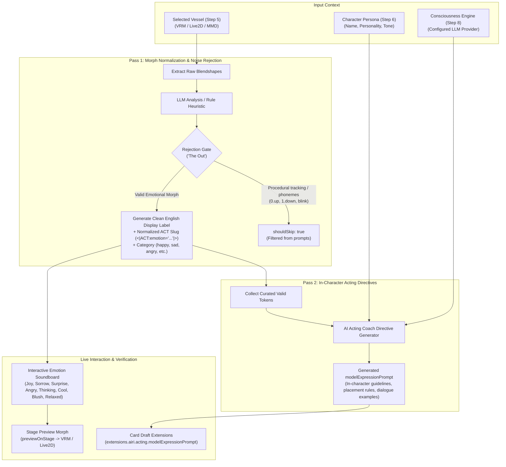

# AIRI Onboarding V3: Step 11 — Emotions (2-Pass ACT Expression Bridge)

---

## 1. Executive Summary & Vision

In virtual companion design, facial expressions and body language are frequently treated as disconnected afterthoughts—either through naive sentiment classifiers that randomly trigger stock animations, or periodic background blinking.

In AIRI, physical manifestation is governed by the **inline ACT token system**:
```
<|ACT:emotion="happy"|>
<|ACT:motion="wave"|>
<|ACT:vfx="fire"|>
<|DELAY:1|>
```
These markers are emitted directly in the LLM's streaming output at natural emotional pivots, intercepted by the chat streaming parser before text reaches TTS (ensuring they are never spoken aloud), preserved in `rawContent` for conversational memory continuity, and dispatched immediately to whichever avatar renderer is on stage (VRM, Live2D, MMD, or Spine).

However, real-world avatar models come with messy, cryptic, or foreign blendshapes:
- Japanese Kana/Kanji morphs: `ジト目` (*jito-me* / scorn), `照れ` (*tere* / blush), `11.怒り` (*ikari* / rage), `キラキラ` (*kirakira* / star eyes).
- Technical procedural noise: `0.up`, `1.down`, `phoneme_aa`, `phoneme_ih`, `eye_blink_l`.

**Step 11 (Emotions)** unbundles this complexity into a dedicated, intuitive setup experience: the **2-Pass ACT Expression Bridge**.

---

## 2. The 2-Pass Architecture

Step 11 leverages and exposes the engine implemented in [`packages/stage-ui/src/composables/use-expression-curation.ts`](file:///Users/richardpinedo/Projects.nosync/airi/airi_dasilva333/packages/stage-ui/src/composables/use-expression-curation.ts).



### Pass 1: Morph Normalization & Noise Filtering ("The Out")
1. **Candidate Extraction**: Discovers candidate blendshapes on the vessel selected in Step 5.
2. **Translation & Standardization**: Translates cryptic or non-English keys into expressive English display titles (e.g., `ジト目` $\to$ *Half-closed Scorn / Smug*, `星星眼` $\to$ *Star Sparkle Eyes*).
3. **ACT Slug Generation**: Creates concise kebab/snake-case identifiers (e.g., `smug_scorn`, `star_eyes`).
4. **Rejection Gate ("The Out")**: Procedural tracking morphs (e.g. eye look-at vectors `0.up`, `1.down`, viseme phonemes `phoneme_aa`) are flagged with `shouldSkip: true` and excluded from acting prompt generation so they don't break emotional expressions.

### Pass 2: In-Character Persona Directives
1. **Persona Context**: Merges the curated tokens with the companion's name, personality, and scenario from Step 6.
2. **Instruction Generation**: Directs the character how to use expressions in character:
   - Use official short syntax: `<|ACT:emotion="expression_name"|>`.
   - Place cues naturally at emotional peaks (1–2 per turn).
   - Provide concrete, authentic character dialogue examples.

---

## 3. UI Component Architecture & Catalog of Controls

```
packages/stage-ui/src/components/scenarios/dialogs/onboarding/v3/steps/
└── step-emotions.vue
```

### 3.1 Hero Header & 2-Pass AI Curation Switchboard
- **Banner**: *Emotions & Stage Expressions* — *Bridge what the avatar vessel physically expresses with how your companion feels.*
- **Dual-Engine Auto-Curate**:
  - **✨ AI Deep Curation**: Dispatches to the Consciousness LLM (configured in Step 8) for nuanced anime archetype translation.
  - **⚡ Instant Heuristic Fallback**: Zero-latency, rule-based morph normalizer (for users running without API keys or offline).
  - **Status Badge**: *e.g., "14 vessel expressions analyzed • 9 expressive emotions curated • 5 tracking shapes filtered out"*.

### 3.2 Interactive Emotion Soundboard & Stage Audition
A responsive grid of mood cards with emoji anchors and live click-to-audition triggers:
| Mood Preset | Emoji | Default Token Slug | Visual / Expressive Impact |
| :--- | :---: | :--- | :--- |
| **Joy / Happy** | 😊 | `<|ACT:emotion="happy"|>` | Cheerful smile, wide radiant eyes |
| **Sorrow / Sad** | 😢 | `<|ACT:emotion="sad"|>` | Drooped eyebrows, downward mouth |
| **Surprise** | 😲 | `<|ACT:emotion="surprised"|>` | Widened pupils, raised eyebrows, open mouth |
| **Anger / Pout** | 😠 | `<|ACT:emotion="angry"|>` | Furrowed brow, pouty lips |
| **Thinking** | 🤔 | `<|ACT:emotion="think"|> ` | Looking upward, contemplative tilt |
| **Cool / Smug** | 😎 | `<|ACT:emotion="cool"|>` | Smug half-smile, confident stance |
| **Blush / Shy** | 😳 | `<|ACT:emotion="blush"|>` | Rosy cheek overlay, bashful glance |
| **Relaxed** | 😴 | `<|ACT:emotion="relaxed"|>` | Gentle neutral resting expression |

- **Live Stage Audition**: Clicking any card calls `previewOnStage(modelFormat, rawKey)`, triggering the actual 3D VRM or 2D Live2D facial morph on the active stage.

### 3.3 Elemental Auras & VFX Manifestations (VRM / MMD)
Four visual aura toggles teaching the model to trigger shader effects during dramatic peaks:
- 🔥 **Fire / Fury** (`<|ACT:vfx="fire"|>`) — Rage, intense burning determination.
- ⚡ **Electric / Surge** (`<|ACT:vfx="electric"|>`) — High voltage, excitement, shock.
- ✨ **Magic / Arcane** (`<|ACT:vfx="magic"|>`) — Mystery, starlight resonance.
- 🌿 **Verdant / Heal** (`<|ACT:vfx="verdant"|>`) — Nature aura, soothing comfort.

### 3.4 In-Character Acting Directives (Collapsible)
- Displays the synthesized `modelExpressionPrompt`.
- Shows a highlighted dialogue preview:
  > *"I'm so thrilled you made it! <|ACT:emotion="happy"|> What adventure are we tackling today?"*
- Supports manual text edits and 1-click prompt regeneration.

---

## 4. Draft State Schema & Contracts

Additions to `useOnboardingV3Draft.ts`:
```ts
export interface OnboardingV3DraftState {
  // ... existing fields ...
  emotionsCurated?: boolean
  curatedExpressions?: CuratedExpressionItem[]
  actingModelExpressionPrompt?: string
  elementalVfxEnabled?: boolean
}
```

---

## 5. Verification & Safety Guidelines

1. **Token Syntax Purity**: Ensure all emitted cues adhere strictly to `<|ACT:emotion="name"|>` and avoid unescaped syntax.
2. **TTS Bleed Prevention**: Verify that marker stripping removes all cues from audio playback while preserving them in `rawContent`.
3. **Stage Fallback Safety**: If the active stage window is closed or minimized during audition, display a graceful notification instead of throwing unhandled IPC errors.
