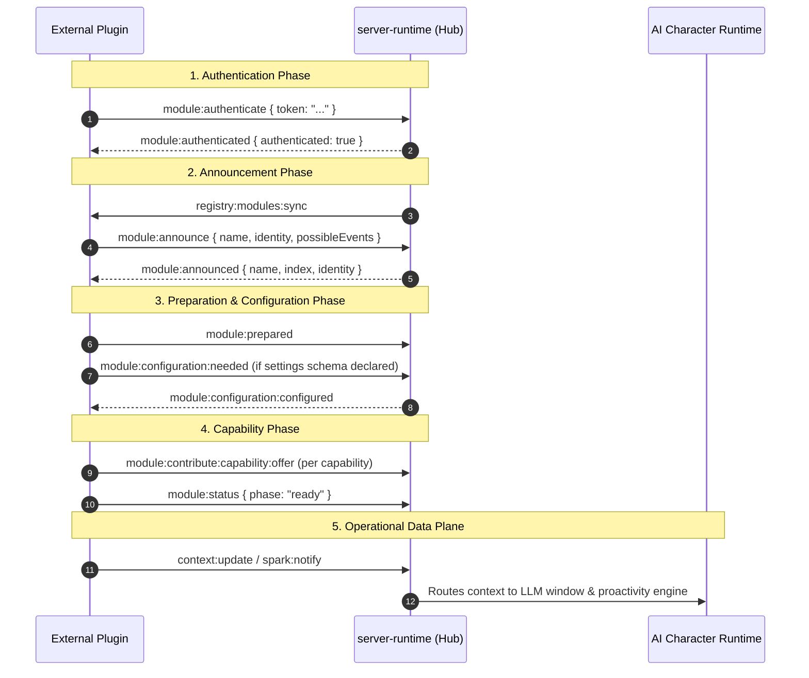

# Architecture & Extension Guide: AIRI Plugin Platform

> **Status**: Approved & Canonical
> **Document**: `docs/design-plugin-architecture.md`
> **Target Audience**: Core Developers, Modders, Third-Party Tool Authors, Integrators
> **Key References**: `packages/plugin-protocol/`, `packages/plugin-sdk/`, `packages/server-sdk/`, `apps/stage-tamagotchi/src/main/services/airi/plugins/`

---

## 1. Executive Summary & Philosophy

Project AIRI is designed around an extensible, modular architecture. While the core client orchestrates Live2D/VRM avatar rendering, audio synthesis, memory persistence, and LLM turn loops, external reality—such as game events, live streams, smart home states, or developer tooling—flows into the AI character via **Plugins and Bridges**.

The plugin system adheres to four core principles:

1. **Isolation by Default**: Plugins run in their own execution contexts (either separate Node/ESM module boundaries or independent external processes), ensuring crashes or resource leaks cannot freeze the transparent avatar stage or audio pipeline.
2. **Dual-Plane Separation**: Administrative lifecycle, configuration, permissions, and UI contributions run strictly on a **Control Plane**, while continuous high-rate sensory streams (vision frames, audio PCM, game coordinates) flow across a dedicated **Data Plane**.
3. **Transport Agnosticism**: Whether communicating via in-memory event buses, Electron IPC (`@moeru/eventa`), or network WebSockets (`@proj-airi/server-runtime`), plugins share standardized protocol contracts (`@proj-airi/plugin-protocol`).
4. **Dual-Architecture Model**: AIRI supports two complementary plugin patterns:
   - **Host-Managed Local Plugins (In-Process / Electron)**: Managed by AIRI's internal `PluginHost`, discovered from user storage, and loaded inside the desktop runtime.
   - **External Network Plugins / Bridges (Out-of-Process / WebSocket)**: Run as standalone daemons, background scripts, or browser extensions in any programming language, connecting to AIRI's central WebSocket message bus.

```
┌──────────────────────────────────────────────────────────────────────────────────┐
│                                PROJECT AIRI RUNTIME                              │
│                                                                                  │
│   ┌───────────────────────────────┐     ┌────────────────────────────────────┐   │
│   │   Host-Managed Local Plugins   │     │      Stage & Character Engine      │   │
│   │    (UserData /plugins/v1/)    │     │   - Live2D / VRM / Stage-Mate      │   │
│   │   • devtools-sample-plugin    │     │   - Audio Pipeline & TTS / STT     │   │
│   │   • local provider extensions │     │   - Proactivity & Memory Systems   │   │
│   └───────────────┬───────────────┘     └─────────────────┬──────────────────┘   │
│                   │ Electron IPC / Eventa                 │                      │
│                   ▼                                       │                      │
│   ┌───────────────────────────────────────────────────────┴──────────────────┐   │
│   │                    server-runtime (WebSocket Message Bus)                │   │
│   │                           ws://localhost:6121/ws                         │   │
│   │            - Auth Token Guard  - Module Registry  - Event Router         │   │
│   └───────────────────────────────────▲──────────────────────────────────────┘   │
│                                       │ WebSocket + Auth Token                   │
└───────────────────────────────────────┼──────────────────────────────────────────┘
                                        │
     ┌──────────────────────────────────┴──────────────────────────────────┐
     │                External Network Plugins & Device Bridges            │
     │                                                                     │
     │   ┌────────────────────────┐  ┌─────────────────┐  ┌────────────┐   │
     │   │ airi-plugin-twitch-chat│  │ Destiny 2 Game  │  │ Web/Chrome │   │
     │   │ (IRC / EventSub Ingest)│  │ Telemetry / OCR │  │ Extension  │   │
     │   └────────────────────────┘  └─────────────────┘  └────────────┘   │
     └─────────────────────────────────────────────────────────────────────┘
```

---

## 2. Architecture Comparison: Which Model to Use?

Before authoring a plugin, choose the architectural pattern suited to your requirements:

| Dimension | Host-Managed Local Plugins (`plugin-sdk`) | External WebSocket Bridges (`server-sdk`) |
|---|---|---|
| **Execution Environment** | Electron Main process (Node.js ESM) | Any runtime: Python, Rust, Go, Node.js, Shell, Browser |
| **Installation Method** | Drop folder into OS `<userData>/plugins/v1/` | Run independently as background daemon or service |
| **Discovery & Activation** | Auto-scanned on boot; toggleable in DevTools UI | Dynamic connection via WebSocket handshake |
| **Authentication** | Process-level trust (runs within host permissions) | Shared `authToken` verified against server config |
| **Best For** | Desktop lifecycle hooks, native OS deep integration, internal provider listing | Live chat ingest (Twitch/Discord), game telemetry (Destiny 2), Home Assistant, browser hooks |
| **Reference Code** | `apps/stage-tamagotchi/src/main/services/airi/plugins` | `docs/proposal-twitch-plugin.md`, `docs/proposal-destiny2-plugin.md` |

---

## 3. Architecture 1: Host-Managed Local Plugins

Host-managed plugins are packaged as folders containing a JSON manifest and an ESM JavaScript entrypoint.

### 3.1 Installation & File System Topology

The Electron main service scans the user data directory at boot:

- **macOS**: `~/Library/Application Support/${appId}/plugins/v1/<plugin-name>/`
- **Linux**: `~/.config/${appId}/plugins/v1/<plugin-name>/` (or `$XDG_CONFIG_HOME/${appId}/plugins/v1/<plugin-name>/`)
- **Windows**: `%APPDATA%/${appId}/plugins/v1/<plugin-name>/`

Enablement state and known paths are automatically persisted in `plugins-v1.json` alongside application configs.

### 3.2 Manifest Schema (`apiVersion: "v1"`)

Every local plugin must contain a manifest file (e.g. `<plugin-name>.json`) validated via Valibot:

```json
{
  "apiVersion": "v1",
  "kind": "manifest.plugin.airi.moeru.ai",
  "name": "my-local-extension",
  "entrypoints": {
    "electron": "./index.mjs"
  }
}
```

- `apiVersion`: Must be `"v1"`.
- `kind`: Must match `"manifest.plugin.airi.moeru.ai"`.
- `name`: Unique kebab-case plugin identifier.
- `entrypoints`: Map of runtimes (`electron`, `node`). Path is resolved relative to the manifest location.

### 3.3 Entrypoint Interface

The entrypoint file (e.g., `index.mjs`) exports lifecycle hooks:

```javascript
/**
 * Phase 1: Context initialization
 * Called when the plugin session is created.
 */
export async function init(context) {
  console.info('[my-local-extension] Initializing context...')
}

/**
 * Phase 2: Module setup & API discovery
 * Provides access to AIRI APIs and channels.
 */
export async function setupModules({ apis, channels }) {
  // Discover available AI providers (OpenAI, Ollama, Anthropic, etc.)
  const providers = await apis.providers.listProviders()
  console.info('[my-local-extension] Discovered providers:', providers.map(p => p.name))
}
```

### 3.4 DevTools Management UI

Host-managed plugins can be inspected and managed in real time via AIRI's built-in DevTools at route `#/devtools/plugin-host`:

- **Registry View**: Shows all discovered plugin manifests, resolved file paths, and current enabled/loaded status.
- **Session Inspector**: Displays running session IDs, lifecycle phases (`ready`, `preparing`, `authenticating`), and module IDs.
- **Capability Matrix**: Lists announced and ready capabilities across the system.
- **Interactive Controls**: Enables hot-reloading individual plugins or toggling automatic boot enablement without restarting the desktop shell.

---

## 4. Architecture 2: External WebSocket Plugins & Bridges

External plugins run out-of-process and communicate with AIRI over WebSockets (`@proj-airi/server-runtime`). This is the canonical approach for game integrations, chat bots, and external hardware bridges.

### 4.1 Connection & Security Boundary

The WebSocket hub listens at `ws://localhost:6121/ws`.

> [!IMPORTANT]
> **Authentication Requirement**: The WebSocket hub strictly enforces authentication. Any client attempting to announce or stream data without exchanging a valid `authToken` is disconnected.
>
> The active token can be retrieved programmatically from `<userData>/server-channel-config.json` or viewed in AIRI settings under `Settings > Modules > Server Channel`.

### 4.2 Module Lifecycle Handshake

When an external plugin connects, it transitions through a deterministic state machine:



### 4.3 Ingesting Ambient Context (`context:update`)

To feed passive situational awareness into the character without interrupting speech, emit `context:update` events.

```typescript
import { ContextUpdateStrategy } from '@proj-airi/server-sdk'
import { nanoid } from 'nanoid'

client.send({
  type: 'context:update',
  data: {
    id: nanoid(),
    contextId: nanoid(),
    lane: 'game:match-telemetry', // Namespaced topic lane
    strategy: ContextUpdateStrategy.ReplaceSelf, // Strategy: Replace vs Append
    text: 'Current Game Mode: Competitive PvP. Map: Widow\'s Court. Score: 4 - 3.',
    metadata: {
      game: 'Destiny2',
      activityType: 'Survival',
      timestamp: Date.now(),
    },
  },
})
```

#### Context Update Strategies

- **`ReplaceSelf`**: Overwrites previous data in the same `lane`. Ideal for state snapshots (e.g. current song, game map, player health, current application window).
- **`AppendSelf`**: Appends to a rolling log in the active context window. Ideal for live feeds (e.g. Twitch chat messages, Discord channel logs).

### 4.4 Ingesting Urgent Events & Interruptions (`spark:notify`)

When an event requires immediate character attention or vocal commentary (e.g. a Twitch raid, a death streak, an incoming phone call, or a motion sensor trip), emit a `spark:notify` event:

```typescript
client.send({
  type: 'spark:notify',
  data: {
    id: nanoid(),
    eventId: nanoid(),
    kind: 'alarm', // 'alarm' | 'ping' | 'reminder'
    urgency: 'immediate', // 'immediate' | 'soon' | 'later'
    headline: 'Twitch Raid: 250 viewers arriving!',
    note: 'Raid sent by user @SpeedyRunner',
    payload: {
      broadcaster: 'SpeedyRunner',
      viewers: 250,
      timestamp: Date.now(),
    },
    destinations: ['character'],
  },
})
```

#### Urgency Levels

- **`immediate`**: Interrupts ongoing idle animations or triggers an expedited proactive speech turn.
- **`soon`**: Queued for execution at the next natural conversational pause.
- **`later`**: Logged to ambient memory for organic recollection later.

---

## 5. Case Studies & Reference Implementations

AIRI includes documented real-world plugin designs demonstrating how to apply these patterns:

### Case Study A: Twitch Live Chat & Events Plugin (`docs/proposal-twitch-plugin.md`)

- **Goal**: Allow the VTuber avatar to read incoming Twitch chat messages and react immediately to high-tier events (subscriptions, bits, raids).
- **Implementation Strategy**:
  - Out-of-process daemon connecting via `@proj-airi/server-sdk`.
  - Chat messages map to `context:update` with `lane: "twitch:chat"` and strategy `AppendSelf`.
  - Subs, bits, and raids map to `spark:notify` with `kind: "alarm"` and `urgency: "immediate"`.
  - Config schema declares `channelName`, `twitchOAuthToken`, and `airiAuthToken`.

### Case Study B: Destiny 2 Proactive Speech Plugin (`docs/proposal-destiny2-plugin.md`)

- **Goal**: Comment on player performance, match outcomes, and death streaks in real time.
- **Implementation Strategy**:
  - **Dual-Conditional Activation**: Checks both global plugin enablement and whether the active character has proactivity enabled.
  - **Adaptive Polling State Machine**:
    - *Orbit/Tower*: Slow poll (15s interval) checking player profile activity hash.
    - *Active Match*: Transitions to high-speed local OCR HUD tracking (every 5s using local ONNX `PP-OCRv6 Tiny` on WebGPU/WASM) isolating scoreboard coordinates.
    - *Match Ended*: Triggers immediate one-shot fetch of the Post Game Carnage Report (PGCR) and feeds weapon kill stats into the character's proactive speech loop.

---

## 6. Step-by-Step Tutorial: Authoring a New Plugin

### Scenario 1: Authoring a Local In-Process Plugin (Node/ESM)

1. Navigate to your user data plugins directory:
   ```bash
   # macOS
   mkdir -p ~/Library/Application\ Support/ai.moeru.airi.dasilva333/plugins/v1/system-stats-plugin
   cd ~/Library/Application\ Support/ai.moeru.airi.dasilva333/plugins/v1/system-stats-plugin
   ```

2. Create `system-stats-plugin.json`:
   ```json
   {
     "apiVersion": "v1",
     "kind": "manifest.plugin.airi.moeru.ai",
     "name": "system-stats-plugin",
     "entrypoints": {
       "electron": "./index.mjs"
     }
   }
   ```

3. Create `index.mjs`:
   ```javascript
   import os from 'node:os'

   export async function init(context) {
     console.log('[SystemStats] Initialized in Electron runtime')
   }

   export async function setupModules({ apis }) {
     setInterval(() => {
       const freeMemGb = (os.freemem() / (1024 ** 3)).toFixed(2)
       console.log(`[SystemStats] Free memory: ${freeMemGb} GB`)
     }, 30000)
   }
   ```

4. Launch AIRI. Navigate to `#/devtools/plugin-host`, click **Refresh Manifests**, find `system-stats-plugin`, and toggle **Enable**.

---

### Scenario 2: Authoring an External WebSocket Bridge (TypeScript)

1. Create a standalone Node/TS project with `@proj-airi/server-sdk`:
   ```bash
   mkdir airi-discord-bridge && cd airi-discord-bridge
   pnpm init
   pnpm add @proj-airi/server-sdk nanoid
   pnpm add -D typescript @types/node tsx
   ```

2. Implement `bridge.ts`:
   ```typescript
   import { Client, ContextUpdateStrategy, WebSocketEventSource } from '@proj-airi/server-sdk'
   import { nanoid } from 'nanoid'

   const client = new Client({
     name: 'bridge:discord-alerts',
     url: 'ws://localhost:6121/ws',
     token: process.env.AIRI_AUTH_TOKEN || 'YOUR_AUTH_TOKEN_HERE',
     caller: 'discord-bridge',
     purpose: 'Forward guild announcements to AIRI character',
     possibleEvents: ['context:update', 'spark:notify'],
     autoReconnect: true,
   })

   // React when authentication succeeds
   client.onEvent('module:authenticated', (event) => {
     if (event.data.authenticated) {
       console.log('✅ Connected and authenticated with AIRI hub!')

       // Send an initial context update
       client.send({
         type: 'context:update',
         data: {
           id: nanoid(),
           contextId: nanoid(),
           lane: 'discord:channel:general',
           strategy: ContextUpdateStrategy.AppendSelf,
           text: '[System]: Discord bridge connected.',
           metadata: { source: 'discord', timestamp: Date.now() },
         },
       })
     }
   })

   // Establish connection
   void client.connect()
   ```

3. Run the bridge:
   ```bash
   AIRI_AUTH_TOKEN="08752879-4087-47ff-8692-b3cfd44c5d1c" npx tsx bridge.ts
   ```

---

## 7. Troubleshooting & Common Pitfalls

1. **Authentication Error (`invalid token`)**:
   - Cause: The `token` provided to `new Client({ token })` does not match the token in `server-channel-config.json`.
   - Fix: Inspect `<userData>/server-channel-config.json` or copy the token from the AIRI DevTools WebSocket Inspector.

2. **Events Dropped or Ignored**:
   - Cause: Emitting events not declared in `possibleEvents`.
   - Fix: Ensure `possibleEvents: ['context:update', 'spark:notify', ...]` lists all event types your plugin intends to send.

3. **Reconnection Spamming**:
   - Cause: Using an outdated SDK client without exponential backoff.
   - Fix: Ensure `@proj-airi/server-sdk` is up to date; use `client.updateToken(newToken)` rather than recreating client instances in loops.

4. **Context Flooding**:
   - Cause: Using `ContextUpdateStrategy.AppendSelf` for rapidly changing single-value state (e.g., GPS or coordinate streaming), causing context window overflow.
   - Fix: Use `ContextUpdateStrategy.ReplaceSelf` for high-frequency telemetry states.

---

## 8. Summary of Relevant Source Files

| Area | File Path |
|---|---|
| **Protocol Contracts** | [`packages/plugin-protocol/src/types/events.ts`](file:///Users/richardpinedo/Projects.nosync/airi/airi_dasilva333/packages/plugin-protocol/src/types/events.ts) |
| **Plugin SDK Core** | [`packages/plugin-sdk/src/plugin-host/core.ts`](file:///Users/richardpinedo/Projects.nosync/airi/airi_dasilva333/packages/plugin-sdk/src/plugin-host/core.ts) |
| **Electron Plugin Host** | [`apps/stage-tamagotchi/src/main/services/airi/plugins/index.ts`](file:///Users/richardpinedo/Projects.nosync/airi/airi_dasilva333/apps/stage-tamagotchi/src/main/services/airi/plugins/index.ts) |
| **DevTools Plugin UI** | [`packages/stage-pages/src/pages/devtools/plugin-host.vue`](file:///Users/richardpinedo/Projects.nosync/airi/airi_dasilva333/packages/stage-pages/src/pages/devtools/plugin-host.vue) |
| **WebSocket Hub Runtime** | [`packages/server-runtime/src/`](file:///Users/richardpinedo/Projects.nosync/airi/airi_dasilva333/packages/server-runtime/src/) |
| **Twitch Proposal** | [`docs/proposal-twitch-plugin.md`](file:///Users/richardpinedo/Projects.nosync/airi/airi_dasilva333/docs/proposal-twitch-plugin.md) |
| **Destiny 2 Proposal** | [`docs/proposal-destiny2-plugin.md`](file:///Users/richardpinedo/Projects.nosync/airi/airi_dasilva333/docs/proposal-destiny2-plugin.md) |
