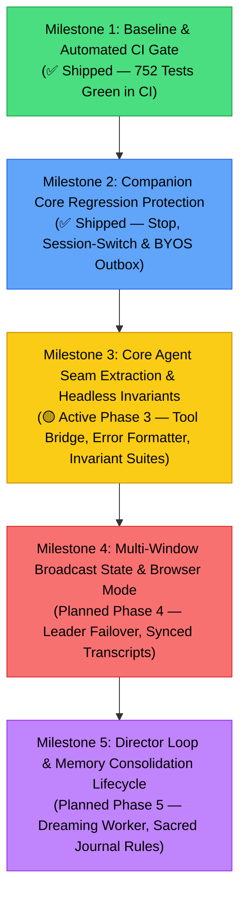

# Canonical Test Suite Catalog, Assertion Matrix & Regression Parity Blueprint

**Document ID:** `docs/project-testing-parity.md`
**Status:** Living Canonical Catalog & Strategy · Active
**Last Verified Baseline:** 2026-09-08 (Commit [`326aeb054`](https://github.com/dasilva333/airi/commit/326aeb054))
**Monorepo Coverage Baseline:** **82 active test suites · 752 passing tests (0 failures)**
**CI Automated Enforcement:** Active via `.github/workflows/ci.yml` (`unit-test` job)
**Related Documents:**
- [`AGENTS.md`](../AGENTS.md) — Critical git status reporting and commit/release safety rules.
- [`docs/rosetta-stone.md`](./rosetta-stone.md) — Canonical concept-to-file path index.
- [`docs/project-specialized-skills.md`](./project-specialized-skills.md) — Skill domain catalog (including `airi-codebase-verification`).
- [`docs/architecture-chat-orchestrator-decomposition.md`](./architecture-chat-orchestrator-decomposition.md) — Core agent seam extraction specification.
- [`docs/UPSTREAM_RADAR.md`](./UPSTREAM_RADAR.md) — Upstream commit delta & PR tracking ledger.

> [!IMPORTANT]
> **Consult Section 1 of this catalog before assuming a feature lacks test coverage or authoring duplicate test files.** Whenever adding, renaming, or refactoring test suites, update this catalog and run `node scripts/audit-test-catalog.mjs` to maintain repository integrity.

---

## 1. Canonical Test Suite Catalog & Domain Inventory

### 1.1 Monorepo Package Summary

| Package / Workspace | Test Suites (Files) | Total Tests | Primary Subsystem Focus |
|---|:---:|:---:|---|
| [`packages/stage-ui`](../packages/stage-ui) | 76 | 906 | Chat, Pacing, WebGPU Workers, BYOS Sync, Providers, Live2D, Memory, Artistry, Proactivity, MCP, Cloudflare OAuth, Gemini Live Bidi, Chat Input Bridge |
| [`packages/live2d-runtime`](../packages/live2d-runtime) | 5 | 79 | Live2D Scripting DSL VM, Command Parser, Selector, Template, VarStore |
| [`packages/stage-pages`](../packages/stage-pages) | 2 | 34 | Settings Topology & Devtools Context Flow Formatters |
| [`apps/stage-tamagotchi`](../apps/stage-tamagotchi) | 6 | 32 | Desktop Multi-Window, Display Bounds, Location, Widgets, Airi Plugins |
| [`apps/server`](../apps/server) | 4 | 29 | Server Character & Provider API Endpoints / Services |
| [`packages/pipelines-audio`](../packages/pipelines-audio) | 4 | 27 | Audio Speech Pipeline, Lead Coordinator, Pause Aligner, TTS Chunker |
| [`apps/stage-edge`](../apps/stage-edge) | 4 | 24 | Cloud Relay Edge Worker, Discord Ed25519, KV Rolling Memory, Discord ACL Matrix |
| [`packages/stage-shared`](../packages/stage-shared) | 1 | 24 | Caption Sentiment Scoring & Shared Stage Utilities |
| [`packages/cap-vite`](../packages/cap-vite) | 4 | 22 | Capacitor Vite Plugin, CLI Integration & Native Wrappers |
| [`packages/plugin-sdk`](../packages/plugin-sdk) | 1 | 22 | Plugin SDK Host Core Lifecycle |
| [`packages/server-runtime`](../packages/server-runtime) | 1 | 9 | Server Route Middleware |
| **Monorepo Vitest Baseline** | **108 Suites** | **1,208 Tests** | **Automated Zero-Failure Headless Test Baseline** |

*(Note: 4 additional test files across `@proj-airi/stage-ui` and `@proj-airi/live2d-runtime` contain 8 tests conditional on external models or live API keys, yielding 114 total test files cataloged and audited).*

---

## 1.2 Domain Test Matrix & Assertion Boundaries

#### Conversational Pacing & Dynamic Spoken Asides
| Invariant / Subsystem | Test Path | Tests | Runner / Env | CI Inclusion | What Assertions Directly Establish | Coverage Boundary & Known Limits |
|---|---|:---:|:---:|:---:|---|---|
| **Turn Pacing Coordinator** | [`packages/stage-ui/src/libs/pacing/turn-pacing-coordinator.test.ts`](../packages/stage-ui/src/libs/pacing/turn-pacing-coordinator.test.ts) | 28 | Node / Fake Timers | Blocking in CI | Fast direct answer suppression (200ms TTFT), 1800ms cold deadline arming, 1200ms vs 1400ms answer vs filler races, barge-in cancellation, long CoT cadence, dynamic asides, deep CoT profiles. | Verifies coordinator timing state and filler decision rules; does not mount AudioContext or verify hardware audio output. |
| **Playback Bridge** | [`packages/stage-ui/src/libs/pacing/pacing-playback-bridge.test.ts`](../packages/stage-ui/src/libs/pacing/pacing-playback-bridge.test.ts) | 26 | Node / Fake Timers | Blocking in CI | Playback bridge integration, filler audio queue scheduling, audio completion handoff to main speech. | Verifies scheduling contracts and event emitters; mocks web audio element playback. |
| **Category Classifier** | [`packages/stage-ui/src/libs/pacing/category-classifier.test.ts`](../packages/stage-ui/src/libs/pacing/category-classifier.test.ts) | 11 | Node / Pure TS | Blocking in CI | Text sentiment, thinking intent, and aside category classification algorithms for aside selection. | Pure deterministic heuristic unit tests; does not exercise LLM-based categorization. |
| **Pacing Audio Cache** | [`packages/stage-ui/src/libs/pacing/pacing-cache.test.ts`](../packages/stage-ui/src/libs/pacing/pacing-cache.test.ts) | 6 | Node / Pure TS | Blocking in CI | Synthesized filler audio LRU caching, key hashing, eviction thresholds, and cache hit metrics. | Verifies in-memory cache data structure; does not test disk persistence or binary codecs. |
| **Pacing Policy** | [`packages/stage-ui/src/libs/pacing/pacing-policy.test.ts`](../packages/stage-ui/src/libs/pacing/pacing-policy.test.ts) | 4 | Node / Pure TS | Blocking in CI | Persisted pacing policy configuration, thresholds, and character card synthesis budget overrides. | Tests Valibot policy parsing and default fallbacks; does not mount Pinia stores. |
| **Pacing Prewarm** | [`packages/stage-ui/src/libs/pacing/pacing-prewarm.test.ts`](../packages/stage-ui/src/libs/pacing/pacing-prewarm.test.ts) | 3 | Node / Pure TS | Blocking in CI | Background audio prewarming and voice pipeline readiness checks. | Verifies prewarm state machine; does not execute actual TTS inference. |

#### Chat Lifecycle, Streaming & Session State
| Invariant / Subsystem | Test Path | Tests | Runner / Env | CI Inclusion | What Assertions Directly Establish | Coverage Boundary & Known Limits |
|---|---|:---:|:---:|:---:|---|---|
| **Stop & Speech Cancellation** | [`packages/stage-ui/src/stores/chat-cancellation.test.ts`](../packages/stage-ui/src/stores/chat-cancellation.test.ts) | 3 | Node / JSDOM Stubs | Blocking in CI | Abort signal triggers during LLM streaming; `stopCurrentGeneration` cancels post-LLM speech when `sending === false` and `isSpeaking === true`; `onGenerationStopped` hook fires; secondary window broadcast stop works. | Verifies store signal propagation, hook emission, and `airi-speaking-state` BroadcastChannel contracts; does not verify actual speaker hardware silencing. |
| **Queue & Cancellation Invariants** | [`packages/stage-ui/src/stores/chat/queue-cancellation.test.ts`](../packages/stage-ui/src/stores/chat/queue-cancellation.test.ts) | 4 | Node / Pinia | Blocking in CI | Q1-Q4, C5: Serial queue dispatch, non-rejecting user Stop, session-scoped pending eviction, and post-cancellation send. | Headless Pinia orchestrator test; mocks provider stream boundary. |
| **Generation Invalidation & Navigation** | [`packages/stage-ui/src/stores/chat/generation-invalidation.test.ts`](../packages/stage-ui/src/stores/chat/generation-invalidation.test.ts) | 3 | Node / Pinia | Blocking in CI | S1-S3: Session navigation changes UI projection without invalidating generation; Stop and reset drop non-cooperative late callbacks. | Headless Pinia orchestrator test; mocks provider stream boundary. |
| **Session Switch Race Safety** | [`packages/stage-ui/src/stores/session-switch-race.test.ts`](../packages/stage-ui/src/stores/session-switch-race.test.ts) | 2 | Node / Pinia | Blocking in CI | Verifies tokens from background session do not leak into active session and restores in-flight stream state on switch back. | Headless Pinia orchestrator test; mocks provider stream boundary. |
| **Lifecycle Hook Determinism** | [`packages/stage-ui/src/stores/chat/lifecycle-contracts.test.ts`](../packages/stage-ui/src/stores/chat/lifecycle-contracts.test.ts) | 5 | Node / Pinia | Blocking in CI | Deterministic hook trace sequences across ordinary, Stop, NO_REPLY, 401/403 failure, and triggerOnly branches. | Tests orchestrator lifecycle hook bus and error cards. |
| **Error Presentation Formatting** | [`packages/stage-ui/src/stores/chat/error-formatter.test.ts`](../packages/stage-ui/src/stores/chat/error-formatter.test.ts) | 6 | Node / Pure TS | Blocking in CI | Formats Markdown error cards, extracts JSON technical details, identifies 401/403/unauthorized auth errors, and provides suggested fixes. | Pure helper unit tests; does not mount Pinia stores or invoke UI renders. |
| **Tool Syntax Recognition & Argument Parsing** | [`packages/stage-ui/src/stores/chat/tool-bridge.test.ts`](../packages/stage-ui/src/stores/chat/tool-bridge.test.ts) | 19 | Node / Pure TS | Blocking in CI | Marker syntax recognition across 5 dialects (`<\|...\|>`, `[call_tool:...]`, `<tool_call>`), lenient JSON parsing recovery, argument key-value decoding, and truncation tolerance. | Pure helper unit tests; does not mount Pinia stores or execute tools. |
| **Intrusion & Climax Prompt Formatting** | [`packages/stage-ui/src/stores/chat/intrusions.test.ts`](../packages/stage-ui/src/stores/chat/intrusions.test.ts) | 18 | Node / Pure TS | Blocking in CI | Pure evaluation of goal-driven Dating Sim victory/defeat climax prompts, elapsed-minute calculation, empty entry support, and dream, journal, and artistry prompt template interpolation. | Pure helper unit tests; does not mount Pinia stores or access staging refs. |
| **Grounding Context Formatting & Assembly** | [`packages/stage-ui/src/stores/chat/grounding-assembler.test.ts`](../packages/stage-ui/src/stores/chat/grounding-assembler.test.ts) | 14 | Node / Pure TS | Blocking in CI | Formatting of 8 contextual grounding blocks (VLM analysis, environmental awareness, STMM/lifetime pass-through, semantic memories, recent topic weights, director scratchpad, salience telemetry), order preservation, and null exclusion. | Pure helper unit tests; does not mount Pinia stores or execute async sensor/memory queries. |
| **Prompt & Grounding Assembly** | [`packages/stage-ui/src/stores/chat/prompt-contracts.test.ts`](../packages/stage-ui/src/stores/chat/prompt-contracts.test.ts) | 6 | Node / Pinia | Blocking in CI | P1-P4, Intrusions: VLM forward timing, image stripping on failure, exact 8-part grounding order, and pre-stream intrusion staging consumption. | Tests prompt assembly and staging clear timing. |
| **Bridged Tool Runtime Loop** | [`packages/stage-ui/src/stores/chat/tool-bridge-runtime.test.ts`](../packages/stage-ui/src/stores/chat/tool-bridge-runtime.test.ts) | 5 | Node / Pinia | Blocking in CI | Maximum 5-round outer bridged loop bound, early round-1 exit, multi-turn tool result association, malformed marker recovery, and marker syntax dialects. | Tests outer bridged loop in performSend; does not test native provider loop in llm.ts. |


| **Message Deduplication & Sync Merge** | [`packages/stage-ui/src/stores/chat/session-message-merge.test.ts`](../packages/stage-ui/src/stores/chat/session-message-merge.test.ts) | 5 | Node / Pure TS | Blocking in CI | Session message deduplication, timestamp sorting, and remote sync merge rules. | Tests pure merge algorithm; does not test remote HTTP sync transport. |
| **Message Payload Sanitization** | [`packages/stage-ui/src/stores/llm.sanitize.test.ts`](../packages/stage-ui/src/stores/llm.sanitize.test.ts) | 5 | Node / Pure TS | Blocking in CI | Stripping images when vision is disabled, converting error roles to user messages, and flattening text parts. | Pure payload transformation unit tests. |
| **Chat Bubble Virtual Keying** | [`packages/stage-ui/src/components/scenarios/chat/message-key.test.ts`](../packages/stage-ui/src/components/scenarios/chat/message-key.test.ts) | 4 | Node / Pure TS | Blocking in CI | Stable key resolution for virtualized chat transcript items with missing IDs or timestamps. | Pure key computation tests; does not mount Vue virtual scroller components. |
| **Chat Scenarios Utility** | [`packages/stage-ui/src/components/scenarios/chat/utils.test.ts`](../packages/stage-ui/src/components/scenarios/chat/utils.test.ts) | 1 | Node / Pure TS | Blocking in CI | Helper functions for chat UI formatting. | Unit helper test. |
| **Multi-Actor Turn Slices** | [`packages/stage-ui/src/utils/chat-actor-slices.test.ts`](../packages/stage-ui/src/utils/chat-actor-slices.test.ts) | 9 | Node / Pure TS | Blocking in CI | Parsing `<\|ACTOR:name\|>` markers, appending actor-aware slices, and demarcating dialogue turns. | Pure slice parsing tests; does not verify stage avatar voice assignment. |
| **Discord Outbound Formatting & Inbound Seams** | [`packages/stage-ui/src/stores/modules/discord-outbound.test.ts`](../packages/stage-ui/src/stores/modules/discord-outbound.test.ts) | 16 | Node / Pure TS | Blocking in CI | Outbound Discord reply formatting (stripping ACT/DELAY tokens, mapping ACTOR prefixes, journal/tool results, error envelopes) and inbound/steer interruption formatting. | Pure transformation unit tests; does not mount Discord bot gateway or Electron IPC. |
| **Gemini Live Multimodal Bidi API Seams** | [`packages/stage-ui/src/stores/modules/gemini-live-seams.test.ts`](../packages/stage-ui/src/stores/modules/gemini-live-seams.test.ts) | 45 | Node / Pure TS | Blocking in CI | Gemini function declaration schema purification ($schema, additionalProperties, anyOf/oneOf nullables, required adjustments), token count integer sanitation, multi-format usage extraction, WebSocket setup message framing with mandatory AUDIO and grounding toggle, 4 marker parsing dialects without regex argument mangling, wire response formatting, turn tool rate limiting, and 16-bit PCM little-endian audio decoding. | Pure protocol transformation and decoder tests; does not connect live WebSocket or stream live microphone audio. |
| **Chat Input Bridge Seams** | [`packages/stage-ui/src/stores/chat/input-bridge.test.ts`](../packages/stage-ui/src/stores/chat/input-bridge.test.ts) | 34 | Node / Pure TS | Blocking in CI | Serialization of broadcast payloads, stripping non-serializable functions and rejecting circular references, chatProvider string ID normalization, clientMessageId echo matching with top-level precedence over nested metadata, triggerOnly verification bypass, inbound action dispatch with cross-session auto-switch, and acknowledgment coordinator lifecycle. | Pure seam unit tests; does not mount Pinia stores, BroadcastChannel, or DOM APIs. |
| **Chat Input Bridge Runtime Relay** | [`packages/stage-ui/src/stores/chat/input-bridge-runtime.test.ts`](../packages/stage-ui/src/stores/chat/input-bridge-runtime.test.ts) | 6 | Node / Pinia & Fake Timers | Blocking in CI | Headless Pinia store runtime relay contracts: secondary-window successful echo resolution, 5000ms timeout rejection and timer/watcher cleanup, transport/serialization failure immediate cleanup, triggerOnly bypass without timer, main window inbound session alignment before ingest and local tool injection into LLM stream, and stop broadcast session cancellation. | Headless Pinia orchestrator test with controlled transport and fake timers; does not mount Electron BrowserWindow or physical WebSocket relays. |

#### Data Persistence & BYOS Sync Engine
| Invariant / Subsystem | Test Path | Tests | Runner / Env | CI Inclusion | What Assertions Directly Establish | Coverage Boundary & Known Limits |
|---|---|:---:|:---:|:---:|---|---|
| **BYOS Outbox Ledger** | [`packages/stage-ui/src/stores/sync-engine-outbox.test.ts`](../packages/stage-ui/src/stores/sync-engine-outbox.test.ts) | 7 | Node / Memory DB | Blocking in CI | Intercepted IndexedDB writes enqueue to `outbox:queue/*`; suppression when sync is disabled; non-`local:` key filtering; rapid write compaction to latest timestamp; deletion action on `removeItem`; outbox draining on remote 200; outbox retention on remote 500. | Verifies outbox queue state machine in memory; does not test physical cloud S3/R2 endpoints or real network socket timeouts. |
| **Sync Engine Conflict Merge** | [`packages/stage-ui/src/stores/sync-engine-merge.test.ts`](../packages/stage-ui/src/stores/sync-engine-merge.test.ts) | 3 | Node / Pure TS | Blocking in CI | Cloud vs local voice profile reconciliation using Last-Writer-Wins (LWW) by `updatedAt`/`createdAt`. | Verifies data merge functions; does not exercise binary asset reconciliation. |
| **Sync Engine Query Safeguards** | [`packages/stage-ui/src/stores/sync-engine-safeguards.test.ts`](../packages/stage-ui/src/stores/sync-engine-safeguards.test.ts) | 10 | Node / Pure TS | Blocking in CI | Index-driven selective sync session ID extraction for checked characters; zero-read unselected session skipping; up-to-date mergeable key download suppression via timestamps/ETags. | Unit test for index resolution and download suppression; does not test active network sockets. |
| **Character Store Lifecycle** | [`packages/stage-ui/src/stores/character.test.ts`](../packages/stage-ui/src/stores/character.test.ts) | 5 | Node / Pinia | Blocking in CI | Character card selection, active character ID switching, and card metadata reactivity. | Pinia store state tests; does not test filesystem card import/export. |
| **Character Orchestrator** | [`packages/stage-ui/src/stores/character/orchestrator/index.test.ts`](../packages/stage-ui/src/stores/character/orchestrator/index.test.ts) | 2 | Node / Pinia | Blocking in CI | Character orchestrator initialization and teardown. | Store lifecycle test. |
| **Long-Term Text Journal** | [`packages/stage-ui/src/stores/memory-text-journal.test.ts`](../packages/stage-ui/src/stores/memory-text-journal.test.ts) | 18 | Node / Memory DB | Blocking in CI | Sacred Journal entry creation, searching, keyword/token ranking, and local heuristic search fallback when worker is unavailable. | In-memory storage tests; does not test IndexedDB persistence across browser restarts. |
| **Cloudflare OAuth PKCE & Edge Vault Seams** | [`packages/stage-ui/src/stores/modules/cloudflare-auth.test.ts`](../packages/stage-ui/src/stores/modules/cloudflare-auth.test.ts) | 21 | Node / Pure TS | Blocking in CI | PKCE SHA-256 challenge calculation, OAuth 2.0 authorization URL construction, callback input parsing (clean codes, query params, hash routes), subdomain normalization/sanitization, account ID resolution, Edge Vault JSON credential serialization/deserialization, and CORS proxy fallback list generation. | Pure transformation unit tests; does not initiate browser popup or make real Cloudflare REST API network calls. |
| **Cloudflare Store Persistence & Recovery** | [`packages/stage-ui/src/stores/modules/cloudflare-persistence.test.ts`](../packages/stage-ui/src/stores/modules/cloudflare-persistence.test.ts) | 4 | Node / Pinia | Blocking in CI | Resilient JSON token serialization, recovery from legacy corrupted `[object Object]` values in localStorage on boot, cross-session authentication persistence, and account ID fallback resolution. | Storage persistence unit tests; does not initiate real network requests. |

#### Local Inference, WebGPU & Audio Processing Workers
| Invariant / Subsystem | Test Path | Tests | Runner / Env | CI Inclusion | What Assertions Directly Establish | Coverage Boundary & Known Limits |
|---|---|:---:|:---:|:---:|---|---|
| **Worker RPC Protocol** | [`packages/stage-ui/src/libs/inference/protocol.test.ts`](../packages/stage-ui/src/libs/inference/protocol.test.ts) | 33 | Node / Pure TS | Blocking in CI | Web Worker request/response message wire framing, error envelopes, and transfer buffers. | Protocol schema validation; does not spin up Web Workers. |
| **Inference Capability Contract** | [`packages/stage-ui/src/libs/inference/contract.test.ts`](../packages/stage-ui/src/libs/inference/contract.test.ts) | 23 | Node / Pure TS | Blocking in CI | Inference engine capability interfaces, input constraints, and output schemas. | Contract definitions and schema assertions. |
| **Web-RWKV Safetensors Parser** | [`packages/stage-ui/src/workers/web-rwkv/safetensors.test.ts`](../packages/stage-ui/src/workers/web-rwkv/safetensors.test.ts) | 21 | Node / ArrayBuffer | Blocking in CI | Binary safetensors header parsing, metadata extraction, and tensor slice byte offsetting. | Pure binary parser tests; does not execute GPU tensor computation. |
| **Local Kokoro TTS Worker** | [`packages/stage-ui/src/libs/inference/adapters/kokoro.test.ts`](../packages/stage-ui/src/libs/inference/adapters/kokoro.test.ts) | 17 | Node / Mocks | Blocking in CI | Phoneme generation, audio buffer assembly, and Kokoro worker adapter interface. | Mocks WebGPU device; does not load ONNX model weights. |
| **Local Whisper STT Worker** | [`packages/stage-ui/src/libs/inference/adapters/whisper.test.ts`](../packages/stage-ui/src/libs/inference/adapters/whisper.test.ts) | 13 | Node / Mocks | Blocking in CI | Streaming audio transcription chunking and Whisper worker adapter messaging. | Mocks WebGPU device; does not execute real microphone input. |
| **GPU Command Executor** | [`packages/stage-ui/src/libs/inference/gpu-executor.test.ts`](../packages/stage-ui/src/libs/inference/gpu-executor.test.ts) | 12 | Node / Mocks | Blocking in CI | WebGPU command pipeline queueing, serial execution, and error boundary handling. | Verifies queue ordering; mocks `GPUDevice`. |
| **GPU Resource Coordinator** | [`packages/stage-ui/src/libs/inference/gpu-resource-coordinator.test.ts`](../packages/stage-ui/src/libs/inference/gpu-resource-coordinator.test.ts) | 11 | Node / Mocks | Blocking in CI | VRAM pressure management, device acquisition locks, and cooperative release. | Verifies lock lifecycle and arbitration logic. |
| **GPU Worker Host** | [`packages/stage-ui/src/libs/inference/gpu-worker-host.test.ts`](../packages/stage-ui/src/libs/inference/gpu-worker-host.test.ts) | 9 | Node / Mocks | Blocking in CI | Web Worker lifecycle, crash recovery heartbeats, and message ping-pong. | Tests host wrapper with mocked Worker instance. |
| **Kokoro Constants & Tokens** | [`packages/stage-ui/src/workers/kokoro/constants.test.ts`](../packages/stage-ui/src/workers/kokoro/constants.test.ts) | 8 | Node / Pure TS | Blocking in CI | Kokoro voice mapping tables and voice token validation. | Pure constant checks. |
| **Web-RWKV Stop Sequence Scanner** | [`packages/stage-ui/src/workers/web-rwkv/stop.test.ts`](../packages/stage-ui/src/workers/web-rwkv/stop.test.ts) | 8 | Node / Pure TS | Blocking in CI | Sliding-window stop token scanner, holdback buffer, and natural end-of-stream flush. | Pure string scanner unit tests. |
| **RMBG Background Removal** | [`packages/stage-ui/src/libs/inference/adapters/background-removal.test.ts`](../packages/stage-ui/src/libs/inference/adapters/background-removal.test.ts) | 7 | Node / Mocks | Blocking in CI | RMBG client adapter messaging and mask processing. | Mocks WebGPU worker. |
| **Needle 2 Subconscious Runtime** | [`packages/stage-ui/src/libs/inference/adapters/needle-client.test.ts`](../packages/stage-ui/src/libs/inference/adapters/needle-client.test.ts) | 5 | Node / Mocks | Blocking in CI | Fast reaction probing (Task 2) and CoT pivot probing (Task 3) client interface. | Verifies client API contracts against mock worker. |
| **Web-LLM Channel Adapter** | [`packages/stage-ui/src/libs/inference/adapters/web-llm-channel.test.ts`](../packages/stage-ui/src/libs/inference/adapters/web-llm-channel.test.ts) | 4 | Node / Mocks | Blocking in CI | Web-LLM streaming communication channel, response packet framing, and abort handling. | Mocks worker channel. |

#### Providers & Model Registries
| Invariant / Subsystem | Test Path | Tests | Runner / Env | CI Inclusion | What Assertions Directly Establish | Coverage Boundary & Known Limits |
|---|---|:---:|:---:|:---:|---|---|
| **Multi-Instance Provider Store** | [`packages/stage-ui/src/stores/providers/runtime/instance-store.phase5.test.ts`](../packages/stage-ui/src/stores/providers/runtime/instance-store.phase5.test.ts) | 21 | Node / Pinia | Blocking in CI | Multi-instance provider store, configuration persistence, active profile selection. | Pinia store state; does not test live network connection. |
| **Web-RWKV Format Templates** | [`packages/stage-ui/src/stores/providers/web-rwkv/format.test.ts`](../packages/stage-ui/src/stores/providers/web-rwkv/format.test.ts) | 13 | Node / Pure TS | Blocking in CI | Web-RWKV prompt format templates, user/bot turn tags. | Template formatting unit tests. |
| **Ollama Provider Client** | [`packages/stage-ui/src/libs/providers/providers/ollama/index.test.ts`](../packages/stage-ui/src/libs/providers/providers/ollama/index.test.ts) | 9 | Node / Mocks | Blocking in CI | Model enumeration, options mapping, and payload serialization. | Mocks HTTP fetch endpoints. |
| **Amazon Bedrock Provider** | [`packages/stage-ui/src/libs/providers/providers/amazon-bedrock/index.test.ts`](../packages/stage-ui/src/libs/providers/providers/amazon-bedrock/index.test.ts) | 7 | Node / Mocks | Blocking in CI | AWS SigV4 signature generation and Converse API payload formatting. | Mocks AWS REST endpoints. |
| **Aliyun Token Refresh** | [`packages/stage-ui/src/stores/providers/aliyun/token.test.ts`](../packages/stage-ui/src/stores/providers/aliyun/token.test.ts) | 5 | Node / Mocks | Blocking in CI | Token acquisition, refresh cycle timing, and expiry calculation. | Tests token calculation logic with mocked fetch. |
| **OpenAI-Compatible Validator** | [`packages/stage-ui/src/libs/providers/validators/openai-compatible.test.ts`](../packages/stage-ui/src/libs/providers/validators/openai-compatible.test.ts) | 5 | Node / Pure TS | Blocking in CI | Endpoint URL and authentication schema validation. | Pure schema validation. |
| **Audio Format Converters** | [`packages/stage-ui/src/stores/providers/converters.test.ts`](../packages/stage-ui/src/stores/providers/converters.test.ts) | 4 | Node / Pure TS | Blocking in CI | PCM, WAV, MP3, and Base64 format converters. | Audio buffer transformation unit tests. |
| **Provider Registry Wiring** | [`packages/stage-ui/src/stores/providers/registry/index.test.ts`](../packages/stage-ui/src/stores/providers/registry/index.test.ts) | 3 | Node / Pure TS | Blocking in CI | Backend registry registration, capability lookup, and factory resolution. | Registry lookup tests. |
| **Provider Catalog** | [`packages/stage-ui/src/stores/provider-catalog.test.ts`](../packages/stage-ui/src/stores/provider-catalog.test.ts) | 2 | Node / Pure TS | Blocking in CI | Catalog enumeration and model capability filtering. | In-memory catalog inspection. |
| **Portable Provider Runtime Matrix** | [`packages/stage-ui/src/libs/providers/runtime-matrix.test.ts`](../packages/stage-ui/src/libs/providers/runtime-matrix.test.ts) | 162 | Node / Pure TS | Blocking in CI | Universal runtime matrix verifying all 39 provider directories and 40 definitions meet metadata, schema, and localization contracts. | Metadata contract compliance; does not execute live network calls. |
| **Tool Schema Sanitizer** | [`packages/stage-ui/src/libs/providers/tool-schema.test.ts`](../packages/stage-ui/src/libs/providers/tool-schema.test.ts) | 10 | Node / Pure TS | Blocking in CI | Collapses nullable `anyOf` unions into `['string', 'null']` for Azure and Grok, cleans unsupported schema attributes recursively. | Pure JSON schema transformation. |
| **Azure OpenAI Provider** | [`packages/stage-ui/src/libs/providers/providers/azure-openai/index.test.ts`](../packages/stage-ui/src/libs/providers/providers/azure-openai/index.test.ts) | 3 | Node / Pure TS | Blocking in CI | Custom completions endpoint URL mapping, `api-version` injection, and tool schema sanitization. | Tests mapping logic with mocked fetch. |
| **ByteDance Ark Provider Family** | [`packages/stage-ui/src/libs/providers/providers/ark-providers.test.ts`](../packages/stage-ui/src/libs/providers/providers/ark-providers.test.ts) | 2 | Node / Mocks | Blocking in CI | Model ID prefix stripping on chat dispatch, model catalog enumeration, and default regional base URLs. | Mocks `createOpenAI`; does not execute live network calls. |
| **MOSS Audio Utilities** | [`packages/stage-ui/src/stores/providers/moss-audio-utils.test.ts`](../packages/stage-ui/src/stores/providers/moss-audio-utils.test.ts) | 1 | Node / Pure TS | Blocking in CI | Audio chunking and header extraction. | Buffer utility test. |
| **Metadata Contract** | [`packages/stage-ui/src/stores/providers/registry/metadata-contract.test.ts`](../packages/stage-ui/src/stores/providers/registry/metadata-contract.test.ts) | 1 | Node / Pure TS | Blocking in CI | Provider metadata schema compliance. | Contract validation. |
| **Round 2 Speech & Audio Providers** | [`packages/stage-ui/src/stores/providers/round2-providers.test.ts`](../packages/stage-ui/src/stores/providers/round2-providers.test.ts) | 9 | Node / Mocks | Blocking in CI | Registration, synthesis, fallback key inheritance, and audio payload formatting for Voicevox, Aivis, MiniMax, MiMo, and Gemini Speech. | Mocks network endpoints and parent Gemini configuration. |
| **VOICEVOX / Aivis Engine Client** | [`packages/stage-ui/src/stores/providers/voicevox/engine.test.ts`](../packages/stage-ui/src/stores/providers/voicevox/engine.test.ts) | 4 | Node / Mocks | Blocking in CI | Audio query creation, synthesis invocation, speaker enumeration, and custom endpoint handling. | Mocks engine REST endpoints. |
| **PCM16 WAV Audio Encoding** | [`packages/stage-ui/src/stores/providers/wav.test.ts`](../packages/stage-ui/src/stores/providers/wav.test.ts) | 3 | Node / Pure TS | Blocking in CI | PCM16 to WAV containerization, RIFF headers, sample rates, Float32 round-trip conversion. | Pure audio buffer transformation. |
| **SSE Hex Audio Stream Parser** | [`packages/stage-ui/src/stores/providers/sse-audio-stream.test.ts`](../packages/stage-ui/src/stores/providers/sse-audio-stream.test.ts) | 2 | Node / Pure TS | Blocking in CI | SSE stream decoding, hex payload byte extraction, and duplicate final summary chunk skipping. | Pure streaming text/hex parser. |

#### Avatar, Live2D & Motion Runtime
| Invariant / Subsystem | Test Path | Tests | Runner / Env | CI Inclusion | What Assertions Directly Establish | Coverage Boundary & Known Limits |
|---|---|:---:|:---:|:---:|---|---|
| **Live2D Variable Store** | [`packages/live2d-runtime/test/var-store.test.ts`](../packages/live2d-runtime/test/var-store.test.ts) | 26 | Node / Pure TS | Blocking in CI | Float parameter storage, clamp rules, linear interpolation, and state reset. | Pure VM state tests; does not render WebGL. |
| **Live2D Command Parser** | [`packages/live2d-runtime/test/command-parser.test.ts`](../packages/live2d-runtime/test/command-parser.test.ts) | 19 | Node / Pure TS | Blocking in CI | DSL command tokenizer, argument parsing, syntax error handling. | Pure parser unit tests. |
| **Expression Noise Gate** | [`packages/stage-ui/src/libs/character/expression-noise-gate.test.ts`](../packages/stage-ui/src/libs/character/expression-noise-gate.test.ts) | 16 | Node / Pure TS | Blocking in CI | Emotion jitter suppression and micro-expression hysteresis thresholds. | Mathematical filtering algorithms. |
| **Live2D Script Interpreter VM** | [`packages/live2d-runtime/test/interpreter.test.ts`](../packages/live2d-runtime/test/interpreter.test.ts) | 13 | Node / Pure TS | Blocking in CI | DSL execution VM (`start_mtn`, `change_cos`, timers, instructions). | Verifies instruction execution; does not bind Cubism Core C++ bindings. |
| **Script Template Engine** | [`packages/live2d-runtime/test/template.test.ts`](../packages/live2d-runtime/test/template.test.ts) | 11 | Node / Pure TS | Blocking in CI | Variable interpolation and conditional template evaluation. | Pure string templating tests. |
| **Motion/Expression Candidate Selector** | [`packages/live2d-runtime/test/selector.test.ts`](../packages/live2d-runtime/test/selector.test.ts) | 10 | Node / Pure TS | Blocking in CI | Probabilistic selection, weight clamping, and fallback rules. | Pure selector algorithm tests. |
| **Live2D Motion Settings** | [`packages/stage-ui/src/features/motions/live2d/settings.test.ts`](../packages/stage-ui/src/features/motions/live2d/settings.test.ts) | 4 | Node / Pure TS | Blocking in CI | Breathing multipliers, physics overrides, and motion parameters. | Config parser tests. |
| **Gaze View Target Constraint** | [`packages/stage-ui/src/features/motions/live2d/view-target.test.ts`](../packages/stage-ui/src/features/motions/live2d/view-target.test.ts) | 2 | Node / Pure TS | Blocking in CI | Head turn coordinate mapping and eye-forward constraint. | Mathematical 2D projection checks. |
| **Lip Sync Run Loop** | [`packages/stage-ui/src/components/scenes/runtime.test.ts`](../packages/stage-ui/src/components/scenes/runtime.test.ts) | 1 | Node / Pure TS | Blocking in CI | Loop execution guard when avatar is active vs paused. | State gate unit test. |
| **Motion Magic Composable** | [`packages/stage-ui/src/features/motions/live2d/use-live2d-motion-magic.test.ts`](../packages/stage-ui/src/features/motions/live2d/use-live2d-motion-magic.test.ts) | 1 | Node / Vue | Blocking in CI | Procedural motion overlay composable lifecycle. | Composable initialization. |

#### Audio Pipeline & Speech Processing
| Invariant / Subsystem | Test Path | Tests | Runner / Env | CI Inclusion | What Assertions Directly Establish | Coverage Boundary & Known Limits |
|---|---|:---:|:---:|:---:|---|---|
| **Pause Aligner** | [`packages/pipelines-audio/src/processors/pause-aligner.test.ts`](../packages/pipelines-audio/src/processors/pause-aligner.test.ts) | 10 | Node / Pure TS | Blocking in CI | Punctuation pause alignment and DELAY token duration insertion. | Pure text processing; does not synthesize PCM audio. |
| **TTS Chunker** | [`packages/pipelines-audio/src/processors/tts-chunker.test.ts`](../packages/pipelines-audio/src/processors/tts-chunker.test.ts) | 8 | Node / Pure TS | Blocking in CI | Sentence-boundary text chunker with punctuation lookahead. | Pure text segmentation. |
| **Playback Lead Coordinator** | [`packages/pipelines-audio/src/processors/lead-coordinator.test.ts`](../packages/pipelines-audio/src/processors/lead-coordinator.test.ts) | 7 | Node / Pure TS | Blocking in CI | Audio playback queue sequencing, jitter buffer, and token ordering. | Queue timing logic; mocks audio hardware sinks. |
| **Speech Store Pitch/Rate Helpers** | [`packages/stage-ui/src/stores/modules/speech.test.ts`](../packages/stage-ui/src/stores/modules/speech.test.ts) | 3 | Node / Pure TS | Blocking in CI | Positive/negative percentage formatting and zero-guarding. | Pure formatting helpers. |
| **End-to-End Speech Pipeline** | [`packages/pipelines-audio/src/speech-pipeline.test.ts`](../packages/pipelines-audio/src/speech-pipeline.test.ts) | 2 | Node / Pure TS | Blocking in CI | Processor chaining, lifecycle initialization, and teardown. | Pipeline architecture test with mock processors. |

#### Autonomous Systems, Artistry, Proactivity & Tool Hub
| Invariant / Subsystem | Test Path | Tests | Runner / Env | CI Inclusion | What Assertions Directly Establish | Coverage Boundary & Known Limits |
|---|---|:---:|:---:|:---:|---|---|
| **Artistry ComfyUI Template & Concept Stacks** | [`packages/stage-ui/src/stores/modules/artistry-template.test.ts`](../packages/stage-ui/src/stores/modules/artistry-template.test.ts) | 16 | Node / Pure TS | Blocking in CI | Workflow template parsing, prompt injection, exposed fields whitelist security boundary, seed auto-randomization, recursive placeholder replacement (`{{PROMPT}}`, `{{IMAGE}}`), and Autonomous Director "Keep Base, Refresh Modifiers" concept stack resolution. | Pure graph and stack transformations; does not execute live ComfyUI REST endpoints or WebGPU generation. |
| **Proactivity, Telemetry & Gating** | [`packages/stage-ui/src/stores/proactivity.test.ts`](../packages/stage-ui/src/stores/proactivity.test.ts) | 20 | Node / Pure TS | Blocking in CI | Busy-pipe mutex check (suppressing proactive evaluation during active speech/stream/dream/typing), sensor payload formatting (idle, window history, load, volume, metrics), NO_REPLY control sentinel recognition, and prefix-cache aligned tail directive framing. | Pure telemetry and state evaluation tests; does not poll real OS sensors. |
| **MCP Tool Bridge & Titration** | [`packages/stage-ui/src/stores/mcp-tool-bridge.test.ts`](../packages/stage-ui/src/stores/mcp-tool-bridge.test.ts) | 13 | Node / Pure TS | Blocking in CI | MCP tool bridge registration and `window.__AIRI_MCP_BRIDGE__` exposure, automatic `mcp.json` config reconciliation for allowed tools (`web_search`, `filesystem`), background `applyAndRestart` execution, and per-card tool titration rules. | Tests bridge contracts and config reconciliation; does not spawn physical MCP child processes. |

#### Cloud Relay & Edge Infrastructure (`apps/stage-edge`)
| Invariant / Subsystem | Test Path | Tests | Runner / Env | CI Inclusion | What Assertions Directly Establish | Coverage Boundary & Known Limits |
|---|---|:---:|:---:|:---:|---|---|
| **Discord Webhook Ed25519 Cryptography** | [`apps/stage-edge/src/crypto/ed25519.test.ts`](../apps/stage-edge/src/crypto/ed25519.test.ts) | 6 | Node / Web Crypto | Blocking in CI | Hex to Uint8Array buffer conversion, Web Crypto Ed25519 signature verification against Discord public key, rejection of tampered body/timestamp, and missing header guard. | Verifies cryptographic verification algorithm; does not test network ingress. |
| **Discord Relay Access Control Matrix** | [`apps/stage-edge/src/discord/acl.test.ts`](../apps/stage-edge/src/discord/acl.test.ts) | 6 | Node / Pure TS | Blocking in CI | User role resolution (`OWNER`, `DESIGNATED`, `VISITOR`) and interaction gate allowing only owner or designated users. | Pure access control matrix unit tests. |
| **Edge KV Rolling Memory Store** | [`apps/stage-edge/src/memory/kv.test.ts`](../apps/stage-edge/src/memory/kv.test.ts) | 4 | Node / Mock KV | Blocking in CI | Transactional turn persistence (`history_{userId}_turn_{timestamp}_{turnId}`), fixed window slicing (latest N turns), unlimited conversation retrieval, and empty state safety. | Verifies KV memory adapter with in-memory KVNamespace; does not connect to Cloudflare KV servers. |
| **Edge Relay Worker Routing & Discord Webhook Handler** | [`apps/stage-edge/src/index.test.ts`](../apps/stage-edge/src/index.test.ts) | 8 | Node / Mocks | Blocking in CI | OPTIONS CORS preflight (204), `/health` status check, `/cors-proxy` header stripping and forwarding, POST `/discord` Ed25519 verification (401 on bad signature), Type 1 PING/PONG, and Type 2 deferred command execution with `ctx.waitUntil`. | Verifies HTTP fetch event routing and isolate handler; mocks upstream Discord and LLM network requests. |

#### Desktop Shell & Electron Integration
| Invariant / Subsystem | Test Path | Tests | Runner / Env | CI Inclusion | What Assertions Directly Establish | Coverage Boundary & Known Limits |
|---|---|:---:|:---:|:---:|---|---|
| **Multi-Display Bounds & DPI** | [`apps/stage-tamagotchi/src/main/windows/shared/display.test.ts`](../apps/stage-tamagotchi/src/main/windows/shared/display.test.ts) | 11 | Node / Electron Mocks | Blocking in CI | Multi-monitor bounds computation, DPI scaling, and screen edge clamping. | Math/geometry calculation tests; mocks Electron `screen` API. |
| **Built-in Desktop Widgets** | [`apps/stage-tamagotchi/src/renderer/stores/tools/builtin/widgets.test.ts`](../apps/stage-tamagotchi/src/renderer/stores/tools/builtin/widgets.test.ts) | 10 | Node / Pinia | Blocking in CI | Widget visibility toggles, state persistence, and widget registration. | Pinia store logic; does not render Electron widget windows. |
| **Display Location Calculation** | [`apps/stage-tamagotchi/src/main/libs/electron/location.test.ts`](../apps/stage-tamagotchi/src/main/libs/electron/location.test.ts) | 3 | Node / Pure TS | Blocking in CI | Window coordinate math and snap positioning calculations. | Pure coordinate math. |
| **Main Process Plugin Host** | [`apps/stage-tamagotchi/src/main/services/airi/plugins/index.test.ts`](../apps/stage-tamagotchi/src/main/services/airi/plugins/index.test.ts) | 3 | Node / Electron Mocks | Blocking in CI | Electron main process plugin discovery and registration. | Plugin host mock assertions. |
| **Stage Three.js Diagnostics** | [`apps/stage-tamagotchi/src/renderer/stores/stage-three-runtime-diagnostics.test.ts`](../apps/stage-tamagotchi/src/renderer/stores/stage-three-runtime-diagnostics.test.ts) | 3 | Node / Pinia | Blocking in CI | Three.js WebGL renderer FPS monitoring and frame drop metrics. | Diagnostic store metrics calculations. |
| **Stage Window Lifecycle** | [`apps/stage-tamagotchi/src/renderer/stores/stage-window-lifecycle.test.ts`](../apps/stage-tamagotchi/src/renderer/stores/stage-window-lifecycle.test.ts) | 2 | Node / Pinia | Blocking in CI | Window open/close lifecycle and event listener detachment. | Store event cleanup test. |

#### UI Composables, Shared Utilities & Devtools
| Invariant / Subsystem | Test Path | Tests | Runner / Env | CI Inclusion | What Assertions Directly Establish | Coverage Boundary & Known Limits |
|---|---|:---:|:---:|:---:|---|---|
| **Settings Topology** | [`packages/stage-pages/src/composables/settings-topology/topology.test.ts`](../packages/stage-pages/src/composables/settings-topology/topology.test.ts) | 32 | Node / Pure TS | Blocking in CI | Node dependency graph, circular reference detection, and navigation layout. | Graph data structure tests. |
| **Response Categorizer** | [`packages/stage-ui/src/composables/response-categoriser.test.ts`](../packages/stage-ui/src/composables/response-categoriser.test.ts) | 35 | Node / Pure TS | Blocking in CI | Streaming response categorization, emotion tag extraction, and speech filtering. | Pure string parsing and regex algorithms. |
| **Caption Sentiment Scoring** | [`packages/stage-shared/src/utils/caption-sentiment.test.ts`](../packages/stage-shared/src/utils/caption-sentiment.test.ts) | 24 | Node / Pure TS | Blocking in CI | Text sentiment scoring for dynamic subtitle tinting. | Heuristic sentiment scoring unit tests. |
| **LLM Marker Parser** | [`packages/stage-ui/src/composables/llm-marker-parser.test.ts`](../packages/stage-ui/src/composables/llm-marker-parser.test.ts) | 13 | Node / Pure TS | Blocking in CI | Token stream parsing (`[ACT:...]`, `[DELAY:...]`, `[SCENE:...]`). | Pure streaming tokenizer tests. |
| **Local Search Index** | [`packages/stage-ui/src/libs/search/__tests__/search.test.ts`](../packages/stage-ui/src/libs/search/__tests__/search.test.ts) | 6 | Node / Pure TS | Blocking in CI | Search tokenization, fuzzy matching, and stop-word filtering. | Pure search algorithms. |
| **Optimistic UI Updates** | [`packages/stage-ui/src/composables/use-optimistic.test.ts`](../packages/stage-ui/src/composables/use-optimistic.test.ts) | 5 | Node / Vue | Blocking in CI | Optimistic UI mutations and automatic rollback on async failure. | Vue reactivity tests; does not render DOM. |
| **Actor Persona Color Hashing** | [`packages/stage-ui/src/components/markdown/actor-colors.test.ts`](../packages/stage-ui/src/components/markdown/actor-colors.test.ts) | 4 | Node / Pure TS | Blocking in CI | Deterministic color hashing for multi-actor chat bubbles. | Pure string hashing unit tests. |
| **Canvas Alpha Detection** | [`packages/stage-ui/src/composables/canvas-alpha.test.ts`](../packages/stage-ui/src/composables/canvas-alpha.test.ts) | 3 | Node / Canvas Mocks | Blocking in CI | Canvas transparency detection and alpha bounding box calculation. | Mocks HTMLCanvasElement 2D context. |
| **Context Flow Formatters** | [`packages/stage-pages/src/pages/devtools/context-flow/composables/use-context-flow-formatters.test.ts`](../packages/stage-pages/src/pages/devtools/context-flow/composables/use-context-flow-formatters.test.ts) | 2 | Node / Pure TS | Blocking in CI | Context flow debugger tree visualization formatters. | Pure text formatters. |
| **Pixel Alpha Sampling** | [`packages/stage-ui/src/composables/canvas-alpha-use-pixel.test.ts`](../packages/stage-ui/src/composables/canvas-alpha-use-pixel.test.ts) | 1 | Node / Canvas Mocks | Blocking in CI | Pixel alpha sampling for transparent click-through stage areas. | Mocks 2D context pixel data. |

#### Backend Server, SDK & Build Tools
| Invariant / Subsystem | Test Path | Tests | Runner / Env | CI Inclusion | What Assertions Directly Establish | Coverage Boundary & Known Limits |
|---|---|:---:|:---:|:---:|---|---|
| **Plugin Host Core** | [`packages/plugin-sdk/src/plugin-host/core.test.ts`](../packages/plugin-sdk/src/plugin-host/core.test.ts) | 22 | Node / Pure TS | Blocking in CI | Plugin host lifecycle, hook registration, sandboxing, and inter-plugin events. | Verifies event dispatch; mocks external plugin packages. |
| **Capacitor Native Config** | [`packages/cap-vite/src/native.test.ts`](../packages/cap-vite/src/native.test.ts) | 11 | Node / Pure TS | Blocking in CI | Capacitor native bridge configuration generation. | Configuration builder unit tests. |
| **Server Character Routes** | [`apps/server/src/routes/__test__/characters.test.ts`](../apps/server/src/routes/__test__/characters.test.ts) | 9 | Node / Fastify Mocks | Blocking in CI | REST API endpoints for character card listing, retrieval, and updates. | Fastify route injections with mock service layer. |
| **Server Route Middleware** | [`packages/server-runtime/src/middlewares/route.test.ts`](../packages/server-runtime/src/middlewares/route.test.ts) | 9 | Node / Pure TS | Blocking in CI | Server routing middleware, path normalization, and error handling. | Middleware execution tests. |
| **Server Provider Routes** | [`apps/server/src/routes/__test__/providers.test.ts`](../apps/server/src/routes/__test__/providers.test.ts) | 8 | Node / Fastify Mocks | Blocking in CI | REST API endpoints for provider status and configuration. | Fastify route injections with mock service layer. |
| **Capacitor CLI Integration** | [`packages/cap-vite/src/cli.test.ts`](../packages/cap-vite/src/cli.test.ts) | 6 | Node / Pure TS | Blocking in CI | Capacitor CLI commands and build target arguments. | CLI argument parsing unit tests. |
| **Server Character Service** | [`apps/server/src/services/__test__/characters.test.ts`](../apps/server/src/services/__test__/characters.test.ts) | 6 | Node / DB Mocks | Blocking in CI | Character data service persistence and cache layers. | Mocks database repo. |
| **Server Provider Service** | [`apps/server/src/services/__test__/providers.test.ts`](../apps/server/src/services/__test__/providers.test.ts) | 6 | Node / DB Mocks | Blocking in CI | Provider management service and connection checking. | Mocks provider backend calls. |
| **Cap-Vite Plugin Core** | [`packages/cap-vite/src/index.test.ts`](../packages/cap-vite/src/index.test.ts) | 4 | Node / Pure TS | Blocking in CI | Cap-vite plugin initialization and configuration hooks. | Vite plugin hooks unit tests. |
| **Vite Config Wrapper** | [`packages/cap-vite/src/vite-wrapper-config.test.ts`](../packages/cap-vite/src/vite-wrapper-config.test.ts) | 1 | Node / Pure TS | Blocking in CI | Vite config wrapper resolution for Capacitor mobile packaging. | Config builder test. |

---

## 2. Non-Vitest & Script-Based Test Harnesses (Explicit Runner Inventory)

The following harnesses execute outside the default headless `pnpm run test:run` Vitest command due to heavy local requirements (e.g. downloaded Steam models, live API keys, or GPU hardware). They are permanent regression fixtures and must not be forgotten:

| Harness / Script | Command | Purpose & Invariants Verified | Execution Requirements | CI Status |
|---|---|---|---|---|
| **Live2D DSL Scenarios** | `pnpm run test:dsl` | Executes full Live2D DSL scenarios, verifying instruction sequencing, costume swaps, and timers in headless Node. | Node.js + TypeScript (zero external assets required) | Run on demand locally |
| **Attention Ecology Harness** | `pnpm run test:attention` | Runs end-to-end screen perception, cascaded salience gates, pHash deduplication, OCR, and vision routing. | Node.js + synthetic image buffers | Run on demand locally |
| **Headless Steam Scenarios** | [`packages/live2d-runtime/test/headless-scenario-runner.test.ts`](../packages/live2d-runtime/test/headless-scenario-runner.test.ts) | Tests full Cubism runtime with actual downloaded Steam Workshop models (`live2d_2883004043`, `live2d_2262182171`). | External assets in `SCRATCH_TMP_DIR` | Skipped in CI if assets absent (`it.skipIf`) |
| **Extracted Model Scenarios** | [`packages/live2d-runtime/test/integration-extracted-models.test.ts`](../packages/live2d-runtime/test/integration-extracted-models.test.ts) | Validates physics parameters and expression mappings against real Live2D model archives. | External assets in `SCRATCH_TMP_DIR` | Skipped in CI if assets absent (`it.skipIf`) |
| **Live OpenRouter LLM Evaluation** | [`packages/stage-ui/src/stores/llm.test.ts`](../packages/stage-ui/src/stores/llm.test.ts) | Validates live LLM response and vision capability detection against remote OpenRouter models (phi-4, gpt-4o, gpt-4o-mini). | `LLM_API_OPENROUTER_API_KEY` environment variable | Skipped in CI if API key absent (`describe.skipIf`) |
| **Warpdrive S3 Provider Integration** | [`packages/vite-plugin-warpdrive/src/providers/s3.test.ts`](../packages/vite-plugin-warpdrive/src/providers/s3.test.ts) | Validates remote S3 upload and pre-signed URL generation. | S3 credentials environment variables | Skipped in CI if credentials absent |

> [!NOTE]
> **CI Job Exists vs Branch Protection Enforcement:**
> The `.github/workflows/ci.yml` workflow now establishes an automated `unit-test` job running `pnpm run test:run` on every push to `main` and all pull requests.
> However, **GitHub branch protection rules** on the `main` branch govern whether this passing check is strictly required before merge. Both layers are necessary to prevent regressions from reaching production.

---

## 3. Behavioral Milestones & Parity Roadmap

Milestones in this fork are defined by **observable behavioral guarantees across subsystem boundaries**, rather than arbitrary file or suite counts:



### Milestone 1: Zero-Failure Baseline & CI Activation — ✅ COMPLETED & VERIFIED
- **Behavioral Goal:** Ensure all existing repository test suites pass with exit code 0 and prevent untested commits from entering `main` via automated GitHub Actions CI.
- **Shipped Reality:** 82 test suites passed, 752 passing tests, dedicated `unit-test` job running in `.github/workflows/ci.yml`.

### Milestone 2: High-Risk Companion Core Regressions — ✅ COMPLETED & VERIFIED
- **Behavioral Goal 1 (Stop Lifecycle):** When generation stops (either mid-stream or during post-LLM speech), the LLM `AbortSignal` fires, `isSpeaking` resets, `onGenerationStopped` emits, and partial text is preserved without orphan tokens.
- **Behavioral Goal 2 (Session Switch Isolation):** In-flight streaming tokens for an abandoned session must never leak into an active session's UI or transcript. Switching back must restore the active stream cleanly.
- **Behavioral Goal 3 (BYOS Sync Integrity):** Intercepted storage writes must reliably enqueue to `outbox:queue/*`, compact rapid successive writes for the same key, record deletion actions, drain on remote HTTP 200, and retain entries on remote HTTP 500.

### Milestone 3: Core Agent Seam Extraction & Invariant Test Harness — 🟡 ACTIVE (Phase 3)
- **Behavioral Goal 1 (Surgical Seam Extraction):** Extract pure, testable sub-modules from the 1,642-line `performSend` closure without touching companion features:
  - `tool-bridge.ts`: Regex marker parsing and lenient JSON recovery.
  - `error-formatter.ts`: Error unwrapping, 401/403 detection, and Markdown card formatting.
  - `intrusions.ts`: Dating Sim climax, Dream state, and Journal reflection prompt building.
  - `grounding-assembler.ts`: Telemetry and RAG message aggregation.
- **Behavioral Goal 2 (Queue Cancellation & Priority):** Rapid user turns or stop requests must purge pending queued sends without dangling promises or orphan state (`queue-cancellation.test.ts`).
- **Behavioral Goal 3 (Stale Generation Discarding):** Delayed streaming chunks arriving after session switch or turn invalidation must be discarded cleanly (`stale-generation.test.ts`).
- **Behavioral Goal 4 (Deterministic Hook Order):** Verify exact lifecycle sequence: `beforeMessageComposed` $\rightarrow$ `beforeSend` $\rightarrow$ tokens $\rightarrow$ `afterSend` $\rightarrow$ `streamEnd` $\rightarrow$ `turnComplete` (`hook-ordering.test.ts`).
- **Behavioral Goal 5 (Tool Recursion Termination):** Enforce strict execution termination when model emits continuous tool calls ($\le 5$ rounds) (`tool-round-limits.test.ts`).

### Milestone 4: Multi-Window Broadcast State & Vitest Browser Mode — Planned (Phase 4)
- **Behavioral Goal 1 (Follower/Leader Failover):** Electron secondary windows (Chatbox, Control Strip, Stage) synchronize state via `BroadcastChannel` with deterministic leader election and clean listener detachment on close.
- **Behavioral Goal 2 (Cross-Window Transcript Reactivity):** Messages sent from secondary windows immediately update the main window's session and vice-versa without race conditions or double-ingestion.

### Milestone 5: Director Loop & Memory Consolidation Lifecycle — Planned (Phase 5)
- **Behavioral Goal 1 (Autonomous Director Resolution):** Base/Layer stack resolution and actor manifestation locks during multi-character scene dialogues.
- **Behavioral Goal 2 (Dreaming & Sacred Journal):** STMM $\rightarrow$ LTMM daily summary rollup, Emotional Exhaustion and MoodState updates during dreaming, and strict enforcement of the Sacred Journal immutability rule.

---

## 4. Developer Testing SOPs & Catalog Maintenance

### 4.1 Running Tests Locally
```bash
# Run entire monorepo test suite (fast headless)
pnpm run test:run

# Run test suite with interactive watch mode
pnpm vitest

# Run tests for a specific workspace
pnpm -F @proj-airi/stage-ui test:run
pnpm -F @proj-airi/live2d-runtime test

# Run a specific test file
pnpm vitest run packages/stage-ui/src/libs/pacing/turn-pacing-coordinator.test.ts

# Run cleanroom domain script harnesses
pnpm run test:dsl          # Live2D DSL interpreter scenario harness
pnpm run test:attention    # Attention Ecology vision/perception harness
```

### 4.2 Automated Catalog Freshness Audit
Whenever adding or moving a test suite, run the catalog auditor to verify link integrity and check for untracked tests:
```bash
node scripts/audit-test-catalog.mjs
```
The script confirms that:
1. Every path referenced in this document exists on disk.
2. Every active test file discovered by Vitest is accounted for in Section 1.

### 4.3 Invariant Test Authoring Standards
1. **Zero External Network Dependencies:** Mocks must be used for all LLM API endpoints, WebSocket transports, and cloud sync providers.
2. **Deterministic Time:** Always use Vitest fake timers (`vi.useFakeTimers()`, `vi.advanceTimersByTime(ms)`) when testing pacing delays, debounce intervals, or proactivity heartbeats.
3. **Storage Isolation:** Use memory storage drivers (`memoryDriver()`) or in-memory IndexedDB stubs (`fake-indexeddb`). Never mutate real disk storage or user profiles.
4. **Clean Teardown:** Every test suite must invoke `afterEach(() => { vi.clearAllMocks(); vi.restoreAllMocks(); })` to eliminate cross-test state contamination.

---

## 5. Historical Baseline, CI Activation & Diagnosis Log (Appendix)

This appendix records the empirical evolution of the test suite from initial diagnosis through CI activation.

### 5.1 Historical Test Run Snapshots

```
┌─────────────────────────┬──────────────┬────────────┬──────────┬──────────┬──────────┬──────────┐
│ Snapshot Milestone      │ Commit SHA   │ Date       │ Passed   │ Failed   │ Skipped  │ Total    │
├─────────────────────────┼──────────────┼────────────┼──────────┼──────────┼──────────┼──────────┤
│ Initial Baseline (Fail) │ 1c6085b      │ 2026-09-08 │ 72 files │ 10 files │ 1 file   │ 710 test │
│ Phase 1 CI Gate (Green) │ f375060      │ 2026-09-08 │ 79 files │ 0 files  │ 4 files  │ 740 test │
│ Phase 2A Stop/Switch    │ f5d9787      │ 2026-09-08 │ 81 files │ 0 files  │ 4 files  │ 745 test │
│ Phase 2B Outbox/Catalog │ 07cae6f      │ 2026-09-08 │ 82 files │ 0 files  │ 4 files  │ 752 test │
│ Phase 3 Peer Spec Pushed│ 326aeb0      │ 2026-09-08 │ 82 files │ 0 files  │ 4 files  │ 752 test │
└─────────────────────────┴──────────────┴────────────┴──────────┴──────────┴──────────┴──────────┘
```

### 5.2 Initial Failure Triage & Resolution (Phase 1 Fixes)

| Subsystem | Failing File | Root Cause | Resolution Applied |
|---|---|---|---|
| **Build Virtuals** | `packages/stage-ui/src/stores/memory-text-journal.test.ts` | Vitest could not resolve `~build/time` and `~build/git` imported via `use-build-info.ts`. | Added virtual module aliases/mocks in `packages/stage-ui/vitest.config.ts`. |
| **Missing Export** | `packages/stage-ui/src/stores/provider-catalog.test.ts` | Failed to resolve `@lemonneko/crop-empty-pixels` via `stage-ui-live2d/src/utils/live2d-preview.ts`. | Aliased missing export in `packages/stage-ui/vitest.config.ts`. |
| **Transitive Preview** | `packages/stage-ui/src/stores/modules/speech.test.ts` | Transitive `@lemonneko/crop-empty-pixels` resolution failure. | Resolved via vitest config alias. |
| **External Fixtures** | `packages/live2d-runtime/test/headless-scenario-runner.test.ts` | Expected downloaded Steam models in `SCRATCH_TMP_DIR`. | Wrapped in `it.skipIf(!hasScratchModels)` for clean CI execution. |
| **External Fixtures** | `packages/live2d-runtime/test/integration-extracted-models.test.ts` | Expected downloaded Steam models in `SCRATCH_TMP_DIR`. | Wrapped in `it.skipIf(!hasScratchModels)`. |
| **Mock Signature** | `packages/live2d-runtime/test/interpreter.test.ts:180` | `onCostumeWillSwap` assertion expected 1 argument, received 2. | Updated expected mock assertion to match current runtime contract. |
| **Transcribe Config** | `packages/audio-pipelines-transcribe` | Vitest project configuration mismatch. | Standardized vitest config. |
| **Plugin SDK** | `packages/plugin-sdk` | Environment mock mismatch in plugin host core. | Fixed host mock context. |

### 5.3 Upstream vs Fork Architectural Gap Context ("The Roast" Audit)

The comparative analysis between `dasilva333/airi@1c6085b` and `moeru-ai/airi@f679616` highlighted:
- **Fork Superiority (9.0 vs 7.0):** Rich persistent companion capabilities (STMM/LTMM/DRMM layered memory, Sacred Journal, Autonomous Director loop, Studio concept stacks, Conversational Pacing with thinking fillers, BYOS data portability).
- **Upstream Superiority (8.5 vs 5.5):** Rigorous automated regression testing, dedicated CI gates, and isolated runtime boundaries.
- **The Parity Mission:** Rather than merging upstream wholesale or adopting unstable upstream runtimes (like Apeira v0.0.5), our fork imports upstream's **testing discipline, isolation boundaries, and regression safety**, creating an unbeatable personal companion platform.
