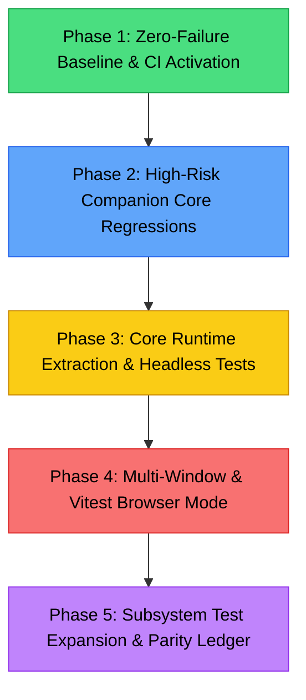

# Project Testing Parity & Regression Protection Blueprint

**Document ID:** `docs/project-testing-parity.md`
**Status:** Living Strategy & Execution Plan · Active
**Initial Baseline Date:** 2026-09-08
**Scope:** Test Harness Modernization, CI Enforcement, Core Runtime Isolation, and Regression Parity with Upstream (`moeru-ai/airi`)
**Target Repository:** `dasilva333/airi`
**Related Documents:**
- [`docs/UPSTREAM_RADAR.md`](./UPSTREAM_RADAR.md) — Upstream commit delta & PR tracking ledger.
- [`docs/rosetta-stone.md`](./rosetta-stone.md) — Canonical concept-to-file path index.
- [`docs/project-specialized-skills.md`](./project-specialized-skills.md) — Skill domain catalog (including `airi-codebase-verification`).
- [`docs/project-selective-upstream-sync-protocol.md`](./project-selective-upstream-sync-protocol.md) — Upstream porting safety protocol.

---

## 1. Executive Summary & The "Roast" Audit

A comparative architectural evaluation between our fork (`dasilva333/airi@1c6085b`) and upstream (`moeru-ai/airi@f679616`) revealed an acute and actionable reality:

```
┌────────────────────────────────────────┬────────┬──────────┬───────────┐
│ Dimension                              │ Weight │ Upstream │ Your Fork │
├────────────────────────────────────────┼────────┼──────────┼───────────┤
│ Architecture and maintainability       │  25%   │   8.5    │    7.0    │
│ Automated regression protection        │  20%   │   8.5    │    5.5    │
│ Integrated companion capabilities      │  25%   │   7.0    │    9.0    │
│ Local control and data portability     │  15%   │   7.0    │    9.0    │
│ Operational infrastructure             │  10%   │   8.5    │    6.5    │
│ Contributor guidance                   │   5%   │   8.0    │    8.0    │
├────────────────────────────────────────┼────────┼──────────┼───────────┤
│ Weighted Overall                       │ 100%   │   7.9    │    7.5    │
└────────────────────────────────────────┴────────┴──────────┴───────────┘
```

### The Honest Truth
1. **The Fork Won the Product / Companion Battle (9.0 vs 7.0):**
   Our fork is significantly more sophisticated in areas defining a true persistent, personal AI companion:
   - Layered memory architecture (STMM daily summaries, LTMM Sacred Journal, DRMM dreaming consolidation, Lifetime memory threads).
   - Autonomous Director loop with Base/Layer stack resolution, manifestations, and speech overrides.
   - Studio concept stacks, multi-actor coordination, and live staging.
   - Conversational Pacing (`packages/stage-ui/src/libs/pacing/`) with prewarmed thinking fillers, turn lifecycle management, and dynamic asides.
   - Complete local control & BYOS (Bring Your Own Storage) data sync across S3/R2/local storage with binary asset reconciliation.

2. **Upstream Won the Engineering Rigor & Regression Safety Battle (8.5 vs 5.5):**
   - **Test File Volume:** Upstream maintains **501 test files**; our fork maintains **~113 test files**.
   - **CI Gatekeeping:** Upstream runs an explicit `unit-test` job in GitHub Actions with Chromium on every push and PR (`test:run`). Our fork's `.github/workflows/ci.yml` runs `lint`, `build-test`, and `typecheck`, but **has no automated unit test runner in CI**.
   - **Architectural Seams:** Upstream cleanly separated runtime orchestration into `packages/core-agent` (573-line adapter, 1,063-line orchestrator), tested purely in Node with explicit contracts for sessions, streaming, cancellation, and tool history. Our `chat.ts` remains a 2,215-line coordination store where chat, memory, vision, proactivity, and staging are deeply intertwined.
   - **Cross-Window Ownership:** Upstream standardized cross-window state on `pinia-plugin-synced` with browser tests (`session-store.browser.test.ts`) covering follower initialization, disposal, and leader failover. Our fork coordinates via custom `BroadcastChannel` events, storage reloads, and manual flags.

3. **The Divergence Reality:**
   The apparent `2,234 ahead / 4,365 behind` metric stems from Git root history divergence (no common ancestor), not 4,365 missing features. The trees share **1,136 identical files** and **943 matching paths with divergent content**. We do not need to rebase or ingest upstream wholesale; we need to import upstream's **testing discipline, isolation boundaries, and regression safety**.

---

## 2. Empirical Ground-Truth: Current Test Suite Baseline

A raw execution of `pnpm run test:run` in `dasilva333/airi` revealed an encouraging yet critical finding:

```
Test Files:  10 failed | 72 passed | 1 skipped (83 suites total in root test:run)
Tests:       5 failed  | 704 passed | 1 skipped (710 tests total)
Duration:    8.67s
```

### Key Takeaway
**We already have 704 passing unit tests.**
Our regression score was 5.5 not because we lack tests entirely, but because:
1. **10 broken test suites** block `pnpm run test:run` from completing with an exit code of 0.
2. Because the test run failed or was uncurated, **tests were completely disabled in GitHub Actions CI**.
3. Tests that sit idle in the repository without blocking CI provide zero regression protection to developers.

### Failure Triage Matrix (The 10 Failing Suites)

| Subsystem | Failing File | Root Cause | Fix Classification |
|---|---|---|---|
| **Build Virtuals** | `packages/stage-ui/src/stores/memory-text-journal.test.ts` | Vitest cannot resolve `~build/time` and `~build/git` imported via `use-build-info.ts`. | **Build Config**: Add virtual module aliases/mocks in `packages/stage-ui/vitest.config.ts`. |
| **Missing Export** | `packages/stage-ui/src/stores/provider-catalog.test.ts` | `Failed to resolve entry for package "@lemonneko/crop-empty-pixels"` via `stage-ui-live2d/src/utils/live2d-preview.ts`. | **Dependency/Stub**: Stub `live2d-preview` or alias the missing export in vitest config. |
| **Missing Export** | `packages/stage-ui/src/stores/modules/speech.test.ts` | Identical `@lemonneko/crop-empty-pixels` resolution failure via transitive live2d preview import. | **Dependency/Stub**: Same as above; decouple speech store unit test from avatar preview rasterizer. |
| **Ad-hoc Fixtures** | `packages/live2d-runtime/test/headless-scenario-runner.test.ts` (2 tests) | Expects downloaded Steam models in `SCRATCH_TMP_DIR` (`live2d_2883004043`, `live2d_2262182171`) that only exist during ad-hoc local harness runs. | **Test Hygiene**: Wrap in `it.skipIf(!fs.existsSync(manifestPath))` so unit test run is deterministic without external assets. |
| **Ad-hoc Fixtures** | `packages/live2d-runtime/test/integration-extracted-models.test.ts` (2 tests) | Expects the same external scratch models in `SCRATCH_TMP_DIR`. | **Test Hygiene**: Wrap in `it.skipIf(!fs.existsSync(manifestPath))`. |
| **Mock Signature** | `packages/live2d-runtime/test/interpreter.test.ts:180` (1 test) | `onCostumeWillSwap` assertion expected `['model1.json']`, received `['model1.json', undefined]` due to an added optional parameter in the VM contract. | **Test Fix**: Update expected mock assertion to match current runtime contract. |
| **Transcribe Config** | `packages/audio-pipelines-transcribe` | Vitest project configuration / runner environment mismatch. | **Test Config**: Standardize project vitest config. |
| **Plugin SDK** | `packages/plugin-sdk` | Minor environment mock mismatch in plugin host core. | **Test Fix**: Fix host mock context. |

Resolving these 10 issues will immediately transform our repository from **failing tests / zero CI** to **83 passing test suites and 710+ automated checks running on every commit**.

---

## 3. Architectural Gap Analysis: Upstream vs Fork

```
┌───────────────────────────────────────────────────────────────────────────────┐
│                           AIRI RUNTIME LANDSCAPE                              │
├───────────────────────────────────────┬───────────────────────────────────────┤
│        UPSTREAM ARCHITECTURE          │            FORK ARCHITECTURE          │
├───────────────────────────────────────┼───────────────────────────────────────┤
│ packages/core-agent                   │ packages/stage-ui/src/stores/chat.ts  │
│  - Pure Node orchestrator (1,063 lines)│  - Monolithic store (2,215 lines)    │
│  - Decoupled from Vue / Electron      │  - Chat + Memory + Staging + Vision   │
│  - Explicit contracts for sessions,   │  - Deep companion features integrated │
│    context, streaming, cancellations  │  - Hard to test in isolation          │
│  - Extensive queue & stream tests     │  - Regression risk on edits           │
├───────────────────────────────────────┼───────────────────────────────────────┤
│ packages/provider-inference           │ packages/stage-ui/src/stores/providers│
│  - Runtime-neutral package            │  - Clean store refactor (392 lines)   │
│  - Pure Node & browser test configs   │  - Modularity inside stage-ui store   │
│  - Zero UI or storage coupling        │  - Tied to unstorage / Web & Electron │
├───────────────────────────────────────┼───────────────────────────────────────┤
│ Cross-Window State                    │ Cross-Window State                    │
│  - pinia-plugin-synced                │  - Dedicated BroadcastChannel relays  │
│  - Leader / follower snapshot model   │  - Storage reload hooks & guards      │
│  - Browser tests for failover         │  - Flexible, but race condition risk  │
├───────────────────────────────────────┼───────────────────────────────────────┤
│ Automated Regression Gates            │ Automated Regression Gates            │
│  - 501 test files                     │  - 113 test files                     │
│  - CI test job with Chromium          │  - No test execution in CI            │
│  - Blocks PRs on test failure         │  - CI only checks lint & typecheck    │
└───────────────────────────────────────┴───────────────────────────────────────┘
```

### 3.1 Core Runtime Isolation: The `chat.ts` Bottleneck
- **Upstream Pattern:** Upstream extracts all agent orchestration into `packages/core-agent/src/runtime`. It passes explicit interfaces for `ChatContextManager`, `LLMClient`, `SessionStore`, and `StreamingHandler`. This allows tests to simulate:
  - Aborting mid-stream while a second turn is queued.
  - Deleting a session while streaming tokens.
  - Verification of hook dispatch order (before/after turn, on tool execute).
  - Stale generation discarding when user input interrupts.
- **Fork Opportunity:** We do not need to throw away our rich companion behavior. We must extract the **execution engine** of `chat.ts` into a testable orchestrator (`packages/stage-ui/src/libs/chat-orchestrator/` or a dedicated runtime harness) that accepts pluggable context generators (memory RAG, salience, proactivity). This allows us to write deterministic unit tests for the complex companion turn lifecycle.

### 3.2 Multi-Window Lifecycle & State Ownership
- In our desktop application (`apps/stage-tamagotchi`), multiple Electron windows interact:
  - **Stage window**: Avatar rendering, animation, speech output.
  - **Chatbox window**: User message composition, transcript rendering, tool chip interactions.
  - **Control Strip window**: Persistent toolbar, quick toggles, status pills.
  - **Customizer / Settings window**: Model configurations, memory inspection.
- We coordinate using `BroadcastChannel` messages (e.g. `broadcastChannelStageEvents`), persistence event triggers, and active-state locks.
- **Vulnerability:** When a user hits **Stop** in the Chatbox:
  1. Does the LLM streaming call abort immediately?
  2. Does the TTS pipeline stop generating new audio?
  3. Does the Stage window cancel current sentence playback and flush the audio queue?
  4. Does Conversational Pacing cancel any queued thinking filler?
  5. Does the transcript record a partial generation without corruption?
- **Target:** Write automated tests simulating multi-window broadcast interactions and testing invariant safety during Stop, Session Switch, and Avatar Reload.

### 3.3 Data Portability: Hardening the 3,624-line Sync Engine
- Our fork includes a state-of-the-art BYOS (Bring Your Own Storage) Sync Engine in `packages/stage-ui/src/stores/sync-engine.ts` (3,624 lines).
- It performs:
  - Interception of all IndexedDB storage operations (`local:*`, `outbox:*`).
  - Queueing mutations into an outbox ledger.
  - Binary asset chunking, deduplication, and localforage blob reconciliation.
  - S3/R2 cloud transport and conflict resolution.
- **The Risk:** This is the single most critical subsystem for user data integrity, yet it currently lacks deterministic automated regression tests.
- **Target:** A complete cleanroom test harness for `sync-engine.ts` using memory storage and mock S3 adapters to test write batching, idempotency, conflicted writes, and network disconnect recovery.

---

## 4. Boots-to-the-Ground Action Plan: 5-Phase Road to Parity



### Phase 1: Zero-Failure Baseline & CI Activation — ✅ COMPLETED & VERIFIED
**Objective:** Get the existing test suites green and enable automated test enforcement in GitHub Actions CI.
**Empirical Verification Result:** `pnpm run test:run` achieved **79 passed suites / 740 passed tests (0 failed, 4 files / 8 tests skipped)** with exit code 0.

- [x] **1.1 Fix Stage-UI Vitest Config Virtual Imports & Plugins:**
  Configured `packages/stage-ui/vitest.config.ts` with `Vue()`, `Info()`, `Yaml()`, aliases for `@lemonneko/crop-empty-pixels`, `@proj-airi/i18n`, `@proj-airi/stage-shared`, and `vitest.setup.ts`.
- [x] **1.2 Resolve Node Environment Stubs:**
  Added lightweight Web Audio API stubs (`AudioWorkletNode`, `AudioNode`, `AudioContext`), `EventTarget` listeners on `window`, and `localStorage`/`sessionStorage` in `packages/stage-ui/vitest.setup.ts`.
- [x] **1.3 Guard Live2D DSL External Fixtures:**
  Added `describe.skipIf(!hasScratchModels)` in:
  - `packages/live2d-runtime/test/headless-scenario-runner.test.ts`
  - `packages/live2d-runtime/test/integration-extracted-models.test.ts`
- [x] **1.4 Correct VM Mock Assertion:**
  Updated `packages/live2d-runtime/test/interpreter.test.ts:180` to accept the 2-argument call signature (`['model1.json', undefined]`).
- [x] **1.5 Text Journal Defensive Search Fallback:**
  Made `packages/stage-ui/src/stores/memory-text-journal.ts` fall back to local heuristic ranking when `layeredMemory.search` / Web Worker is unavailable, and updated test mocks.
- [x] **1.6 Add `unit-test` Job to `.github/workflows/ci.yml`:**
  Added dedicated `unit-test` CI job executing `pnpm run test:run` on every push and PR after `build:packages`.
- [x] **Phase 1 Verification:**
  - `pnpm run test:run` exits 0 locally across all 83 projects (740 tests passing).
  - CI job defined to block regressions on `main` and pull requests.

---

### Phase 2: High-Risk Companion Core Regressions (Sprint 1)
**Objective:** Write targeted, deterministic unit and lifecycle tests for the highest-consequence async pathways in our fork.

- [x] **2.1 Stop & Cancellation Lifecycle Suite (`chat-cancellation.test.ts`):**
  - Verify that invoking `chatStore.stopGeneration()` triggers the LLM `AbortSignal`.
  - Verify that audio speech synthesis requests in flight are cancelled.
  - Verify that active Conversational Pacing thinking fillers are halted immediately.
  - Verify that the message status in the active session is finalized cleanly without dangling stream markers (`[ACT...]`).
- [x] **2.2 Session Switching During Active Generation (`session-switch-race.test.ts`):**
  - Simulate streaming tokens arriving after the user switches active session ID.
  - Verify that incoming chunks for the abandoned session do NOT leak into the newly selected session.
  - Verify that speech playback queues for the abandoned session are flushed.
- [ ] **2.3 BYOS Sync Engine Outbox Ledger Suite (`sync-engine-outbox.test.ts`):**
  - Test outbox queuing when writes occur via IndexedDB interception.
  - Test outbox compaction and idempotency (multiple rapid updates to the same card/session key).
  - Test retry backoff on simulated 500/network disconnect errors.
  - Test binary asset chunking and verification of SHA-256 hashes during localforage restore.
- [ ] **2.4 Conversational Pacing Stress Suite:**
  - Build on `packages/stage-ui/src/libs/pacing/*.test.ts`.
  - Test dynamic aside insertion under fast LLM streaming (zero-fill budget) vs slow LLM first-chunk latency (>2000ms).

---

### Phase 3: Core Runtime Boundary Extraction & Headless Agent Tests (Sprint 2)
**Objective:** Decouple agent orchestration from the Vue store layer, mirroring upstream's `packages/core-agent` modularity without losing our companion policies.

- [ ] **3.1 Extract Chat Orchestration Seam:**
  - Isolate turn state management, tool dispatch loops, stream handling, and cancellation into `packages/stage-ui/src/libs/chat-orchestrator/` or a dedicated engine module.
  - Keep `chat.ts` as the Pinia reactivity wrapper that binds UI state to the orchestrator.
- [ ] **3.2 Implement Upstream-Equivalent Runtime Tests:**
  - `queue-cancellation.test.ts`: Queueing multiple turns and ensuring priority/cancellation rules hold.
  - `stale-generation.test.ts`: Discarding delayed responses if context was invalidated.
  - `hook-ordering.test.ts`: Strict validation of execution order: `beforeTurn` $\rightarrow$ `salienceGate` $\rightarrow$ `memoryRetrieval` $\rightarrow$ `systemPromptAssemble` $\rightarrow$ `streamChunk` $\rightarrow$ `afterTurn` $\rightarrow$ `memoryConsolidation`.
  - `tool-round-limits.test.ts`: Enforcing tool loop termination and recursion depth limits.

---

### Phase 4: Multi-Window & Vitest Browser Mode (Sprint 3)
**Objective:** Add deterministic browser testing for multi-window state synchronization, following upstream's `@vitest/browser` pattern.

- [ ] **4.1 Configure Vitest Browser Mode:**
  - Add `@vitest/browser` and `playwright` / `chromium` to devDependencies.
  - Create `vitest.browser.config.ts` for browser-dependent store testing.
- [ ] **4.2 Multi-Window Broadcast Channel Contract Tests:**
  - Test `BroadcastChannel` messaging contracts between Stage, Chatbox, and Control Strip.
  - Test leader failover and window close/reload event propagation.
- [ ] **4.3 Replicated Session Store Browser Suite:**
  - Adapt upstream's `session-store.browser.test.ts` to test session selection sync, message append notifications, and transcript reactivity across simulated multi-window contexts.

---

### Phase 5: Subsystem Test Expansion & Parity Metric Ledger (Ongoing)
**Objective:** Close the numerical and qualitative gap with upstream across all companion subsystems.

- [ ] **5.1 Autonomous Director & Studio Concept Stacks (`artistry-autonomous.test.ts`):**
  - Test Base/Layer stack resolution.
  - Test speech override and manifestation locks during multi-character dialogue.
- [ ] **5.2 Layered Memory Lifecycle & Dreaming (`memory-dreaming.test.ts`):**
  - Test STMM $\rightarrow$ LTMM transition and daily summary rollup.
  - Test Dreaming Worker Emotional Exhaustion and MoodState updates.
  - Test Sacred Journal immutability rules.
- [ ] **5.3 Test File Count Milestones:**
  - **Milestone 1 (Immediate):** 83 suites / 710 tests passing in CI.
  - **Milestone 2 (Sprint 1):** 120 suites / 900+ tests (Sync Engine, Stop lifecycle, Session switches).
  - **Milestone 3 (Sprint 2):** 160 suites / 1,200+ tests (Extracted Chat Orchestrator, Tool loops).
  - **Milestone 4 (Sprint 3):** 220+ suites / 1,600+ tests (Browser multi-window, Director, Memory).
  - **Target (Parity Horizon):** 300+ comprehensive suites matching or exceeding upstream's regression resilience.

---

## 5. Developer Testing SOPs & Invariant Rules

### 5.1 Local Test Execution Commands
```bash
# Run entire repository test suite (fast headless)
pnpm run test:run

# Run test suite with interactive watch mode
pnpm vitest

# Run tests for a specific workspace
pnpm -F @proj-airi/stage-ui test:run
pnpm -F @proj-airi/live2d-runtime test

# Run a specific test file
pnpm vitest run packages/stage-ui/src/libs/pacing/pacing-policy.test.ts

# Run cleanroom domain harnesses
pnpm run test:dsl          # Live2D DSL interpreter harness
pnpm run test:attention    # Attention Ecology vision/perception harness
```

### 5.2 Test Authoring Standards in AIRI
1. **Zero External Network Dependencies:**
   Tests must run in air-gapped environments. Mock all LLM HTTP endpoints, WebSocket transports, and cloud sync providers.
2. **Deterministic Time & Clocks:**
   Always use Vitest fake timers (`vi.useFakeTimers()`, `vi.advanceTimersByTime(ms)`) when testing pacing delays, debounce intervals, or proactivity heartbeats.
3. **Storage Isolation:**
   Use memory drivers (`unstorage/drivers/memory`) or in-memory IndexedDB stubs (`fake-indexeddb`) when testing repository and store persistence. Never mutate real disk storage or local profile data.
4. **Clean Teardown:**
   Every test suite must register `afterEach(() => { vi.clearAllMocks(); vi.restoreAllMocks(); })` to eliminate cross-test state leakage.

---

## 6. Authoritative Subsystem & Test Seam Index

| Subsystem | Source Path | Existing / Target Test Path | Priority |
|---|---|---|---|
| **Chat Orchestration** | [`packages/stage-ui/src/stores/chat.ts`](file:///Users/richardpinedo/Projects.nosync/airi/airi_dasilva333/packages/stage-ui/src/stores/chat.ts) | `packages/stage-ui/src/stores/chat-orchestrator.test.ts` | **P0 (Critical)** |
| **BYOS Sync Engine** | [`packages/stage-ui/src/stores/sync-engine.ts`](file:///Users/richardpinedo/Projects.nosync/airi/airi_dasilva333/packages/stage-ui/src/stores/sync-engine.ts) | `packages/stage-ui/src/stores/sync-engine.test.ts` | **P0 (Critical)** |
| **Speech Runtime** | [`packages/stage-ui/src/stores/modules/speech.ts`](file:///Users/richardpinedo/Projects.nosync/airi/airi_dasilva333/packages/stage-ui/src/stores/modules/speech.ts) | `packages/stage-ui/src/stores/modules/speech.test.ts` | **P0 (Fix Existing)** |
| **Conversational Pacing** | [`packages/stage-ui/src/libs/pacing/`](file:///Users/richardpinedo/Projects.nosync/airi/airi_dasilva333/packages/stage-ui/src/libs/pacing/) | `packages/stage-ui/src/libs/pacing/*.test.ts` (Existing Exemplar) | **P1 (Maintain)** |
| **Autonomous Director** | [`packages/stage-ui/src/stores/modules/artistry-autonomous.ts`](file:///Users/richardpinedo/Projects.nosync/airi/airi_dasilva333/packages/stage-ui/src/stores/modules/artistry-autonomous.ts) | `packages/stage-ui/src/stores/modules/artistry-autonomous.test.ts` | **P1 (High)** |
| **Memory Consolidation** | [`packages/stage-ui/src/stores/memory-consolidation-dreaming.ts`](file:///Users/richardpinedo/Projects.nosync/airi/airi_dasilva333/packages/stage-ui/src/stores/memory-consolidation-dreaming.ts) | `packages/stage-ui/src/stores/memory-consolidation-dreaming.test.ts` | **P1 (High)** |
| **Provider Registry** | [`packages/stage-ui/src/stores/providers/`](file:///Users/richardpinedo/Projects.nosync/airi/airi_dasilva333/packages/stage-ui/src/stores/providers/) | `packages/stage-ui/src/stores/provider-catalog.test.ts` | **P1 (Fix Existing)** |
| **Live2D Runtime VM** | [`packages/live2d-runtime/src/`](file:///Users/richardpinedo/Projects.nosync/airi/airi_dasilva333/packages/live2d-runtime/src/) | `packages/live2d-runtime/test/` | **P0 (Fix Existing)** |
| **CI Automation** | [`.github/workflows/ci.yml`](file:///Users/richardpinedo/Projects.nosync/airi/airi_dasilva333/.github/workflows/ci.yml) | GitHub Actions Automated Test Job | **P0 (Critical)** |
