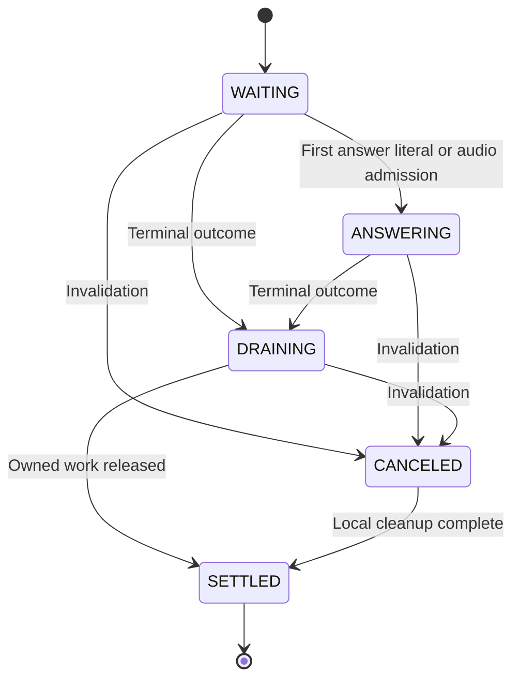
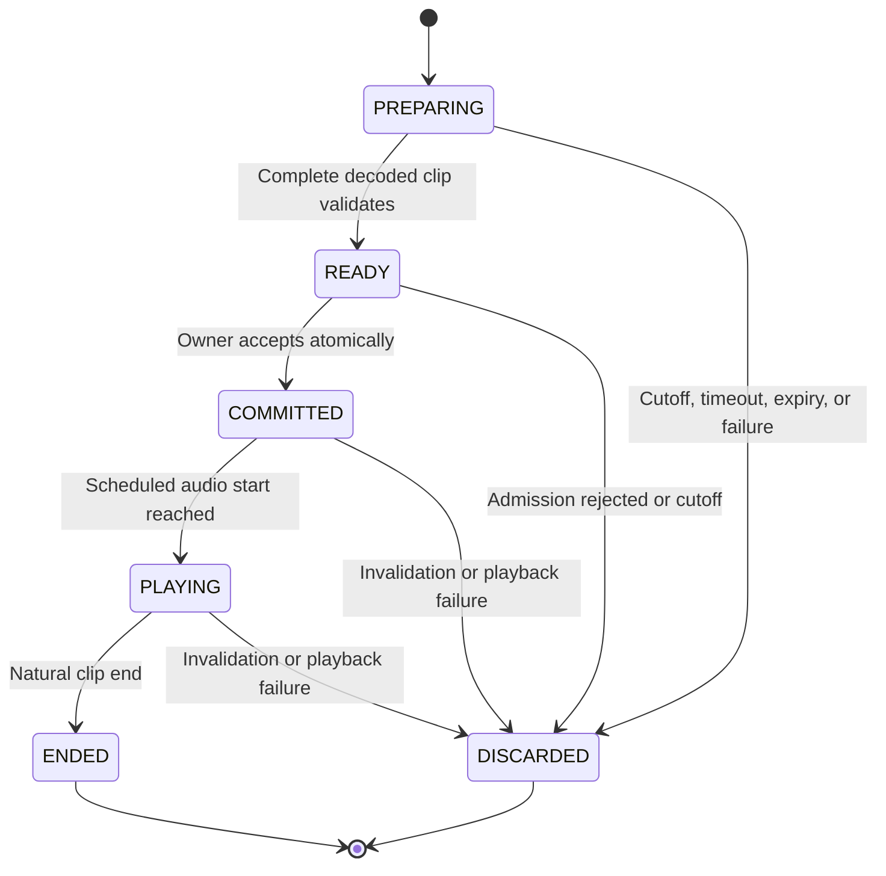

# Conversational Pacing and Thinking Fillers

**Revision:** 2026-09-05 — consolidated implementation contract 2
**Status:** Active implementation. The supplied handoff reports Phases 0–5 complete; Phase 6 is specified here; Phase 7 remains planned. This document revision does not independently certify the latest application build.
**Scope:** Turn-based typed chat, STT, and proactivity using AIRI’s ordinary chat and custom TTS path.
**Excluded:** Gemini Live native PCM (`outputMode: 'gemini'`), provider-internal reasoning that is not exposed, and changes to the Live2D DSL runtime.

## 1. Product intent and decisions

Make waiting feel attended to without delaying an answer unnecessarily. A short turn may receive one cached acknowledgment. An extended reasoning turn may receive a few spaced acknowledgments or intentionally authored spoken asides. An eligible opportunity may also remain silent.

Three pillars share one turn owner and one speech lane:

1. **Cached pacing:** category-informed, pre-rendered phrases at an adaptive initial deadline and a bounded repeat cadence.
2. **Dynamic asides:** short, listener-facing spoken cues prepared through the selected speech provider. Formulated via a 3-tier cascade: explicit `<think_aloud>` cues, the on-device Needle WASM Semantic Extractor parsing raw reasoning streams, and keyword heuristics fallback.
3. **Presentation:** transient captions, in-bubble streaming CoT drawer, avatar cues, and later visual typing effects, separate from canonical conversation records.

The following product decisions are authoritative throughout this document:

- **Queue acceptance is commitment.** A fully prepared filler accepted by the shared playback owner finishes naturally when answer text subsequently arrives, including if its scheduled start is slightly in the future. Passing an eligibility deadline, selecting text, starting synthesis, or decoding audio is not commitment.
- **Never build a filler backlog.** The owner accepts a filler only into an immediately available speech lane with a bounded scheduling lead. A busy lane rejects the opportunity; it does not queue fillers behind unrelated speech.
- **Answer onset closes pacing permanently for that turn.** Cancel preparation, discard uncommitted audio, clear candidates, and stop repeat scheduling. A committed filler may finish while normal answer synthesis proceeds.
- **Stop and barge-in cancel owned audio.** Session invalidation, an interrupting replacement turn, host teardown, and playback failure also release resources. Natural completion is a policy for answer arrival, not a prohibition on necessary lifecycle cleanup.
- **A filler before `NO_REPLY` is allowed.** A confirmed silence decision closes pacing and discards uncommitted work. It need not erase an acknowledgment already committed. No substantive answer is fabricated.
- **All sources share one budget.** Cached phrases, explicit asides, and experimental pivots cannot each obtain separate cadence slots.
- **Silence is a valid fallback.** Missing cache, expired cues, weak category evidence, slow synthesis, unsupported providers, and occupied speech lanes do not block the answer.
- **Ephemeral CoT Storage Invariance.** Reasoning tokens (`reasoning_content`) and internal thinking traces are strictly transient in-memory UI artifacts. They are **NEVER** persisted to the database (`chat-sessions.repo` / IndexedDB).

This replaces earlier references to “hardware onStart commitment,” a single filler per turn, fixed dispatch-anchored repeat intervals, and unconditional zero-gap playback.

## 2. Ownership and integration boundaries

Four clocks must remain distinct: inference events, audio scheduling, visual presentation, and persistence. Durations measured on one clock must not be subtracted from timestamps on another.

| Concern | Integration location | Responsibility |
| --- | --- | --- |
| Turn orchestration | `packages/stage-ui/src/stores/chat.ts` | Capture turn identity, normalize answer onset and terminal outcomes, reject stale generations |
| Session records | `packages/stage-ui/src/stores/chat/session-store.ts` | Preserve canonical records and the established silence-sentinel policy |
| Chat events | `packages/stage-ui/src/stores/chat/hooks.ts` | Carry turn context with reasoning, literals, stop, flush, and terminal events |
| Protocol parsing | `llm-marker-parser.ts`, `response-categoriser.ts`, provider adapters | Preserve ordinary ACT/DELAY/ACTOR behavior; isolate explicit aside extraction |
| Pacing policy | `libs/pacing/turn-pacing-coordinator.ts` | Deadlines, opportunities, budgets, cutoff latch, attempt ownership |
| Reasoning evidence | `libs/pacing/category-classifier.ts` | Bounded, chunk-invariant category scores; no playback authority |
| Cache and preparation | `pacing-cache.ts`, `pacing-prewarm.ts` | Local audio, voice fingerprints, bounded preparation and eviction |
| Playback bridge | `pacing-playback-bridge.ts` | Prepare candidate, revalidate, request atomic acceptance from existing owner |
| Host integration | `composables/use-turn-pacing.ts`, `components/scenes/ControlStripHost.vue` | Bind canonical intent, audio clock, actual source scheduling, captions, and cancellation |
| Speech execution | `packages/pipelines-audio/src/speech-pipeline.ts`, `managers/playback-manager.ts` | One queue/owner, ordinary answer synthesis, serialized source scheduling |
| Configuration | `types/card.schema.ts`, `stores/modules/airi-card.ts`, `CardCreationTabActing.vue` | Card-scoped policy, normalization, three-tab UI, template insertion |

Paths above are repository integration targets, not assertions that every contract below already exists. Reconcile current signatures before implementation. Do not create a second audio driver in `speech.ts`; it remains the selected-provider/settings authority.

The elected speech host alone runs pacing for a turn. Mirrored windows may show transient playback state but cannot independently synthesize or commit fillers. The bridge receives the real `intentId`, `streamId`, and `ownerId` from the ordinary speech runtime. It must not derive a second intent ID from `turnId`.

## 3. Identity, events, and clocks

The following TypeScript defines target contracts, not copy-and-paste replacements for current exported types.

```ts
interface TurnKey {
  sessionId: string
  turnId: string
  generation: number
}

interface SpeechOwner extends TurnKey {
  intentId: string
  streamId: string
  ownerId: string
}

interface EventStamp extends TurnKey {
  seq: number // monotonically increasing at the turn coordinator
  receivedAtMs: number // coordinator-local monotonic clock
}

type TurnEvent = EventStamp & (
  | { type: 'reasoning', text: string, channel: string }
  | { type: 'aside', text: string, cueId: string, source: 'explicit' | 'organic' }
  | { type: 'answer-literal', text: string }
  | { type: 'answer-audio-admitted' }
  | { type: 'tool', phase: 'start' | 'end' }
  | { type: 'stream-flush' }
  | { type: 'terminal', outcome: 'answer' | 'no-reply' | 'empty' | 'error' }
  | { type: 'invalidate', reason: string }
)
```

Only nonempty, usable answer literals after protocol, marker, reasoning, and silence-prefix filtering trigger `answer-literal`. Hidden reasoning, an opening delimiter, tool output, a connected event, or an ACT token is not answer onset. `answer-audio-admitted` is a defensive cutoff for audio that reaches the owner before the literal notification.

Stamp events on receipt in the owning coordinator. Use a monotonic clock for deadlines and synthesis budgets; use wall time only for dated logs and persistent cache age. Audio source start/end times use the owning `AudioContext` clock. Cross-window messages carry identity and sequence; foreign clock origins are not directly comparable.

Every timer closure, asynchronous completion, and playback event carries both a `TurnKey` and an `attemptId` or item ID. Check current turn identity and attempt identity after every await and immediately before playback admission. A timestamp alone cannot prove an event belongs to a current generation.

The synchronous order observed by the coordinator resolves races. A pending answer cutoff processed before acceptance wins. An acceptance already completed before answer onset remains committed. Do not pretend unreceived provider data was available earlier, or retrospectively reorder accepted actions by coarse timestamps.

## 4. Lifecycle and invariants

### 4.1 Turn state is independent of clip state

```ts
type TurnPhase = 'waiting' | 'answering' | 'draining' | 'canceled' | 'settled'
type AttemptPhase = 'preparing' | 'ready' | 'committed' | 'playing' | 'ended' | 'discarded'

interface PacingTurnState {
  phase: TurnPhase
  pacingClosed: boolean
  terminalSeen: boolean
  committedCount: number
  spokenCount: number
  attemptsMade: number
  nextEligibleAtMs?: number
  activeAttemptId?: string
  pendingCueId?: string
}
```

`pacingClosed` is a permanent latch for the turn. Set it on first answer literal, answer audio admission, terminal outcome, cancellation, or exhaustion of the commit budget. Reaching the budget does not settle the conversation; inference and ordinary answer playback continue.



An attempt has a separate lifecycle:



Answer arrival does not transition a committed or playing attempt to discarded. It closes future pacing and allows ordinary answer synthesis to proceed.

### 4.2 Counters and resource bounds

- At most one prepared/committed/playing filler attempt exists for a turn at once.
- At most one pending dynamic cue exists outside that attempt.
- At most one client-side filler synthesis job exists per elected speech host. A server that ignores abort may still compute; discard its response and do not interpret that as client ownership.
- Increment `committedCount` atomically on acceptance. Enforce `committedCount <= maxFillersPerTurn` before each acceptance.
- Increment `spokenCount` once when the source start is observed on the audio clock. Never use an enqueue timestamp for this metric.
- Commit reserves the phrase and, for a cached phrase, its category. A playback failure does not refund the budget or create an immediate retry.
- Each eligible opportunity attempts at most one preparation. No same-opportunity retry chain through all three sources.
- Bound all preparation attempts with `maxAttemptsPerTurn = 2 * maxFillersPerTurn`. Increment `attemptsMade` when preparation begins, whether or not it eventually commits. An empty candidate selection does not start a preparation attempt. Reaching this internal bound prevents further attempts; the final permitted attempt may still complete. It does not settle the chat turn.
- All ordinary hooks and answer routing run independently of filler preparation; never await filler I/O in the answer literal hook.

### 4.3 Cutoff, cancellation, and settlement

| Event | Uncommitted work | Committed filler | Next action |
| --- | --- | --- | --- |
| First usable answer | Abort/discard; clear cue and timer | Finish naturally | Synthesize answer normally and serialize playback |
| Confirmed `NO_REPLY` or empty terminal | Abort/discard | Finish naturally | End the ordinary intent without manufacturing answer text |
| Successful assistant terminal | Abort/discard | Drain naturally | Settle after synthesis and owned playback drain |
| Inference error | Abort/discard | May finish the short acknowledgment | Preserve ordinary error handling; do not claim progress |
| Stop, barge-in, interrupting turn, host teardown, invalidation | Abort/discard | Stop owned sources | Release resources and settle locally once |
| Pacing-only failure | Discard failing attempt | Release if broken | Disable pacing as necessary; preserve ordinary answer path |

`stream-end` is a flush event, potentially one of several within a tool loop. It is not the final turn outcome. `assistant-end` reports inference completion; pacing settlement additionally waits for local owned work to release. Confirmed `NO_REPLY` needs an explicit terminal notification even if the existing chat path skips ordinary assistant-end hooks.

Emit `onSettled` exactly once. Interim timing updates use `onMetricsUpdated`; they must not re-emit settlement. After cancellation, late callbacks may release their own local resources but cannot mutate a newer turn or publish stale captions.

Local cancellation detaches canceled jobs from turn ownership after installing stale-result rejection and requesting abort. Settlement does not wait indefinitely for a noncooperative remote server or unresolved fetch; a detached completion remains barred from playback.

## 5. Initial deadline and repeated opportunities

### 5.1 Adaptive initial deadline

Use successful dispatch-to-first-answer-literal samples in a bounded bucket keyed by provider instance, model, modality, and reasoning configuration. Exclude errors, canceled turns, and silence-only outcomes. Do not substitute total reasoning duration for TTFT. Retain the most recent 32 samples in chronological order.

For chronological samples `x[0..n-1]`, initialize `mu = x[0]`, `d = 0`, then update remaining samples with fixed `alpha = 2 / 17` and `beta = 0.2`:

```text
mu_new = alpha * x + (1 - alpha) * mu_old
d_new  = beta * abs(x - mu_new) + (1 - beta) * d_old
```

Sort a copy only for percentiles; use nearest rank `p(q) = sorted[ceil(q*n)-1]`. With at least 20 samples, use `p10`; otherwise omit that floor:

```text
rawD = mu - kFast * d
withFloor = n >= 20 ? max(rawD, p10) : rawD
D = clamp(withFloor, armMinMs, armMaxMs)
```

The user’s maximum always wins over the statistical floor. With no samples, `D = clamp(1800, armMinMs, armMaxMs)`. Freeze the calculated deadline and normalized policy at dispatch.

For at least 20 samples with `p90 <= 700 ms`, skip the initial cached opportunity. This heuristic does not disable extended pacing for an unusually slow turn: evaluate a later opportunity at `t0 + pacingIntervalMs` if still waiting. No category evidence is invented. Every actual opportunity still checks answer cutoff.

This is a tunable heuristic, not a probability guarantee. Remove the previous unmeasurable “1% false-positive budget” based on when an answer would hypothetically have been ready. Report actual acceptance ordering and observed audio gaps instead.

### 5.2 One repeat cadence definition

The first opportunity is at `t0 + D` and is **cached-only**. It does not wait for a dynamic cue or start network synthesis to rescue a cache miss.

After a filler finishes:

```text
nextEligibleAtMs = observedFillerEndMs + pacingIntervalMs
```

After an opportunity is skipped or fails before commitment:

```text
nextEligibleAtMs = opportunityCompletedAtMs + pacingIntervalMs
```

> [!IMPORTANT]
> **Timer Re-Arming Invariant**: Whenever an opportunity fails before commitment (e.g. `notifyCacheMiss()`, synthesis timeout, empty candidate pool), the coordinator must immediately reschedule `intervalTimerHandle` for `now + pacingIntervalMs` as long as `committedCount < maxFillers` and `!pacingClosed`. Leaving the coordinator in `STAGING` without an active timer handle permanently halts conversational pacing for the turn.

Do not also run dispatch-anchored interval timers. Never catch up missed intervals after a background-tab pause. A late timer evaluates at most one current opportunity and schedules the next from its completion. On resume, recheck context state, cue age, and turn validity first.

Example with `D = 1800`, a 1200 ms first filler, and a 15000 ms interval: first playback ends near 3000 ms; the next opportunity is near 18000 ms. If that filler ends at 19200 ms, the next opportunity is near 34200 ms. Scheduling lead and preparation time may shift actual playback; the gap never becomes shorter to compensate.

Repeat opportunities require `phase === 'waiting' && !pacingClosed`, remaining budgets, no active filler attempt, and an available speech host. A text answer whose audio is still synthesizing cannot reopen pacing. Tool events neither reset the deadline nor create their own budget; before answer onset they simply coexist with the same turn schedule.

## 6. Category evidence and deduplication

Categories remain `analytical`, `memory`, `emotional`, `uncertain`, and `generic`. They are coarse selection hints, not verified cognitive stages, sentiment diagnoses, or proof that a memory lookup occurred.

### 6.1 Count unique text, not repeated buffer evaluations

Decode the provider stream incrementally. Complete lexical terms only when a boundary arrives; retain an incomplete trailing term across chunks. Normalize a completed term with Unicode normalization, case folding, and straight/curly apostrophe equivalence before matching. Never treat a provider chunk as a word.

Maintain a bounded deque representing at most the most recent 1024 characters of completed terms and separators in the current evidence epoch. Store each term’s category contributions so eviction subtracts old contributions. Do not repeatedly add the total score returned from an overlapping rolling buffer. Evidence must be invariant to chunk partitioning for the same text and logical epoch boundaries.

Keep local negation context for up to three completed terms. Determine each term’s contribution once, including whether it is negated; eviction of the earlier negation term must not retroactively turn it positive. Reset negation at a sentence boundary. Retain partial-word and three-term context across epoch rotation without scoring old words again. Drop an overlong individual token after 160 characters until its next boundary; keep memory bounded.

For category `c`, score `S[c] = positive[c] - negated[c]`. A cadence timer does not convert an incomplete lexical fragment into a complete word. Unsupported languages may produce no category hits and fall back to curated Generic phrases.

`reasoningWindowMs` retains a narrow meaning: the initial category-sampling duration starting at the first reasoning event, capped by the initial opportunity. Zero means Generic-only for that first opportunity. Freeze that initial snapshot when its window closes. Subsequent opportunities use fresh evidence epochs between opportunity completions/playback ends and the next opportunity, bounded by the deque. Do not disable all classification after the first 900 ms of a long turn.

### 6.2 Cached selection

At an opportunity, take a score snapshot and rank the four specific categories by descending score, with stable tie order `analytical`, `memory`, `emotional`, `uncertain`. Among unused categories with enabled, usable cached phrases, select the strongest satisfying:

```text
S[c] >= categoryThreshold
S[c] >= 0.5 * max(0, strongestSpecificScoreBeforeExclusions)
```

The relative guard prevents a weak runner-up from winning solely because a dominant category has already spoken. This preserves aggregate winner selection among eligible categories without forcing a scripted category tour. Both thresholds are product heuristics and should be evaluated in listening sessions.

If no specific category qualifies, choose an unused Generic category with an unused cached phrase; otherwise skip. Once a cached category commits, it cannot repeat in that turn. Do not add a hidden exception that reuses Generic after five categories.

Dynamic asides are not forced into cached categories. They use phrase deduplication and the shared commit budget. Therefore a cap of 6–8 is meaningful with dynamic asides enabled, but a cached-only turn may exhaust its available categories earlier. A cap is a ceiling, not a target.

Normalize phrase identity with Unicode normalization, case folding, collapsed whitespace, and removal of superficial terminal punctuation. Retain internal punctuation and wording. Compare all sources against the same committed-phrase set. Exact deduplication does not claim semantic paraphrase detection.

Within a category, choose randomly among eligible cached phrases, with injectable RNG for tests. Avoid the immediately previous phrase across turns when an alternative exists; this small in-memory recency preference does not block speech when only one phrase is available.

## 7. Explicit spoken asides and provider routing

### 7.1 Protocol boundaries

An explicit aside is an intentionally listener-facing sentence, not arbitrary private deliberation selected for exposure. `<think_aloud>` is an application protocol only on adapters configured to recognize it. Prompt instructions do not establish provider support.

| Stream capability | Behavior |
| --- | --- |
| Exposed separate reasoning text | Classify normalized reasoning; extract configured explicit cues from that channel |
| Configured in-band reasoning delimiters | Incrementally separate the known reasoning channel before aside extraction |
| Structured thinking text or summary | Use only text the adapter actually exposes; do not assume it is the complete internal reasoning trace |
| Opaque/encrypted thinking or no reasoning output | No extraction; cached pacing can still operate |
| Ordinary answer text containing XML/code | Follow the normal answer parser; do not globally remove arbitrary tags |
| Native Gemini PCM | No pacing coordinator or custom filler source |

Adapters emit complete semantic events into the existing pipeline. An aside extractor must return both completed cues and remaining reasoning spans: finding one cue cannot discard unrelated text in the same chunk. Ordinary answer literals still pass through the established marker and response filters before answer onset and TTS.

### 7.2 Incremental grammar and rejection

Initial explicit grammar is exactly `<think_aloud>plain text</think_aloud>`, case-sensitive, without attributes, nesting, XML entities, or embedded control tags. Recognize it only inside a configured reasoning text channel. Do not execute ACT, DELAY, ACTOR, speech markup, tools, or nested commands from an aside.

The extractor retains possible tag prefixes across chunks and has states OUTSIDE, OPEN, and DISCARDING. A completed valid closing tag emits one cue. On nested markup, attributes, controls, or an overlong payload, discard the entire candidate instead of stripping individual tokens into a new sentence. An unfinished tag at answer onset or stream termination emits nothing. Retain bounded parser state while discarding, not an ever-growing payload. Recovery may abandon further cue extraction for that reasoning block; it must not swallow the independent answer channel.

Input bounds: at most 160 Unicode code points and 12 locale-segmented words, when reliable word segmentation exists. For scripts without reliable word segmentation, enforce the character bound and audio-duration validation. **Reject overlong cues rather than truncating them mid-proposition.** The decoded duration limit is authoritative for every language.

Examples such as quoted `<think_aloud>` instructions inside code are not reliable listener-facing cues. Reject cues in recognized fenced code; outside explicitly supported channels, do not attempt extraction. The model template should ask for brief asides, not a transcript or summary of private reasoning.

### 7.3 Candidate storage and priority

```ts
interface AsideCandidate {
  cueId: string
  turn: TurnKey
  source: 'explicit' | 'organic'
  text: string
  phraseKey: string
  collectedAtMs: number
  expiresAtMs: number
}
```

Closing a tag creates a candidate, not a speech request. Keep one pending cue with `candidateTtlMs = 15000` by default. It is expired when `now >= expiresAtMs`.

- A newer explicit cue replaces a pending explicit or organic cue.
- An organic cue cannot displace a fresh explicit cue.
- Selection moves the cue into an immutable attempt snapshot. A newer cue may fill the single pending slot but cannot rewrite or restart the in-flight attempt.
- Revalidate expiry after preparation and before acceptance. Acceptance consumes the cue.
- Clear pending cues on cutoff; deduplicate repeated delivery by `cueId` as well as phrase identity.

The first opportunity uses cached phrases only. Later opportunities, once `now - t0 >= dynamicAfterMs`, choose a valid explicit cue if dynamic synthesis is enabled and eligible; otherwise choose an experimental organic cue if enabled and eligible; otherwise use cached category selection. `dynamicAfterMs` defaults to 15000 ms. Never let tag arrival create another cadence opportunity.

### 7.4 The 3-Tier Aside Extraction Cascade

When frontier reasoning models (DeepSeek-R1, QwQ, Claude thinking, OpenAI o1/o3-mini) generate reasoning traces, explicit prompt compliance varies widely: models may ignore instructions to use `<think_aloud>` tags, emit reasoning entirely in Chinese/Japanese, or interleave math proofs. Conversely, rigid keyword pattern-matching fails whenever the character speaks in a non-standard register or a foreign language.

To solve this, dynamic aside extraction uses a **3-Tier Priority Cascade**:

```
[Reasoning Buffer Available at dynamicAfterMs]
                    │
                    ▼
       ┌─────────────────────────┐
       │ Tier 1: Explicit Tags   │
       │ Look for <think_aloud>  │
       └────────────┬────────────┘
                    │ (Not Found or Disabled)
                    ▼
       ┌─────────────────────────┐
       │ Tier 2: Semantic        │
       │         Extractor       │
       │ (Needle WASM Runtime)   │
       └────────────┬────────────┘
                    │ (Failed, Low Conf, or Disabled)
                    ▼
       ┌─────────────────────────┐
       │ Tier 3: Heuristics      │
       │ Keyword / Pivot Dict    │
       └────────────┬────────────┘
                    │ (Miss)
                    ▼
          [Cached Pacing Fallback]
```

1. **Tier 1 (Explicit `<think_aloud>` Tags)**:
   - Evaluates the reasoning stream for `<think_aloud>plain text</think_aloud>`.
   - Highest priority: represents explicit, prompt-contracted intent from the primary model.
2. **Tier 2 (Semantic Extractor / Needle 2 WASM)**:
   - When Tier 1 yields no tags, the active reasoning buffer is evaluated by the local on-device **Needle 2** Simple Attention Network running in a WebAssembly worker.
   - Extracts natural spoken hesitation phrases from raw unconstrained reasoning without requiring explicit model prompt compliance.
   - Operates in ~150–250ms at 500+ tok/s, returning a constrained JSON candidate with confidence scoring.
3. **Tier 3 (Heuristics / Keyword Fallback Dictionary)**:
   - If Needle is disabled, encounters an error, or returns a sub-threshold candidate, the buffer scans against configured character pivot phrases and cue keywords.
   - If all three tiers fail to produce a dynamic candidate, the opportunity falls back cleanly to pre-cached category pacing phrases.

### 7.5 Needle 2 On-Device WASM Subconscious Runtime ("Daydreaming")

To avoid platform divergence, dual-maintenance debt, and native FFI crashes across desktop (Electron), browser (Web Stage), and mobile (Capacitor iOS/Android), the Semantic Extractor runs strictly as **Option B: Pure WASM Web Worker** (`packages/stage-ui/src/workers/needle/semantic-extractor.ts`).

- **Footprint**: 45M-parameter Simple Attention Network (SAN), 14 MB binary, ~28–60 MB session RAM.
- **WASM Performance**: Powered by Walsh-Hadamard MLPs, engram hash tables, and 2-bit quantization, running at 500+ tokens/second on standard CPU threads without consuming GPU VRAM needed for Three.js / Live2D rendering.
- **Constrained JSON Decoding**:
  ```json
  {
    "name": "extract_spoken_aside",
    "description": "Extract a short (2-10 word) listener-facing hesitation or thought from the reasoning buffer.",
    "parameters": {
      "type": "object",
      "properties": {
        "spokenAside": { "type": "string" },
        "confidence": { "type": "number", "minimum": 0.0, "maximum": 1.0 }
      },
      "required": ["spokenAside", "confidence"]
    }
  }
  ```
- **Architectural Specification**: Fully detailed in [`docs/design-needle-subconscious-runtime.md`](./design-needle-subconscious-runtime.md).

---

## 8. Dynamic synthesis and preparation

### 8.1 Complete-clip mode for Phase 6

Prepare the **complete short clip**, decode it, and validate its actual playback duration before acceptance. Do not start streaming filler audio before the duration check. Ordinary answer TTS can remain streaming.

This means Phase 6 eligibility uses **time to complete validated clip**, not merely time to first playable bytes:

```text
prepareLatencyMs = validatedDecodedReadyAtMs - synthesisRequestedAtMs
```

The measurement includes provider queueing, synthesis, transfer, decoding, and validation. Real-time factor and first-chunk latency are useful diagnostics but cannot establish this admission budget.

Default `maxSynthesisBudgetMs = 600`. Treat it as a product budget, not a claimed provider benchmark. Use the last 20 preparation samples for the active provider instance/model/voice/output settings, requiring at least five representative samples and `p90 <= budget` to enable dynamic preparation. Timeouts count as failures above the budget, not omitted successes. User cancellation is not a latency sample.

Collect cold measurements through explicit previews or idle preparation; do not benchmark repeatedly inside conversational turns. With insufficient data, use cached fillers. Every live job also has its own hard budget timer; eligibility history is never a substitute for enforcing the deadline. After a live budget overrun, disable dynamic preparation for the remainder of that turn. Future qualification requires refreshed measurements. The feature uses the currently selected, qualified speech provider; it does not instantiate a second TTS engine.

### 8.2 Duration and stale-result checks

Use decoded frame count, sample rate, and effective playback rate to establish duration. Reject empty, nonfinite, or overlong clips. A cached manifest’s estimated duration is not sufficient. For Phase 6 fillers use a fixed playback rate after voice-specific synthesis; changing it requires revalidation.

At every asynchronous boundary check: current `TurnKey`, current attempt ID, `!pacingClosed`, candidate expiry, preparation deadline, and provider/voice fingerprint. Treat changing the active voice or audio mode as cancellation of the current pacing lane. The ordinary chat runtime owns its own broader settings transition.

Timeout and answer onset request abort immediately. Late responses are discarded even if the server ignored abort. A late result from attempt A must never become attempt B’s audio or clear attempt B’s handle. Release buffers, object URLs, readers, and listeners on every path.

### 8.3 Reference flow

```ts
async function runOpportunity(turn: PacingTurn) {
  if (!turn.canPrepareNow())
    return
  const selection = turn.selectCandidateForThisOpportunity()
  if (!selection)
    return turn.completeSkippedOpportunity()

  const attempt = turn.beginAttempt(selection) // consumes an attempt, not a commit
  try {
    const prepared = await prepareCompleteClip(attempt, attempt.abort.signal)
    if (!turn.isAttemptValid(attempt))
      return
    if (!durationAndVoiceMatch(prepared, attempt))
      return

    // Synchronous admission: no await between final validation and commitment.
    const receipt = playbackOwner.tryCommitFiller({
      owner: turn.speechOwner,
      attemptId: attempt.id,
      audio: prepared.audio,
      isValid: () => turn.isAttemptValid(attempt),
      maxAdmissionLeadMs: 100,
    })
    if (receipt.accepted)
      turn.recordCommit(attempt, receipt)
  }
  catch (error) {
    turn.recordPreparationFailure(attempt, error)
  }
  finally {
    // Identity-aware: cannot overwrite a later attempt or rearm a closed turn.
    turn.completePreparation(attempt)
  }
}
```

`completePreparation` schedules a repeat only for an uncommitted, still-current attempt. A committed attempt waits for its playback end. Mark commitment before delivering any start callbacks; queue owner notifications until its acceptance receipt and counters have been recorded.

## 9. Playback admission, natural completion, and handoff

### 9.1 Atomic admission

`tryCommitFiller` is a target extension of the existing playback owner. It either rejects without leaving queued work, or returns a receipt with `itemId`, canonical owner identity, `acceptedAtMs`, `scheduledStartSec`, and `scheduledEndSec`.

Acceptance requires a running audio context, current identity, no answer cutoff, remaining commit budget, no previous filler in preparation/playback, and an available lane. The source must be scheduled within `maxAdmissionLeadMs = 100` of the current audio clock. If the host cannot meet that bound or another item owns the slot, skip the opportunity. No filler steals unrelated audio, including creator voice or native PCM output; hosts unable to arbitrate those lanes must suppress pacing while they are active.

“No previous filler” excludes the current ready attempt requesting admission. The owner must not reject that attempt merely because the coordinator still holds its preparation handle.

Commit is the owner's atomic queue reservation/source scheduling operation, not an `onStart` notification. The Web Audio host reports its scheduled source times separately. A manager event emitted before the play function runs is not evidence of audible hardware output. Use audio-clock observations for captions and timing; do not promise a physical-speaker onset measurement unavailable to the host.

Once accepted, the short filler cannot be displaced by ordinary answer priority or per-owner overflow rules. Answer buffers retain the same owner and queue immediately after it. A “steal oldest” policy must not interrupt the filler on answer admission.

The ordering invariant is:

```text
answerCutoff processed before acceptance => reject filler
acceptance processed before answerCutoff => preserve committed filler
invalidation at either point => cancel owned work
```

Allowing an accepted filler to start after answer text arrives is intentional. Replace the old contradictory invariant “no filler may start after an answer is scheduled.” There may be no **new acceptance** after cutoff.

### 9.2 Handoff on the audio clock

For a committed filler, let its scheduled source interval be `[sF, eF)`. Let `C` be current audio-context time and `L` a positive local scheduling lead. A decoded first answer buffer is scheduled at:

```text
sA = max(eF, C + L)
gapMs = 1000 * (sA - eF)
```

If the answer buffer is available early enough, `sA = eF` and scheduled gap is zero. If it is late, start when ready and record the positive gap. Never extend, loop, or repeat the filler to hide the underrun. Do not wait for `onEnd` to schedule an already prepared answer buffer.

The speech owner must support looking ahead to the ready answer buffer while retaining logical serialization. Merely naming a FIFO operation `schedule()` does not meet this contract. If the host only supports end-callback sequencing, report best-effort handoff until the source scheduler is implemented and verified; do not label its gaps zero.

Use short gain ramps inside each buffer’s own interval where needed to avoid edge discontinuities. A zero scheduled gap does not itself establish click-free or natural speech. Do not overlap intelligible speech for a crossfade. Visemes, captions, and actor attribution follow the same source timestamps and item IDs.

With an initially free lane, the extra answer waiting introduced by one committed filler is bounded by its remaining duration plus the bounded admission lead. Other provider latency and unrelated playback waits are measured separately; do not attribute them all to pacing.

## 10. Cache, transcripts, and provider continuation

### 10.1 Device-local audio

Store cached audio in a dedicated localforage store with manifest entries. Do not place raw bytes or cache manifests under sync-enabled structured `local:` keys. Dynamic asides are ephemeral and not automatically cached.

Fingerprint a canonical, versioned serialization of provider instance, model, voice ID, pitch, rate, language, text, format, and synthesis-affecting options. Use SHA-256 over an unambiguous JSON tuple or equivalent length-delimited encoding; joining arbitrary fields with a bare separator can alias distinct inputs. Provider endpoints/config revisions matter when the same model and voice names address different engines. Exclude secrets.

Persist bytes and manifest as one logical entry where possible. If separate records remain, handle missing pairs as misses and clean orphan records during maintenance. Manifest fields include fingerprint version, measured duration, byte length, created time, and last-used time.

Default cache limits are 64 MiB and 256 entries, evicted least-recently-used. Serialize maintenance/write decisions so concurrent warmups do not evade limits. Warm or inspect caches outside the answer hook; decode only a bounded selection, not the entire collection. Cache retrieval has measurable latency and is not described as zero-latency. A cache preparation attempt has a 250 ms budget and becomes a skipped opportunity on timeout. These defaults are tunable device policy.

### 10.2 Canonical text and transient presentation

| Representation | Contains | Persistence/replay |
| --- | --- | --- |
| Canonical `content` | Ordinary user-facing answer | Existing conversation history |
| Canonical `rawContent` | Existing replay-compatible answer representation and legitimate orchestration markers | Preserve established replay semantics; no pacing-generated strings |
| Reasoning working state | Adapter-exposed reasoning for bounded classification/extraction | Pacing does not add it to transcripts, captions, or memory |
| Pacing item | Cached phrase or selected spoken aside, identity, timing | Ephemeral; never inserted as an assistant answer |
| Pacing captions / visual draft | What is currently being spoken or revealed | Renderer memory only; cleared on release/invalidation |
| Provider continuation payload | Existing opaque/signed/provider-required artifacts | Preserve the provider adapter’s required handling; never rewrite them through a display sanitizer |

When explicit cues travel in in-band reasoning that would otherwise enter `rawContent`, remove recognized pacing envelopes from the canonical projection using the incremental parser. Keep the provider’s separate continuation representation intact if required by its protocol. Do not globally regex-strip XML, destroy signed thinking blocks, or change historical replay records as a side effect of enabling pacing.

The implementation must verify the actual assembly paths before writing this projection. If current `rawContent` also serves as the provider’s exact continuation store, separate those responsibilities in the adapter or leave explicit extraction disabled for that route. Do not claim perfect preservation while editing the same bytes for incompatible purposes.

This revision does not introduce broad deletion of previously retained reasoning, existing diagnostic views, or `NO_REPLY` records. It prohibits new pacing leakage. Confirmed silence follows the established session policy; pacing independently receives its terminal event. Do not route aside text through ordinary chat-literal hooks, reasoning-to-speech fallback, memory ingestion, or remote assistant replay.

#### The Sacred Ephemeral Storage Invariance Rule
> [!IMPORTANT]
> **CoT reasoning tokens (`reasoning_content`) are STRICTLY EPHEMERAL in-memory UI artifacts and must NEVER be persisted to the database.**
>
> 1. **Zero Database Footprint**: Reasoning tokens exist only in transient Vue component reactive state (`ref`/`shallowRef`) or in-memory Pinia session turn objects while the current session is loaded.
> 2. **Persistence Boundary**: When a message turn is serialized and committed to `chat-sessions.repo` / unstorage (`local:chat/session:*`) or IndexedDB, all `reasoning_content` buffers and thinking traces are **completely omitted**.
> 3. **Rationale**:
>    - **Token Bloat**: Modern reasoning traces can span 2,000–8,000 tokens per turn. Persisting them would balloon local storage gigabytes over time.
>    - **Context Window Pollution**: If reasoning tokens were saved in message history, subsequent prompt compilation passes would accidentally ingest obsolete internal chain-of-thought into the LLM context, degrading conversation quality and causing token-drift.
>    - **Privacy & Cleanliness**: Transcripts remain clean, canonical records of user dialogue and assistant speech.

## 11. Card policy and editing experience

Keep policy under `extensions.airi.acting.pacing`. Existing fields and defaults must normalize into a captured runtime policy; absence must not silently enable a new feature. The table defines the target schema, including new Phase 6 fields. Historical “implemented shape” claims should be checked against current code before migration.

| Field | Default | Validation / meaning |
| --- | --- | --- |
| `enabled` | false for absent config | Master pacing switch |
| `armMinMs` | 900 | Integer 500–5000 |
| `armMaxMs` | 3500 | Integer 500–10000; at least `armMinMs` |
| `maxFillerDurationMs` | 2200 | Integer 400–4000; applies to every source |
| `reasoningWindowMs` | 900 | Integer 0–2000; initial category window only |
| `categoryThreshold` | 2 | Finite number 1–10 |
| `kFast` | 0.5 | Finite number 0–2 |
| `maxFillersPerTurn` | 3 | Integer 1–8; commit ceiling |
| `pacingIntervalMs` | 15000 | Integer 5000–45000; measured after end/skip |
| `fillers` | [] | Entries: `text`, `category`, `enabled`; preserve optional existing IDs |
| `dynamicAsidesEnabled` | false | Explicitly opt into dynamic speech |
| `dynamicAfterMs` | 15000 | Integer 5000–60000; only later opportunities |
| `candidateTtlMs` | 15000 | Integer 1000–45000 |
| `maxSynthesisBudgetMs` | 600 | Integer 100–2000; complete-clip preparation |
| `asides.lookForThinkAloudTags` | true | Tier 1: Look for explicit `<think_aloud>` tags in reasoning |
| `asides.useSemanticExtractor` | false | Tier 2: Use Needle WASM Semantic Extractor on reasoning buffer |
| `asides.useHeuristicsFallback` | true | Tier 3: Fall back to keyword/pivot heuristics dictionary |
| `experimentalOrganicPivots` | false | Requires dynamic asides enabled |
| `visualTyping.enabled` | false | Presentation only |
| `visualTyping.minIntervalMs` | 20 | Integer 0–1000 |
| `visualTyping.maxIntervalMs` | 80 | Integer 0–2000; at least minimum |
| `visualTyping.experimentalDraftRetype` | false | Separate experimental visual option |
| `presentation.showLiveCotDrawer` | true | Show in-bubble collapsible CoT streaming drawer |

Valibot validation must reject nonfinite values, validate category enums and phrase lengths, and enforce cross-field order. Trim phrase text and reject empty enabled phrases; cap the collection at 128 entries and each phrase at 160 code points. Detect duplicates without silently rewriting user prose. Runtime defaults do not overwrite imported source values. Preserve accepted historical timing values within these compatibility ranges rather than narrowing them because a UI slider changed.

Invalid pacing configuration disables pacing for that card until corrected; it must not prevent the card from loading or ordinary chat from working. Preserve invalid imported data for repair. Do not silently substitute an enabled default. Adding optional Phase 6 fields must not erase unknown unrelated acting extensions. Implement these constraints through the current schema and update boundary, not a parallel persistence schema.

Consolidate the acting editor into **Model Expressions**, **Speech Tags**, and **Pacing & Fillers**. Keep cadence, maximum fillers, phrase cache controls, dynamic enablement, and a small status explanation readily accessible; put statistical tuning in advanced settings. Explain that a maximum is not a promised count and that a short acknowledgment may precede a silence decision.

### 11.1 Acting Tab UI Layout & Controls

```
┌─────────────────────────────────────────────────────────────────────────────┐
│ 🎭 Conversational Pacing & Thinking Fillers                                 │
├─────────────────────────────────────────────────────────────────────────────┤
│ [X] Enable Dynamic Thinking Fillers (Masks response latency with audio)     │
│                                                                             │
│ Preset Thinking Bundle:                                                     │
│ [ Tsundere (Baka, wait up!) ▼ ]  [ ⚡ Pre-cache Audio for Current Voice ]   │
│                                                                             │
│ Thinking Quotes:                                                            │
│ ┌─────────────────────────────────────────────────────────────────────────┐ │
│ │ • "Hold on a second..."                                             [X] │ │
│ │ • "Don't rush me, let me think!"                                    [X] │ │
│ │ • "Wait, what did you just say...?"                                 [X] │ │
│ │ + [Add Custom Quote]                                                    │ │
│ └─────────────────────────────────────────────────────────────────────────┘ │
│                                                                             │
│ 🧠 Late Reasoning & CoT Audio Extraction (Threshold Trigger):               │
│ When thinking takes longer than the threshold, extract spoken thoughts:     │
│                                                                             │
│ Extraction Strategies (Cascaded Fallback):                                  │
│   [X] Look for <think_aloud> tags                                           │
│       Prompt contract: extracts explicit spoken thinking directives         │
│   [X] Use Semantic Extractor (Needle WASM)                                  │
│       Subconscious 45M SAN model parses raw unprompted CoT stream in 150ms  │
│   [X] Use Heuristics Fallback                                               │
│       Keyword matching dictionary fallback if model/tags are unavailable    │
│                                                                             │
│ Timing & Visual Controls:                                                   │
│   Dynamic Synthesis Threshold: [=====|=========] 3.0s                        │
│   [X] Show Live CoT Drawer in Chatbox (In-bubble thinking accordion)        │
└─────────────────────────────────────────────────────────────────────────────┘
```

Move the existing `speechMannerismPrompt` editing surface without deleting or reinterpreting stored text. Label it “Speech style and pacing instructions.” Templates append with a clear separator, skip duplicate insertion, and offer normal editor undo. They do not auto-enable dynamic speech. Preserve provider-reported mannerism helpers. Capability-specific generated instructions should be added to the effective prompt only on supported routes, without rewriting the saved field.

Suggested explicit-cue template:

> When this connection supports spoken-aside cues, you may occasionally emit a brief `<think_aloud>...</think_aloud>` sentence intended for the listener while preparing your answer. Use your character’s voice. Keep it short and self-contained; avoid private deliberation, code, instructions, or claims about actions you have not performed. Do not repeat yourself or delay the answer to produce a cue. AIRI may skip the cue. Otherwise answer normally.

Treat templates as optional behavior guidance; the parser, budgets, and owner enforce execution. Unsupported providers simply use cached pacing.

## 12. Pillar C: visual pacing and accessibility

Visual typing cannot delay answer synthesis or mutate canonical message objects. Maintain a turn-keyed ephemeral presentation model with `canonicalText`, `spokenText`, `displayText`, `transientDraft`, and caption segments.

Each caption segment carries item/segment ID, actor identity, role (`answer` or `pacing`), and audio-context timing. If visual typing lags behind speech, reveal the required spoken segment immediately. If it leads, show unhighlighted text until the corresponding source time. Character offsets alone are insufficient for audio alignment.

Transient asides may appear as transient captions so users who do not hear the audio can follow the same interaction. They must not enter the persistent assistant transcript. Clear on interruption and completion. Honor reduced-motion preferences and avoid repeatedly announcing typewriter character changes to assistive technology.

Draft/backspace effects remain experimental. Render Markdown from a safe presentation projection; never mutate a persisted message to simulate deletion. Voice-only mode, text-only mode, streaming Markdown, multi-actor output, and remote replay need separate presentation fixtures before release.

### 12.1 In-Bubble CoT Streaming Drawer (Killing DevTools Network Tab Debugging)

A major friction point when using reasoning models (DeepSeek-R1, QwQ, Claude thinking, OpenAI o1/o3-mini) is opacity: when a turn takes 4–10 seconds to begin emitting spoken answer text, users and developers are left staring at a blank chatbox or bouncing loading indicators. Historically, diagnosing the delay required opening Browser/Electron DevTools (`F12`), navigating to the Network tab, finding the raw SSE event stream, and scrolling through JSON deltas.

To solve this, the desktop and web chat surfaces (`packages/stage-ui/src/components/scenarios/chat/response-part.vue` inside `assistant-item.vue`) render an **In-Bubble CoT Streaming Drawer**:

```
Collapsed Header (when pacing is enabled):
┌─────────────────────────────────────────────────────────────────────────────┐
│ 💡 ...tail of active reasoning stream | 1/3 fillers · next in 12s | 21.4s ∨ │
└─────────────────────────────────────────────────────────────────────────────┘

Expanded Bipartite Drawer (6-line view):
┌─────────────────────────────────────────────────────────────────────────────┐
│ 💡 Reasoning | 1/3 fillers · next in 12s | 21.4s                          ∧ │
├─────────────────────────────────────────────────────────────────────────────┤
│ ┌─ 3-Row Reasoning Preview Marquee (h-[4.5rem], auto-scroll, tail-follow) ┐ │
│ │ The user is asking about the math behind orbital decay.                 │ │
│ │ Need to stay in character as Airi, slightly annoyed.                    │ │
│ │ <think_aloud>Wait, do you seriously expect me to do this?</think_aloud>  │ │
│ └─────────────────────────────────────────────────────────────────────────┘ │
│ ┌─ 3-Line Pacing State Machine Ledger (h-[4.5rem], chronological stream) ─┐ │
│ │ [00:01.8] Armed cached filler: "Hmm..." (Generic) ➔ OK (1.4s)           │ │
│ │ [00:03.2] Playback ended ➔ Scheduled next interval (+15.0s)             │ │
│ │ [00:18.2] Armed filler 2: "Let me see..." ➔ OK (1.8s) · Playing         │ │
│ └─────────────────────────────────────────────────────────────────────────┘ │
└─────────────────────────────────────────────────────────────────────────────┘
```

- **Live Header Pacing Counter & Real-Time Next Countdown**:
  - Conditioned strictly on pacing being enabled for the card/turn.
  - Displays live spoken/committed filler count: `1/3 fillers` or `2/3 fillers`.
  - Displays a real-time 1-second ticking countdown to the next scheduled opportunity while in `STAGING`: `· next in 12s`.
  - When a filler is actively speaking, shows `· 🎙️ speaking`.
  - When the commit budget is reached or answer arrives, seamlessly collapses to `· handoff` or duration alone.
- **Expanded Bipartite Layout (3 Rows Preview + 3 Lines State Ledger)**:
  - **Top 3 Rows (`h-[4.5rem]` / 3-row marquee)**: The live reasoning text preview with tail-chasing autoscroll, out-of-flow text track, and `<think_aloud>` badge highlighting.
  - **Bottom 3 Lines (`h-[4.5rem]` / 3-line rolling log)**: Dedicated chronological ledger of the Turn Pacing Coordinator state machine. Displays live events:
    - Arm events with category and phrase text (`[00:01.8] Armed cached filler: "Hmm..."`).
    - Cache hit / playback start / finish (`➔ OK (1.4s)`).
    - Cache miss / synthesis timeouts (`➔ Cache miss (timeout 800ms) ➔ Rescheduled (+15.0s)`).
    - Dynamic aside extraction cues from Tier 1, Tier 2 (Needle WASM), or Tier 3 (Heuristics).
    - Conditioned on pacing being enabled; if pacing is disabled, only the top reasoning preview renders.
- **In-Flight Live Streaming & Settlement Retention**:
  - As `reasoning_content` deltas arrive, they stream directly into the active assistant message bubble within the drawer.
  - **Settlement Persistence (In-Memory)**: The reasoning drawer and its bipartite state machine ledger remain visible and inspectable after message generation settles. The legacy deduplication rule that hid the drawer when `reasoning === contentText` has been walked back.
  - **User-Controlled Collapse**: The drawer does NOT automatically collapse upon answer text onset if the user manually opened it to inspect reasoning or pacing telemetry.
  - **Telemetry Snapshot Retention**: Pacing metrics (`PacingMetrics` snapshot including `stateLog`, filler counts, `ttftMs`, and live state) are captured in `chat.ts` on `buildingMessage.categorization.pacingMetrics` so that when the message is committed to `sessionMessages`, the telemetry and rolling ledger remain intact across view re-renders.
- **Idempotency Guard**:
  - `notifyAnswerAudioScheduled()` in `TurnPacingCoordinator` is strictly idempotent (`if (this.answerAudioScheduled) return`). Multi-chunk sentence audio scheduling during streaming playback does not duplicate settlement stateLog events or flood telemetry channels.
- **Adaptive Retry on Initial Cache Miss**:
  - If the initial filler attempt (`attemptsMade <= 1 && committedCount === 0`) encounters a cache miss, the coordinator reschedules the next opportunity with an adaptive 5s retry (`Math.min(5000, pacingIntervalMs)`) instead of leaping 15s forward, ensuring mid-length CoT turns (5–12s) receive filler opportunities.
- **Strict Ephemeral Lifetime**: Reasoning content and state machine telemetry are bound strictly to the in-memory session lifetime; they are excluded from persistent IndexedDB database serialization (`chat-sessions.repo`).

## 13. Observability and acceptance measurements

Record bounded in-memory turn summaries and per-attempt metrics. Do not store full reasoning or dynamic cue text in ordinary telemetry.

| Metric | Definition |
| --- | --- |
| `ttftMs` | First usable answer literal minus actual request dispatch, monotonic clock |
| `deadlineMs` | Frozen initial pacing deadline |
| `attemptOutcome` | Skipped, cache miss, expired, timed out, rejected, committed, ended, or interrupted |
| `prepareLatencyMs` | Complete validated clip ready minus preparation start |
| `committedCount` / `spokenCount` | Separate accepted reservations and observed source starts |
| `fillerStartSec`, `fillerEndSec` | Scheduled/observed audio-context boundaries, explicitly labeled |
| `answerFirstAudioSec` | First answer source start on that same context clock |
| `handoffGapMs` | First answer start minus last committed filler end, only when directly adjacent in the same lane |
| `cutoffReason` | Answer literal, answer audio admission, terminal outcome, budget, failure, or invalidation |

If no filler precedes the answer, gap is not applicable, not zero. If a filler is interrupted, mark the handoff interrupted rather than seamless. Never calculate the gap from filler start or answer enqueue time. Preserve per-attempt records so a third filler does not overwrite the first filler’s outcome.

Use `onMetricsUpdated` while playback drains and a single final settlement event. UI labels distinguish “scheduled gap,” measured host start delay, and unavailable timing. “Seamless” requires the corresponding source-clock evidence and listening validation, not just a falsy number.

## 14. Verification plan

Test policy with a fake monotonic clock and playback admission with a separate fake audio clock. Model queue acceptance and source start as distinct events. Include deterministic clocks and seeded RNG; a fake `schedule()` that merely appends an array cannot establish audio handoff behavior.

| Scenario | Required result |
| --- | --- |
| Answer at 200/800 ms under defaults | No filler acceptance; ordinary answer path unchanged |
| Twenty 5000 ms samples, `armMaxMs=3500` | Deadline is 3500 ms |
| Initially fast bucket has one 60 s turn | No initial filler; later opportunities remain possible |
| Answer before ready-buffer acceptance | Discard buffer; no filler queued |
| Filler accepted, answer arrives before scheduled source start | Preserve accepted short filler; no new pacing work |
| Answer arrives while filler is playing | Finish filler; answer may synthesize concurrently |
| Lane occupied by prior speech | Skip filler; no backlog or voice stealing |
| Answer text arrives; audio delayed 30 s | Pacing remains closed for the turn |
| Answer and admission share a timer tick | Coordinator event order determines outcome; no double commit |
| Repeat interval after a 1200 ms clip | Full configured interval begins after clip end |
| Background tab misses several opportunities | One current evaluation; no burst of catch-up fillers |
| Same reasoning split at every possible chunk boundary | Same completed terms and scores at equivalent epoch boundaries |
| `cal` + `cul` + `ate` and split negation | One match at completion; local negation preserved |
| Used Analytical has 40 hits; unused Uncertain has 2 | Do not force Uncertain; use eligible Generic or skip |
| Cached-only cap 8 | Stop at eligible-category exhaustion; no repeat exception |
| Explicit cue closes between opportunities | Store one candidate; no immediate synthesis or speech |
| Tag nested, split, overlong, fenced, or unterminated | Correct rejection/buffering; no answer-channel corruption |
| Cue expires while decoding | Discard at revalidation; no stale utterance |
| New cue arrives during immutable attempt A | May replace pending slot; cannot mutate A |
| Dynamic job exceeds 600 ms | Request abort; discard late result; disable dynamic work this turn |
| Fast first TTS chunk, slow complete clip | Fail complete-clip budget; do not commit partial audio |
| Dynamic/cached clip exceeds duration limit | Reject before acceptance; no truncation or immediate retry |
| Repeated server failures | Attempt budget and cadence bound work; answer remains usable |
| `NO_REPLY` before acceptance | Close pacing, discard pending work, terminate without answer audio |
| `NO_REPLY` after acceptance | Drain the short filler; no substantive reply; settle once |
| Tool round ends, later round reasons | Flush without settling; same budget until answer cutoff |
| Stop during fetch, decode, accepted lead, or playback | Owned work stops; late callbacks cannot act on another turn |
| Correct buffer ready before filler end | Schedule adjacent sources on same clock; zero scheduled gap |
| Buffer ready after filler end | Positive underrun; no loop or fabricated zero |
| Explicit cue on provider with signed continuation artifacts | Canonical projection omits cue; required provider artifacts remain valid |
| Literal XML/code in an ordinary answer | Preserve normal rendering unless the established answer protocol says otherwise |
| Mirrored hosts / native Gemini PCM | One elected pacing owner / complete native bypass |
| Card import, template append, invalid config | Preserve data and unrelated settings; no surprise enablement |
| Transcript, memory, export, and remote replay | No new pacing strings or transient drafts enter canonical history |

Run integration checks across typed chat, STT, proactivity, direct-answer providers, exposed reasoning providers, opaque reasoning providers, and the selected local speech engine under concurrent load. Use a small representative set rather than claiming support from provider names alone.

For source changes, run affected unit suites plus:

```bash
pnpm -F @proj-airi/stage-ui typecheck
pnpm -F @proj-airi/stage-pages typecheck
```

Validate the audio package when changing its owner/scheduler. Build Electron when host wiring or packaging changes. A documentation-only revision does not constitute these checks. Listening checks cover sentence boundaries, repetition, interruption, audible clicks, caption alignment, and a 60–120 second reasoning turn.

## 15. Delivery stages and existing progress

Preserve historical numbering for continuity. “Reported complete” reflects the supplied handoff and is not a fresh source audit.

| Phase | Reported state | Scope and next gate |
| --- | --- | --- |
| 0 | Complete | Types, policy schema, card defaults; reconcile normalized optional Phase 6 fields |
| 1 | Complete | Coordinator and cache; verify corrected commitment/attempt semantics |
| 2 | Complete | Reasoning normalization and classifier; verify chunk invariance and epoch accounting |
| 3 | Complete | Acting settings, cache prewarming and previews; preserve stored values |
| 4 | Complete | Host integration, shared intent, clamp/metrics corrections; verify source-clock scheduling and terminal handling |
| 5 | Complete | Repeated pacing and telemetry; reconcile end-anchored cadence, deduplication, and single settlement |
| 6 | In design | Explicit asides, Needle WASM Semantic Extractor worker, complete-clip preparation, deterministic cancellation and three-tab consolidation |
| 7 | Planned | Visual typing, in-bubble CoT drawer, transient drafts, caption reconciliation and accessibility |

Implement Phase 6 in reviewable increments:

1. Reconcile owner admission, cutoff latch, attempt IDs, and terminal settlement with Phases 4–5. Existing source compatibility takes precedence over mechanically copying example interfaces.
2. Add parser fixtures and provider-aware canonical projection with dynamic playback disabled. Confirm ordinary answers and continuation artifacts remain correct.
3. Enable explicit candidate preparation and Tier 2 Needle WASM Semantic Extractor through the shared owner, with budgets, expiry, duration checks, and cancellation fixtures. Preserve cached-only behavior when disabled.
4. Consolidate the editor, append-only templates, measured qualification status, and bounded diagnostics.
5. Evaluate organic extraction separately under its experimental flag. It is not a prerequisite for releasing explicit asides.

## 16. Release acceptance

The implementation is ready for the selected rollout routes only when:

- Queue acceptance, source start, and source end are distinct and correctly measured.
- No new filler is accepted after the answer cutoff; already committed short fillers finish naturally.
- Every source respects one cadence, one owner, one commit ceiling, and bounded preparation attempts.
- Repeat scheduling cannot resume after answer text, `NO_REPLY`, error, or invalidation.
- Only current attempt results reach playback; abort-ignoring servers cannot cause late local speech.
- Complete clips satisfy preparation and duration limits before acceptance.
- Explicit cues are collected incrementally and spoken only at eligible opportunities; missing support degrades to cached pacing.
- Cached categories and all phrase identities obey the specified deduplication policy without inventing category progression.
- Canonical history remains free of pacing-generated text while provider continuation and existing replay semantics remain intact.
- Handoff metrics use adjacent audio-clock end/start times and identify underruns honestly.
- Stop/barge-in and multi-window ownership work through the existing speech runtime.
- Settings preserve existing card content; new dynamic and organic behaviors are opt-in.
- Relevant automated fixtures and representative listening checks pass on the enabled routes. The status line alone is not release evidence.

## 17. References and revision notes

Source integration references below are repository-relative so this file can replace `docs/proposal-conversational-pacing-thinking-fillers.md` directly:

- [Chat orchestration](../packages/stage-ui/src/stores/chat.ts)
- [Chat hooks](../packages/stage-ui/src/stores/chat/hooks.ts)
- [Session records](../packages/stage-ui/src/stores/chat/session-store.ts)
- [Marker parser](../packages/stage-ui/src/composables/llm-marker-parser.ts)
- [Response categorizer](../packages/stage-ui/src/composables/response-categoriser.ts)
- [Pacing types](../packages/stage-ui/src/types/pacing.ts)
- [Coordinator](../packages/stage-ui/src/libs/pacing/turn-pacing-coordinator.ts)
- [Classifier](../packages/stage-ui/src/libs/pacing/category-classifier.ts)
- [Cache](../packages/stage-ui/src/libs/pacing/pacing-cache.ts)
- [Prewarming](../packages/stage-ui/src/libs/pacing/pacing-prewarm.ts)
- [Playback bridge](../packages/stage-ui/src/libs/pacing/pacing-playback-bridge.ts)
- [Pacing composable](../packages/stage-ui/src/composables/use-turn-pacing.ts)
- [Speech host](../packages/stage-ui/src/components/scenes/ControlStripHost.vue)
- [Speech pipeline](../packages/pipelines-audio/src/speech-pipeline.ts)
- [Playback manager](../packages/pipelines-audio/src/managers/playback-manager.ts)
- [Speech settings](../packages/stage-ui/src/stores/modules/speech.ts)
- [Card schema](../packages/stage-ui/src/types/card.schema.ts)
- [Acting editor](../packages/stage-pages/src/pages/settings/airi-card/components/tabs/CardCreationTabActing.vue)
- [Needle subconscious runtime architecture](./design-needle-subconscious-runtime.md)
- [Semantic Extractor WASM worker](../packages/stage-ui/src/workers/needle/semantic-extractor.ts)
- [Message bubble CoT drawer](../apps/stage-tamagotchi/src/renderer/components/chat/MessageBubble.vue)
- [Interaction architecture](./arch-chat-stt-proactivity-pipelines.md)
- [Data catalog](./data-catalog.md)

This revision replaces the supplied consolidation draft, preserving the approved product direction while making the following choices explicit: commitment at bounded queue acceptance; repeat timing after end/skip; complete-clip qualification; immutable attempt identities; one final settlement; category scoring without duplicate chunk counts; provider-aware transcript projection; and a single policy/defaults table. It uses the supplied documents and previously inspected repository architecture. It does not assert that later local changes were fetched or tested.
