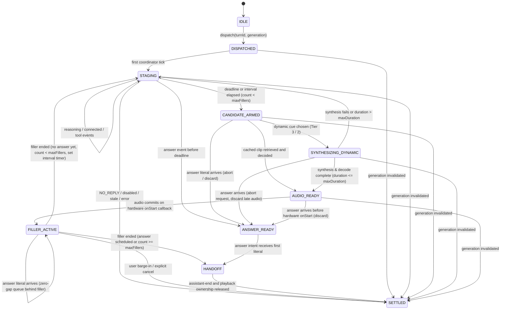

# Conversational Pacing and Thinking Fillers

**Status:** In active implementation — Phases 0 through 5 completed, Phase 6 (Dynamic Live CoT Vocalization & Acting Tab Consolidation) in design
**Scope:** Turn-based text/STT/proactivity responses that use the ordinary chat hook and speech-runtime path
**Out of scope:** Gemini Live native PCM output (`outputMode: 'gemini'`), which owns its own audio clock and must not be mixed with custom TTS

## 1. Executive Summary

Conversational pacing is a coordination problem between four clocks:

1. Inference clock: request dispatch, provider events, first usable answer text, and final settlement.
2. Speech clock: TTS synthesis, decoded audio duration, queued playback, and interruption.
3. Presentation clock: avatar cues, captions, and transient visual rendering.
4. Persistence clock: the final assistant message written to the chat session.

The system MUST have one authoritative turn coordinator and one speech intent per turn. Thinking fillers are optional audio items owned by that intent. They are never emitted as assistant text, never inserted into `rawContent`, and never create a second TTS engine or playback queue.

The design has three pillars:

- **Pillar A, bounded latency masking & multi-stage pacing:** arm at an adaptive threshold, choose a filler only from evidence available before the deadline, scale gracefully into multi-stage pacing for extended CoT, and cancel or hand off through the existing speech intent.
- **Pillar B, live dynamic vocalization & 3-tier cognitive hierarchy:** for fast local neural TTS engines (measured by Time to First Playable Audio under concurrent load), synthesize on-the-fly vocalized thoughts from explicit `<think_aloud>` intentional spoken asides (preferred path) or experimental organic conversational pivots during sustained reasoning.
- **Pillar C, presentation pacing:** pace display-only text and visual hesitation independently from TTS, while persisting only the canonical assistant response.

The design rejects several assumptions in the previous draft:

- Receiving an SSE header is not evidence that an answer is imminent. Only a usable answer literal suppresses a filler.
- Chain-of-thought is provider-specific and is not a reliable personality or sentiment channel. Arbitrary hidden reasoning is never spoken or persisted as transcript text. However, explicitly tagged `<think_aloud>` cues are treated as intentional spoken asides authored for the listener and may be vocalized transiently via pacing audio.
- “Zero gap” is a measurable scheduling invariant, not a promise that any arbitrary browser/provider combination can satisfy. It requires decoded audio to be scheduled against the same `AudioContext` clock with a positive lead.
- `speech.ts` is a settings/provider store, not the audio queue owner. Queue ownership belongs to the speech pipeline and intent runtime.
- A cache key is not a data contract. The cache must define ownership, eviction, invalidation, and whether audio is synchronized. The default is local-only and non-syncing.

## 2. Existing Architecture and Invariants

The implementation MUST fit these current paths:

| Concern | Current authority | Required integration |
| --- | --- | --- |
| Turn generation, stream lifecycle, session inscription | `packages/stage-ui/src/stores/chat.ts` and `packages/stage-ui/src/stores/chat/session-store.ts` | `chat.ts` owns `performSend`, stream events, and generation invalidation; `session-store.ts` owns session records and inscription. Create one coordinator per generation. |
| Cross-surface route map | `docs/arch-chat-stt-proactivity-pipelines.md` | Typed chat, STT, and proactivity converge on the ordinary chat path; all share the speech lane. |
| Stream marker interception | `packages/stage-ui/src/composables/llm-marker-parser.ts` | Run before categorization and TTS. ACT/DELAY/ACTOR remain special tokens. |
| Speech settings and active voice | `packages/stage-ui/src/stores/modules/speech.ts` | Read provider/model/voice/rate/pitch; do not add playback ownership here. |
| TTS segmentation and playback scheduling | `packages/pipelines-audio/src/speech-pipeline.ts` | Extend intent metadata/playback ownership rather than creating a parallel queue. |
| Speech host and cancellation | speech runtime/pipeline runtime and `ControlStripHost.vue` | One intent, one owner, explicit cancel on barge-in or generation invalidation. |
| Acting prompts and card persistence | `card.schema.ts`, `airi-card.ts`, `CardCreationTabActing.vue` | Add validated pacing configuration under `extensions.airi.acting`. |
| Chat persistence | chat session repo and `ChatAssistantMessage` | `content` is display text; `rawContent` retains model output and markers. Pacing metadata is not transcript content. |

### 2.1 Non-negotiable invariants

- **Turn Identity & Stale Generations**: Every turn has a unique `turnId`, `sessionId`, and captured `generation`. Events from a stale generation MUST be ignored, including late provider events, timer callbacks, TTS completions, and playback callbacks.
- **Multi-Stage Turn Budget**: Pacing cadence supports up to `maxFillersPerTurn` (default 3, configurable 1–8). Every spoken filler or aside consumes one slot of this turn budget. Once `fillersSpokenCount >= maxFillersPerTurn`, no further fillers are armed or synthesized.
- **Deduplication Disciplines**: Cached fillers enforce strict category deduplication (`getTopCategoryExcluding` across the 5 categories: `analytical`, `memory`, `emotional`, `uncertain`, `generic`). Dynamic asides (`<think_aloud>`) and repeat fallback slots enforce strict phrase deduplication (`usedPhrases`).
- **Hidden Reasoning vs. Intentional Spoken Asides**:
  - Arbitrary hidden reasoning (raw `<think>` blocks, provider `reasoning_content`) is deliberative scratchpad and MUST NEVER be spoken aloud, shown to the user as assistant speech, or written to session transcripts.
  - Intentional spoken asides (`<think_aloud>`) are explicitly authored, listener-facing cues emitted by the model during sustained thinking. They are parsed, sanitized, stripped from chat transcripts, and made available as candidate phrases for pacing vocalization.
  - Organic pivot extraction (`Wait, actually...`) is strictly experimental. Because regex keyword filters cannot establish semantic suitability to speak aloud (e.g. discarded internal hypotheses), it is disabled by default and falls back to curated pre-cached phrases.
- **Candidate Collection vs. Cadence Commitment**: Emitting `</think_aloud>` merely *arms a dynamic candidate* with an expiry; it does NOT trigger immediate speech. Pacing policy and cadence intervals control when an eligible candidate is selected for synthesis and playback.
- **Abort Contract**: Calling `AbortController.abort()` on in-flight dynamic TTS is an immediate cancellation request. The client contract is to request cancellation immediately and deterministically reject/discard any arriving audio before playback unless its turn and candidate remain valid.
- **Decoded Audio Duration Safeguard**: An input word cap (10–12 words) is an input filter, not an audio duration guarantee. Decoded audio duration MUST be checked against `maxFillerDurationMs` (default 2200ms) before committing to playback. If decoded duration exceeds `maxFillerDurationMs`, the audio is discarded.
- **Commitment Lifecycle & Preemption**: The system enforces four distinct candidate states when the main answer arrives:

| Candidate State when Answer Arrives | Invariant Behavior |
| --- | --- |
| Being extracted, synthesized, or decoded | Abort request sent, discard arriving audio; answer proceeds immediately. |
| Ready/decoded but not committed to playback (`onStart`) | Discard decoded buffer; answer owns the playback slot immediately. |
| Committed to playback (`onStart` received from audio hardware) | Finish the short aside naturally; zero-gap queue answer audio behind it (`s1 = e0`). |
| Any state on explicit user Stop or barge-in | Abort inference, cancel intent, stop all audio immediately, discard all state. |

- **Answer Onset Cutoff**: No further filler work, interval timers, or dynamic synthesis jobs are initiated once the first answer literal arrives or answer audio is scheduled.
- **NO_REPLY Handling**: For turns where reasoning deliberates before concluding with `NO_REPLY` (e.g. quiet proactivity evaluations), an early pacing filler may have already legitimately committed and played as natural "thinking out loud" (since future outcome cannot be predicted). However, `NO_REPLY` arriving *before* a filler commits cancels any pending candidate and suppresses all subsequent pacing for that turn.
- **Stream vs. Intent Lifecycle**: `stream-end` flushes; `assistant-end` settles. This matches remote replay and speech-host lifecycle rules.
- **Gemini Audio Bypass**: Native Gemini audio mode bypasses this subsystem entirely. Custom Gemini mode follows the normal marker/parser/TTS path but still cannot be mixed with native PCM.

## 3. Formal Model

Let `t0` be monotonic time at dispatch. Let `ta` be the time of the first answer literal after marker parsing and reasoning categorization. Let `tf` be the time filler playback commits (`onStart`), or `∞` if it never commits. Let `te` be answer settlement.

The filler candidate state is a partial function:

```text
F(turn) ∈ {suppressed, candidate_armed, synthesizing, decoded_ready, committed, canceled, rejected}
```

The safety property is:

```text
if ta < tf, then no filler audio is audible
```

The race policy is governed by the commitment boundary:

1. If answer text arrives while a filler candidate is armed, synthesizing, or decoded_ready (prior to `tf`), the filler is canceled/discarded and never scheduled to hardware.
2. If answer text arrives after filler playback has committed (`onStart`, $t_f \le t_a$), the active short filler finishes naturally, and answer audio is enqueued seamlessly at $s_1 = e_0$, subject to `maxFillerDurationMs`.
3. If answer audio is already decoded and scheduled with a start time earlier than filler start, any uncommitted filler is rejected; the answer owns the next playback slot.

The product objective is not “always fill silence.” It is to minimize perceived dead air subject to:

```text
P(filler audible | answer would have been ready first) ≤ falsePositiveBudget
```

The initial default budget is 1% over a rolling 100-turn window, with a hard safety floor that disables fillers after repeated late starts.

## 4. Provider Protocol Matrix

The provider adapter MUST normalize provider output into a stream-neutral event contract. The coordinator MUST NOT inspect provider-specific object shapes.

```ts
type InferenceEvent
  = | { type: 'connected', at: number }
    | { type: 'reasoning', text: string, visibility: 'hidden' | 'visible', at: number }
    | { type: 'answer', text: string, at: number }
    | { type: 'special', token: string, at: number }
    | { type: 'tool', phase: 'start' | 'end', at: number }
    | { type: 'finish', reason?: string, at: number }
    | { type: 'error', error: unknown, at: number }
```

| Provider behavior | Adapter normalization | Filler consequence |
| --- | --- | --- |
| Separate `reasoning_content` deltas | `reasoning`, `visibility: hidden` | Reasoning may inform a coarse category; it does not suppress filler. |
| In-band `<think>`/`<thought>` | Delimiter adapter removes hidden block before normal categorization | The delimiter parser must be incremental and chunk-safe. |
| Anthropic thinking events | `reasoning`, then `answer` | Same policy; event names never reach coordinator logic. |
| Direct answer stream | `answer` after marker parsing | Suppress pending filler immediately. |
| Slow non-reasoning model | No event until answer or finish | Adaptive deadline may arm generic filler; no fabricated CoT category. |
| Ultra-fast model | `answer` before deadline | No filler synthesis or playback. |
| Tool loop | `tool:start` pauses answer expectation but does not reset `t0` | A filler may play once; tool output cannot create another filler. |

If an adapter cannot distinguish hidden reasoning from user-visible text, it MUST emit the data as `answer`. It MUST NOT guess that arbitrary XML is hidden reasoning.

## 5. State Machine



`ANSWER_READY` is an internal state, not a second speech intent. The normal assistant speech intent remains the sole owner of answer TTS.

### 5.1 Transition rules

| From | Event | Guard | Action |
| --- | --- | --- | --- |
| `DISPATCHED` | first tick | turn current | enter `STAGING`; emit optional nonverbal staging cue |
| `STAGING` | answer literal | current | cancel arm/interval timer; enter `ANSWER_READY`; send literal to ordinary intent |
| `STAGING` | deadline elapsed | `fillersSpokenCount < maxFillersPerTurn`, no answer audio scheduled, pacing enabled | enter `CANDIDATE_ARMED`; select candidate (Tier 3 `<think_aloud>` -> Tier 2 pivot -> Tier 1 cached `getTopCategoryExcluding`) |
| `STAGING` | interval flush elapsed | `fillersSpokenCount < maxFillersPerTurn`, no answer audio scheduled | enter `CANDIDATE_ARMED`; select next candidate |
| `CANDIDATE_ARMED` | cached clip ready | decoded duration $\le \text{maxFillerDurationMs}$, no answer scheduled | enter `AUDIO_READY`; schedule on playback manager |
| `CANDIDATE_ARMED` | dynamic cue selected | TTFPA eligible, local TTS available | enter `SYNTHESIZING_DYNAMIC`; launch fetch with `AbortController` |
| `CANDIDATE_ARMED` | answer literal | current | cancel candidate; enter `ANSWER_READY` |
| `SYNTHESIZING_DYNAMIC` | answer literal | current | trigger `abortController.abort()`, mark candidate discarded, enter `ANSWER_READY` |
| `SYNTHESIZING_DYNAMIC` | synthesis success | decoded duration $\le \text{maxFillerDurationMs}$, no answer scheduled | enter `AUDIO_READY`; schedule on playback manager |
| `SYNTHESIZING_DYNAMIC` | duration exceeded | decoded duration $> \text{maxFillerDurationMs}$ | discard audio; log duration warning; return to `STAGING` |
| `AUDIO_READY` | answer literal | before hardware `onStart` | discard scheduled buffer; enter `ANSWER_READY` |
| `AUDIO_READY` | hardware `onStart` | current turn and generation | enter `FILLER_ACTIVE`; increment `fillersSpokenCount`; track start timestamp |
| `FILLER_ACTIVE` | answer literal | current | ordinary intent continues; answer audio scheduled seamlessly at $s_1 = e_0$ |
| `FILLER_ACTIVE` | filler audio ended | `!answerAudioScheduled` and `fillersSpokenCount < maxFillersPerTurn` | return to `STAGING`; reset classification window; arm interval timer (`pacingIntervalMs`) |
| `FILLER_ACTIVE` | filler audio ended | `answerAudioScheduled` or `fillersSpokenCount >= maxFillersPerTurn` | enter `HANDOFF`; notify metrics if answer scheduled |
| any non-settled | `assistant-end` | current | flush answer; settle after queue ownership is released |
| any | cancel/barge-in | current | abort inference, abort dynamic TTS, cancel speech intent, stop owned playback, settle as interrupted |

The commitment model resolves the race deterministically: if playback has not committed (`onStart`), the filler is discarded; once committed (`onStart`), the short aside completes naturally and the answer queues smoothly behind it without restart or truncation.

## 6. Adaptive Timing and Multi-Stage Cadence

Timers remain necessary because absence of an event is itself a signal. They are policy deadlines, not guesses about provider internals.

### 6.1 Bounded EMA and Percentile Floor

For each `(providerInstanceId, modelId, modality)` bucket, record successful TTFT samples $x_n$ where TTFT is dispatch-to-first-answer-literal. Use a bounded EMA:

```text
μ_n = α x_n + (1 - α) μ_(n-1)
α = 2 / (N + 1), N ∈ [8, 32]
```

Track dispersion with an EMA of absolute deviation:

```text
d_n = β |x_n - μ_n| + (1 - β) d_(n-1)
```

The arm deadline incorporates the empirical 10th percentile floor $p_{10}$ when at least 20 samples exist, with the clamp applied *after* the percentile floor to guarantee strict bound compliance:

```text
D = clamp(max(μ - k_fast d, p10(TTFT)), D_min, D_max)
```

Defaults:

```text
D_min = 900 ms
D_max = 3500 ms
k_fast = 0.5
```

For a cold bucket, use $D = 1800\text{ ms}$. For an ultra-fast bucket where $p_{90}(\text{TTFT}) \le 700\text{ ms}$, the effective policy is disabled because the minimum arm deadline would provide no useful masking.

The deadline is recalculated only between turns. It MUST NOT move while a turn is in flight. This prevents a settings/provider update from racing a timer callback.

### 6.2 Multi-Stage Cadence & Interval Flushes

For extended reasoning models deliberating past the initial deadline, pacing scales into progressive intervals:

1. **First Pacing Event**: Evaluated at adaptive deadline $D$ (typically 1.5s–3.5s).
2. **Subsequent Pacing Events**: Evaluated at cadence intervals ($t_0 + D + k \times \text{pacingIntervalMs}$, default interval 15s, range 5s–45s).
3. **Turn Budget**: Limited strictly to `fillersSpokenCount < maxFillersPerTurn` (default 3, range 1–8).
4. **Resolution of 5 Categories vs. 8 Fillers**:
   - The 5 semantic categories (`generic`, `analytical`, `memory`, `emotional`, `uncertain`) govern *curated pre-cached fillers* via category deduplication (`getTopCategoryExcluding`).
   - On long turns configured with `maxFillersPerTurn > 5`, once all 5 categories have spoken, subsequent slots are satisfied by:
     - Explicit `<think_aloud>` intentional spoken asides (Tier 3).
     - Experimental organic pivots (Tier 2, if enabled).
     - Curated generic phrase fallbacks governed by phrase deduplication (`usedPhrases`).

A filler slot is eligible only if:

```text
now - t0 ≥ deadlineOrIntervalTarget
answerAudioScheduled = false
fillersSpokenCount < maxFillersPerTurn
audioContext.state === 'running'
(cacheHit === true || dynamicAsideReady === true)
```

No network TTS request may be made after the deadline to rescue a missed cache hit on Tier 1. A cache miss on Tier 1 means “no cached filler this slot,” not “wait longer.”

## 7. Streaming Interception and Cue Extraction

### 7.1 Ordering

Every answer stream MUST pass through the existing `useLlmmarkerParser` before categorization or speech. The stream adapter first normalizes provider reasoning events; the ordinary answer text then follows:

```text
provider events
  -> protocol adapter
  -> reasoning/delimiter normalizer
  -> useLlmmarkerParser
  -> streaming categorizer
  -> chat hooks / speech intent
```

ACT, DELAY, ACTOR, and future special tokens remain special events. They must not enter the filler classifier or TTS literal stream.

### 7.2 Incremental reasoning window

The classifier is intentionally not sentiment analysis. It emits one of a small configured set:

```ts
type ThinkingCategory = 'analytical' | 'memory' | 'emotional' | 'uncertain' | 'generic'
```

The classifier consumes normalized hidden reasoning only, up to `maxReasoningChars = 1024` or `maxReasoningMs = 900`, whichever occurs first. It uses token-boundary-safe normalization:

```ts
function consumeReasoningChunk(chunk: string) {
  window += chunk
  window = window.slice(-1024)
  const terms = tokenizeForMatching(window) // Unicode-aware, no regex over raw chunks
  return scoreCategories(terms, configuredCategoryLexicon)
}
```

`tokenizeForMatching` lowercases, folds punctuation, preserves negation tokens, and retains a rolling 3-token context. A category score is valid only when:

```text
positiveEvidence - negatedEvidence ≥ categoryThreshold
```

Negation is local and conservative: `not`, `never`, `don't`, `shouldn't`, and equivalent configured terms suppress a matching term within the next three normalized tokens. The classifier MUST NOT infer “angry” from a sentence such as “I should not sound angry.”

Keyword matches are category evidence, not direct audio commands. Custom card configuration maps category to a filler clip; it cannot cause arbitrary text from reasoning to be spoken.

If reasoning arrives split as `cal` + `cul` + `ate`, the rolling string buffer is classified only after a token boundary or the window deadline. No single chunk is assumed to be a token.

### 7.3 Pseudocode

```ts
async function onInferenceEvent(event: InferenceEvent) {
  if (!isCurrentTurn(event.at))
    return

  if (event.type === 'reasoning' && event.visibility === 'hidden') {
    // 1. Check for explicit <think_aloud> intentional spoken aside tag
    const dynamicCue = extractThinkAloudCue(event.text)
    if (dynamicCue) {
      coordinator.armDynamicCandidate(dynamicCue)
      return
    }

    // 2. Feed into category classifier for coarse categorization of pre-cached fillers
    const category = classifier.consume(event.text)
    if (category && coordinator.state === 'CANDIDATE_ARMED')
      coordinator.replaceCandidate(category)
    return
  }

  if (event.type === 'answer') {
    coordinator.cancelPendingFiller('answer-arrived')
    parser.consume(event.text) // parser emits ordinary literal/special hooks
    return
  }

  if (event.type === 'finish')
    await coordinator.onAssistantEnd()
}
```

The classifier and cue extractors are advisory. They never own turn settlement, persistence, or playback.

### 7.4 Dynamic Spoken Aside Extraction (`<think_aloud>`) vs. Experimental Organic Pivots

There is a fundamental semantic hierarchy among dynamic thought candidates:

1. **Explicit `<think_aloud>` Cues (Preferred Dynamic Path / Gold Standard)**:
   - The model explicitly authors an in-character thought intended for the listener:
     `<think_aloud>Wait, did we import that correctly?</think_aloud>`
   - Formally defined as an **intentional spoken aside**, even though transported inside the reasoning stream.
   - The streaming parser extracts and sanitizes the content (clamped to 10–12 words max, stripping any XML or control markers).
   - Crucially, it is completely stripped from user-facing transcripts and session history: neither `content` nor `rawContent` persists the aside into chat records.
2. **Organic Pivot Extraction (Experimental Fallback)**:
   - Scans reasoning for human cognitive pivots (`"Wait, actually..."`, `"Hold on, what if..."`, `"Oh, I see..."`).
   - **Marked Strictly Experimental** (`experimentalOrganicPivots: false` by default).
   - *Technical pushback & safety rationale*: Filtering code tokens (`{`, `}`, `_`, `\`, `$`), LaTeX, and meta tokens (`system`, `user`, `instruction`) cannot establish that an extracted fragment is semantically appropriate to say aloud. For example, a deliberative sentence such as *"Wait, that accusation could be true..."* passes keyword filters but may represent a discarded internal hypothesis rather than something the persona should announce to the user.
   - Default policy: When no explicit `<think_aloud>` cue is present, the engine defaults to curated, pre-cached fillers (Tier 1) rather than guessing meaning from raw reasoning text.

### 7.5 Candidate Collection vs. Playback Cadence

The system maintains a strict separation between *collecting a candidate* and *committing to playback*:

- A completed `</think_aloud>` tag merely **arms a candidate** with an expiration window (e.g. next interval flush or 15s); it does NOT immediately blurt it out.
- At most **one pending dynamic candidate** is held at any time; a newer completed tag replaces an older unplayed candidate.
- At most **one filler synthesis job** is permitted in flight at a time.
- Cadence timing controls playback: The candidate is evaluated only when the coordinator reaches an eligible cadence flush ($D$ or $t_0 + D + k \times \text{pacingIntervalMs}$).
- Priority: At an eligible flush, an explicit `<think_aloud>` candidate takes precedence over extracted pivots or cached fillers.
- Unified Turn Budget: Every spoken aside (cached or dynamic) increments `fillersSpokenCount` and counts against `maxFillersPerTurn`.
- Answer Cutoff: Once the first answer literal arrives or answer audio is scheduled, all dynamic candidate collection and synthesis immediately cease.

## 8. Speech Runtime and Zero-Gap Handoff

### 8.1 Ownership contract

The filler and answer MUST use the same speech intent owner and playback manager. The speech pipeline already serializes playback while allowing TTS generation concurrency. The implementation should add typed metadata, for example:

```ts
interface PacingPlaybackMeta {
  turnId: string
  role: 'thinking-filler' | 'assistant-answer'
  generation: number
}
```

`PlaybackItem` carries this metadata for observability and cancellation. It does not create a second queue.

### 8.2 Scheduling invariant and Decoded Duration Verification

Let `C` be the `AudioContext.currentTime`, `s0` the filler start, `e0` its scheduled end, and `s1` the answer start. For zero-gap handoff:

```text
s1 = e0
decodedAnswerBuffer.ready = true before e0 - lead
lead ≥ max(2 render quanta, provider scheduling jitter)
```

In practice the playback manager MUST schedule the answer buffer against the same context clock before `e0`, not wait for an `onEnd` callback to start a new source. If the answer is not ready by `e0 - lead`, the system chooses continuity over the zero-gap claim: it ends the filler at its natural boundary and starts the answer when ready, recording an underrun metric.

*Decoded Audio Duration Safeguard*: An input word cap (10–12 words) is an input filter, NOT an audio duration guarantee (speech rate, syllable complexity, and pause pauses vary widely). Decoded audio duration MUST be checked against `maxFillerDurationMs` (default 2200ms) before committing to playback:

```text
minDurationMs ≤ durationMs ≤ maxFillerDurationMs
default maxFillerDurationMs = 2200
```

If decoded audio duration exceeds `maxFillerDurationMs`, the audio buffer is rejected and discarded; the system returns to `STAGING` and falls back to a curated cached filler or silence. The filler cannot be looped.

*Conversational Preemption Rule*: Governed by the 4-state commitment table:
1. If the first answer literal or audio arrives while a filler is being extracted, synthesized, or decoded, the filler is canceled/aborted and discarded.
2. If decoded audio is ready but has not yet committed to hardware playback (`onStart`), it is discarded; the answer owns the playback slot immediately.
3. If the filler has committed to playback (`onStart` received from audio hardware), the short aside (1–2s) completes naturally, and answer audio is queued seamlessly at $s_1 = e_0$. Mid-speech truncation is strictly forbidden unless caused by user barge-in or stop.

### 8.3 Cache contract

The prior draft's `local:audio:thinking-cache/{voiceId}` is not an approved catalog key. Structured `local:` writes sync through the outbox. Audio bytes belong in localforage, while a small manifest may use local storage only if it is explicitly marked non-syncing.

Recommended local-only key:

```text
thinking-audio-{sha256(provider, model, voiceId, pitch, rate, language, text, format)}
```

Manifest fields:

```ts
interface ThinkingAudioEntry {
  key: string
  voiceFingerprint: string
  category: ThinkingCategory
  text: string
  format: string
  durationMs: number
  byteLength: number
  createdAt: number
  lastUsedAt: number
}
```

Cache rules:

- Generate only from explicit pre-cache action, idle-time warming, or the first successful use outside the critical deadline.
- Never synthesize a cache miss on the critical path.
- Invalidate when provider, model, voice, pitch, rate, language, format, or text changes.
- Cap total bytes and entry count; evict least-recently-used entries.
- Do not sync raw audio or cache manifests across devices by default.
- Store bytes with `localforage`; use `toRaw` for reactive data before persistence where applicable.

### 8.4 Cancellation, Abort Contract, and Barge-In

Cancellation is generation-scoped. On user speech, explicit stop, session switch, or newer interrupting turn:

1. Bump the chat session generation using the existing canonical mechanism.
2. Abort the LLM inference request where the provider supports `AbortSignal`.
3. If a dynamic TTS synthesis request is in flight, immediately call `abortController.abort()`.
   - *Abort Contract*: Calling `abort()` is a client-side cancellation request. The coordinator guarantees that any late-arriving audio response will be deterministically rejected and discarded before scheduling or playback, regardless of whether the local speech server terminates compute immediately.
4. Cancel the speech intent with an explicit reason.
5. Stop playback items owned by the turn, including any active filler.
6. Do not persist transient filler text, dynamic asides, or visual draft state.
7. Settle the interrupted turn exactly once.

Cancellation MUST be idempotent. A late `onEnd` callback from the playback manager MUST be ignored if its generation is stale.

## 9. Pillar B: Text and Visual Pacing

Pillar B is presentation-only. It MUST NOT delay audio, mutate canonical message content, or infer permanent personality facts from hidden reasoning.

### 9.1 Separate clocks

The assistant response has three representations:

```ts
interface AssistantPresentation {
  canonicalText: string
  spokenText: string
  displayText: string
  transientDraft?: string
  captionSegments: CaptionSegment[]
}
```

- `canonicalText` is the clean final content persisted as `content`.
- `spokenText` is the literal stream sent to TTS after marker/category filtering.
- `displayText` is what the UI currently reveals.
- `transientDraft` is renderer memory only and is never written to chat history.

TTS timing is authoritative for captions that represent speech. A typewriter effect may reveal text earlier or later, but caption highlighting MUST use segment IDs and audio playback timestamps, not character index alone.

If visual text lags behind audio, captions reveal the required segment immediately. If visual text leads audio, the UI may show unhighlighted text but MUST NOT claim it has been spoken.

### 9.2 Draft/retype safety

Draft and deletion effects operate on an ephemeral presentation store keyed by `turnId`. At `assistant-end`, only the final parser output is passed to `inscribeTurn`. The persistence layer MUST never receive `transientDraft`.

Markdown is rendered only from `displayText` after a safe debounce or from canonical completed text. The effect engine MUST NOT mutate the persisted message object in place.

Recommended default: ship typewriter pacing and caption alignment first; keep simulated backspace/retype behind an experimental flag until accessibility, markdown, and interruption tests pass.

## 10. Card Schema and Settings Integration

The configuration belongs under the existing `extensions.airi.acting` object. It is card-scoped policy; audio bytes remain device-local.

Implemented Valibot shape (`packages/stage-ui/src/types/card.schema.ts`):

```ts
export const AiriThinkingFillerSchema = object({
  text: pipe(string(), minLength(1), maxLength(160)),
  category: union([
    literal('generic'),
    literal('analytical'),
    literal('memory'),
    literal('emotional'),
    literal('uncertain'),
  ]),
  enabled: boolean(),
})

export const AiriPacingSchema = object({
  enabled: boolean(),
  armMinMs: optional(pipe(number(), integer(), minValue(900), maxValue(3500))),
  armMaxMs: optional(pipe(number(), integer(), minValue(900), maxValue(6000))),
  maxFillerDurationMs: optional(pipe(number(), integer(), minValue(400), maxValue(2200))),
  reasoningWindowMs: optional(pipe(number(), integer(), minValue(0), maxValue(1200))),
  categoryThreshold: optional(pipe(number(), minValue(1), maxValue(10))),
  kFast: optional(pipe(number(), minValue(0), maxValue(2))),
  maxFillersPerTurn: optional(pipe(number(), integer(), minValue(1), maxValue(8))),
  pacingIntervalMs: optional(pipe(number(), integer(), minValue(5000), maxValue(45000))),
  fillers: optional(array(AiriThinkingFillerSchema)),
  experimentalOrganicPivots: optional(boolean()),
  visualTyping: optional(object({
    enabled: boolean(),
    minIntervalMs: optional(pipe(number(), integer(), minValue(0), maxValue(1000))),
    maxIntervalMs: optional(pipe(number(), integer(), minValue(0), maxValue(2000))),
    experimentalDraftRetype: optional(boolean()),
  })),
})
```

### 10.1 Acting Tab Segmented UI Architecture & Consolidation

To prevent vertical scaling sprawl in `CardCreationTabActing.vue` and eliminate underutilized surfaces, the acting tab is consolidated into a clean 3-segment pill navigation bar (`expressions`, `speech`, `pacing`):

- **Model Expressions**: Emotion prompt mappings, Live2D/VRM expression links, idle loops, and emotion tags.
- **Speech Tags**: Audio expressions, paralinguistic tag discovery (`/v1/capabilities`), and head-tethered caption FX.
- **Pacing & Fillers** (Consolidated Hub):
  - Master toggle (`acting.pacing.enabled`)
  - Adaptive Latency & Cadence Sliders (`armMinMs`, `armMaxMs`, `maxFillerDurationMs`, `maxFillersPerTurn`, `pacingIntervalMs`, `categoryThreshold`, `reasoningWindowMs`)
  - **Thinking & Conversational Pacing Prompt Scratchpad**:
    - Backed by `extensions.airi.acting.speechMannerismPrompt` (100% schema & prompt-builder compatible).
    - 1-click template insertion chips: `[✨ Insert <think_aloud> CoT Template]`, `[✨ Insert Conversational Pacing Template]`.
    - **Safe Content Preservation**: When inserting templates, the UI MUST NOT silently overwrite existing text. If `speechMannerismPrompt` already contains text, the template is cleanly appended with a newline separator (or prompts for confirmation). Reusing the storage key maintains schema compatibility while treating templates as strictly optional additions that do not erase existing persona mannerisms.
    - Preserves provider-side mannerism chips when reported by the active engine.
  - Thinking fillers table with category badge pills, phrase text inputs, and row-level enable toggles.
  - Live cache verification chips showing "Cached" (emerald) vs "Uncached" (amber) status per phrase against the active character voice.
  - "Pre-warm Audio Cache" batch synthesis button with real-time percentage progress bar.
  - Inline audition playback to preview pre-rendered audio directly in the card editor.

Validation enforces `armMinMs ≤ armMaxMs` at the update boundary. Imported cards with invalid or absent pacing config automatically fallback to default safe values.

## 11. Implementation Boundaries

The subsystem is organized into modular libraries, composables, and hook integration points:

```text
packages/stage-ui/src/
  types/
    pacing.ts                     normalized events, pacing state machine, metrics, policy config
  libs/pacing/
    turn-pacing-coordinator.ts    generation-scoped state machine and adaptive bounded-EMA deadline
    category-classifier.ts        bounded incremental streaming keyword & negation classifier
    pacing-cache.ts               localforage deterministic SHA-256 fingerprint audio store
    pacing-playback-bridge.ts     zero-gap playback scheduler bridge and preemption manager
    pacing-prewarm.ts             batch TTS synthesis, duration estimator, and cache status inspector
  composables/
    use-turn-pacing.ts            stage host lifecycle orchestrator composable
    response-categoriser.ts       in-band XML/tag incremental parser with onReasoningChunk callback
  stores/
    chat/hooks.ts                 orchestrator chat hooks (including onReasoningChunk)
    chat.ts                       dual-path reasoning emission (in-band and reasoning-delta)
  components/scenes/
    ControlStripHost.vue          stage host hook subscriber, Web Audio playback, and lip-sync node
packages/stage-pages/src/
  pages/settings/airi-card/components/tabs/
    CardCreationTabActing.vue     4-segment pill navigation (expressions, speech, mannerisms, pacing)
```

Integration points:

- `chat.ts` and `response-categoriser.ts` emit unified `onReasoningChunk` hooks for both in-band `<think>` and out-of-band `reasoning-delta` streams.
- `use-turn-pacing.ts` manages coordinator dispatch, empirical TTFT samples, and bridge scheduling.
- `ControlStripHost.vue` wires into `onBeforeSend`, `onReasoningChunk`, `onTokenLiteral`, `onAssistantResponseEnd`, and `onGenerationStopped`, connecting directly to `playbackManager` and `audioContext`.
- `playbackManager` handles zero-gap serialization: active fillers complete naturally while the synthesized answer queues cleanly behind them.
- `session-store.ts` remains strictly insulated: thinking filler audio and transient metrics are never persisted into session chat history.

## 12. Observability and Failure Policy

Each turn records metrics in memory and debug logs, not chat history:

```ts
interface PacingMetrics {
  turnId: string
  providerKey: string
  ttftMs?: number
  deadlineMs: number
  fillerCandidate?: ThinkingCategory
  fillerOutcome: 'none' | 'cache-miss' | 'canceled' | 'played' | 'rejected'
  fillerStartMs?: number
  answerFirstAudioMs?: number
  handoffGapMs?: number
  interrupted: boolean
}
```

Safe degradation is mandatory:

- Missing cache: no filler, ordinary TTS continues.
- Missing reasoning events: generic category only, never an error.
- TTS/provider failure: cancel owned filler/answer as appropriate; do not retry filler on the hot path.
- AudioContext unavailable: suppress filler and preserve normal chat.
- Parser error: follow existing parser end behavior and prevent marker leakage; do not let pacing bypass parser safeguards.
- Coordinator exception: disable pacing for the turn and leave the ordinary chat path usable.

## 13. Verification Plan

### 13.1 Unit tests

- EMA convergence, cold start, clamping, and percentile floor ($D = \text{clamp}(\max(\mu - k_{\text{fast}} \cdot d, p_{10}), D_{\min}, D_{\max})$).
- State transition table for every event in every state, including candidate arming, dynamic synthesis, and playback commitment.
- Stale generation events cannot transition or schedule playback.
- Answer at 899 ms, exactly at deadline, and after filler start.
- Multi-stage pacing budget invariant: `fillersSpokenCount <= maxFillersPerTurn`, interval timers schedule next candidates only while `!answerAudioScheduled`, and all timers are cleared upon answer onset.
- 4-State commitment table: uncommitted dynamic synthesis or decoded ready audio is canceled/discarded when answer arrives before hardware `onStart`.
- Decoded audio duration safeguard: buffers exceeding `maxFillerDurationMs` are rejected and discarded prior to commitment.
- Delimiter parsing across arbitrary chunk boundaries for in-band `<think>`.
- `cal` + `cul` + `ate` rolling classification with token boundaries.
- Negation examples do not select contradictory categories.
- ACT/DELAY/ACTOR never enter literal filler classification or TTS.
- Dynamic spoken aside extraction: `<think_aloud>` parsed, sanitized to 10–12 words, arms candidate with expiration, does not speak immediately on tag close, and is stripped from session transcripts (`content` and `rawContent`).
- Deduplication: category deduplication for pre-cached phrases (`getTopCategoryExcluding`) vs phrase deduplication for dynamic asides and repeat fallbacks (`usedPhrases`).
- `NO_REPLY` handling: `NO_REPLY` arriving before a filler commits cancels any pending filler and suppresses further pacing for the turn. (If extended deliberation elapsed before `NO_REPLY` was determined, an early committed filler settles cleanly without answer audio.)
- Cancellation is idempotent and settles once.
- Cache fingerprint invalidates on every voice-affecting field.
- Cache eviction is bounded and local-only.
- `content`/`rawContent` and persisted session messages never contain filler or draft text.

### 13.2 Deterministic latency bench

Build a fake provider and fake playback clock. Run at least:

| Scenario | Expected result |
| --- | --- |
| 200 ms direct answer | No filler; answer starts normally. |
| 800 ms direct answer | No filler under default policy. |
| 1800 ms silent non-reasoning | Generic cached filler may start once. |
| 5000 ms hidden reasoning | Pacing filler plays; if reasoning continues past interval flush, next candidate evaluates up to `maxFillersPerTurn`. |
| Answer at 1400 ms, filler arm at 1200 ms but not started (`onStart` pending) | Filler canceled; no audio. |
| Answer at 1400 ms, filler committed at 1200 ms (`onStart` received) | Answer queued seamlessly at $s_1 = e_0$; no overlap or mid-speech cut. |
| Dynamic aside emitted at 2500 ms, answer arrives at 2700 ms while TTS in flight | Abort request sent, arriving audio discarded; answer starts immediately. |
| Dynamic aside emitted, decoded duration is 3100 ms (> 2200 ms limit) | Dynamic audio discarded; coordinator falls back to cached filler or silence. |
| Cache miss at arm deadline | No filler; no extra wait. |
| User barge-in during filler | Generation bump, intent cancel, owned audio stops, no persistence leak. |
| Proactivity followed by chat | Shared speech lane remains serialized and both turns settle. |
| Gemini native PCM | Pacing coordinator is not instantiated. |

### 13.3 Repository validation

For implementation changes:

```bash
pnpm -F @proj-airi/stage-ui typecheck
pnpm -F @proj-airi/stage-pages typecheck
```

Run the affected audio package typecheck if `packages/pipelines-audio` changes. A build is required if Electron entry points or packaging are changed. This proposal rewrite itself is documentation-only and does not require a typecheck.

## 14. Three-Tier Cognitive Pacing & Live Dynamic CoT Vocalization

When extended reasoning models (DeepSeek-R1, QwQ, Claude 3.7 Thinking) deliberate for 30s to 90s, pacing evolves beyond static pre-cached audio clips into dynamic, contextual vocalization when powered by high-speed neural TTS engines (measured by Time to First Playable Audio under concurrent inference workload).

### 14.1 The Three-Tier Cognitive Hierarchy

```
┌───────────────────────────────────────────────────────────┐
│ Tier 1: Instant Pre-cached Fillers (The Reflex)            │
│  • Fires at early adaptive deadline (~1.5–3.5s)           │
│  • Zero-latency localforage/OPFS cache                     │
│  • "Hmm...", "Let's see...", "Checking that..."           │
└─────────────────────────────┬─────────────────────────────┘
                              │ If reasoning continues past threshold (default 15s)
┌─────────────────────────────▼─────────────────────────────┐
│ Tier 3: Explicit <think_aloud> XML Cues (Preferred Dynamic)│
│  • Intentional listener-facing aside authored by model     │
│  • Highest dynamic priority; sanitized & clamped (10–12w) │
│  • Tag close arms candidate with expiry (doesn't blurt)   │
└─────────────────────────────┬─────────────────────────────┘
                              │ If no explicit tag emitted in reasoning stream
┌─────────────────────────────▼─────────────────────────────┐
│ Tier 2: Organic Pivot Extraction (Experimental Fallback)  │
│  • Scans stream for "Wait...", "Hold on...", "Actually..."│
│  • Regex cannot ensure semantic safety (disabled by default)
│  • Evaluated at interval cadence flushes                  │
└───────────────────────────────────────────────────────────┘
```

1. **Tier 1: Instant Pre-cached Fillers (The Reflex)**:
   - Evaluated at `calculateDeadline()` (~1.5s–3.5s).
   - Serves immediate latency masking for turns completing within 5–10s.
   - Zero-latency local retrieval from `pacing-cache` via `localforage`.
2. **Tier 3: Explicit `<think_aloud>` XML Cues (Preferred Dynamic Path / Gold Standard)**:
   - Highest priority dynamic path. The model intentionally authors a character thought directed at the listener:
     `<think_aloud>Wait, did we import that correctly?</think_aloud>`
   - Formally defined as an **intentional spoken aside**, even though transported inside the hidden reasoning stream.
   - Extracted by the streaming parser, sanitized (10–12 words max, control tokens stripped), and armed as a candidate with an expiry.
   - Stripped completely from user-facing transcripts and chat session history (`content` and `rawContent`).
3. **Tier 2: Organic Pivot Extraction (Experimental Fallback)**:
   - Evaluated at cadence intervals only when no explicit `<think_aloud>` cue is present.
   - Scans for cognitive pivot phrases: `"Wait, actually..."`, `"Hold on, what if..."`, `"Oh, I see..."`.
   - **Marked Strictly Experimental** (`experimentalOrganicPivots: false` by default).
   - *Pushback on regex semantics*: Filtering code tokens and meta keywords cannot establish that a sentence is appropriate to speak aloud. Internal deliberative hypotheses (e.g. "Wait, that accusation could be true...") pass keyword filters but are not meant for the listener. Defaulting to curated cached phrases remains the safe default when no explicit cue is present.

### 14.2 Live Dynamic TTS Lifecycle, TTFPA, and Commitment Contract

#### 14.2.1 Performance Threshold: TTFPA vs. Nominal RTF

A nominal Real-Time Factor (RTF) of $\le 0.28$ alone does NOT guarantee 100–250ms synthesis latency. For instance, a 3-second audio clip at 0.28 RTF requires ~840ms of raw compute before network transport, serialization, and decoding overhead.

The true eligibility gate is **Time to First Playable Audio (TTFPA) under actual concurrent LLM reasoning and GPU load**. Pacing dynamically enables on-the-fly synthesis only when:

```text
TTFPA(concurrent_load) ≤ maxSynthesisBudgetMs (default 600ms)
```

#### 14.2.2 Decoded Duration Safeguard

An input word cap (10–12 words) is an input filter, not an audio duration guarantee. Decoded audio duration MUST be checked against `maxFillerDurationMs` (default 2200ms) before committing to playback. If decoded duration exceeds `maxFillerDurationMs`, the buffer is discarded and the engine falls back to cached fillers or silence.

#### 14.2.3 Abort Request vs. Client Discard Contract

Every dynamic synthesis request is associated with an `AbortController`. When the main LLM answer arrives:
- `abortController.abort()` is called immediately to request server cancellation.
- The coordinator enforces the client safety invariant: any late-arriving or post-abort response is deterministically rejected and discarded before scheduling, regardless of server compute state.

#### 14.2.4 Four-State Playback Commitment Table

| Candidate State when Answer Arrives | Invariant Behavior |
| --- | --- |
| Being extracted, synthesized, or decoded | Abort request sent, discard arriving audio; answer proceeds immediately. |
| Ready/decoded but not committed to playback (`onStart`) | Discard decoded buffer; answer owns the playback slot immediately. |
| Committed to playback (`onStart` received from audio hardware) | Finish the short aside naturally; zero-gap queue answer audio behind it (`s1 = e0`). |
| Any state on explicit user Stop or barge-in | Abort inference, cancel intent, stop all audio immediately, discard all state. |

### 14.3 Card Editor Consolidation & Safe Prompt Scratchpad

To unify pacing prompt engineering with character cards:
- The lonely, underutilized **"Mannerisms"** sub-tab in `CardCreationTabActing.vue` is retired, reducing the navigation bar from 4 tabs to 3 clean hubs:
  1. `Model Expressions`
  2. `Speech Tags`
  3. `Pacing & Fillers`
- The schema-backed prompt field `extensions.airi.acting.speechMannerismPrompt` is moved into `Pacing & Fillers` and repurposed as the **Thinking & Conversational Pacing Prompt Scratchpad**.
- 1-Click Action Chips:
  - `[✨ Insert <think_aloud> CoT Template]`: Injects standard instructions teaching the persona to mutter in `<think_aloud>` during deep reasoning.
  - `[✨ Insert Conversational Pacing Template]`: Injects natural cadence and hesitation instructions.
  - Retains provider-reported mannerism chips as optional helpers for backwards compatibility.
- **Safe Content Preservation**: When inserting templates, the UI MUST NOT silently overwrite existing text. If `speechMannerismPrompt` already contains text, the template is cleanly appended with a newline separator (or prompts for confirmation). Reusing the storage key maintains 100% schema compatibility without distorting existing persona mannerisms.
- `buildActingInstruction` continues injecting `speechMannerismPrompt` into the system prompt.

## 15. Phased Roadmap

### Phase 0: Contracts & Instrumentation (Completed)

- Define `AiriPacingSchema` and `AiriThinkingFillerSchema` in `packages/stage-ui/src/types/card.schema.ts`.
- Define normalized types, state enum, and `InferenceEvent` union in `packages/stage-ui/src/types/pacing.ts`.
- Initialize default pacing extensions on character cards.

### Phase 1: Safe Filler Coordinator & Audio Cache (Completed)

- Implement `TurnPacingCoordinator`: state machine (`IDLE` -> `DISPATCHED` -> `STAGING` -> `FILLER_ARMED` -> `FILLER_ACTIVE` -> `HANDOFF` -> `SETTLED`), adaptive bounded-EMA deadline calculation (`calculateDeadline`), and p90 ultra-fast model heuristic bypass.
- Implement `PacingPlaybackBridge`: preemption of armed fillers, zero-gap handoff behind active fillers, and interruption handling.
- Implement `pacing-cache`: localforage audio storage with deterministic SHA-256 fingerprinting across voice parameters (`provider`, `model`, `voiceId`, `pitch`, `rate`, `language`, `text`, `format`).
- Comprehensive unit test suite with virtual clock verification.

### Phase 2 Part A: Reasoning Normalization & Category Selection (Completed)

- Implement `BoundedCategoryClassifier`: rolling 1024-character window, token-safe keyword matching, negation suppression, and threshold scoring.
- Implement incremental `onReasoningChunk` callback in `createStreamingCategorizer` (`packages/stage-ui/src/composables/response-categoriser.ts`) for in-band `<think>` streams.
- Update `.agents/skills/airi-interaction-pipelines/SKILL.md` to document dual-path reasoning normalization.

### Phase 3: Card Acting Settings UI & Audio Pre-warming Pipeline (Completed)

- Refactor `CardCreationTabActing.vue` into a segmented pill navigation bar to prevent runaway vertical scaling.
- Implement latency sliders (`armMinMs`, `armMaxMs`, `maxFillerDurationMs`, `kFast`, `categoryThreshold`, `reasoningWindowMs`).
- Implement batch audio pre-warming pipeline (`pacing-prewarm.ts`) with real-time percentage progress bar and local cache status chips.
- Add inline audition audio playback to preview pre-rendered filler audio clips directly in the card editor.

### Phase 4: Runtime Wiring & Chat Orchestrator Integration (Completed)

- Connected `TurnPacingCoordinator` and `PacingPlaybackBridge` to the live chat generation cycle via `use-turn-pacing.ts`.
- Added `onReasoningChunk` chat hook to `packages/stage-ui/src/stores/chat/hooks.ts` and emitted it from `chat.ts` for both in-band `<think>` chunks and out-of-band `reasoning-delta` chunks.
- Connected into `ControlStripHost.vue`:
  - `onBeforeSend`: Dispatches turn pacing coordinator.
  - `onReasoningChunk`: Feeds reasoning text into classifier.
  - `onTokenLiteral`: Feeds answer text into coordinator.
  - `onAssistantResponseEnd`: Flushes and settles coordinator.
  - `onGenerationStopped`: Immediately cancels coordinator and stops active playback.
  - `playbackManager.onStart`: Signals `onFillerStarted()` when audio becomes audible.
  - `playbackManager.onEnd`: Signals `onFillerEnded()` for clean handoff.
- Routed pre-warmed audio decoding through `AudioContext.decodeAudioData` and scheduled into `playbackManager` with shared intent context.
- Fixed deadline clamp math (`Math.max(minD, Math.min(maxD, deadline))` after `p10`) and zero-gap handoff metrics (`fillerEndMs`).
- Added reasoning/silence guidance tip in `CardCreationTabActing.vue`.

### Phase 5: Extended Chain-of-Thought Pacing & Telemetry Diagnostics (Completed)

- **The Long-CoT Problem Solved**: Extended reasoning models (DeepSeek-R1, o1, QwQ, Claude Thinking) spending 30s to 90s in heavy reasoning now receive multi-stage progressive fillers.
- **Rolling Category Hit Accumulator**: Accumulates category match scores across streaming CoT tokens.
- **"Once Per Category, Aggregate Winner" Selection**:
  - Implemented `getTopCategoryExcluding`: at each interval flush, only categories that have not yet spoken in this turn are eligible.
  - Highest aggregate score in the window wins the slot, preventing parrot loops and mirroring the cognitive arc of thought.
  - Strict per-turn phrase deduplication via `usedPhrases`.
- **Configurable Hard Cap & Cadence Controls**:
  - `maxFillersPerTurn` slider (1 to 8, default 3) and `pacingIntervalMs` slider (8s to 30s, default 15s).
- **Answer Preemption & Zero-Gap Handoff**:
  - Wired `onAnswerAudioScheduled` into `ControlStripHost.vue` audio scheduling, resolving `answerFirstAudioMs` and `handoffGapMs`.
  - Re-notifies `onSettled` whenever handoff gap resolves.
- **Limits & Telemetry Popover in Chat Header**:
  - Surfaces real-time TTFT latency, handoff gap (`ms (seamless)` vs `+ms`), filler count badges, and multi-schema token usage (`tok in / out`) with frosted translucent header styling.

### Phase 6: Dynamic Live CoT Vocalization & Acting Tab Consolidation (In Design / Upcoming)

- **3-Tier Cognitive Hierarchy**:
  - Tier 1: Instant cached reflex (~1.5–3.5s).
  - Tier 3: Explicit `<think_aloud>` XML cues emitted by the model during CoT (preferred dynamic path).
  - Tier 2: Organic pivot extraction (`"Wait..."`, `"Hold on..."`) marked experimental (`experimentalOrganicPivots: false`).
- **Live Dynamic TTS with Client Discard Contract & Duration Guard**:
  - Gated by TTFPA under concurrent inference load.
  - Candidate collection with expiration vs. cadence-controlled playback.
  - In-flight dynamic TTS cancellation via `AbortController` + deterministic client rejection.
  - Decoded audio duration checked against `maxFillerDurationMs` before commitment.
  - 4-state commitment table enforced at playback manager boundary.
- **Acting Tab Consolidation**:
  - Retire underutilized "Mannerisms" sub-tab (consolidating 4 tabs to 3: `Model Expressions`, `Speech Tags`, `Pacing & Fillers`).
  - Repurpose `speechMannerismPrompt` into the dedicated Thinking & Conversational Pacing Prompt scratchpad in `Pacing & Fillers`.
  - Add 1-click template insertion chips (`[✨ Insert <think_aloud> CoT Template]`, `[✨ Insert Conversational Pacing Template]`) with safe content append.

### Phase 7: Visual Presentation Pacing & Typing Simulation (Upcoming)

- Implement ephemeral presentation store for typewriter pacing and caption reconciliation.
- Ensure safe transient draft buffer that never mutates canonical session history.

## 16. Acceptance Criteria

The feature is production-ready only when all of the following hold:

- Fast direct-answer turns never wait for or play a filler.
- A filler cannot start after the first answer audio is scheduled.
- At most `maxFillersPerTurn` fillers play per turn, respecting cadence intervals, category deduplication for cached fillers, and phrase deduplication for dynamic asides.
- A stale or interrupted turn cannot produce late audio, avatar cues, or persistence writes.
- Arbitrary hidden reasoning (raw `<think>` blocks, provider `reasoning_content`) is never shown, spoken, or persisted as assistant-visible content. Only explicitly tagged intentional spoken asides (`<think_aloud>`) or experimental sanitized pivots may be vocalized transiently via pacing audio, and neither is ever written to session transcripts or canonical content.
- ACT markers remain governed by the existing parser and are never spoken.
- Cache misses on Tier 1 degrade to ordinary behavior without added latency.
- Dynamic candidate collection separates tag extraction (arming with expiry) from cadence playback (only 1 pending candidate, 1 synthesis job in flight).
- In-flight dynamic synthesis or uncommitted decoded audio is immediately discarded if the answer arrives before hardware playback commitment (`onStart`).
- Decoded filler audio duration is strictly verified against `maxFillerDurationMs` before playback commitment.
- `NO_REPLY` arriving before a filler commits cancels any pending filler and suppresses subsequent pacing for the turn.
- The answer can be pre-buffered behind a filler using the shared playback clock; measured underruns are visible.
- `content`, `rawContent`, captions, and transient visual state have clearly separated contracts.
- Typed chat, STT, and proactivity use the same tested coordinator; Gemini native audio does not.

## 17. References

- [`docs/arch-chat-stt-proactivity-pipelines.md`](./arch-chat-stt-proactivity-pipelines.md)
- [`docs/rosetta-stone.md`](./rosetta-stone.md)
- [`docs/data-catalog.md`](./data-catalog.md)
- [`packages/stage-ui/src/types/pacing.ts`](../packages/stage-ui/src/types/pacing.ts)
- [`packages/stage-ui/src/libs/pacing/turn-pacing-coordinator.ts`](../packages/stage-ui/src/libs/pacing/turn-pacing-coordinator.ts)
- [`packages/stage-ui/src/libs/pacing/category-classifier.ts`](../packages/stage-ui/src/libs/pacing/category-classifier.ts)
- [`packages/stage-ui/src/libs/pacing/pacing-cache.ts`](../packages/stage-ui/src/libs/pacing/pacing-cache.ts)
- [`packages/stage-ui/src/libs/pacing/pacing-playback-bridge.ts`](../packages/stage-ui/src/libs/pacing/pacing-playback-bridge.ts)
- [`packages/stage-ui/src/libs/pacing/pacing-prewarm.ts`](../packages/stage-ui/src/libs/pacing/pacing-prewarm.ts)
- [`packages/stage-ui/src/composables/use-turn-pacing.ts`](../packages/stage-ui/src/composables/use-turn-pacing.ts)
- [`packages/stage-ui/src/composables/response-categoriser.ts`](../packages/stage-ui/src/composables/response-categoriser.ts)
- [`packages/stage-ui/src/stores/chat.ts`](../packages/stage-ui/src/stores/chat.ts)
- [`packages/stage-ui/src/stores/chat/hooks.ts`](../packages/stage-ui/src/stores/chat/hooks.ts)
- [`packages/stage-ui/src/stores/chat/session-store.ts`](../packages/stage-ui/src/stores/chat/session-store.ts)
- [`packages/stage-ui/src/stores/modules/speech.ts`](../packages/stage-ui/src/stores/modules/speech.ts)
- [`packages/pipelines-audio/src/speech-pipeline.ts`](../packages/pipelines-audio/src/speech-pipeline.ts)
- [`packages/stage-ui/src/components/scenes/ControlStripHost.vue`](../packages/stage-ui/src/components/scenes/ControlStripHost.vue)
- [`packages/stage-ui/src/types/card.schema.ts`](../packages/stage-ui/src/types/card.schema.ts)
- [`packages/stage-pages/src/pages/settings/airi-card/components/tabs/CardCreationTabActing.vue`](../packages/stage-pages/src/pages/settings/airi-card/components/tabs/CardCreationTabActing.vue)
