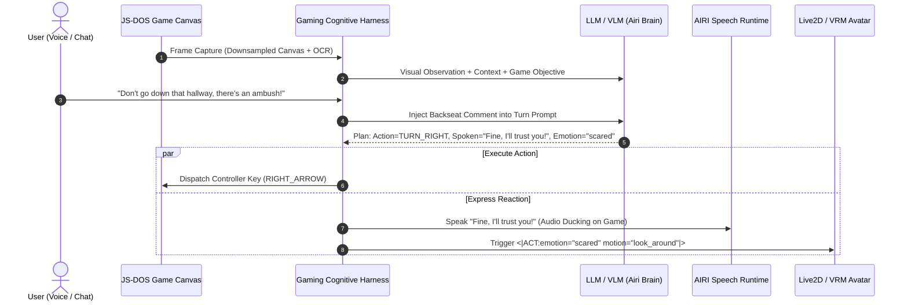
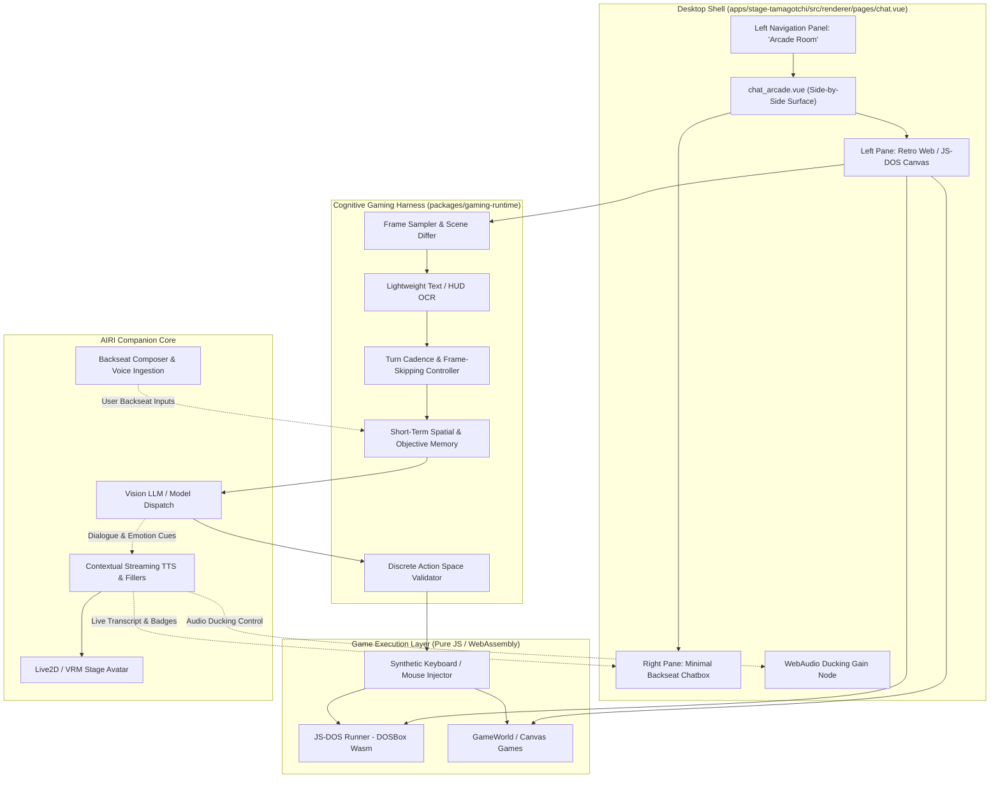

# Proposal: Generic Gaming Agent Runtime

A generic, cross-game agent harness and execution engine for AIRI that enables characters to autonomously play games, react in real time, and banter with the user through **interactive backseat gaming** — with zero Python sidecar dependencies.

---

## 1. Motivation & Background

### The Upstream Problem: Per-Game Bespoke Integrations
Upstream AIRI attempted game support by building bespoke, tightly-coupled adapters:
1. **Minecraft (`services/minecraft`)**: Required a 4-layer cognitive architecture coupled to Mineflayer (PrismarineJS), parsing Java Edition raw network packets (`minecraft-data`), managing voxel raycasts, and tracking inventory slots. Upstream startup audits (`docs/runtime-stability-audit.md`) revealed that discovering Minecraft dependencies synchronously delayed desktop window startup by over 20 seconds.
2. **Factorio**: Relied on Factorio's RCON (Remote Console) socket and custom Lua injection scripts (`settings/factorio/*`).
3. **The Fundamental Dead End**: Supporting $N$ games required maintaining $N$ separate protocols, game-specific bot clients, and brittle state machines. Whenever a game updated, its bespoke bridge broke.

### The New Direction: A Universal, Zero-Python Gaming Runtime
Instead of building a dedicated bot for every title, this proposal outlines a **universal gaming agent runtime** combining:
1. **A Game-Agnostic Cognitive Harness**: Inspired by `GamingAgent` (LMGame Bench), separating observation, working memory, action validation, and self-reflection from the underlying game engine.
2. **Zero-Python WebAssembly Execution (JS-DOS & Web Canvas)**: Emulating classic PC titles (via JS-DOS / Wasm DOSBox) and running browser games directly inside AIRI's Electron/Web renderer with **zero Python sidecars**, zero virtualenv setup, and zero native compilation headaches.
3. **Interactive Backseat Gaming**: Turning gameplay into a live social co-op experience where the user critiques, coaches, or heckles AIRI in real-time, and AIRI argues back, follows advice, panics, or gloats using her speech runtime and acting tokens.

---

## 2. Framework Landscape Analysis

Recent open-source research has produced four notable game-playing agent benchmarks and runtimes. Here is how they compare in the context of AIRI:

| Framework | Core Engine | Execution Target | Strengths | Drawbacks for AIRI |
| :--- | :--- | :--- | :--- | :--- |
| **`lmgame-org/GamingAgent`** | LLM/VLM Agent Harness | Gymnasium / Stable-Retro | Clean separation between bare VLM and cognitive scaffolding (memory, planning, action validation, reflection). | Python-based; relies on Gymnasium/Retro environments. |
| **`alexzhang13/videogamebench`** | Benchmark Suite (20 DOS & GB games) | **JS-DOS** (Playwright/Browser) & PyBoy (Python) | Proves that JS-DOS in browser canvases can run Doom, Civilization, Warcraft II, and Prince of Persia. | Mixes Python PyBoy with JS-DOS; focused on static evaluation rather than interactive companions. |
| **`gameworld-project/gameworld`** | Browser Benchmark (34 games) | HTML5 Canvas / Chromium | Broad game selection (puzzles, platformers, arcade); dual computer-use and semantic action spaces. | Benchmark-first; no companion dialogue or character persona integration. |
| **`krafton-ai/ORAK`** | Benchmark Suite (12 commercial games) | Heterogeneous (Steam, PySC2, PyBoy, etc.) | High prestige titles (Street Fighter, Slay the Spire, Stardew Valley). | Not a unified harness; requires massive multi-runtime setup across disparate desktop binaries. |

### Architectural Insight: Decoupling Harness from Runner
The candidate projects reveal that gaming agents consist of two independent components:
* **The Cognitive Harness**: Translates the visual scene into reasoning, plans next steps, enforces valid actions, and reflects on outcomes.
* **The Environment Runner**: Executes those actions in a virtual environment and produces the next frame.

By adopting **JS-DOS (WebAssembly)** and **HTML5 Canvas**, AIRI can run the entire environment runner inside its existing Node/Electron/Web stack without external processes.

---

## 3. The Core Interactive Hook: "Backseat Gaming" & Live Banter

In existing research benchmarks, the agent plays games in sterile isolation to maximize an evaluation score. In AIRI, the agent plays games **for and with the user**.

Backseat gaming is one of the most engaging dynamics in live streaming and companion AI:
* The user watches the game feed in an AIRI widget and gives real-time suggestions ("Watch your six!", "Use the potion!", "Go left, trust me!").
* The agent ingests this advice, compares it against its own spatial reasoning, and dynamically responds with emotional and vocal reactions.



### Dynamic Backseat Banter Archetypes
Depending on the character card persona and intimacy state, the agent reacts to backseat advice differently:
1. **The Trusting Neophyte**: Eagerly follows user advice, thanks the user when it works, and acts betrayed when bad advice leads to a game over (`<|ACT:emotion="pout"|>`).
2. **The Stubborn Competitor**: Rejects user suggestions ("I know what I'm doing!"), tries its own plan, and either gloats on success (`<|ACT:emotion="smug"|>`) or frantically covers up its mistakes on failure.
3. **The Panicked Gamer**: Gets overwhelmed during tense encounters (e.g. Doom low health / monsters approaching) and screams for user guidance while spamming evasive maneuvers.

---

## 4. Architectural Design



---

## 5. The "Arcade Room" Desktop Chatbox Surface (`chat_arcade.vue`)

### 5.1 Workspace Navigation Integration
Following the architecture documented in `airi-desktop-chatbox` (`references/workspace-navigation.md`):
* **Surface Key**: `'arcade'`
* **Label**: `'Arcade Room'`
* **Icon**: `'i-solar:gamepad-bold-duotone'`
* **Code-Split Component**: `chat_arcade.vue` registered via `defineAsyncComponent` in `apps/stage-tamagotchi/src/renderer/pages/chat.vue`.
* **Right Panel Behavior**: In `chat.vue`, `showRightPanel` is explicitly restricted to `activeSurface === 'messages'`. Selecting `'Arcade Room'` reclaims the entire window canvas width, giving optimal real estate for the game and chat split.

### 5.2 Side-by-Side Layout Wireframe

```
┌────────────────────────────────────────────────────────────────────────────────────────────────────────┐
│ [≡] AIRI - Chat Window [Arcade Room]                                                      [⚙] [_][□][X]│
├─────────────────┬────────────────────────────────────────────────────┬─────────────────────────────────┤
│  WORKSPACE      │             GAME VIEWPORT (65% Width)              │    BACKSEAT CHAT (35% Width)    │
│                 │ ┌────────────────────────────────────────────────┐ │ ┌─────────────────────────────┐ │
│ 💬 Chat View    │ │                                                │ │ │ 🌸 AIRI                     │ │
│ 📹 Director     │ │              JS-DOS / RETRO CANVAS             │ │ │ "Alright, let's see what    │ │
│ 📖 World Bible  │ │             (Doom / Civ I / 2048)              │ │ │ this game is all about!"    │ │
│ 🎨 Studio       │ │                                                │ │ │ <|ACT:emotion="smug"|>      │ │
│ 📁 Media        │ │                    [ 4:3 ]                     │ │ ├─────────────────────────────┤ │
│ 🧬 Thread       │ │                                                │ │ │ 👤 You                      │ │
│ 📜 Event Ledger │ │                                                │ │ │ "Watch out behind you,      │ │
│ 📝 Notes        │ │                                                │ │ │ there's an explosive barrel"│ │
│ 🎬 Rehearsal    │ ├────────────────────────────────────────────────┤ │ ├─────────────────────────────┤ │
│ 🕹️ Arcade Room  │ │ [Preset: Doom Shareware ▼] [Restart] [Savestate]│ │ │ 🌸 AIRI                     │ │
│                 │ │ Mode: [● AI Playing] [○ You Play] [🔊 ────○──] │ │ │ "Wait, where?! Don't yell   │ │
│ ─────────────── │ └────────────────────────────────────────────────┘ │ │ at me, I'm aiming!"         │ │
│ ⚙️ Settings     │   Tips: Use [Space] to pause; LLM plays in bursts.  │ │ <|ACT:emotion="panicked"|>    │ │
│                 │                                                    │ ├─────────────────────────────┤ │
│                 │                                                    │ │ [ Backseat advice...      ] │ │
│                 │                                                    │ │ [Careful!] [Shoot!] [Heal!] │ │
│                 │                                                    │ └─────────────────────────────┘ │
└─────────────────┴────────────────────────────────────────────────────┴─────────────────────────────────┘
```

### 5.3 Dual Play Modes
The Arcade Room supports two interactive modes selectable via a toggle:
1. **AI Autopilot (Agent Plays, User Backseats)**:
   * The cognitive harness reads the canvas, selects discrete actions, and sends synthetic inputs.
   * The user types or speaks backseat tips into the minimal chatbox.
   * AIRI debates, panics, or listens, streaming dialogue into the chat transcript and TTS runtime.
2. **Co-Pilot / Spectate (User Plays, Agent Backseats You)**:
   * The user clicks into the game canvas and plays directly using standard keyboard/mouse controls.
   * The cognitive harness runs in spectator mode (sampling frames every 3–5 seconds or on major state shifts via lightweight OCR).
   * AIRI acts as your live personal gaming companion, cheering your victories, gasping at near-misses, and roasting your deaths!

---

## 6. Subsystem Specifications

### 6.1 The JS-DOS WebAssembly Runner
* **Library**: `js-dos` (or `@emulators/dosbox-x` / `emulators` package) running directly inside Electron or browser web workers.
* **Zero Native Binaries**: Compiles DOSBox into WebAssembly (`.wasm`), eliminating all Python sidecars and operating system discrepancies.
* **Savestate Integration**: JS-DOS supports serializing and deserializing memory state snapshots. This allows:
  * Checkpointing games before dangerous attempts.
  * Instant rewind / restart on game-over without replaying intro screens.
  * Fast state inspection (reading memory addresses for health, score, or ammo if mapped).

### 6.2 The Unified Action Space Interface
Games must not require custom tool signatures. The harness standardizes all games into two canonical input spaces:

```typescript
export type DiscreteGamepadButton
  = | 'UP' | 'DOWN' | 'LEFT' | 'RIGHT'
    | 'BUTTON_A' | 'BUTTON_B' | 'BUTTON_X' | 'BUTTON_Y'
    | 'START' | 'SELECT'
    | 'WAIT'

export interface GamepadAction {
  type: 'gamepad'
  button: DiscreteGamepadButton
  durationMs?: number // e.g. hold UP for 250ms
}

export interface PointerAction {
  type: 'pointer'
  action: 'click' | 'double_click' | 'drag' | 'hover'
  x: number // Normalized 0.0 - 1.0 coordinates
  y: number
  targetX?: number
  targetY?: number
}

export interface GamingActionPlan {
  actions: (GamepadAction | PointerAction)[]
  thought: string
  spokenCommentary?: string
  actingCue?: string // e.g. <|ACT:emotion="smug" motion="nod"|>
}
```

### 6.3 Frame Cadence & Latency Management
Real-time games (like *Doom*) run at 35–60 FPS, while VLM inference takes 500ms–2000ms. To bridge this gap:
1. **Turn-Based Auto-Pause**: For turn-based games (Civilization, 2048, Sokoban, Pokemon, Oregon Trail), the game naturally waits for input.
2. **Action-Burst Execution**: For real-time games (Doom, Prince of Persia), the LLM generates short macro bursts (e.g. `[MOVE_FORWARD(500ms), FIRE, TURN_LEFT(200ms)]`). During execution, the game runs, then the harness samples the settling frame before triggering the next reasoning turn.
3. **Conversational Pacing & Fillers**: When inference takes >800ms, AIRI's Conversational Pacing engine (`proposal-conversational-pacing-thinking-fillers.md`) emits spontaneous vocal fillers ("Hmm...", "Wait a second...", "Let's see...") so the stream never feels frozen.

### 6.4 Audio Ducking & Avatar LookAt
* **Audio Ducking**: When the agent speaks, the game's WebAudio gain node is automatically reduced by 70% (`gain.linearRampToValueAtTime(0.3, ...)`), then smoothly restored when TTS finishes.
* **Stage LookAt**: The Live2D / VRM avatar's gaze can be dynamically routed to point toward the game widget location on the desktop screen, giving the visual appearance that she is actively looking at the monitor while playing.

---

## 7. Game Library Roadmap

### Phase 1: Zero-Dependency DOS & Web Classics
* **DOS (via JS-DOS WebAssembly)**:
  * *Doom / Doom II* (Shareware/Freeware): Classic 2.5D FPS action.
  * *Prince of Persia*: Precision 2D platforming with high visual clarity.
  * *Civilization I*: Turn-based strategy ideal for long-term planning and backseat debate.
  * *The Oregon Trail*: Text/graphical decision-making with high narrative humor.
* **HTML5 Canvas / Web**:
  * *2048*: Numerical puzzle solving; great for testing spatial logic.
  * *Sokoban*: Box-pushing puzzle benchmark.
  * *Flappy Bird / Runner*: Fast-reflex reflex testing.

### Phase 2: WebAssembly Console Emulation (No Python)
* Evaluate browser-native WebAssembly Game Boy emulators (e.g. `WasmBoy` or `binjgb-wasm`) to bring *Pokémon Red* and *Tetris* into the pure-web runtime without introducing Python/PyBoy sidecars.

---

## 8. Comparison: Upstream vs. Generic Gaming Runtime

| Capability | Upstream Approach | Proposed Generic Runtime |
| :--- | :--- | :--- |
| **Technology Stack** | Mineflayer (Node.js) + Factorio RCON | JS-DOS (WebAssembly) + HTML5 Canvas |
| **External Dependencies** | Node native modules, external game instances | Zero external installs; 100% in-process WebAssembly |
| **New Game Cost** | Weeks to months (bespoke protocol implementation) | Minutes (ROM / shareware file drag-and-drop) |
| **User Interaction** | Dry terminal chat or silent bot | Live backseat voice/chat banter with vocal fillers |
| **Avatar Integration** | None | Full Live2D / VRM emotions, acting cues, and gaze tracking |
| **Startup Overhead** | 20s blocking dependency discovery | Lazy on-demand WebAssembly initialization |

---

## 9. Implementation Phases

### Phase 1: Engine Foundation & JS-DOS Spike
- [ ] Create `packages/gaming-runtime` with normalized `GamepadAction` and `PointerAction` schemas.
- [ ] Implement `JsDosRunner` wrapping `@emulators/dosbox` in a dedicated Web Worker.
- [ ] Verify shareware *Doom* or *Prince of Persia* loads, renders to an offscreen canvas, and accepts programmatic key injections.

### Phase 2: Cognitive Harness & Frame Pipeline
- [ ] Build `FrameSampler` with canvas screenshot downsampling (512x512 JPEG/WebP) and lightweight visual diffing.
- [ ] Connect frame observations to AIRI's VLM dispatch gateway.
- [ ] Implement the prompt builder template with action space definitions and objective tracking.

### Phase 3: Desktop Chatbox "Arcade Room" Integration (`chat_arcade.vue`)
- [ ] Register `'arcade'` route, label, and `i-solar:gamepad-bold-duotone` icon in `apps/stage-tamagotchi/src/renderer/pages/chat.vue`.
- [ ] Create `chat_arcade.vue` featuring the side-by-side Game Viewport + Backseat Chat stream.
- [ ] Wire backseat chat ingestion: user chat messages during an active session are tagged with `[BACKSEAT_ADVICE]` and injected into the immediate next reasoning cycle.
- [ ] Bind speech output and `<|ACT:*|>` emotion tokens to the gaming loop with WebAudio ducking.

---

## 10. Open Questions & Design Considerations

> [!NOTE]
> **Shareware vs. User-Provided ROMs**:
> To keep AIRI legally clean and distributable, built-in presets will only bundle open-source or shareware games (e.g. Doom Shareware, FreeDOS titles, open-source HTML5 games). A simple drag-and-drop `.zip` or `.rom` importer will allow users to load their own titles.

> [!TIP]
> **Audio Ducking Latency**:
> By hooking directly into the WebAudio graph of the JS-DOS emulator, volume changes can occur with <10ms latency when TTS starts, preventing dialogue from being drowned out by game music.
