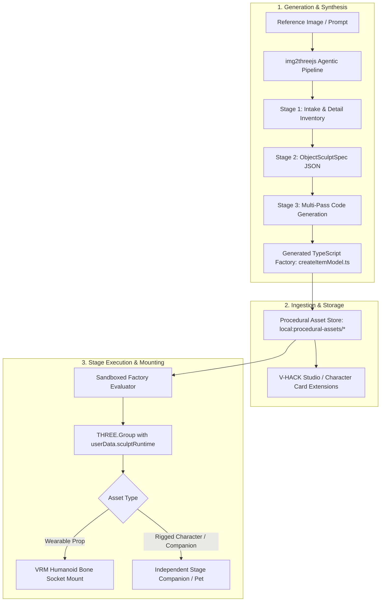

# Proposal: Code-Only Procedural 3D Item & Character Generation via img2threejs

This document proposes integrating a **code-first, procedural 3D generation pipeline** into **AIRI**, inspired by the architecture and showcase of **`img2threejs`**.

---

## 🧭 1. Vision & Context

In [`proposal-trellis-dynamic-item-manifestation.md`](./proposal-trellis-dynamic-item-manifestation.md), AIRI established the goal of allowing AI characters to dynamically generate and equip 3D items in their physical environment. That proposal relies on **neural 3D diffusion** (ComfyUI + TRELLIS) to output `.glb` binary mesh files.

While neural diffusion excels at photorealistic organic blobs, it introduces major operational friction:
* Requires a local or cloud GPU server running ComfyUI with 16GB+ VRAM.
* Outputs heavy, non-editable, black-box binary meshes (5MB - 50MB `.glb` files).
* Mesh topologies often lack clean rigging, pivots, colliders, or animation hooks.

**`img2threejs`** introduces a revolutionary alternative: **Reconstruction-by-Code**. Instead of generating opaque 3D binary files, an agentic multi-pass sculpting pipeline reconstructs the object or character as **pure, self-contained Three.js TypeScript code** (`createObjectModel.ts`).

---

## ⚖️ 2. Architectural Comparison: Neural Diffusion vs. Code Synthesis

| Dimension | Neural Diffusion (TRELLIS) | Procedural Code Generation (img2threejs) |
| :--- | :--- | :--- |
| **Generation Backend** | ComfyUI server + PyTorch + CUDA GPU (Heavy) | Agentic LLM + Python stdlib validation (`forge/`) (Lightweight) |
| **Output Artifact** | `.glb` binary blob (stored in IndexedDB) | TypeScript source code (`THREE.Group` factory) |
| **Runtime Dependencies** | Three.js GLTFLoader + Draco / Meshopt decoders | Pure Three.js primitives + procedural GLSL shaders |
| **Asset Size / Footprint** | 5 MB – 50 MB per asset | 5 KB – 80 KB of diffable, versionable code |
| **Editability & Tweaking** | Static geometry; requires external 3D software (Blender) | 100% parametric; tweak dimensions, colors, and loops directly |
| **Animation & Rigging** | Inert static meshes (requires external auto-rigging) | Native bone rigs (`userData.rig`), pivots, sockets, and animation clips |
| **Client Viability** | Needs remote API or high-end local workstation | Can be bundled directly into Character Cards or executed locally |

---

## 🏗️ 3. Core Subsystems & AIRI Integration



---

### A. Use Case 1: Wearable Stage Props & Dynamic Wardrobe

Dynamic items generated via LLM tool calls (e.g. `create_stage_item(attachTo, prompt)`) or chosen in V-HACK Studio can be compiled directly into procedural Three.js factories:
* **Skeletal Sockets**: Mounts seamlessly onto the VRM bone hierarchy established in the TRELLIS specification:
  * `"head"` → `vrm.humanoid.getNormalizedBoneNode('head')` (Hats, crowns, glasses, horns)
  * `"wrist"` → `vrm.humanoid.getNormalizedBoneNode('leftWrist')` (Watches, bracelets, shields)
  * `"waist"` → `vrm.humanoid.getNormalizedBoneNode('hips')` (Belts, pouches, tail accessories)
* **Parametric Scaling**: Because the item is code, bounding box calibration, pivot offsets, and normalizations run cleanly via geometry math rather than guessing mesh transforms.

### B. Use Case 2: Autonomous Rigged 3D Companions (The "Boxing Man" Track)

As demonstrated in `img2threejs`'s Ringside Boxer showcase:
* **Full Skeletal Rigging**: Generates characters with custom humanoid skeletons (e.g. 41 bones) bound with geodesic skinning.
* **Embedded Animation Clips**: Ships with integrated action clips (`idle`, `walk`, `jab`, `hook`, `defeat`, `victory`) without requiring Mixamo or external animation files.
* **Measured-Impact VFX**: Includes procedural hit-sparks, dust puffs, and kinetic trails generated via code.
* **Application in AIRI**:
  * **Stage Pets & Mini-Companions**: Summoning procedural companion creatures (e.g. Pikachu mascot, robotic drones, fantasy familiars) that wander the stage beside the main avatar.
  * **Interactive NPCs & Sparring Partners**: Allowing AIRI to host interactive stage games or combat mini-games directly in Electron or Web.

### C. Use Case 3: V-HACK Studio & Wardrobe Integration

AIRI's V-HACK DevTools (`airi-vrm-vhack-studio`) enables surgical GLB inspection, MToon material tuning, and costume modification.
* Integrating `img2threejs` allows users and characters to generate **modular wardrobe attachments** directly within V-HACK:
  1. User uploads a reference photo of an outfit accessory (e.g. cybernetic visor, tactical pouch).
  2. The pipeline generates the procedural Three.js geometry and MToon-compatible shader parameters.
  3. The item is previewed live in V-HACK and saved to the character's wardrobe preset.

### D. Use Case 4: Ultra-Portable Character Card Packaging

Character Cards in AIRI (`.airi.png` / CCv3) carry persona prompts, voices, and metadata.
* Traditional 3D models require gigabytes of external storage or CDN hosting.
* A procedural character or companion generated via `img2threejs` can be embedded **directly inside the character card's JSON metadata** (`extensions.airi.proceduralModels`), making the card completely autonomous, self-rendering, and offline-capable across desktop and mobile.

---

## ⚙️ 4. Runtime Execution & Security Architecture

Because `img2threejs` emits executable TypeScript/JavaScript factory functions, running them in AIRI requires strict sandboxing:

1. **Safe Factory Contract**:
   Each generated procedural model adheres to a strict factory interface:
   ```typescript
   export interface ProceduralModelFactory {
     createModel: (spec: ObjectSculptSpec, options?: ModelOptions) => THREE.Group & {
       userData: {
         sculptRuntime: {
           nodes: Record<string, THREE.Object3D>
           sockets: Record<string, THREE.Object3D>
           colliders: THREE.Box3[]
         }
         rig?: {
           skeleton: THREE.Skeleton
           bones: THREE.Bone[]
           bound: boolean
         }
         tick?: (delta: number, elapsed: number) => void
       }
     }
   }
   ```
2. **Execution Sandbox**:
   - Models run within a sandboxed worker or restricted Three.js scope with no access to DOM, Electron IPC, or network APIs.
   - Geometry generation uses only standard `three` imports (`THREE.BufferGeometry`, `THREE.MeshStandardMaterial`, `THREE.ShaderMaterial`).

---

## 🔄 5. Unified Item Manifestation Strategy (Dual-Engine)

AIRI's dynamic item system will support both pipelines through a unified consciousness tool:

```typescript
interface CreateStageItemParams {
  name: string
  prompt: string
  attachTo: 'head' | 'wrist' | 'waist' | 'ankle' | 'stage_floor'
  engine?: 'auto' | 'procedural_code' | 'diffusion_trellis'
}
```

* **Default Mode (`auto` / `procedural_code`)**:
  * Prioritizes `img2threejs`. Zero VRAM requirement, instant code evaluation, lightweight storage, and guaranteed socket attachments.
* **Diffusion Fallback (`diffusion_trellis`)**:
  * Used when ComfyUI is active and the user requests highly complex, photorealistic organic models (e.g., specific photoreal sculptures or scanned artifacts).

---

## 📅 6. Roadmap & Milestones

- [ ] **Phase 1: Shared Bone Socket Framework**
  - Finalize the skeletal mounting system in `RendererStage.vue` (compatible with both TRELLIS GLBs and procedural Three.js groups).
- [ ] **Phase 2: Procedural Model Runtime & Persistence**
  - Define `local:procedural-models` schema in `docs/data-catalog.md`.
  - Implement the runtime loader and animation tick dispatcher for `THREE.Group` factories with `userData.tick`.
- [ ] **Phase 3: Agentic Synthesis Task Integration**
  - Integrate the `img2threejs` intake and `ObjectSculptSpec` generation flow as a background agent skill or Electron sidecar service.
  - Implement visual comparison sheet review using AIRI's VLM dispatch gateway.
- [ ] **Phase 4: V-HACK Studio & Character Card Integration**
  - Add "Procedural Props" drawer to V-HACK DevTools.
  - Support bundling procedural Three.js factories into `.airi.png` card exports.
