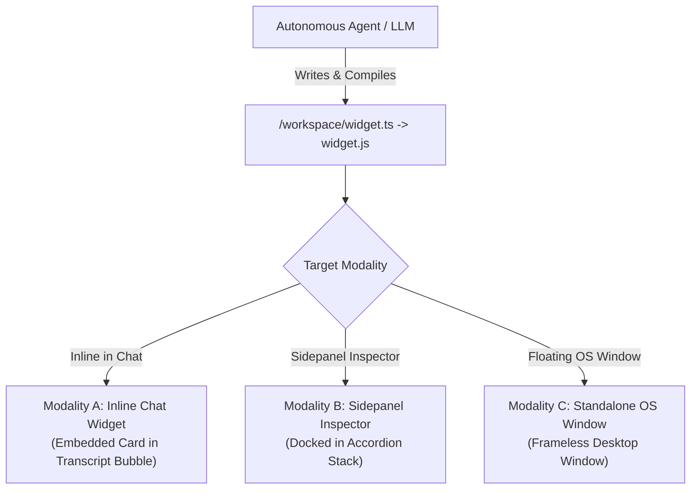
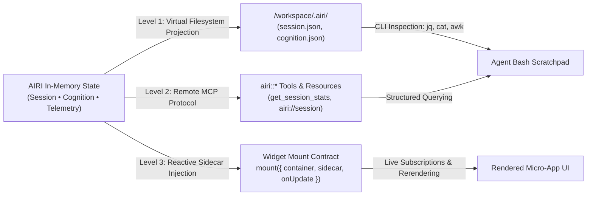

# Proposal: In-Memory Agent Sandboxes, Zero-VM Workspaces, and Edge WASM Capabilities

> **Status**: Proposed / RFC
> **Author**: Richard Pinedo (@dasilva333 / azimuthal)
> **Date**: 2026-10-10
> **Target Audience**: Core Developers, Architecture Maintainers, Community Extension Developers
> **Related Documents**: [`docs/design-cloud-relay.md`](./design-cloud-relay.md), [`docs/proposal-plugin-ecosystem-and-community-registry.md`](./proposal-plugin-ecosystem-and-community-registry.md), [`docs/design-discord-control-plane.md`](./design-discord-control-plane.md), [`docs/arch-mcp-integration.md`](./arch-mcp-integration.md), [`docs/proposal-built-in-llm-webgpu.md`](./proposal-built-in-llm-webgpu.md)

---

## 1. Executive Summary & Macro Context

### The Economic & Compute Inversion
Over the past 18 months, developer tooling has witnessed a fundamental economic divergence:
1. **Inference costs are dropping exponentially** (10× to 100× annualized decrease across frontier models like Claude Opus, DeepSeek, and lightweight distilled models).
2. **Dedicated compute and host VM costs remain flat or are rising**, driven by surging datacenter memory (RAM) and power demands.

Currently, agentic developer environments (Cursor Cloud, Claude Code VMs, Docker-based code sandboxes) provide autonomous agents with full 16GB–32GB Linux virtual machines. While convenient, this model fails three foundational requirements of Project AIRI:
* **Strict Local-First & Zero-Custody Boundaries**: Spawning unconstrained host processes or requiring \$50/month cloud Linux VPSs violates AIRI's mission of client-side ownership and zero-overhead execution.
* **Universal Tri-Platform Parity**: AIRI runs across **Desktop Electron** (`apps/stage-tamagotchi`), **Web Browser** (`apps/stage-web`), and **Mobile Capacitor** (`apps/stage-pocket`). Spawning Node child processes, Docker containers, or native bash shells is fundamentally impossible inside a mobile browser or iOS sandbox.
* **Host System Safety**: Granting autonomous agents direct host terminal access creates significant hazards (accidental `rm -rf`, unexpected network calls, environment leakage).

### The In-Memory / WASM Breakthrough
By combining **V8 Isolates**, **in-memory POSIX simulation (`just-bash`)**, and **lightweight WebAssembly tooling (such as `ts-rust` / `@tsc-rs/wasm` and QuickJS-WASM)** within AIRI's native **`@xsai`** framework, we can give AIRI characters an autonomous, fully functioning "virtual computer" and dynamic runtime that:
* Consumes **< 200MB of RAM** and negligible CPU when idle.
* Executes identically inside a **Chrome browser tab**, an **iPhone Capacitor webview**, an **Electron desktop window**, or a **serverless Cloudflare Worker**.
* Guarantees **100% memory-isolated containment** with zero risk to the user's host operating system.
* Synergizes with **Remote MCP over Streamable HTTP** (`stage-web`), forming a dual-engine architecture where MCP provides external data ingestion and `just-bash` provides in-memory data processing and code execution.

This proposal organizes these capabilities into **Three Golden Architectural Pillars**:
1. **Self-Synthesizing In-Memory Plugins & Generative UI**: Allowing characters to create, typecheck, and register their own tools and interface widgets in-memory on the fly.
2. **The Character's Personal Virtual Computer (`just-bash` + WASM)**: Giving characters their own virtual Unix workspace and terminal embedded directly in the chat experience.
3. **Next-Gen Cloudflare Edge Relay with WASM**: Upgrading the zero-custody Discord bot and cloud relay with edge code execution, dynamic graphic rendering, and simulation abilities.

---

## 2. Architectural Blueprint: The Multi-Surface Substrate

```
┌──────────────────────────────────────────────────────────────────────────────────────────────┐
│                                     PROJECT AIRI RUNTIME                                     │
│               (Desktop Electron • Web Browser • Mobile Capacitor • Edge Worker)              │
├──────────────────────────────────────────────────────────────────────────────────────────────┤
│                                                                                              │
│   ┌───────────────────────────────┐                  ┌────────────────────────────────────┐  │
│   │  Pillar 1: Self-Synthesizing  │                  │   Pillar 2: Virtual Workstation    │  │
│   │      In-Memory Plugins        │                  │      (just-bash + WASM Engine)     │  │
│   │                               │                  │                                    │  │
│   │  • Agent-generated TS tools   │                  │  • In-memory POSIX Virtual FS      │  │
│   │  • In-isolate type checking   │                  │  • Sandboxed JS/TS code runner     │  │
│   │    via @tsc-rs/wasm           │                  │  • Interactive Terminal Drawer UI  │  │
│   │  • Native @xsai/tool contract │                  │  • Zero-risk host isolation        │  │
│   │  • toolsResolver auto-mount   │                  │  • Preserved in IndexedDB / OPFS   │  │
│   │  • Generative UI Vue widgets  │                  │  • Dual-wield with Remote MCP      │  │
│   └───────────────┬───────────────┘                  └─────────────────┬──────────────────┘  │
│                   │                                                    │                     │
│                   ▼                                                    ▼                     │
│  ══════════════════════════════════════════════════════════════════════════════════════════  │
│                               SHARED WASM / ISOLATE SUBSTRATE                                │
│       [QuickJS / V8 Worker]       [@tsc-rs/wasm Compiler]       [MemFS Virtual Drive]        │
│  ══════════════════════════════════════════════════════════════════════════════════════════  │
│                   ▲                                                    │                     │
│                   │ Remote MCP (Streamable HTTP / SSE)                 │                     │
│  ┌────────────────┴──────────────────┐                                 ▼                     │
│  │   External Remote MCP Servers     │                   ┌───────────────────────────┐       │
│  │   (Search, APIs, GitHub, Notion)  │                   │ Pillar 3: Edge Relay WASM │       │
│  │   via packages/stage-ui/mcp       │                   │    (apps/stage-edge)      │       │
│  └───────────────────────────────────┘                   │                           │       │
│                                                          │ • Edge Discord Code Exec  │       │
│                                                          │ • Dynamic SVG/Canvas Cards│       │
│                                                          │ • Zero-Server Cost Sim    │       │
│                                                          └───────────────────────────┘       │
└──────────────────────────────────────────────────────────────────────────────────────────────┘
```

---

## 3. Pillar 1: Self-Synthesizing In-Memory Plugins & Generative UI

### 3.1 Problem Statement
Currently, adding a tool to AIRI requires:
* Authoring a hardcoded TypeScript module in `packages/stage-ui/src/tools/` or `packages/plugin-*`,
* Or configuring an external Model Context Protocol (MCP) server.

This model is static: if a user asks a character to perform a novel structured task (e.g., *"Calculate my monthly recurring subscription burn rate based on this list and alert me"*), the character cannot dynamically create a tool for itself.

### 3.2 Native `@xsai/tool` Architecture
Rather than adopting foreign agent frameworks (like Vercel AI SDK or LangChain), dynamic tool authoring directly aligns with AIRI's internal **`@xsai/tool`** primitives:

```ts
import { tool } from '@xsai/tool'
import { z } from 'zod'

export interface DynamicAgentToolManifest {
  name: string
  description: string
  schema: z.ZodObject<any>
  executeCode: string // In-memory TypeScript function body
}
```

#### The Dynamic Verification & Mount Cycle:
1. **Tool Code Synthesis**: The LLM outputs the tool implementation conforming to `@xsai/tool`.
2. **In-Isolate Type Verification**: The code is evaluated against `@tsc-rs/wasm` in memory. If syntax or type signatures mismatch, diagnostics feed back to the model within milliseconds.
3. **`toolsResolver` Hot-Mount**: The verified tool is wrapped in an isolated Web Worker / QuickJS sandbox and pushed into the reactive `toolsResolver` (`packages/stage-ui/src/stores/chat.ts`). It immediately becomes available for subsequent tool-call turns without requiring a page reload.
4. **Generative UI Component Rendering**:
   Along with logic, the agent can output declarative UI widgets (using `@proj-airi/ui` primitives or sandboxed SVG/HTML) that mount into the desktop chat stream as interactive cards (e.g. tracking progress bars, clickable toggles, status pills).

### 3.3 Tri-Modal Surface Architecture

To accommodate the user experience across the desktop interface (matching the right-hand Inspector Stack in AIRI's Desktop Chatbox), Generative UI is structured around **three distinct presentation modalities**:



#### Modality A: Inline Chat Widget (`spawn_gen_inline` / `<agent-embed>`)
* **Location**: Rendered directly inside the conversational transcript bubble.
* **Use Case**: Ephemeral calculations, quick inline data graphs, interactive multi-choice polls, or compact visual summaries.
* **Constraints**: Compact height budget (<500px), transparent card background blending seamlessly with chat typography.

#### Modality B: Sidepanel Inspector Widget (`spawn_gen_sidepanel`)
* **Location**: Docked within the collapsible right-hand Inspector Stack (alongside `STAGE ⌵`, `NANO COGNITION ⌵`, `MEMORIES ⌵`, `CURRENT SCENE ⌵`, and `MEDIA GALLERY ⌵`).
* **Collapsible Workspace / Terminal Section**: A dedicated accordion pane (`WORKSPACE / TERMINAL ⌵`) allowing users to expand and monitor the agent's real-time bash execution, `tsc` compilation logs, and virtual filesystem state.
* **Collapsible Widgets Section**: A dedicated accordion pane (`GENERATIVE WIDGETS ⌵`) rendering persistent micro-apps and tools alongside the 3D Stage.
* **Use Case**: Ambient companion tools (live session pulse, clock/timer, Spotify mini-player, system health monitor, persistent task list).

#### Modality C: Standalone Desktop Widget (`spawn_gen_widget`)
* **Location**: An independent, frameless, draggable, floating Electron desktop window managed by `WidgetsWindowManager`.
* **Use Case**: Desktop "living wall" accessories that stay on screen even when the main chat window is minimized or collapsed (e.g. floating weather radar, pet tamagotchi mini-display, persistent calendar HUD).

---

### 3.4 The Three-Tiered State Bridges

A generative widget is only as compelling as the data powering it. Rather than forcing widgets to be static snapshots or requiring continuous LLM polling, AIRI establishes a **Three-Tiered State Bridge** connecting the agent and its widgets directly to AIRI's rich in-memory session, cognition, and telemetry state:



#### Level 1: Virtual Filesystem Bridge (`/workspace/.airi/`)
The in-memory RAM disk projects read-only virtual state files under `/workspace/.airi/`:
* `/workspace/.airi/session.json`: Current session ID, active character card name, total message count, last user message timestamp, and elapsed hours.
* `/workspace/.airi/cognition.json`: Active emotional valence, arousal, somatic state (e.g. `focused`, `sleepy`, `daydreaming`), and attention focus.
* `/workspace/.airi/telemetry.json`: AFK/idle seconds, active foreground application, window dimensions, and audio playback status.
* `/workspace/.airi/messages.json`: Recent transcript turns with role, timestamp, and token counts.

**Why this matters**: The model can use native POSIX tools (`cat`, `jq`, `awk`, `head`) to inspect real timestamps, calculate diffs, and test formulas before writing widget code—without cluttering the LLM conversation context with massive state dumps:
```bash
airi@sandbox:~$ cat /workspace/.airi/session.json | jq '{hours: .hoursSinceLastMessage, messages: .messageCount}'
{
  "hours": 3.42,
  "messages": 18
}
```

#### Level 2: MCP State Bridge (`airi::*` Tools & Resources)
For formal structured queries within tool-call loops, AIRI exposes native MCP endpoints over Streamable HTTP:
* `airi::get_session_stats`: Returns validated session metadata, turn history, and interaction velocity.
* `airi::get_cognition_vector`: Returns somatic states, mood scores, and active Director concept stacks.
* Resource `airi://session/active`: Subscribable resource stream for real-time state synchronization.

#### Level 3: Widget Contract Bridge (Reactive `sidecar` Injection)
When a generative widget is mounted (whether Inline, Sidepanel, or Floating Window), the host runtime injects an `AiriWidgetContext` with a localized, reactive `sidecar` snapshot and an `onUpdate` event listener:

```typescript
export interface AiriWidgetSidecar {
  session: {
    id: string
    activeCardName: string
    messageCount: number
    lastUserMessageAt: string // ISO-8601
    hoursSinceLastMessage: number
  }
  cognition: {
    emotion: string
    valence: number // -1.0 to 1.0
    energy: number // 0.0 to 1.0
    somaticState?: 'focused' | 'restless' | 'sleepy' | 'engaged'
  }
  telemetry: {
    isAfk: boolean
    idleSeconds: number
    activeApp?: string
  }
}

export interface AiriWidgetContext {
  container: HTMLElement
  sidecar: AiriWidgetSidecar
  /**
   * Subscribes to live state updates pushed from AIRI's runtime stores.
   * Returns an unsubscribe cleanup function.
   */
  onUpdate: (callback: (updatedSidecar: AiriWidgetSidecar) => void) => () => void
}
```

#### Canonical Reference: "Hours Since Last Message" Companion Widget
The agent leverages the Level 3 sidecar contract to create a live, reactive companion widget that updates in real time without continuous LLM inference:

```typescript
// /workspace/time_since_last_message.ts
import type { AiriWidgetContext, AiriWidgetSidecar } from './types/airi-widget'

export default function mount({ container, sidecar, onUpdate }: AiriWidgetContext) {
  let currentSidecar = sidecar

  function formatDuration(ms: number): string {
    const totalSecs = Math.max(0, Math.floor(ms / 1000))
    const hours = Math.floor(totalSecs / 3600)
    const mins = Math.floor((totalSecs % 3600) / 60)
    const secs = totalSecs % 60
    if (hours > 0)
      return `${hours}h ${mins}m ${secs}s`
    if (mins > 0)
      return `${mins}m ${secs}s`
    return `${secs}s`
  }

  container.innerHTML = `
    <div class="p-4 rounded-xl bg-slate-900/80 border border-slate-700/60 backdrop-blur-md text-white shadow-xl">
      <div class="flex items-center justify-between mb-2">
        <span class="text-xs uppercase tracking-wider text-slate-400 font-medium">Session Pulse</span>
        <span id="emotion-tag" class="text-xs px-2 py-0.5 rounded-full bg-indigo-500/20 text-indigo-300 font-mono"></span>
      </div>
      <div class="text-2xl font-bold font-mono text-emerald-400 mb-1" id="timer-display">--:--:--</div>
      <div class="text-xs text-slate-400 flex justify-between">
        <span>Since last talk with <span class="text-slate-200 font-medium" id="card-name"></span></span>
        <span id="msg-count" class="font-mono text-slate-300"></span>
      </div>
    </div>
  `

  const timerEl = container.querySelector('#timer-display')!
  const emotionEl = container.querySelector('#emotion-tag')!
  const cardNameEl = container.querySelector('#card-name')!
  const msgCountEl = container.querySelector('#msg-count')!

  function renderStatic() {
    cardNameEl.textContent = currentSidecar.session.activeCardName || 'AIRI'
    emotionEl.textContent = `${currentSidecar.cognition.emotion} (${Math.round(currentSidecar.cognition.energy * 100)}% nrg)`
    msgCountEl.textContent = `${currentSidecar.session.messageCount} msgs`
  }

  function updateTimer() {
    const lastDate = new Date(currentSidecar.session.lastUserMessageAt).getTime()
    const elapsedMs = Date.now() - lastDate
    timerEl.textContent = formatDuration(elapsedMs)
  }

  renderStatic()
  updateTimer()

  // 1. Live tick every second inside the container (zero LLM overhead)
  const timerInterval = setInterval(updateTimer, 1000)

  // 2. React to real-time session events (new messages, emotion transitions)
  const unsubscribe = onUpdate((newSidecar) => {
    currentSidecar = newSidecar
    renderStatic()
    updateTimer()
  })

  return () => {
    clearInterval(timerInterval)
    unsubscribe()
  }
}
```

---

## 4. Pillar 2: The Character's Personal Virtual Computer (`just-bash` Sandbox)

### 4.1 Concept & User Experience
To give AI characters true agency, they need a scratchpad that goes beyond text tokens. We propose introducing **"Airi's Personal Terminal"**—an in-memory virtual Unix-like environment:

* **Interactive Chat Drawer**:
  A collapsible terminal drawer in the Desktop Chatbox (`packages/stage-ui/src/components/chat/`) and Web Stage. When Airi performs complex reasoning, users can click to reveal a live terminal window showing the agent running virtual commands:
  ```bash
  airi@sandbox:~$ cat data/daily_mood.json | jq '.average'
  airi@sandbox:~$ ts-run scripts/calculate_schedule.ts
  >> Optimal sleep schedule: 23:30 - 07:30
  ```
* **User-Agent Collaboration**:
  The user can drop virtual text files or datasets directly into the sandbox folder, allowing Airi to inspect, edit, and organize them without ever exposing the host computer's actual filesystem.

### 4.2 Architecture: Native `@xsai` Tool Binding
Using `just-bash`, the tool declaration matches AIRI's exact tool authoring standard:

```ts
import { tool } from '@xsai/tool'
import { Bash } from 'just-bash'
import { z } from 'zod'

export const virtualBash = new Bash({
  cwd: '/workspace',
})

export const bashTool = tool({
  name: 'bash',
  description: 'Execute a command in an in-memory sandboxed POSIX environment (ls, cat, grep, find, echo, jq, etc.)',
  parameters: z.object({
    command: z.string().describe('The bash command line string to run'),
  }),
  execute: async ({ command }) => {
    const result = await virtualBash.exec(command)
    return {
      stdout: result.stdout,
      stderr: result.stderr,
      exitCode: result.exitCode,
    }
  },
})
```

### 4.3 Production Hardening & Sandbox Findings (From Cleanroom Prototype)

During extensive testing in `scripts/tests/just-bash-harness` across frontier and distilled models, four critical friction points were identified and resolved to ensure the sandbox behaves like a real developer environment:

1. **Native Rust `tsc-rs` Integration (`tsc` / `tsc-rs`)**:
   - Integrated `pingdotgg/ts-rust` v0.2.0 (Mach-O arm64 / Linux x64 binary based on TypeScript 7.1.0-dev Rust port).
   - Drops TypeScript compilation times from ~800ms+ (Node `tsc`) to **~2ms**, enabling instant type checking and module emission in client-side loops.
   - Registered under both `tsc` and `tsc-rs`. Formatted `tsc --version` output to report `Version 5.8.2`—aligning with standard model pretraining reflexes and preventing models from drifting into speculative reasoning about Rust compiler internals.
   - Implemented a compiler flag normalizer that intercepts `--outDir /workspace` conflicts and redirects output to isolated temp directories, preventing macOS APFS read-only root errors (`TS5033: Cannot write file ... because it would overwrite input file`).

2. **`sed -i` Permissions Preservation**:
   - In-memory VFS engines often rewrite files atomically on in-place replacement (`sed -i`), stripping the POSIX `+x` executable mode bit.
   - Wrapped `sed` to query `stat.mode` prior to substitution and re-apply `chmod(target, origMode)` after writing. Scripts (such as CLI tools and sparkline generators) remain executable after regex tweaks.

3. **In-Memory `node` Command**:
   - Frontier models frequently test scripts using `node <file>.js` or `node -e "<expr>"`.
   - Added a built-in `node` command reporting `v22.14.0` that executes sandboxed JavaScript in-isolate, providing the exact execution context models expect without needing an external Node process.

4. **Terminal ANSI Color Rendering (`ansiToHtml`)**:
   - Terminal activity logs capture raw VT100 / ANSI escape sequences (colors, bold, cursor moves).
   - Implemented `ansiToHtml()` translating 30–37 foreground, 90–97 bright, and 40–47 background color codes into Tailwind CSS classes while cleanly filtering cursor repositioning escapes (`\u001b[2J`, `\u001b[H`), allowing CLI sparklines, status bars, and ASCII art to render in full color in the chat drawer.

---

## 5. The Dual-Engine Synergy: Remote MCP + Virtual Bash in Web-Stage

A major breakthrough in Project AIRI's recent development is **Remote MCP over Streamable HTTP** (commit `d13880011c6`), which enabled browser-native MCP tools in `apps/stage-web` via `StreamableHTTPClientTransport` with Cloudflare CORS fallback.

Coupling **Remote MCP** with **In-Memory Bash** creates a powerful dual-engine paradigm:

```
┌────────────────────────────────────────────────────────────────────────────────────────┐
│                                   THE DUAL ENGINE                                      │
├────────────────────────────────────────────────────────────────────────────────────────┤
│                                                                                        │
│     REMOTE MCP (The External Senses)           VIRTUAL BASH (The In-Memory Hands)      │
│     • Connects over Streamable HTTP            • Runs 100% in browser/isolate memory   │
│     • Pulls data from Notion, GitHub,          • Saves data to /workspace/data.json    │
│       OpenWebSearch, Databases, Web APIs       • Slices/filters via jq, grep, awk      │
│     • Fetches raw 50KB JSON payloads           • Avoids context-window token blowup    │
│                                                • Executes TypeScript/Python scripts    │
│                                                                                        │
│     Agent Flow:                                                                        │
│     1. [mcp_call_tool] → Fetch 200 GitHub issues or financial quotes via remote MCP    │
│     2. [bash.exec]     → echo "$data" > issues.json && jq '.[] | select(...)'          │
│     3. [bash.exec]     → Runs analysis script, formats table, outputs concise answer   │
└────────────────────────────────────────────────────────────────────────────────────────┘
```

### Why This Is Transformative for `stage-web`:
1. **Eliminating Context Bloat**: Instead of dumping huge 50KB MCP API responses directly into the LLM chat history (which exhausts context limits and causes prompt cache misses), the agent pipes the response to a file on the virtual disk (`/workspace/input.json`) and inspects only the relevant slices with `jq` or `head`.
2. **Browser Parity Without Host Daemons**: Users on `stage-web` can connect remote MCP endpoints (like web search or database queries) and simultaneously execute real data processing scripts without running a backend Node server or Docker container.
3. **End-to-End Verification in Cleanroom Harness**: In live validation with DeepSeek-v4.1-flash, the model queried Tokyo weather via a Remote MCP tool (`weather_lookup`), saved the structured response into `/workspace/data.json`, authored a 160-line typed TypeScript component (`weather_card.ts`) with responsive glassmorphism styles and 3-day forecast grids, compiled it with `tsc` in 2ms, and mounted it into the Generative UI canvas via `mount_widget`.

---

## 6. Pillar 3: Next-Gen Cloudflare Edge Relay with WASM ("Vercel for Characters")

### 6.1 Context & Cloudflare Workers WASM Support
AIRI's **Cloud Relay** ([`apps/stage-edge/`](file:///Users/richardpinedo/Projects.nosync/airi/airi_dasilva333/apps/stage-edge/), governed by [`airi-cloud-relay-infrastructure`](file:///Users/richardpinedo/Projects.nosync/airi/.agents/skills/airi-cloud-relay-infrastructure/SKILL.md)) deploys an HTTP interaction worker on Cloudflare Workers that serves as a 24/7 Discord bot and Edge KV memory sync.

Cloudflare Workers run on V8 Isolates and feature **native WebAssembly support**. A `.wasm` module can be bundled directly into the Worker package and executed with zero cold-start delay and zero kernel virtualization overhead.

### 6.2 Novel Edge Capabilities
By integrating targeted WASM binaries into `apps/stage-edge`, the Discord bot gains capabilities traditionally reserved for heavy cloud servers:

1. **Edge Code Interpreter in Discord Slash Commands**:
   * Users in Discord can invoke `/eval` or ask the bot complex procedural questions (e.g. data crunching, Monte Carlo simulations, regex parsing).
   * The Discord worker executes the task inside an embedded QuickJS-WASM sandbox directly on Cloudflare’s edge nodes within the 50ms CPU execution budget.
2. **Dynamic Visual Card & Avatar Asset Synthesis**:
   * Currently, the Discord bot only returns plain text (limited to 2,000 characters).
   * Using a compiled Rust WASM crate (such as `resvg` or `image-rs`), the Worker can dynamically render visual status sheets, character intimacy badges, and RPG quest cards directly from SVG templates into PNG byte buffers, attaching them to Discord webhook replies.
3. **Edge Semantic Vector Search (Micro-RAG)**:
   * Run lightweight vector cosine similarity or embedding quantization in WASM over KV-stored conversational history without calling external vector databases.

---

## 7. Security, Isolation, & Resource Boundaries

| Security Domain | Host Process Model (Traditional) | AIRI In-Memory / WASM Model |
| :--- | :--- | :--- |
| **Filesystem Access** | Full read/write to user disk (`$HOME`) | In-memory RAM disk only (virtual memfs) |
| **Network Access** | Raw TCP / unrestricted internet sockets | Gated by application CORS / fetch proxies |
| **Host System Calls** | Unrestricted kernel syscalls (`fork`, `exec`) | None (runs inside browser/isolate sandbox) |
| **Memory Footprint** | 1GB+ (Docker / VM / separate processes) | < 200MB shared V8 isolate heap |
| **Cross-Platform Parity** | Desktop only (breaks on Web/iOS) | 100% parity on Electron, Web, Mobile, Edge |

---

## 8. Open Questions & Technical Risks

1. **WASM Binary Size on Cloudflare Workers Free Tier**:
   Cloudflare Workers Free limits script size to 1MB compressed (10MB on Paid). Full compilers like `ts-rust` WASM may exceed 3MB uncompressed. Can we strip unnecessary compiler phases or use dynamic streaming instantiation from an R2 bucket?
2. **Virtual Filesystem State Persistence**:
   How frequently should the agent's virtual sandbox state be flushed to IndexedDB / localforage? Should we implement an incremental dirty-page snapshot mechanism to prevent memory spikes during long chat sessions?
3. **Template Compilation for Generative UI**:
   While pure TypeScript logic can be checked via `@tsc-rs/wasm`, Vue Single File Components still require Volar template compilation. Should dynamic Generative UI widgets use standard declarative JSON component schemas (like Reka UI / UnoCSS schema) rather than raw arbitrary `.vue` SFC strings?
4. **Execution Timeout & Infinite Loop Protection**:
   In-isolate code execution must enforce hard execution budgets (e.g., maximum 2,000ms CPU execution time) via `AbortController` or Web Worker termination to prevent accidental infinite loops generated by the LLM.

---

## 9. Phased Implementation Roadmap

* **Phase 1-4: Cleanroom Harness & Compiler Engine (Completed & Verified in `scripts/tests/just-bash-harness/`)**
  * **Phase 1**: In-memory POSIX bash (`just-bash`) with zero host disk leakage, RAM disk mounted at `/workspace`, pre-seeded files, and real-time execution streaming.
  * **Phase 2**: Dual-pane UI (Chat on left, Terminal Activity on right) powered by client-side streaming via `@xsai` (`@xsai/stream-text`, `@xsai/tool`) with zero backend chat proxy.
  * **Phase 3**: Remote Model Context Protocol (MCP) client over Streamable HTTP (`@modelcontextprotocol/sdk`) with Cloudflare CORS fallback.
  * **Phase 4**: Native Mach-O arm64 / Linux x64 TypeScript compiler bridge (`tsc-rs` / `ts-rust` masked as TS 5.8.2 compiling in 2ms), dynamic iframe canvas preview, and 4 sandbox friction fixes (`--outDir` compiler normalizer, `sed -i` permissions preservation, in-memory `node`, full ANSI color styling).
* **Phase 5: Sidepanel Accordion Integration (`packages/stage-ui` / `apps/stage-tamagotchi`)**
  * Port the collapsible `WORKSPACE / TERMINAL ⌵` and `GENERATIVE WIDGETS ⌵` components into the desktop chat interface.
  * Dock them into the right-hand Inspector Stack alongside `STAGE ⌵`, `NANO COGNITION ⌵`, `MEMORIES ⌵`, `CURRENT SCENE ⌵`, and `MEDIA GALLERY ⌵`.
* **Phase 6: Three-Tiered State Bridges & Reactive Sidecar**
  * Implement the Level 1 virtual filesystem projection in `virtualBash` (`/workspace/.airi/session.json`, `cognition.json`, `telemetry.json`, `messages.json`).
  * Implement Level 2 MCP endpoints (`airi::get_session_stats`, `airi://session/active`).
  * Implement Level 3 reactive `sidecar` and `onUpdate` listener contract for dynamic generative micro-apps (enabling live timers and session pulse displays without continuous LLM inference).
* **Phase 7: Desktop Window Bridge (`WidgetsWindowManager`)**
  * Connect Electron main-process window management to load compiled virtual scripts from the in-memory sandbox.
  * Support `spawn_gen_widget` opening floating, frameless, transparent OS windows with persisted screen coordinates.
* **Phase 8: Cloudflare Edge Relay WASM Extensions (`apps/stage-edge`)**
  * Add QuickJS-WASM code interpreter module to `apps/stage-edge/src/inference/`.
  * Implement edge-evaluated Discord slash commands (`/eval`) and dynamic SVG card rendering on Cloudflare Workers.
